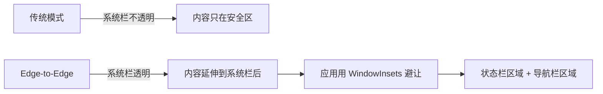
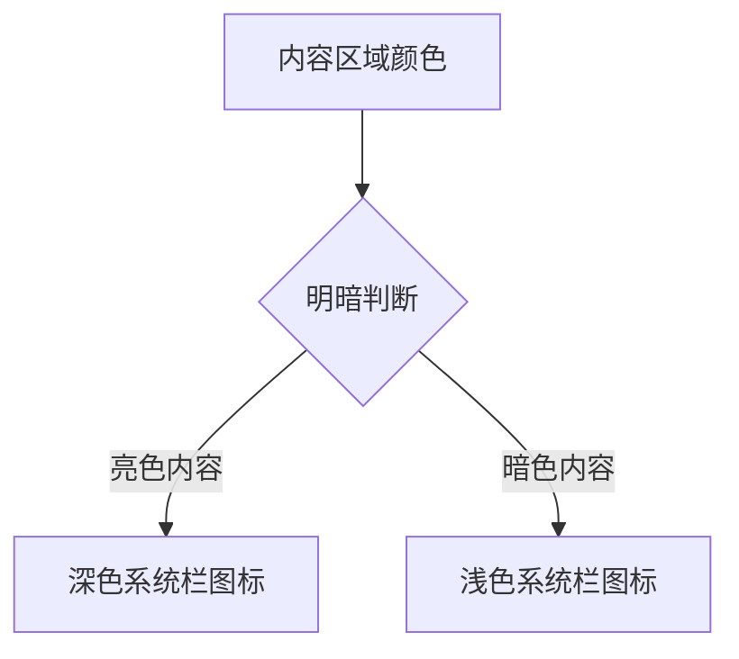
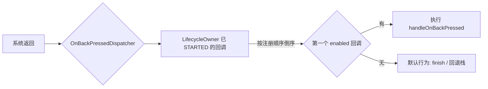

# Edge-to-Edge 全面屏适配

> 面试高频指数：高
> Android 15（API 35）起全面屏强制启用，Edge-to-Edge 已是每个 Android 应用的必修课。

## 1. 什么是 Edge-to-Edge

### 1.1 概念

Edge-to-Edge（边到边）指内容绘制延伸到系统栏（状态栏、导航栏）**之后**，由应用自己处理避让与布局。



| 对比项 | 传统模式 | Edge-to-Edge |
| --- | --- | --- |
| 系统栏 | 不透明，占独立区域 | 透明，内容可绘制到其后 |
| 布局避让 | 系统自动 fitSystemWindows | 应用自己处理 insets |
| 手势导航条 | 黑色条带 | 透明 + 对比度图标 |
| 目标 SDK | 34 及以下 | **35+ 强制** |

### 1.2 为什么强制

- 统一不同设备（刘海屏、挖孔屏、手势导航）的显示行为；
- 提升沉浸感，让内容与系统 UI 融合；
- 避免各厂商定制 ROM 行为不一致。

## 2. 启用方式

### 2.1 enableEdgeToEdge（推荐）

::: code-tabs

@tab:active Java

```java
public class MainActivity extends AppCompatActivity {

    @Override
    protected void onCreate(Bundle savedInstanceState) {
        // 必须在 setContentView 之前调用
        EdgeToEdge.enable(this);
        super.onCreate(savedInstanceState);
        setContentView(R.layout.activity_main);
    }
}
```

@tab Kotlin

```kotlin
class MainActivity : AppCompatActivity() {

    override fun onCreate(savedInstanceState: Bundle?) {
        // 必须在 setContentView 之前调用
        EdgeToEdge.enable(this)
        super.onCreate(savedInstanceState)
        setContentView(R.layout.activity_main)
    }
}
```

:::

### 2.2 兼容性

- `EdgeToEdge.enable()` 内部自动兼容不同 API 级别：
  - API 35+：强制边到边，系统栏默认透明；
  - API 21-34：设置透明系统栏 + 调整对比度；
- 所有 Activity 都要调用（或在 BaseActivity 统一处理）。

## 3. WindowInsets 处理

启用后必须用 insets 避让，否则内容会被系统栏遮挡。

### 3.1 获取并应用 insets

::: code-tabs

@tab:active Java

```java
public class MainActivity extends AppCompatActivity {

    @Override
    protected void onCreate(Bundle savedInstanceState) {
        EdgeToEdge.enable(this);
        super.onCreate(savedInstanceState);
        setContentView(R.layout.activity_main);

        // 避让顶部状态栏
        ViewCompat.setOnApplyWindowInsetsListener(findViewById(R.id.root), (v, insets) -> {
            Insets bars = insets.getInsets(
                    WindowInsetsCompat.Type.systemBars());
            v.setPadding(bars.left, bars.top, bars.right, 0);
            return insets;
        });
    }
}
```

@tab Kotlin

```kotlin
class MainActivity : AppCompatActivity() {

    override fun onCreate(savedInstanceState: Bundle?) {
        EdgeToEdge.enable(this)
        super.onCreate(savedInstanceState)
        setContentView(R.layout.activity_main)

        // 避让顶部状态栏
        ViewCompat.setOnApplyWindowInsetsListener(findViewById(R.id.root)) { v, insets ->
            val bars = insets.getInsets(WindowInsetsCompat.Type.systemBars())
            v.setPadding(bars.left, bars.top, bars.right, 0)
            insets
        }
    }
}
```

:::

### 3.2 Insets 类型

| 类型 | 含义 | 典型用途 |
| --- | --- | --- |
| `systemBars()` | 状态栏 + 导航栏 | 根布局整体避让 |
| `statusBars()` | 仅状态栏 | 顶部标题避让 |
| `navigationBars()` | 仅导航栏 | 底部按钮/列表避让 |
| `displayCutout()` | 刘海/挖孔区域 | 全屏场景避让 |
| `ime()` | 软键盘 | 输入框上移 |
| `systemGestures()` | 手势区域 | 边缘滑动操作避让 |

### 3.3 动态监听（软键盘示例）

::: code-tabs

@tab:active Java

```java
// 输入框跟随软键盘上移
ViewCompat.setOnApplyWindowInsetsListener(findViewById(R.id.input_root), (v, insets) -> {
    Insets ime = insets.getInsets(WindowInsetsCompat.Type.ime());
    v.setPadding(0, 0, 0, ime.bottom);
    return insets;
});
```

@tab Kotlin

```kotlin
// 输入框跟随软键盘上移
ViewCompat.setOnApplyWindowInsetsListener(findViewById(R.id.input_root)) { v, insets ->
    val ime = insets.getInsets(WindowInsetsCompat.Type.ime())
    v.setPadding(0, 0, 0, ime.bottom)
    insets
}
```

:::

## 4. 系统栏样式调整

### 4.1 深色模式对比度



::: code-tabs

@tab:active Java

```java
// 手动调整系统栏图标对比度
public class MainActivity extends AppCompatActivity {

    private void setSystemBarAppearance(boolean isLight) {
        Window window = getWindow();
        int flags = window.getDecorView().getSystemUiVisibility();
        if (isLight) {
            flags |= View.SYSTEM_UI_FLAG_LIGHT_STATUS_BAR;
            flags |= View.SYSTEM_UI_FLAG_LIGHT_NAVIGATION_BAR;
        } else {
            flags &= ~View.SYSTEM_UI_FLAG_LIGHT_STATUS_BAR;
            flags &= ~View.SYSTEM_UI_FLAG_LIGHT_NAVIGATION_BAR;
        }
        window.getDecorView().setSystemUiVisibility(flags);
    }
}
```

@tab Kotlin

```kotlin
// 手动调整系统栏图标对比度
class MainActivity : AppCompatActivity() {

    private fun setSystemBarAppearance(isLight: Boolean) {
        val window = window
        var flags = window.decorView.systemUiVisibility
        if (isLight) {
            flags = flags or View.SYSTEM_UI_FLAG_LIGHT_STATUS_BAR
            flags = flags or View.SYSTEM_UI_FLAG_LIGHT_NAVIGATION_BAR
        } else {
            flags = flags and View.SYSTEM_UI_FLAG_LIGHT_STATUS_BAR.inv()
            flags = flags and View.SYSTEM_UI_FLAG_LIGHT_NAVIGATION_BAR.inv()
        }
        window.decorView.systemUiVisibility = flags
    }
}
```

:::

### 4.2 沉浸式（全屏）场景

::: code-tabs

@tab:active Java

```java
// 视频/游戏全屏：隐藏系统栏，滑动边缘临时显示
public class PlayerActivity extends AppCompatActivity {

    @Override
    public void onWindowFocusChanged(boolean hasFocus) {
        super.onWindowFocusChanged(hasFocus);
        if (hasFocus) {
            hideSystemBars();
        }
    }

    private void hideSystemBars() {
        WindowInsetsControllerCompat controller =
                WindowCompat.getInsetsController(getWindow(), getWindow().getDecorView());
        controller.hide(WindowInsetsCompat.Type.systemBars());
        controller.setSystemBarsBehavior(
                WindowInsetsControllerCompat.BEHAVIOR_SHOW_TRANSIENT_BARS_BY_SWIPE);
    }
}
```

@tab Kotlin

```kotlin
// 视频/游戏全屏：隐藏系统栏，滑动边缘临时显示
class PlayerActivity : AppCompatActivity() {

    override fun onWindowFocusChanged(hasFocus: Boolean) {
        super.onWindowFocusChanged(hasFocus)
        if (hasFocus) {
            hideSystemBars()
        }
    }

    private fun hideSystemBars() {
        val controller = WindowCompat.getInsetsController(
            window, window.decorView
        )
        controller.hide(WindowInsetsCompat.Type.systemBars())
        controller.systemBarsBehavior =
            WindowInsetsControllerCompat.BEHAVIOR_SHOW_TRANSIENT_BARS_BY_SWIPE
    }
}
```

:::

## 5. 预测性返回（Predictive Back）

### 5.1 OnBackPressedDispatcher

传统 `onBackPressed()` 已废弃，统一由 `OnBackPressedDispatcher` 管理：

::: code-tabs

@tab:active Java

```java
public class MainActivity extends AppCompatActivity {

    @Override
    protected void onCreate(Bundle savedInstanceState) {
        super.onCreate(savedInstanceState);

        // 添加自定义返回回调（优先级高于默认返回行为）
        getOnBackPressedDispatcher().addCallback(this, new OnBackPressedCallback(true) {
            @Override
            public void handleOnBackPressed() {
                // 自定义返回逻辑：如弹窗确认
                if (needConfirm) {
                    showExitConfirmDialog();
                } else {
                    setEnabled(false);   // 临时禁用自身，让默认返回生效
                    getOnBackPressedDispatcher().onBackPressed();
                }
            }
        });
    }
}
```

@tab Kotlin

```kotlin
class MainActivity : AppCompatActivity() {

    override fun onCreate(savedInstanceState: Bundle?) {
        super.onCreate(savedInstanceState)

        // 添加自定义返回回调（优先级高于默认返回行为）
        onBackPressedDispatcher.addCallback(this, object : OnBackPressedCallback(true) {
            override fun handleOnBackPressed() {
                // 自定义返回逻辑：如弹窗确认
                if (needConfirm) {
                    showExitConfirmDialog()
                } else {
                    isEnabled = false   // 临时禁用自身，让默认返回生效
                    onBackPressedDispatcher.onBackPressed()
                }
            }
        })
    }
}
```

:::

### 5.2 回调执行顺序



| 概念 | 说明 |
| --- | --- |
| `OnBackPressedCallback` | 一个返回处理单元，isEnabled 控制是否生效 |
| `addCallback(owner, callback)` | 自动跟随 LifecycleOwner 生命周期移除 |
| 优先级 | 后注册的优先执行（栈式） |
| 与 Fragment 联动 | Fragment 的 onBackPressed 回调也注册在同一 dispatcher |

### 5.3 返回动画预览（可选）

```xml
<!-- AndroidManifest.xml 中开启预测性返回动画 -->
<application
    android:enableOnBackInvokedCallback="true">
```

## 6. 面试高频题

::: details Q1：Edge-to-Edge 是什么？为什么 Android 15 强制？

Edge-to-Edge 指应用内容绘制延伸到状态栏和导航栏之后，由应用用 WindowInsets 自己避让。Android 15（targetSdk 35）强制是因为：① 统一各厂商 ROM 的系统栏行为；② 提升沉浸感；③ 手势导航时代旧的 fitSystemWindows 语义已不适用。

:::

::: details Q2：enableEdgeToEdge 应该在哪里调用？不调用会怎样？

必须在 `setContentView` 之前调用（内部需要修改 Window 属性）。targetSdk 35 下不调用时，系统仍会按强制边到边渲染，但默认系统栏样式可能与应用主题不匹配，且 `WindowInsets` 行为不一致，容易出现内容被遮挡的问题。

:::

::: details Q3：WindowInsets 如何做避让？举例说明

通过 `ViewCompat.setOnApplyWindowInsetsListener` 监听，用 `insets.getInsets(Type.systemBars())` 拿到各边距，设置到根布局 padding。分类处理：顶部标题避让 statusBars、底部列表避让 navigationBars、输入框避让 ime、视频全屏忽略避让但隐藏系统栏。

:::

::: details Q4：OnBackPressedDispatcher 与 onBackPressed 有什么关系？

`onBackPressed()` 已废弃，其逻辑被迁移到 `OnBackPressedDispatcher`。默认行为（finish 或回退栈）仍在，但新增了可插拔的回调机制：`OnBackPressedCallback` 按注册逆序执行，先到先得。Fragment、Dialog 等组件也复用同一 dispatcher，形成统一的返回处理链。

:::

::: details Q5：手势导航模式下导航栏高度如何获取？

手势导航时导航栏可能高度为 0（无实体按键），但系统手势区域（systemGestures）仍存在。不要依赖固定的导航栏高度，应始终通过 `WindowInsetsCompat` 动态获取；底部布局同时避让 navigationBars 与 systemGestures 以防误触。

:::

## 7. 小结

- Edge-to-Edge 是 **Android 15+ 强制要求**，`EdgeToEdge.enable()` 统一入口。
- 核心工作是 **WindowInsets 避让**：按场景选择 systemBars / ime / cutout 等类型。
- 系统栏样式用 `WindowInsetsControllerCompat` 控制，兼容新旧 API。
- 返回处理统一走 `OnBackPressedDispatcher`，为预测性返回动画打基础。

## 相关阅读

- [ActivityResult API 详解](activity-result.md)
- [Android Activity 生命周期](/android/activity/)
- [Window 与窗口管理](/ui/window/)
- [UI 布局机制](/ui/layout/)
