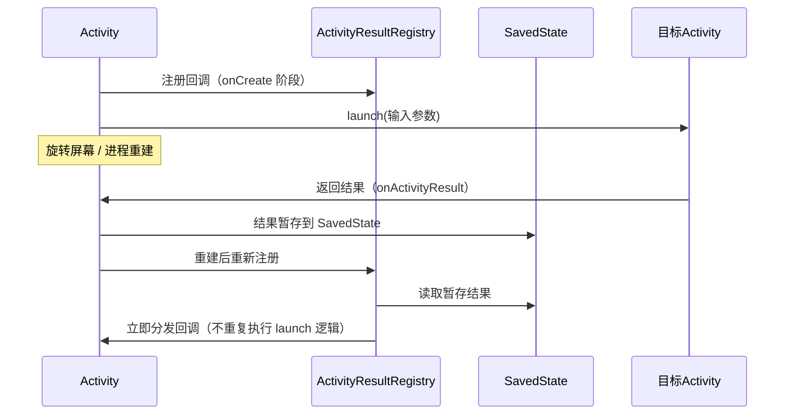

# ActivityResult API 详解

> 面试高频指数：高
> ActivityResult API 取代了已废弃的 startActivityForResult / onActivityResult，是 androidx.activity 的核心能力。

## 1. 为什么需要 ActivityResult API

### 1.1 传统方式的痛点

::: code-tabs

@tab:active Java

```java
// ✗ 传统方式：回调与调用分离，代码分散难维护
public class MainActivity extends AppCompatActivity {

    private static final int REQUEST_IMAGE = 100;

    private void pickImage() {
        Intent intent = new Intent(Intent.ACTION_GET_CONTENT);
        intent.setType("image/*");
        startActivityForResult(intent, REQUEST_IMAGE);   // 发起请求
    }

    // 回调方法在 Activity 另一个区域，逻辑割裂
    @Override
    protected void onActivityResult(int requestCode, int resultCode, Intent data) {
        super.onActivityResult(requestCode, resultCode, data);
        if (requestCode == REQUEST_IMAGE && resultCode == RESULT_OK) {
            Uri uri = data.getData();
            // 处理图片...
        }
    }
}
```

@tab Kotlin

```kotlin
// ✗ 传统方式：回调与调用分离，代码分散难维护
class MainActivity : AppCompatActivity() {

    private val requestImage = 100

    private fun pickImage() {
        val intent = Intent(Intent.ACTION_GET_CONTENT).apply { type = "image/*" }
        startActivityForResult(intent, requestImage)   // 发起请求
    }

    // 回调方法在 Activity 另一个区域，逻辑割裂
    override fun onActivityResult(requestCode: Int, resultCode: Int, data: Intent?) {
        super.onActivityResult(requestCode, resultCode, data)
        if (requestCode == requestImage && resultCode == RESULT_OK) {
            val uri = data?.data
            // 处理图片...
        }
    }
}
```

:::

### 1.2 传统方式的四大问题

| 问题 | 说明 |
| --- | --- |
| 代码分散 | 调用与回调分离，requestCode 魔法数易冲突 |
| 无类型安全 | Intent 数据靠手动解析，无编译期检查 |
| 生命周期混乱 | 在错误时机调用会崩溃；恢复时回调顺序难控 |
| 状态丢失 | 旋转屏幕后结果可能丢失或重复回调 |

## 2. 基本用法

### 2.1 注册与启动

::: code-tabs

@tab:active Java

```java
public class MainActivity extends AppCompatActivity {

    // ① 在字段初始化时注册（不是点击时才注册）
    private final ActivityResultLauncher<String> pickImage =
            registerForActivityResult(
                    new ActivityResultContracts.GetContent(),
                    uri -> {
                        // 结果回调：uri 为 null 表示用户取消
                        if (uri != null) {
                            imageView.setImageURI(uri);
                        }
                    });

    private void onClickPick() {
        // ② 启动：传入输入参数（GetContent 需要 MIME 类型）
        pickImage.launch("image/*");
    }
}
```

@tab Kotlin

```kotlin
class MainActivity : AppCompatActivity() {

    // ① 在字段初始化时注册（不是点击时才注册）
    private val pickImage =
            registerForActivityResult(ActivityResultContracts.GetContent()) { uri ->
                // 结果回调：uri 为 null 表示用户取消
                if (uri != null) {
                    imageView.setImageURI(uri)
                }
            }

    private fun onClickPick() {
        // ② 启动：传入输入参数（GetContent 需要 MIME 类型）
        pickImage.launch("image/*")
    }
}
```

:::

### 2.2 关键规则

- **注册时机**：在 STARTED 之前注册，字段初始化阶段即可（Activity、Fragment 均可）。
- **回调线程**：回调在主线程执行。
- **取消**：用户取消时回调仍会执行，输入为 null（或 RESULT_CANCELED 语义），必须判空。
- **重复启动**：同一 launcher 可以多次 launch，每次都会回调。

## 3. ActivityResultContracts 内置契约

| 契约类 | 输入 | 输出 | 用途 |
| --- | --- | --- | --- |
| `StartActivityForResult` | Intent | ActivityResult | 通用（返回 Intent） |
| `StartActivityForResult`（自定义） | Intent | ActivityResult | 任意 Activity 结果 |
| `GetContent` | MIME 类型 String | Uri? | 打开系统文件选择器（无持久权限） |
| `OpenDocument` | 数组 String[] | Uri? | 打开文档（可请求持久权限） |
| `TakePicture` | Uri（输出地址） | Boolean | 相机拍照，写入指定 Uri |
| `TakeVideo` | Uri（输出地址） | Boolean | 相机录像 |
| `RequestPermission` | String | Boolean | 单个运行时权限 |
| `RequestMultiplePermissions` | 数组 String[] | Map<String, Boolean> | 多个运行时权限 |
| `PickContact` | 无（Void） | Uri? | 选择联系人 |

### 3.1 相机拍照完整示例

::: code-tabs

@tab:active Java

```java
public class MainActivity extends AppCompatActivity {

    private ActivityResultLauncher<Uri> takePicture;
    private Uri outputUri;

    @Override
    protected void onCreate(Bundle savedInstanceState) {
        super.onCreate(savedInstanceState);

        takePicture = registerForActivityResult(
                new ActivityResultContracts.TakePicture(),
                success -> {
                    if (success) {
                        // 照片已写入 outputUri
                        imageView.setImageURI(outputUri);
                    }
                });
    }

    private void onClickCamera() {
        // 先创建输出文件，再启动相机
        File dir = getCacheDir();
        File file = new File(dir, "photo_" + System.currentTimeMillis() + ".jpg");
        outputUri = FileProvider.getUriForFile(this, getPackageName() + ".fileprovider", file);
        takePicture.launch(outputUri);
    }
}
```

@tab Kotlin

```kotlin
class MainActivity : AppCompatActivity() {

    private lateinit var takePicture: ActivityResultLauncher<Uri>
    private lateinit var outputUri: Uri

    override fun onCreate(savedInstanceState: Bundle?) {
        super.onCreate(savedInstanceState)

        takePicture = registerForActivityResult(
            ActivityResultContracts.TakePicture()
        ) { success ->
            if (success) {
                // 照片已写入 outputUri
                imageView.setImageURI(outputUri)
            }
        }
    }

    private fun onClickCamera() {
        // 先创建输出文件，再启动相机
        val file = File(cacheDir, "photo_${System.currentTimeMillis()}.jpg")
        outputUri = FileProvider.getUriForFile(
            this, "$packageName.fileprovider", file
        )
        takePicture.launch(outputUri)
    }
}
```

:::

### 3.2 运行时权限（推荐写法）

::: code-tabs

@tab:active Java

```java
public class MainActivity extends AppCompatActivity {

    private final ActivityResultLauncher<String> requestCamera =
            registerForActivityResult(
                    new ActivityResultContracts.RequestPermission(),
                    granted -> {
                        if (granted) {
                            // 权限已授予，开始使用相机
                            openCamera();
                        } else {
                            // 权限被拒绝，引导去设置页
                            showPermissionRationale();
                        }
                    });

    private void onClickOpen() {
        // 检查权限 → 已授予直接使用，否则请求
        if (ContextCompat.checkSelfPermission(this, Manifest.permission.CAMERA)
                == PackageManager.PERMISSION_GRANTED) {
            openCamera();
        } else {
            requestCamera.launch(Manifest.permission.CAMERA);
        }
    }
}
```

@tab Kotlin

```kotlin
class MainActivity : AppCompatActivity() {

    private val requestCamera =
            registerForActivityResult(ActivityResultContracts.RequestPermission()) { granted ->
                if (granted) {
                    // 权限已授予，开始使用相机
                    openCamera()
                } else {
                    // 权限被拒绝，引导去设置页
                    showPermissionRationale()
                }
            }

    private fun onClickOpen() {
        // 检查权限 → 已授予直接使用，否则请求
        if (ContextCompat.checkSelfPermission(this, Manifest.permission.CAMERA)
                == PackageManager.PERMISSION_GRANTED
        ) {
            openCamera()
        } else {
            requestCamera.launch(Manifest.permission.CAMERA)
        }
    }
}
```

:::

## 4. 生命周期安全原理

### 4.1 为什么旋转屏幕不丢回调



### 4.2 核心机制

| 机制 | 作用 |
| --- | --- |
| `ActivityResultRegistry` | 统一管理所有 launcher 的注册与分发 |
| `ComponentActivity` | 内部持有 registry，通过 Lifecycle 联动 |
| SavedState 暂存 | 结果在重建前写入 onSaveInstanceState，重建后恢复分发 |
| 注册时机校验 | STARTED 之后注册会抛 `IllegalStateException`（防误用） |

### 4.3 Fragment 中使用

::: code-tabs

@tab:active Java

```java
public class ProfileFragment extends Fragment {

    private final ActivityResultLauncher<String> pickImage =
            registerForActivityResult(
                    new ActivityResultContracts.GetContent(),
                    uri -> {
                        if (uri != null) {
                            // 更新头像
                        }
                    });

    @Override
    public View onCreateView(LayoutInflater inflater, ViewGroup container,
                             Bundle savedInstanceState) {
        View view = inflater.inflate(R.layout.fragment_profile, container, false);
        view.findViewById(R.id.btn_pick).setOnClickListener(v ->
                pickImage.launch("image/*"));
        return view;
    }
}
```

@tab Kotlin

```kotlin
class ProfileFragment : Fragment() {

    private val pickImage =
            registerForActivityResult(ActivityResultContracts.GetContent()) { uri ->
                if (uri != null) {
                    // 更新头像
                }
            }

    override fun onCreateView(
        inflater: LayoutInflater,
        container: ViewGroup?,
        savedInstanceState: Bundle?
    ): View {
        val view = inflater.inflate(R.layout.fragment_profile, container, false)
        view.findViewById<View>(R.id.btn_pick).setOnClickListener {
            pickImage.launch("image/*")
        }
        return view
    }
}
```

:::

## 5. 自定义契约

当内置契约不满足需求时，可以自定义 `ActivityResultContract`：

::: code-tabs

@tab:active Java

```java
// 自定义契约：裁剪图片，输入原图 Uri，输出裁剪后 Uri
public class CropImageContract
        extends ActivityResultContract<Uri, Uri> {

    public static class Input {
        public Uri sourceUri;
        public int aspectX = 1;
        public int aspectY = 1;
    }

    @Override
    public Intent createIntent(Context context, Input input) {
        Intent intent = new Intent("com.android.camera.action.CROP");
        intent.setDataAndType(input.sourceUri, "image/*");
        intent.putExtra("aspectX", input.aspectX);
        intent.putExtra("aspectY", input.aspectY);
        intent.putExtra("output", Uri.fromFile(
                new File(context.getCacheDir(), "crop_result.jpg")));
        return intent;
    }

    @Override
    public Uri parseResult(int resultCode, Intent intent) {
        if (resultCode != Activity.RESULT_OK) return null;
        return intent != null ? intent.getData() : null;
    }
}

// 使用
ActivityResultLauncher<CropImageContract.Input> crop =
        registerForActivityResult(new CropImageContract(),
                croppedUri -> {
                    if (croppedUri != null) {
                        // 显示裁剪结果
                    }
                });
crop.launch(new CropImageContract.Input());
```

@tab Kotlin

```kotlin
// 自定义契约：裁剪图片，输入原图 Uri，输出裁剪后 Uri
class CropImageContract : ActivityResultContract<CropImageContract.Input, Uri?>() {

    class Input(val sourceUri: Uri, val aspectX: Int = 1, val aspectY: Int = 1)

    override fun createIntent(context: Context, input: Input): Intent {
        return Intent("com.android.camera.action.CROP").apply {
            setDataAndType(input.sourceUri, "image/*")
            putExtra("aspectX", input.aspectX)
            putExtra("aspectY", input.aspectY)
            putExtra("output", Uri.fromFile(File(context.cacheDir, "crop_result.jpg")))
        }
    }

    override fun parseResult(resultCode: Int, intent: Intent?): Uri? {
        if (resultCode != Activity.RESULT_OK) return null
        return intent?.data
    }
}

// 使用
val crop = registerForActivityResult(CropImageContract()) { croppedUri ->
    if (croppedUri != null) {
        // 显示裁剪结果
    }
}
crop.launch(CropImageContract.Input(sourceUri))
```

:::

## 6. 面试高频题

::: details Q1：registerForActivityResult 相比 startActivityForResult 解决了哪些问题？

1. **代码聚合**：调用与回调写在一起，requestCode 魔法数消失；
2. **类型安全**：契约定义了输入/输出类型，编译期可检查；
3. **生命周期安全**：结果与 SavedState 联动，重建后自动恢复，不会丢失；
4. **防误用**：STARTED 后注册直接抛异常，从源头避免经典崩溃。

:::

::: details Q2：为什么要在字段初始化时注册，而不是点击时才注册？

`registerForActivityResult` 必须在 `STARTED` 之前调用，字段初始化阶段（onCreate 中）必然满足条件。若在点击事件（此时已 STARTED）中注册会抛 `IllegalStateException`，因为此时 registry 已锁定生命周期。同时提前注册能保证重建时回调能正确恢复分发。

:::

::: details Q3：GetContent 与 OpenDocument 有什么区别？

| 对比项 | GetContent | OpenDocument |
| --- | --- | --- |
| 返回权限 | 临时读取权限 | 可请求持久权限 |
| 适用场景 | 一次性读取图片/文件 | 长期访问文档（如打开过的文件列表） |
| 权限恢复 | 进程结束后失效 | 通过 takePersistableUriPermission 持久化 |

:::

::: details Q4：TakePicture 输入的是 Uri 而不是返回 Uri，为什么？

相机应用无法直接往我们应用的私有目录写入，所以需要**我们预先创建文件**并授权（通过 FileProvider 暴露），把输出 Uri 传给相机。拍照成功后照片直接写入该 Uri，回调只返回布尔值表示成功与否。这避免了传统方式中 FileProvider 授权时机混乱的问题。

:::

::: details Q5：进程被系统杀死后，ActivityResult 结果会怎样？

结果会保存在 Activity 的 SavedState 中。进程重建后，ActivityResultRegistry 从 SavedState 恢复未消费的结果，并在 launcher 重新注册时立即回调。也就是说**结果不会丢失**，但回调会延迟到重建完成之后。这也是为什么回调必须做判空处理。

:::

## 7. 小结

- ActivityResult API 是处理 Activity 间通信的**现代标准方案**，`startActivityForResult` 已废弃。
- 内置契约覆盖了文件选择、相机、权限等高频场景，自定义契约解决特殊需求。
- 底层依赖 `ActivityResultRegistry` + SavedState，天然具备**生命周期安全**。
- 面试重点：注册时机、契约输入输出、重建后结果恢复原理。

## 相关阅读

- [Android Activity 生命周期](/android/activity/)
- [运行时权限机制](/android/permission/)
- [Fragment 基础](/android/fragment/fragment-basics.md)
