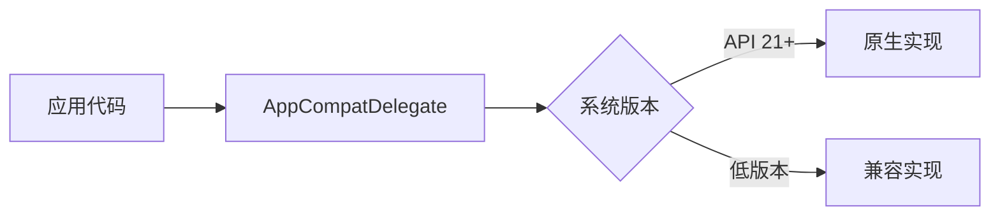
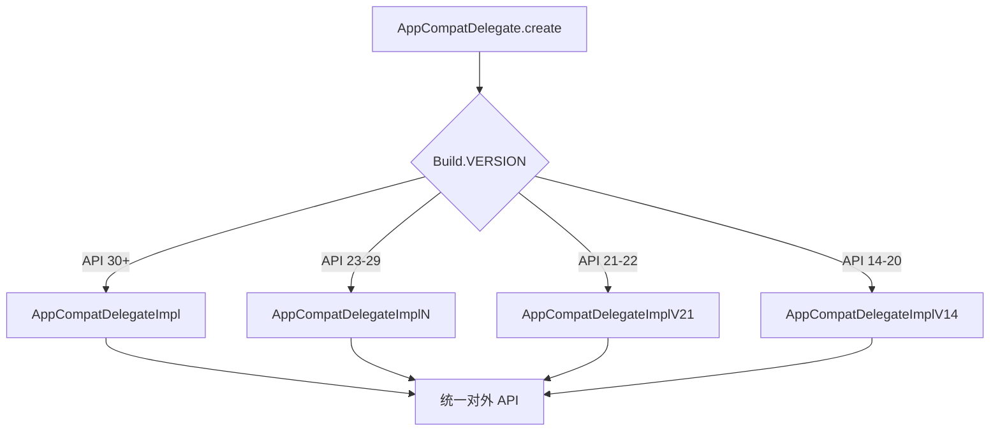
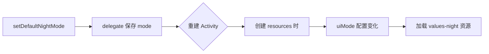

# AppCompat 兼容原理

> 面试高频指数：中
> AppCompat 是 AndroidX 中最重要的向后兼容库，让新特性在旧系统上也能工作。

## 1. 为什么需要 AppCompat

### 1.1 兼容的本质

系统更新慢、碎片化严重，新 API 只在部分版本可用。AppCompat 的思路是：**用代理层做版本分流**——高版本走原生实现，低版本走兼容实现，对外接口一致：



| 特性 | 原生支持 | AppCompat 兼容 |
| --- | --- | --- |
| Material 主题 | API 21+ 部分 | 全版本一致 |
| 夜间模式 | API 29+ | **API 14+** |
| AppCompat 控件 | 无 | 全版本 |
| Vector 图标 | API 21+ | **API 14+** |

### 1.2 核心组成

- `AppCompatActivity`：Activity 基类，内部持有 AppCompatDelegate；
- `AppCompatDelegate`：代理，把兼容工作委托给实现类；
- `Theme.AppCompat`：基础主题，保证控件样式统一；
- `AppCompat*` 控件：ImageView、TextView 等的兼容版本。

## 2. AppCompatActivity 原理

### 2.1 委托模式

AppCompatActivity 的核心是**委托模式**：自己不做兼容工作，全权交给 `AppCompatDelegate`，而 delegate 按系统版本选择实现：

::: code-tabs

@tab:active Java

```java
public class MainActivity extends AppCompatActivity {

    @Override
    protected void onCreate(Bundle savedInstanceState) {
        // AppCompatActivity.onCreate 内部调用
        // AppCompatDelegate.onCreate(...)
        // delegate 根据系统版本创建不同实现
        super.onCreate(savedInstanceState);
        setContentView(R.layout.activity_main);
    }
}
```

@tab Kotlin

```kotlin
class MainActivity : AppCompatActivity() {

    override fun onCreate(savedInstanceState: Bundle?) {
        // AppCompatActivity.onCreate 内部调用
        // AppCompatDelegate.onCreate(...)
        // delegate 根据系统版本创建不同实现
        super.onCreate(savedInstanceState)
        setContentView(R.layout.activity_main)
    }
}
```

:::

### 2.2 AppCompatDelegate 版本适配

`create()` 工厂方法按 Build.VERSION 分支，不同版本用不同实现类：



不同实现类在**内部细节**上分版本处理，对外暴露相同能力（主题、夜间模式、Window 装饰）。

### 2.3 setContentView 做了什么

`setContentView` 也经过 delegate——内部把普通控件替换成 AppCompat 版本、设置窗口装饰、应用主题：

::: code-tabs

@tab:active Java

```java
// 简化逻辑：setContentView 会经过 delegate
@Override
public void setContentView(int layoutResID) {
    getDelegate().setContentView(layoutResID);   // 委托给 delegate
}
```

@tab Kotlin

```kotlin
// 简化逻辑：setContentView 会经过 delegate
override fun setContentView(layoutResID: Int) {
    delegate.setContentView(layoutResID)   // 委托给 delegate
}
```

:::

delegate 内部：
1. 创建 `AppCompatViewInflater`，把布局里的控件**替换**为 AppCompat 版本；
2. 设置支持 ActionBar 的窗口装饰（如果启用了 ActionBar）；
3. 应用主题相关属性。

## 3. 控件自动兼容机制

### 3.1 AppCompatViewInflater

你写 `<ImageView>`，实际拿到的是 `AppCompatImageView`——布局填充器自动完成了替换：

| 布局控件 | 实际替换为 | 增加的能力 |
| --- | --- | --- |
| TextView | AppCompatTextView | autoSizeText、tint、字体 |
| ImageView | AppCompatImageView | tint、矢量图支持 |
| Button | AppCompatButton | tint、背景覆盖 |
| EditText | AppCompatEditText | tint、错误图标 |
| CheckBox | AppCompatCheckBox | tint |
| RadioButton | AppCompatRadioButton | tint |

### 3.2 Tint 着色机制

AppCompat 控件对图片着色（tint）的支持：

::: code-tabs

@tab:active Java

```java
// AppCompatImageView 的 tint 支持（简化）
public class AppCompatImageView extends ImageView {

    @Override
    public void setImageResource(int resId) {
        super.setImageResource(resId);
        // 自动应用 android:tint 属性
        applySupportTint();
    }
}
```

@tab Kotlin

```kotlin
// AppCompatImageView 的 tint 支持（简化）
class AppCompatImageView : ImageView {

    override fun setImageResource(resId: Int) {
        super.setImageResource(resId)
        // 自动应用 android:tint 属性
        applySupportTint()
    }
}
```

:::

**tint 的优势**：同一张图片资源可动态着色，无需为每个颜色准备一套 drawable。

## 4. DayNight 夜间模式

### 4.1 原理

`AppCompatDelegate.setDefaultNightMode()` 让应用在 API 14+ 支持深色模式——几个模式值的含义如下：

::: code-tabs

@tab:active Java

```java
public class SettingsActivity extends AppCompatActivity {

    public static void applyNightMode(int mode) {
        // 设置全局夜间模式（重启 Activity 生效）
        AppCompatDelegate.setDefaultNightMode(mode);
    }

    // mode 可选值：
    // MODE_NIGHT_NO          跟随系统关闭
    // MODE_NIGHT_YES         强制开启
    // MODE_NIGHT_FOLLOW_SYSTEM  跟随系统（默认）
    // MODE_NIGHT_AUTO_BATTERY   省电时自动开启（已废弃）
}
```

@tab Kotlin

```kotlin
class SettingsActivity : AppCompatActivity() {

    companion object {
        fun applyNightMode(mode: Int) {
            // 设置全局夜间模式（重启 Activity 生效）
            AppCompatDelegate.setDefaultNightMode(mode)
        }

        // mode 可选值：
        // MODE_NIGHT_NO          跟随系统关闭
        // MODE_NIGHT_YES         强制开启
        // MODE_NIGHT_FOLLOW_SYSTEM  跟随系统（默认）
        // MODE_NIGHT_AUTO_BATTERY   省电时自动开启（已废弃）
    }
}
```

:::

### 4.2 夜间模式实现方式

设置模式后，系统通过 **uiMode 配置变化**触发 Activity 重建，重建时自动加载 `values-night` 资源：



| 资源目录 | 用途 |
| --- | --- |
| values/ | 默认（亮色）资源 |
| values-night/ | 夜间模式资源 |
| drawable-night/ | 夜间图片 |

### 4.3 强制生效（不用重启）

::: code-tabs

@tab:active Java

```java
// 已废弃 API，推荐让系统自动重建
getDelegate().applyDayNight();
```

@tab Kotlin

```kotlin
// 已废弃 API，推荐让系统自动重建
delegate.applyDayNight()
```

:::

## 5. Compat 工具类

AppCompat 之外，androidx.core 提供大量 Compat 工具类，让新 API 在旧版本安全调用：

| 工具类 | 典型能力 |
| --- | --- |
| `ContextCompat` | getColor / getDrawable / startActivity |
| `ViewCompat` | postOnAnimation / setBackground / insets |
| `ActivityCompat` | 权限请求 / 通知权限 |
| `ResourcesCompat` | getDrawable / getFont |

::: code-tabs

@tab:active Java

```java
// 示例：在旧版本安全调用
int color = ContextCompat.getColor(context, R.color.primary);
Drawable drawable = ContextCompat.getDrawable(context, R.drawable.icon);
```

@tab Kotlin

```kotlin
// 示例：在旧版本安全调用
val color = ContextCompat.getColor(context, R.color.primary)
val drawable = ContextCompat.getDrawable(context, R.drawable.icon)
```

:::

## 6. 面试高频题

::: details Q1：AppCompatActivity 为什么能向下兼容新特性？

关键在**委托模式**：AppCompatActivity 内部持有 AppCompatDelegate，所有兼容操作委托给它。AppCompatDelegate 按 API 级别选择不同实现类（ImplV14/V21/N 等），低版本用兼容逻辑模拟新行为，高版本直接走原生路径。对外 API 不变，内部实现隔离。

:::

::: details Q2：布局里的 Button 为什么自动变成 AppCompatButton？

setContentView 经过 AppCompatDelegate 后，会使用 AppCompatViewInflater 解析布局，把标准的 View 子类替换成对应的 AppCompat 版本（Button → AppCompatButton），从而获得 tint、矢量图等兼容能力。默认情况下所有兼容控件都会自动替换，无需手动指定。

:::

::: details Q3：AppCompat 夜间模式的原理是什么？

AppCompatDelegate.setDefaultNightMode 记录模式值，Activity 重建时通过 Configuration.uiMode 切换 resources，从而加载 values-night 目录下的资源。旧系统没有原生深色模式，AppCompat 用 uiMode 配置变更模拟实现；API 29+ 则直接跟随系统。

:::

::: details Q4：Theme.AppCompat 与 Material 主题有什么关系？

Theme.AppCompat 是 AppCompat 的基础主题，保证控件样式在各版本一致。Material Components 的 Theme.MaterialComponents 继承自 Theme.AppCompat（或其变体），在其基础上添加 Material Design 组件和主题属性。选择 Material 主题时依赖链为：Theme.MaterialComponents → Theme.AppCompat → Theme.AppCompat.Light。

:::

::: details Q5：为什么还要存在 Compat 工具类（ContextCompat 等）？

① 很多系统 API 在新版本改变了签名或行为，Compat 类内部做版本判断，对外保持稳定 API；② 有些能力是新 API 才有，Compat 类在旧版本提供模拟实现；③ 避免开发者写大量 Build.VERSION 分支，降低出错率。

:::

## 7. 小结

- AppCompat 通过**委托模式**（AppCompatDelegate）实现向后兼容。
- **控件替换**（AppCompatViewInflater）带来 tint、矢量图等能力。
- **DayNight** 用 uiMode 配置切换模拟深色模式，全版本可用。
- Compat 工具类是安全调用系统 API 的标准姿势。

## 相关阅读

- [Jetpack Core 库](/jetpack/core/)
- [Android Context 机制](/android/context/)
- [Android 资源系统](/android/resource/)
