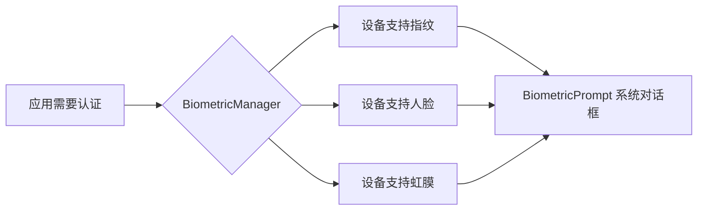
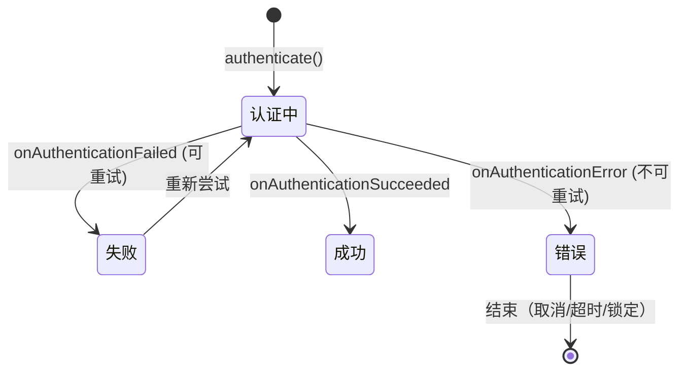
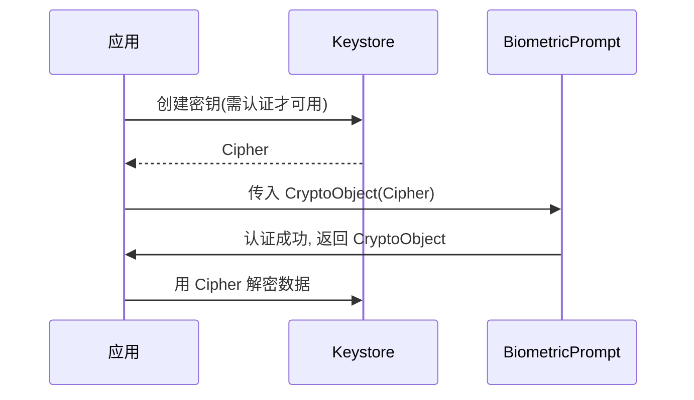

# BiometricPrompt 生物识别

> 面试高频指数：中
> androidx.biometric 提供统一的生物识别入口（指纹 / 人脸 / 虹膜），系统级 UI，安全可靠。

## 1. 生物识别概览

### 1.1 为什么用 androidx.biometric

先由 `BiometricManager` 检测设备支持哪种生物特征（指纹/人脸/虹膜），再统一交给 `BiometricPrompt` 弹系统对话框，一套 API 覆盖所有机型：



| 方案 | 优点 | 缺点 |
| --- | --- | --- |
| 厂商 SDK（指纹/人脸） | 功能丰富 | 碎片化，每家 API 不同 |
| android.hardware.biometrics | 原生 API | API 28+ 才有 |
| **androidx.biometric** | **统一 API、系统 UI、自动降级** | 依赖库版本 |

### 1.2 认证类型

| 类型 | 说明 | 安全等级 |
| --- | --- | --- |
| BIOMETRIC_STRONG | 指纹 / 3D 人脸等强生物特征 | Class 3 |
| BIOMETRIC_WEAK | 2D 人脸等弱特征 | Class 2 |
| DEVICE_CREDENTIAL | PIN / 密码 / 图案（备用） | Class 1 |

## 2. 支持性检测

动手弹窗之前先问一句"设备支持吗"——`BiometricManager.canAuthenticate` 返回是否可用：

::: code-tabs

@tab:active Java

```java
public class BiometricHelper {

    // 检测设备是否支持强生物识别
    public static boolean isBiometricAvailable(Context context) {
        BiometricManager manager = BiometricManager.from(context);
        return manager.canAuthenticate(
                BiometricManager.Authenticators.BIOMETRIC_STRONG
                        | BiometricManager.Authenticators.BIOMETRIC_WEAK)
                == BiometricManager.BIOMETRIC_SUCCESS;
    }
}
```

@tab Kotlin

```kotlin
object BiometricHelper {

    // 检测设备是否支持强生物识别
    fun isBiometricAvailable(context: Context): Boolean {
        val manager = BiometricManager.from(context)
        return manager.canAuthenticate(
            BiometricManager.Authenticators.BIOMETRIC_STRONG
                or BiometricManager.Authenticators.BIOMETRIC_WEAK
        ) == BiometricManager.BIOMETRIC_SUCCESS
    }
}
```

:::

### 2.1 canAuthenticate 返回值

| 返回值 | 含义 | 建议处理 |
| --- | --- | --- |
| `BIOMETRIC_SUCCESS` | 可用 | 正常使用 |
| `BIOMETRIC_ERROR_NONE_ENROLLED` | 未录入生物特征 | 引导去设置页 |
| `BIOMETRIC_ERROR_HW_UNAVAILABLE` | 硬件不可用 | 提示用户，用密码兜底 |
| `BIOMETRIC_ERROR_NO_HARDWARE` | 无硬件 | 用密码兜底 |
| `BIOMETRIC_ERROR_SECURITY_UPDATE_REQUIRED` | 需要安全更新 | 提示升级系统 |

## 3. BiometricPrompt 认证

### 3.1 基础认证流程

认证的核心是 `BiometricPrompt` + 回调：**成功**进主流程、**失败**可重试、**错误**（取消/超时/锁定）结束流程：

::: code-tabs

@tab:active Java

```java
public class LoginActivity extends AppCompatActivity {

    private Executor executor;

    @Override
    protected void onCreate(Bundle savedInstanceState) {
        super.onCreate(savedInstanceState);
        executor = ContextCompat.getMainExecutor(this);
    }

    private void startBiometricAuth() {
        BiometricPrompt prompt = new BiometricPrompt(this, executor,
                new BiometricPrompt.AuthenticationCallback() {
                    @Override
                    public void onAuthenticationSucceeded(
                            BiometricPrompt.AuthenticationResult result) {
                        super.onAuthenticationSucceeded(result);
                        // 认证成功，进入主界面
                        goToMain();
                    }

                    @Override
                    public void onAuthenticationFailed() {
                        super.onAuthenticationFailed();
                        // 识别失败（可重试），不结束流程
                    }

                    @Override
                    public void onAuthenticationError(int errorCode, CharSequence errString) {
                        super.onAuthenticationError(errorCode, errString);
                        // 不可重试的错误（取消/超时/锁定），结束流程
                        showError(errString);
                    }
                });

        prompt.authenticate(
                new BiometricPrompt.PromptInfo.Builder()
                        .setTitle("验证身份")
                        .setSubtitle("使用指纹或人脸登录")
                        .setNegativeButtonText("使用密码")
                        .setAllowedAuthenticators(
                                BiometricManager.Authenticators.BIOMETRIC_STRONG
                                        | BiometricManager.Authenticators.BIOMETRIC_WEAK
                                        | BiometricManager.Authenticators.DEVICE_CREDENTIAL)
                        .build());
    }
}
```

@tab Kotlin

```kotlin
class LoginActivity : AppCompatActivity() {

    private lateinit var executor: Executor

    override fun onCreate(savedInstanceState: Bundle?) {
        super.onCreate(savedInstanceState)
        executor = ContextCompat.getMainExecutor(this)
    }

    private fun startBiometricAuth() {
        val prompt = BiometricPrompt(this, executor,
            object : BiometricPrompt.AuthenticationCallback() {
                override fun onAuthenticationSucceeded(
                    result: BiometricPrompt.AuthenticationResult
                ) {
                    super.onAuthenticationSucceeded(result)
                    // 认证成功，进入主界面
                    goToMain()
                }

                override fun onAuthenticationFailed() {
                    super.onAuthenticationFailed()
                    // 识别失败（可重试），不结束流程
                }

                override fun onAuthenticationError(
                    errorCode: Int, errString: CharSequence
                ) {
                    super.onAuthenticationError(errorCode, errString)
                    // 不可重试的错误（取消/超时/锁定），结束流程
                    showError(errString)
                }
            })

        prompt.authenticate(
            BiometricPrompt.PromptInfo.Builder()
                .setTitle("验证身份")
                .setSubtitle("使用指纹或人脸登录")
                .setNegativeButtonText("使用密码")
                .setAllowedAuthenticators(
                    BiometricManager.Authenticators.BIOMETRIC_STRONG
                        or BiometricManager.Authenticators.BIOMETRIC_WEAK
                        or BiometricManager.Authenticators.DEVICE_CREDENTIAL
                )
                .build()
        )
    }
}
```

:::

### 3.2 认证流程状态机

整个流程是一个有限状态机：



**关键区别**：

- `onAuthenticationFailed`：指纹没对上，**流程不结束**，可继续尝试；
- `onAuthenticationError`：取消、超时、多次失败锁定等，**流程结束**。

## 4. CryptoObject 加密绑定

### 4.1 为什么需要 CryptoObject

普通认证只证明"你是机主"；要解密敏感数据还需要证明"认证后你才被授权用这把钥匙"。CryptoObject 把密钥与认证绑定：



::: code-tabs

@tab:active Java

```java
public class CryptoManager {

    private static final String KEY_NAME = "biometric_key";

    // 生成需要认证才能使用的密钥
    public SecretKey createKey() throws Exception {
        KeyGenParameterSpec spec = new KeyGenParameterSpec.Builder(
                KEY_NAME,
                KeyProperties.PURPOSE_ENCRYPT | KeyProperties.PURPOSE_DECRYPT)
                .setBlockModes(KeyProperties.BLOCK_MODE_GCM)
                .setEncryptionPaddings(KeyProperties.ENCRYPTION_PADDING_NONE)
                .setUserAuthenticationRequired(true)   // 关键：需用户认证
                .setInvalidatedByBiometricEnrollment(true)
                .build();

        KeyGenerator generator = KeyGenerator.getInstance(
                KeyProperties.KEY_ALGORITHM_AES, "AndroidKeyStore");
        generator.init(spec);
        return generator.generateKey();
    }

    // 加密：返回 IV 供解密使用
    public Cipher encrypt(byte[] plainText) throws Exception {
        SecretKey key = getKey();
        Cipher cipher = Cipher.getInstance("AES/GCM/NoPadding");
        cipher.init(Cipher.ENCRYPT_MODE, key);
        byte[] encrypted = cipher.doFinal(plainText);
        // 保存 cipher.getIV() 与 encrypted（示例略）
        return cipher;
    }
}
```

@tab Kotlin

```kotlin
object CryptoManager {

    private const val KEY_NAME = "biometric_key"

    // 生成需要认证才能使用的密钥
    fun createKey(): SecretKey {
        val spec = KeyGenParameterSpec.Builder(
            KEY_NAME,
            KeyProperties.PURPOSE_ENCRYPT or KeyProperties.PURPOSE_DECRYPT
        )
            .setBlockModes(KeyProperties.BLOCK_MODE_GCM)
            .setEncryptionPaddings(KeyProperties.ENCRYPTION_PADDING_NONE)
            .setUserAuthenticationRequired(true)   // 关键：需用户认证
            .setInvalidatedByBiometricEnrollment(true)
            .build()

        val generator = KeyGenerator.getInstance(
            KeyProperties.KEY_ALGORITHM_AES, "AndroidKeyStore"
        )
        generator.init(spec)
        return generator.generateKey()
    }

    // 加密：返回 IV 供解密使用
    fun encrypt(plainText: ByteArray): Cipher {
        val key = getKey()
        val cipher = Cipher.getInstance("AES/GCM/NoPadding")
        cipher.init(Cipher.ENCRYPT_MODE, key)
        cipher.doFinal(plainText)
        // 保存 cipher.iv 与 encrypted（示例略）
        return cipher
    }
}
```

:::

### 4.2 认证 + 解密

认证通过后从 `AuthenticationResult` 里取回已授权的 Cipher 完成解密——密钥只在认证成功那一刻解锁：

::: code-tabs

@tab:active Java

```java
// 认证成功后用 CryptoObject 解密
private void authAndDecrypt(Cipher cipher, byte[] encryptedData) {
    BiometricPrompt prompt = new BiometricPrompt(this, executor,
            new BiometricPrompt.AuthenticationCallback() {
                @Override
                public void onAuthenticationSucceeded(
                        BiometricPrompt.AuthenticationResult result) {
                    super.onAuthenticationSucceeded(result);
                    // 从结果中取回 Cipher（已授权）
                    Cipher authorized = result.getCryptoObject().getCipher();
                    try {
                        byte[] plain = authorized.doFinal(encryptedData);
                        // 展示明文
                    } catch (Exception e) {
                        // 解密失败
                    }
                }
            });

    prompt.authenticate(
            new BiometricPrompt.PromptInfo.Builder()
                    .setTitle("验证身份以查看内容")
                    .setNegativeButtonText("取消")
                    .build(),
            new BiometricPrompt.CryptoObject(cipher));   // 绑定密钥
}
```

@tab Kotlin

```kotlin
// 认证成功后用 CryptoObject 解密
private fun authAndDecrypt(cipher: Cipher, encryptedData: ByteArray) {
    val prompt = BiometricPrompt(this, executor,
        object : BiometricPrompt.AuthenticationCallback() {
            override fun onAuthenticationSucceeded(
                result: BiometricPrompt.AuthenticationResult
            ) {
                super.onAuthenticationSucceeded(result)
                // 从结果中取回 Cipher（已授权）
                val authorized = result.cryptoObject?.cipher
                try {
                    val plain = authorized?.doFinal(encryptedData)
                    // 展示明文
                } catch (e: Exception) {
                    // 解密失败
                }
            }
        })

    prompt.authenticate(
        BiometricPrompt.PromptInfo.Builder()
            .setTitle("验证身份以查看内容")
            .setNegativeButtonText("取消")
            .build(),
        BiometricPrompt.CryptoObject(cipher)   // 绑定密钥
    )
}
```

:::

## 5. 安全等级与最佳实践

### 5.1 安全等级选择

| 业务场景 | 推荐认证方式 |
| --- | --- |
| 登录 / 支付 | BIOMETRIC_STRONG（必须强认证） |
| 查看普通隐私内容 | BIOMETRIC_WEAK 即可 |
| 应用解锁 | 生物识别 + DEVICE_CREDENTIAL 兜底 |
| 密钥解密 | CryptoObject + BIOMETRIC_STRONG |

### 5.2 最佳实践

1. **先检测**：认证前必须 canAuthenticate 检查，返回码分场景处理；
2. **必须兜底**：negative button（密码）保证无生物识别也能用；
3. **失败可重试**：onAuthenticationFailed 不要结束流程；
4. **错误必结束**：onAuthenticationError 后要清理状态；
5. **密钥失效**：录入新指纹会 invalidate 旧密钥，需处理重建。

## 6. 面试高频题

::: details Q1：BiometricPrompt 与指纹厂商 SDK 的区别？

BiometricPrompt 是系统级统一 API：① 一套代码兼容指纹/人脸/虹膜；② 系统级对话框，UI 一致且安全；③ 自动处理版本差异；④ 支持 CryptoObject 强认证。厂商 SDK 功能多但碎片化、UI 自定义复杂、安全强度难以保证。

:::

::: details Q2：onAuthenticationFailed 与 onAuthenticationError 的区别？

failed：单次识别没对上（如指纹放偏了），**流程继续**，用户可以重试；error：发生了不可恢复的情况（取消、超时、指纹锁定等），**流程结束**，需要用户重新发起认证。业务上 failed 只提示不处理，error 要清理状态并给出兜底方案。

:::

::: details Q3：CryptoObject 的作用是什么？

把密钥和生物认证绑定：密钥设置 setUserAuthenticationRequired(true)，只有通过 BiometricPrompt 认证后才解锁可用。防止攻击者绕过认证直接解密数据。认证成功后从 AuthenticationResult 取回授权后的 Cipher 解密。

:::

::: details Q4：新增指纹后为什么旧密钥失效？

密钥在创建时与录入的生物特征绑定（setInvalidatedByBiometricEnrollment）。系统检测到指纹库变化（新增/删除指纹）会使密钥失效，防止他人用新增指纹获取授权。业务上需捕获 KeyPermanentlyInvalidatedException 并重新创建密钥。

:::

::: details Q5：没有生物识别硬件的设备怎么办？

① canAuthenticate 返回 NO_HARDWARE / NONE_ENROLLED；② 通过 setAllowedAuthenticators 加入 DEVICE_CREDENTIAL，允许用户用 PIN/密码认证；③ 或者提供备用登录方式（账号密码）。不要把生物识别作为唯一入口。

:::

## 7. 小结

- **BiometricManager** 负责能力检测，返回值分场景处理；
- **BiometricPrompt** 提供统一系统对话框，区分 failed（可重试）与 error（结束）；
- **CryptoObject** 把密钥与认证绑定，实现强安全的数据解密；
- 生物识别只是**入口之一**，永远要有密码/图案等兜底方案。

## 相关阅读

- [Android 权限机制](/android/permission/)
- [Jetpack Core 库](/jetpack/core/)
- [Android Service 机制](/android/service/)
