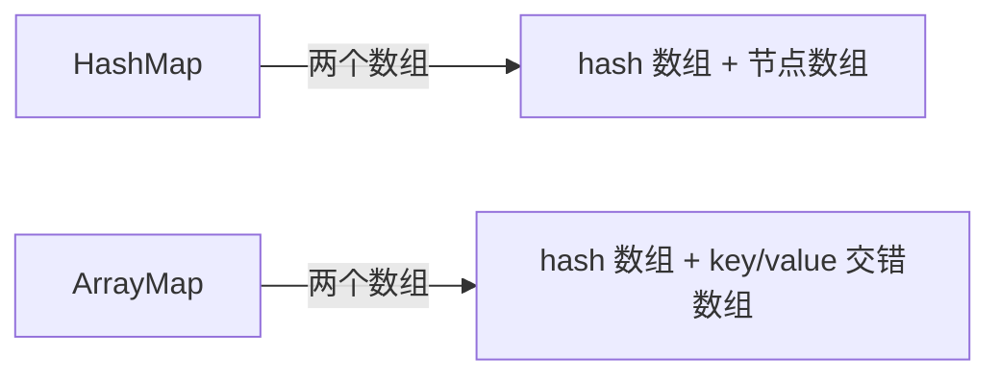
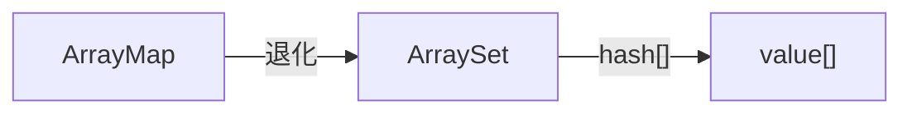
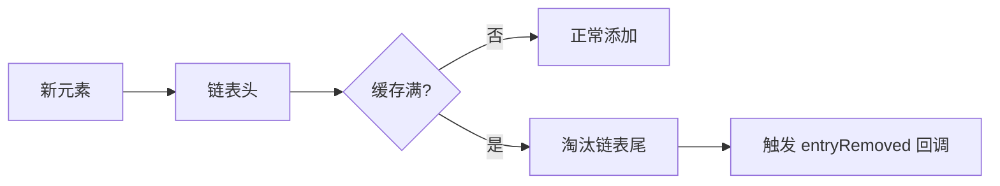

# Collection 集合库详解

> 面试高频指数：中
> androidx.collection 提供内存高效的集合实现，是性能优化的利器。

## 1. ArrayMap 原理

### 1.1 为什么需要 ArrayMap

HashMap 的每个条目都是一个独立对象（Entry），内存开销大。ArrayMap 用**两个数组**替代：一个存哈希、一个交错存 key/value，紧凑得多：



| 对比项 | HashMap | ArrayMap |
| --- | --- | --- |
| 内部结构 | 哈希表 + 链表/树 | 两个数组（hash[] + key/value[]） |
| 内存占用 | 高（每个 Entry 一个对象） | 低（紧凑数组，无额外对象） |
| 查找速度 | O(1) 哈希 | O(1) 哈希 + 二分查找优化 |
| 适合场景 | 大数据量 | **小数据量（< 1000）** |
| 迭代 | 无序 | 插入序（实际上按数组顺序） |

### 1.2 内部结构

核心结构就两个数组：`mHashes` 存哈希值（保持有序以便二分查找），`mArray` 按 [key, value, key, value…] 交错存数据：

::: code-tabs

@tab:active Java

```java
// 简化示意：两个数组
public class ArrayMap<K, V> {

    int[] mHashes;        // 哈希值数组（有序）
    Object[] mArray;      // key 与 value 交错存储
    // mArray: [key0, value0, key1, value1, ...]

    // 添加元素
    public V put(K key, V value) {
        int hash = key.hashCode();
        int index = indexOfKey(key, hash);   // 二分查找
        if (index >= 0) {
            // 已存在，替换
            int valueIndex = index * 2 + 1;
            V old = (V) mArray[valueIndex];
            mArray[valueIndex] = value;
            return old;
        }
        // 不存在，插入到合适位置（保持数组有序）
        appendToArray(index, key, value);
        return null;
    }

    // 查找：二分查找
    public V get(Object key) {
        int index = indexOfKey(key, key.hashCode());
        return index >= 0 ? (V) mArray[index * 2 + 1] : null;
    }
}
```

@tab Kotlin

```kotlin
// 简化示意：两个数组
class ArrayMap<K, V> {

    var mHashes: IntArray = IntArray(0)      // 哈希值数组（有序）
    var mArray: Array<Any?> = arrayOfNulls(0) // key 与 value 交错存储
    // mArray: [key0, value0, key1, value1, ...]

    // 添加元素
    fun put(key: K, value: V): V? {
        val hash = key.hashCode()
        val index = indexOfKey(key, hash)   // 二分查找
        if (index >= 0) {
            // 已存在，替换
            val valueIndex = index * 2 + 1
            val old = mArray[valueIndex] as V
            mArray[valueIndex] = value
            return old
        }
        // 不存在，插入到合适位置（保持数组有序）
        appendToArray(index, key, value)
        return null
    }

    // 查找：二分查找
    fun get(key: K): V? {
        val index = indexOfKey(key, key.hashCode())
        return if (index >= 0) mArray[index * 2 + 1] as V else null
    }
}
```

:::

### 1.3 为什么更省内存

| 数据结构 | 每个元素额外开销 |
| --- | --- |
| HashMap Entry | 对象头 + next 指针 + hash 字段 ≈ 32B+ |
| ArrayMap | 仅 4B（hash int）+ 对象引用，无包装对象 |

**典型场景**：Android 中需要维护几百个键值对时（如 View 属性缓存、Bundle 内部），ArrayMap 可省下明显内存。Google 在 Bundle、Fragment、Intent 内部大量使用。

## 2. ArraySet

ArraySet 是 ArrayMap 思路的单元素版本：

- 基于 ArrayMap 思路的单元素集合；
- 内部只有 hash 数组 + value 数组；
- 适合**小集合去重**场景；
- 查找用二分，插入保持有序。

它和 ArrayMap 的关系可以看作"退化"：



## 3. LruCache 缓存

### 3.1 LRU 算法

LruCache 基于 LinkedHashMap 实现 **LRU（Least Recently Used）**：最近最少使用优先淘汰。新元素进链表头，缓存满时淘汰链表尾：



### 3.2 使用示例

图片缓存是 LruCache 的经典用法：容量按进程内存的 1/8 算，`sizeOf` 告诉 LruCache"单个元素占多大"，淘汰时走 `entryRemoved` 回调：

::: code-tabs

@tab:active Java

```java
public class ImageCache {

    private LruCache<String, Bitmap> cache;

    public ImageCache() {
        // 按内存大小计算缓存容量：进程内存的 1/8
        int maxMemory = (int) (Runtime.getRuntime().maxMemory() / 1024);
        int cacheSize = maxMemory / 8;

        cache = new LruCache<String, Bitmap>(cacheSize) {
            // 计算单个元素大小（单位与容量一致）
            @Override
            protected int sizeOf(String key, Bitmap value) {
                return value.getByteCount() / 1024;
            }

            // 元素被淘汰时的回调（可用于回收）
            @Override
            protected void entryRemoved(boolean evicted, String key,
                                        Bitmap oldValue, Bitmap newValue) {
                // oldValue.recycle() 谨慎调用，可能仍被引用
            }
        };
    }

    public void put(String key, Bitmap bitmap) {
        cache.put(key, bitmap);
    }

    public Bitmap get(String key) {
        return cache.get(key);
    }
}
```

@tab Kotlin

```kotlin
class ImageCache {

    // 按内存大小计算缓存容量：进程内存的 1/8
    private val cache = object : LruCache<String, Bitmap>(
        (Runtime.getRuntime().maxMemory() / 1024).toInt() / 8
    ) {
        // 计算单个元素大小（单位与容量一致）
        override fun sizeOf(key: String, value: Bitmap): Int {
            return value.byteCount / 1024
        }

        // 元素被淘汰时的回调（可用于回收）
        override fun entryRemoved(
            evicted: Boolean,
            key: String,
            oldValue: Bitmap,
            newValue: Bitmap?
        ) {
            // oldValue.recycle() 谨慎调用，可能仍被引用
        }
    }

    fun put(key: String, bitmap: Bitmap) = cache.put(key, bitmap)
    fun get(key: String): Bitmap? = cache.get(key)
}
```

:::

### 3.3 线程安全

- `get()` 是**线程安全**的（内部 synchronized）；
- `put()` 在 API 12+ 也是线程安全的；
- 自定义 `sizeOf` 与 `entryRemoved` 时注意并发。

## 4. 不可变集合

### 4.1 为什么需要不可变集合

不可变集合解决三个问题：

- **安全**：集合内容不可修改，防止外部误改；
- **性能**：内部直接访问，无防御性拷贝；
- **Compose 友好**：UI 状态传递更安全。

### 4.2 用法

构建不可变集合有 builder 和 `immutableListOf` 两种方式，读取与普通集合一致：

::: code-tabs

@tab:active Java

```java
// 构建不可变集合（Java 中通过 builder）
ImmutableList<String> names = ImmutableList.<String>builder()
        .add("Kotlin")
        .add("Java")
        .build();

ImmutableMap<String, Integer> ages = ImmutableMap.<String, Integer>builder()
        .put("Alice", 18)
        .put("Bob", 20)
        .build();

// 读取与普通集合一致
for (String name : names) {
    System.out.println(name);
}
```

@tab Kotlin

```kotlin
// 构建不可变集合
val names: ImmutableList<String> = immutableListOf("Kotlin", "Java")
val ages: ImmutableMap<String, Int> = immutableMapOf("Alice" to 18, "Bob" to 20)

// 或从已有集合转换
val source = listOf("a", "b")
val frozen: ImmutableList<String> = source.toImmutableList()

// 读取与普通集合一致
for (name in names) {
    println(name)
}
```

:::

### 4.3 与 Kotlin 只读集合区别

| 对比项 | Kotlin `List<T>` | androidx ImmutableList |
| --- | --- | --- |
| 是否真不可变 | 否（接口，可能可变实现） | **是**（运行时强制） |
| 能否修改 | 编译期提示 | 直接抛异常 |
| 用途 | 一般只读 | 跨层传递、Compose 状态 |

## 5. FlowExt 协程扩展

androidx.collection 提供少量 Flow 工具，常用集合转换：把集合 `asFlow()` 后接标准 Flow 操作符即可：

::: code-tabs

@tab:active Java

```java
// FlowExt 主要为 Kotlin API，Java 中无直接等价写法；
// 对应语义：把集合转换为 Flow 后做过滤转换
// （Java 侧通常用回调或 RxJava 实现）
```

@tab Kotlin

```kotlin
// FlowExt 使用示例
import androidx.collection.flow.*

val result = listOf(1, 2, 3, 4, 5)
    .asFlow()
    .map { it * 2 }        // 转换
    .filter { it > 4 }     // 过滤
    .toList()              // 结果: [6, 8, 10]
```

:::

## 6. 面试高频题

::: details Q1：ArrayMap 相比 HashMap 的优势和劣势？

**优势**：内存占用低（双数组、无 Entry 包装对象），适合小数据量场景；**劣势**：插入/删除需要数组移动（O(n)），大数据量时性能差。Google 推荐数据量小于 1000 时用 ArrayMap。Android 系统源码（Bundle、Fragment 参数）大量使用。

:::

::: details Q2：LruCache 的原理是什么？

基于 LinkedHashMap 实现 LRU：accessOrder=true 时，每次 get/put 会把元素移到链表尾部（最近使用），链表头部即最近最少使用。缓存满时从头部淘汰，触发 entryRemoved 回调。所有操作 synchronized 保证线程安全。

:::

::: details Q3：什么情况下应该用 SparseArray 而不是 HashMap？

键为 int 类型（如 View 的 id、position）时用 SparseArray：① 避免 int 自动装箱成 Integer 的开销；② 内部用 int 数组 + 对象数组，更省内存；③ 也是二分查找。同理还有 SparseIntArray（值也是 int）等变体。

:::

::: details Q4：不可变集合和 Kotlin 的 List 有什么区别？

Kotlin List 只是接口层面的只读约束，底层可能是可变实现，运行时可通过 asMutableList 等方法绕过；androidx 不可变集合在运行时强制不可变，修改抛 UnsupportedOperationException，安全性更高，特别适合作为 Compose UI 状态和跨模块传递。

:::

::: details Q5：项目中缓存一般如何设计？

分层设计：① 内存层用 LruCache（图片用 getByteCount 计大小，按进程内存比例分配）；② 磁盘层用 DiskLruCache（或第三方）；③ 网络层配合 HTTP 缓存。同时注意：缓存 key 要稳定（URL 或唯一 id），淘汰时要考虑元素是否仍被引用（避免误 recycle）。

:::

## 7. 小结

- **ArrayMap / ArraySet**：内存友好的小型集合，系统源码标配；
- **LruCache**：最常用的内存缓存方案，图片缓存核心；
- **不可变集合**：安全传递 + Compose 友好；
- **FlowExt**：集合与协程 Flow 的桥梁。

## 相关阅读

- [Java 集合框架](/language/java/collections/)
- [Kotlin 协程与 Flow](/network/coroutine/)
- [Bitmap 与图片缓存](/ui/bitmap/)
