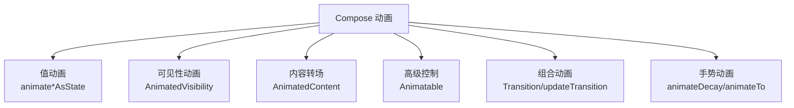

# Compose 动画

> Compose 把动画变成**状态变化**:值变化 → 动画过渡。告别 XML 动画资源,用几十行 Kotlin 实现弹性、关键帧、转场。本文覆盖完整动画体系。

## 一、动画体系总览



| 动画类型 | 用途 | 代表 API |
|---------|------|---------|
| 值动画 | 数值/颜色/尺寸平滑变化 | `animateFloatAsState` / `animateColorAsState` |
| 可见性 | 显示/隐藏过渡 | `AnimatedVisibility` |
| 转场 | 内容切换动画 | `AnimatedContent` / `Crossfade` |
| 高级 | 精细控制(弹簧/关键帧) | `Animatable` / `animateTo` |
| 多状态 | 状态机驱动动画 | `transition` / `updateTransition` |

## 二、值动画:animate*AsState

```kotlin
@Composable
fun LikeButton(isLiked: Boolean) {
    // 目标值变化时自动动画过渡
    val scale by animateFloatAsState(
        targetValue = if (isLiked) 1.2f else 1f,
        animationSpec = spring(          // 弹性动画
            dampingRatio = Spring.DampingRatioMediumBouncy,
            stiffness = Spring.StiffnessLow
        ),
        label = "likeScale"
    )
    Icon(
        Icons.Filled.Favorite,
        contentDescription = null,
        modifier = Modifier.scale(scale)
    )
}
```

### 常用 animate*AsState

| API | 类型 | 典型场景 |
|-----|------|---------|
| `animateFloatAsState` | Float | 透明度/缩放/进度 |
| `animateDpAsState` | Dp | 尺寸/间距 |
| `animateColorAsState` | Color | 主题色/状态色 |
| `animateIntAsState` | Int | 数字 |
| `animateOffsetAsState` | Offset | 位置 |
| `animateRectAsState` | Rect | 区域 |

## 三、可见性动画:AnimatedVisibility

```kotlin
@Composable
fun ExpandableCard(expanded: Boolean) {
    Column {
        Text("标题")
        AnimatedVisibility(
            visible = expanded,
            enter = slideInVertically(       // 进入动画
                initialOffsetY = { -it },
                animationSpec = tween(300)
            ) + fadeIn(),                    // 组合:滑动+淡入
            exit = slideOutVertically() + fadeOut()
        ) {
            Text("详细内容...")
        }
    }
}
```

### EnterTransition / ExitTransition 组合

| 动画 | 说明 |
|------|------|
| `fadeIn / fadeOut` | 透明度 |
| `slideInVertically / slideOutVertically` | 垂直滑动 |
| `slideInHorizontally` | 水平滑动 |
| `expandVertically / shrinkVertically` | 尺寸展开 |
| `scaleIn / scaleOut` | 缩放 |
| `+` 运算符 | 组合多个动画 |

## 四、内容转场:AnimatedContent

```kotlin
@Composable
fun ProfileContent(profile: Profile) {
    AnimatedContent(
        targetState = profile,
        transitionSpec = {
            // 新旧内容交叉淡入 + 水平滑动
            (fadeIn() + slideInHorizontally { it }) togetherWith
                (fadeOut() + slideOutHorizontally { -it })
        },
        label = "profile"
    ) { target ->
        ProfileView(target)   // 显示目标状态内容
    }
}

// 简单场景直接 Crossfade
Crossfade(targetState = isLoading, label = "loading") { loading ->
    if (loading) LoadingView() else ContentView()
}
```

## 五、高级控制:Animatable

```kotlin
@Composable
fun rememberFadeAnimator(): Animatable<Float, AnimationVector1D> {
    return remember { Animatable(1f) }
}

// 手势拖拽回弹
val offsetX = remember { Animatable(0f) }

Box(
    Modifier
        .offset { IntOffset(offsetX.value.roundToInt(), 0) }
        .pointerInput(Unit) {
            detectHorizontalDragGestures { change, dragAmount ->
                change.consume()
                scope.launch {
                    offsetX.snapTo(offsetX.value + dragAmount)  // 跟随手指
                }
            }
        }
        .pointerInput(Unit) {
            detectTapGestures {
                scope.launch {
                    offsetX.animateTo(0f)   // 松手回弹
                }
            }
        }
)
```

### Animatable 特性

| 特性 | 说明 |
|------|------|
| `snapTo(value)` | 直接跳转(手势跟随) |
| `animateTo(value, spec)` | 动画到目标值 |
| `animateDecay(velocity)` | 惯性衰减(Fling) |
| 可打断 | 新动画无缝接管旧动画 |
| 线程安全 | 协程中调用,支持多协程控制 |

## 六、弹簧与关键帧

```kotlin
// 弹簧动画
val springSpec = spring(
    dampingRatio = Spring.DampingRatioNoBouncy,   // 阻尼比:反弹程度
    stiffness = Spring.StiffnessMedium             // 刚度:回弹速度
)

// 关键帧动画
val keyframesSpec = keyframes {
    durationMillis = 1000
    0f at 0 with LinearEasing       // 起点
    0.5f at 300 with FastOutSlowInEasing
    1f at 700
    0.8f at 900
    1f at 1000                       // 结束
}

// 补间动画
val tweenSpec = tween(
    durationMillis = 500,
    easing = FastOutSlowInEasing     // 标准缓动
)
```

| AnimationSpec | 特点 | 场景 |
|--------------|------|------|
| `tween(duration, easing)` | 固定时长线性过渡 | 常规 UI 动画 |
| `spring` | 物理弹性,无固定时长 | 回弹/点赞/拖拽 |
| `keyframes` | 多阶段关键帧 | 复杂路径动画 |
| `repeatable` / `infiniteRepeatable` | 循环播放 | 加载动画 |
| `snap` | 瞬间切换 | 状态恢复 |

## 七、Transition 多属性动画

```kotlin
enum class BoxState { Collapsed, Expanded }

@Composable
fun AnimatedBox() {
    var state by remember { mutableStateOf(BoxState.Collapsed) }
    // 定义一组相关属性的状态动画
    val transition = updateTransition(state, label = "box")

    val size by transition.animateDp(label = "size") { s ->
        if (s == BoxState.Expanded) 200.dp else 80.dp
    }
    val color by transition.animateColor(label = "color") { s ->
        if (s == BoxState.Expanded) Color.Red else Color.Blue
    }
    val rotation by transition.animateFloat(label = "rotation") { s ->
        if (s == BoxState.Expanded) 180f else 0f
    }

    Box(
        modifier = Modifier
            .size(size)
            .background(color)
            .rotate(rotation)
            .clickable { state = if (state == BoxState.Collapsed) BoxState.Expanded else BoxState.Collapsed }
    )
}
```

## 八、性能与最佳实践

| 实践 | 说明 |
|------|------|
| 只动画"变化的部分" | 避免整个界面重组 |
| 用 `graphicsLayer` 动画 | 平移/缩放/旋转走 GPU,不触发布局 |
| 复用 AnimationSpec | 定义为常量避免重组重建 |
| `derivedStateOf` | 高频变化值派生时避免重组风暴 |
| 可打断优先 | 手势动画用 Animatable 支持打断 |

```kotlin
// ✓ 推荐:graphicsLayer 做位移动画(GPU 合成)
Modifier.graphicsLayer {
    translationX = animatedOffset.value
    rotationZ = animatedRotation.value
    scaleX = animatedScale.value
}
// ✗ 避免:offset 触发布局重排
Modifier.offset { IntOffset(x, 0) }
```

## 九、高频面试题

### Q1：Compose 动画与 View 属性动画的区别?
::: details 查看答案
① 声明式:View 用 ObjectAnimator/AnimatorSet 命令式调用,Compose 用状态驱动,目标值变化自动动画;② 无资源文件:Compose 动画全部代码声明,无需 XML;③ 自动重组:动画值变化自动触发使用它的区域重组;④ 物理动画:内置 spring/decay 物理模型;⑤ 与组合函数集成:动画值通过 remember/rememberSaveable 保持,随状态自然管理生命周期。
:::

### Q2：animateFloatAsState 是如何触发动画的?
::: details 查看答案
animateFloatAsState 内部创建 Animatable 并 remember,当 targetValue 变化时启动 Animatable.animateTo(targetValue, spec)。每次动画帧更新值会触发使用该值的 Composable 重组,从而驱动 UI 变化。通过 label 参数辅助调试,StateFlow 共享动画值可实现多组件同步动画。
:::

### Q3：AnimatedVisibility 与 AnimatedContent 的区别?
::: details 查看答案
AnimatedVisibility:同一内容(或不同内容)的显示/隐藏过渡,visible 为 Boolean 控制,进出场动画可组合;AnimatedContent:当目标状态变化时,同时显示旧内容退出动画和新内容进入动画(togetherWith),适合内容切换(如 Profile 不同状态);Crossfade 是其简化版,仅做淡入淡出。
:::

### Q4：Animatable 与 animate*AsState 如何选择?
::: details 查看答案
animate*AsState:声明式便捷 API,适合"目标值驱动的简单动画",内部自动管理 Animatable;Animatable:需要精细控制的场景,如手势拖拽跟随(snapTo)、回弹(animateTo)、惯性衰减(animateDecay)、动画可被打断、多协程同时控制。复杂交互(拖拽+回弹+打断)用 Animatable,简单状态动画用 animate*AsState。
:::

### Q5：Compose 动画性能优化有哪些要点?
::: details 查看答案
① 优先 graphicsLayer 动画(translation/rotation/scale/alpha),由 GPU 合成,避免触发 measure/layout 重组;② 动画范围最小化,只有动画值使用的 Composable 重组;③ AnimationSpec 定义为顶层常量复用;④ 高频动画配合 derivedStateOf 减少派生计算;⑤ 长列表中的动画注意避免每帧全列表重组;⑥ 用 Profile GPU Rendering/Systrace 检查是否掉帧。
:::

## 小结

- Compose 动画 = 状态驱动 + 自动过渡,声明式替代命令式
- animate*AsState 覆盖 90% 值动画场景
- AnimatedVisibility/AnimatedContent 处理显示与转场
- Animatable 提供手势打断/回弹/衰减等高级控制
- spring/tween/keyframes 三种核心 spec 满足不同节奏
- graphicsLayer 动画是性能关键

> 进阶阅读：[Compose 核心概念](/jetpack/compose/compose-basics.md) | [Compose 布局系统](/jetpack/compose/compose-layout.md) | [属性动画机制](/ui/animation/property-animation.md)
