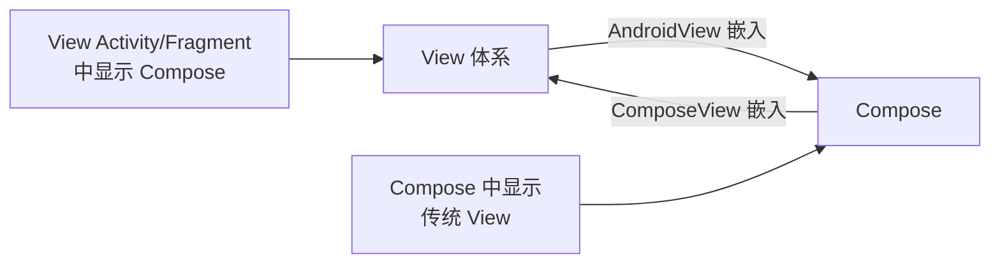
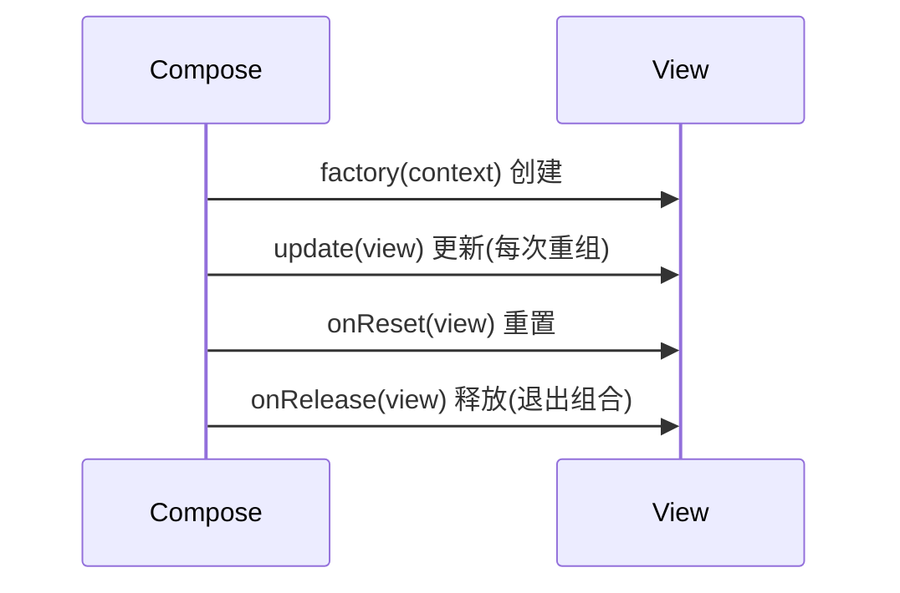
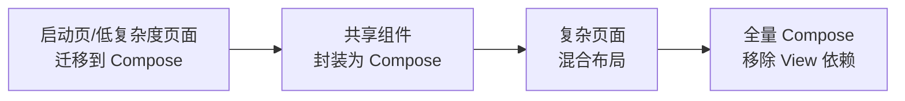

# Compose 与 View 互操作

> 实际项目中 Compose 与 View 体系长期共存:老代码库渐进迁移、复用成熟三方控件(WebView/Map/视频)、以及 Compose 中需要 View 生态能力。本文详解双向互操作。

## 一、互操作场景总览



| 方向 | 方案 | 场景 |
|------|------|------|
| View → Compose | `AndroidView` | Compose 中嵌入 WebView/Map/视频播放器 |
| Compose → View | `ComposeView` | View 布局中嵌 Compose 组件 |
| 双向共存 | Activity 内混合 | 渐进式迁移 |

## 二、Compose 中嵌入 View:AndroidView

```kotlin
@Composable
fun WebViewDemo(url: String) {
    AndroidView(
        factory = { context ->
            // 1. 创建 View(仅在首次创建时调用)
            WebView(context).apply {
                settings.javaScriptEnabled = true
                webViewClient = WebViewClient()
            }
        },
        update = { webView ->
            // 2. 状态变化时更新
            if (webView.url != url) {
                webView.loadUrl(url)
            }
        },
        modifier = Modifier.fillMaxSize()
    )
}
```

### AndroidView 生命周期



| 回调 | 时机 | 用途 |
|------|------|------|
| `factory` | 首次进入组合 | 创建 View,做一次性配置 |
| `update` | 每次重组 | 同步状态到 View |
| `onReset` | 组合移出/更新前 | 清理临时状态 |
| `onRelease` | 移出组合 | 释放资源(WebView 销毁等) |

### 高级:拦截 View 回调到 Compose 状态

```kotlin
@Composable
fun MapViewWithMarker(markerPosition: LatLng?) {
    val context = LocalContext.current
    AndroidView(
        factory = { ctx ->
            MapView(ctx).apply {
                // 一次性配置
                onCreate(null)
            }
        },
        update = { mapView ->
            // 状态驱动更新
            mapView.getMapAsync { googleMap ->
                googleMap.clear()
                markerPosition?.let { pos ->
                    googleMap.addMarker(MarkerOptions().position(pos))
                }
            }
        },
        modifier = Modifier.fillMaxSize()
    )
}
```

## 三、View 中嵌入 Compose:ComposeView

```kotlin
// 传统 XML 布局中嵌入 Compose
<androidx.compose.ui.platform.ComposeView
    android:id="@+id/composeView"
    android:layout_width="match_parent"
    android:layout_height="wrap_content" />

// 或代码创建
val composeView = ComposeView(context).apply {
    setContent {
        MaterialTheme {
            MyComposableComponent()
        }
    }
}
container.addView(composeView)
```

```kotlin
// Fragment 中托管 Compose
class ProfileFragment : Fragment() {
    override fun onCreateView(
        inflater: LayoutInflater, container: ViewGroup?, savedInstanceState: Bundle?
    ): View {
        return ComposeView(requireContext()).apply {
            setViewCompositionStrategy(
                ViewCompositionStrategy.DisposeOnViewTreeLifecycleDestroyed
            )
            setContent {
                ProfileScreen()
            }
        }
    }
}
```

### ViewCompositionStrategy 策略

| 策略 | 说明 |
|------|------|
| `DisposeOnDetachedFromWindow` | 默认:View 脱离窗口即释放组合 |
| `DisposeOnViewTreeLifecycleDestroyed` | 跟随 Lifecycle 销毁(推荐 Fragment) |
| `DisposeOnViewTreeViewModelStoreOwnerDestroyed` | 跟随 ViewModelStore 销毁 |

## 四、生命周期与状态桥接

### 4.1 生命周期感知

```kotlin
@Composable
fun LifecycleAwareView() {
    val lifecycleOwner = LocalLifecycleOwner.current

    DisposableEffect(lifecycleOwner) {
        val observer = LifecycleEventObserver { _, event ->
            when (event) {
                Lifecycle.Event.ON_RESUME -> { /* 恢复 */ }
                Lifecycle.Event.ON_PAUSE -> { /* 暂停 */ }
                else -> {}
            }
        }
        lifecycleOwner.lifecycle.addObserver(observer)
        onDispose {
            lifecycleOwner.lifecycle.removeObserver(observer)
        }
    }
}
```

### 4.2 共享 ViewModel

```kotlin
@Composable
fun HybridScreen(viewModel: MyViewModel = viewModel()) {
    // Compose 侧使用同一 ViewModel
    val data by viewModel.data.collectAsState()

    Column {
        Text(data.title)
        AndroidView(
            factory = { ctx ->
                CustomChartView(ctx).apply {
                    // View 侧访问同一 ViewModel
                    setViewModel(viewModel)
                }
            }
        )
    }
}
```

> View 体系与 Compose 共享 ViewModel 的关键:`viewModel()` 与 `ViewModelProvider` 使用同一 ViewModelStoreOwner(Activity/Fragment),实现状态统一。

## 五、渐进式迁移策略



| 阶段 | 策略 | 风险控制 |
|------|------|---------|
| 试点 | 新页面直接用 Compose | 小流量验证 |
| 混合 | 老页面中嵌入 ComposeView | 保持功能一致 |
| 提取 | 公共组件转 Compose 并封装 | 接口兼容 |
| 收尾 | 移除 View 依赖 | 回归测试 |

## 六、常见问题与坑

| 问题 | 原因 | 解决方案 |
|------|------|---------|
| 组合不释放 | 未设置 ViewCompositionStrategy | Fragment 用 DisposeOnViewTreeLifecycleDestroyed |
| WebView 泄漏 | 未销毁 | onRelease 中 destroy() |
| 更新丢失 | update 依赖不完整 | 把依赖全部作为参数传入 |
| 布局尺寸异常 | AndroidView 默认 wrap | 显式 Modifier.fillMaxSize/size |
| 触摸事件冲突 | 嵌套滚动冲突 | NestedScrollConnection 桥接 |

## 七、高频面试题

### Q1：Compose 中如何嵌入一个 WebView?
::: details 查看答案
用 AndroidView 包装:factory 中创建 WebView 并做一次性配置(启用 JS 等),update 中根据状态变化 loadUrl/更新配置,onRelease 中销毁 WebView 防泄漏。注意 WebView 是传统 View,接收点击事件与 Compose 触摸互不干扰,复杂交互(JS 回调)可通过 WebViewClient 回调转成 Compose 状态。
:::

### Q2：AndroidView 的 factory、update、onRelease 分别在什么时候调用?
::: details 查看答案
factory:第一次进入组合时创建 View(只调用一次);update:每次重组时调用,用于把最新状态同步到 View;onRelease:View 移出组合时调用,释放资源。注意 factory 只创建一次,若依赖的状态初始化需要刷新,需在 update 中处理,不能依赖 factory 重复执行。
:::

### Q3：View 体系中如何嵌入 Compose 组件?
::: details 查看答案
用 ComposeView 添加到 View 容器:XML 中声明或代码 new ComposeView(context) 然后 setContent { ... }。关键点:① 设置合适的 ViewCompositionStrategy(如在 Fragment 中推荐 DisposeOnViewTreeLifecycleDestroyed,避免组合泄漏);② 通过 LocalContext/LocalLifecycleOwner 获取上下文与生命周期;③ ViewModel 通过 activityViewModels() 与 Compose viewModel() 共享。
:::

### Q4：Compose 与 View 如何共享 ViewModel 和状态?
::: details 查看答案
① ViewModel:确保两者使用同一个 ViewModelStoreOwner(Activity/Fragment),Compose 用 viewModel(),View 用 ViewModelProvider(requireActivity());② 数据流:ViewModel 暴露 StateFlow/LiveData,Compose 用 collectAsState()/observeAsState() 收集,View 用 observe() 订阅;③ 事件:Compose 状态变化通过回调/StateFlow 通知 View 侧更新,避免双向耦合。
:::

### Q5：Compose 渐进式迁移应该怎么做?
::: details 查看答案
① 从新页面/独立模块开始用 Compose,低风险验证;② 老页面用 ComposeView 局部嵌入 Compose 组件,逐步替换;③ 公共自定义 View 封装成 Compose 组件提供等效 API;④ 注意 ViewCompositionStrategy 防止组合泄漏;⑤ 迁移期间 Compose 与 View 通过共享 ViewModel/事件总线保持状态一致;⑥ 全部迁移完成后移除 View 依赖。核心原则:小步快跑、状态统一、回归保障。
:::

## 小结

- AndroidView 让 Compose 复用传统 View(WebView/Map/视频)
- ComposeView 让 View 布局承载 Compose 组件
- 生命周期通过 ViewCompositionStrategy 桥接
- ViewModel 通过同一 ViewModelStoreOwner 共享
- 渐进式迁移:试点 → 混合 → 提取 → 收尾
- 注意 WebView 销毁与组合释放防泄漏

> 进阶阅读：[Compose 核心概念](/jetpack/compose/compose-basics.md) | [Compose 状态管理](/jetpack/compose/compose-state.md) | [WebView 使用与优化](/ui/view/webview-guide.md)
