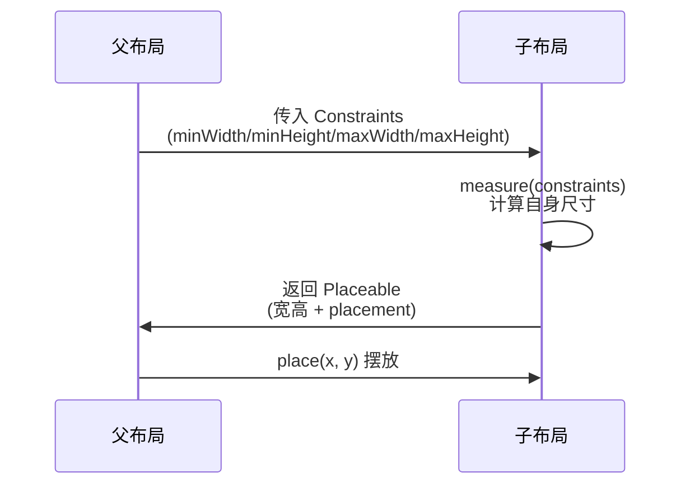

# Compose 布局系统

> Compose 摆脱了 XML + measure/layout 的繁琐,用声明式布局组合构建 UI。本文深入布局原理(一次布局两次遍历)、常用布局容器、ConstraintLayout 与自定义 Layout。

## 一、布局原理:一次布局两次遍历

Compose 的布局基于**约束 (Constraints)**,父节点提供约束,子节点测量并回报尺寸:



| 阶段 | 方法 | 说明 |
|------|------|------|
| 测量 | `MeasureScope.measure(constraints)` | 在约束内确定尺寸 |
| 摆放 | `Placeable.placeRelative(x, y)` | 确定子节点位置 |

> 与 View 的 measure/layout 相比:Compose 没有 MeasureSpec,而是统一的 Constraints(约束范围),语义更清晰且强制支持"测量两次"(Intrinsic)模式。

## 二、基础布局容器

### 2.1 三大基础容器

::: code-tabs

@tab:active Java

```java
// Compose 仅支持 Kotlin DSL，无 Java 等价写法；
// Row/Column/Box 对应 View 体系：LinearLayout（horizontal/vertical）与 FrameLayout
```

@tab Kotlin

```kotlin
// Row: 水平排列
Row(
    modifier = Modifier.fillMaxWidth(),
    horizontalArrangement = Arrangement.SpaceBetween,  // 主轴分布
    verticalAlignment = Alignment.CenterVertically     // 交叉轴对齐
) {
    Text("左")
    Text("右")
}

// Column: 垂直排列
Column(
    verticalArrangement = Arrangement.Center,
    horizontalAlignment = Alignment.CenterHorizontally
) { /* ... */ }

// Box: 堆叠排列(类似 FrameLayout)
Box(modifier = Modifier.size(200.dp)) {
    Image(painter, contentDescription = null, modifier = Modifier.fillMaxSize())
    Text("覆盖文字", modifier = Modifier.align(Alignment.BottomEnd))
}
```

:::

### 2.2 Arrangement / Alignment 速查

| 概念 | 作用 | 常用值 |
|------|------|--------|
| Arrangement(主轴) | 子项在主轴的分布 | Start / End / Center / SpaceBetween / SpaceAround / SpaceEvenly |
| Alignment(交叉轴) | 子项在交叉轴的对齐 | Top / CenterVertically / Bottom |
| BoxScope.align | Box 内子项对齐 | TopStart / Center / BottomEnd 等 9 个 |

## 三、ConstraintLayout 约束布局

> 解决复杂嵌套:用约束关系代替多层布局嵌套,提升性能。

::: code-tabs

@tab:active Java

```java
// Compose 仅支持 Kotlin DSL，无 Java 等价写法；
// ConstraintLayout 对应 View 体系：androidx.constraintlayout.widget.ConstraintLayout + XML 约束
```

@tab Kotlin

```kotlin
@Composable
fun ConstraintDemo() {
    ConstraintLayout(modifier = Modifier.fillMaxSize()) {
        val (avatar, name, desc) = createRefs()

        Image(
            painter = painterResource(R.drawable.avatar),
            contentDescription = null,
            modifier = Modifier
                .constrainAs(avatar) {
                    top.linkTo(parent.top, margin = 16.dp)
                    start.linkTo(parent.start, margin = 16.dp)
                    width = Dimension.wrapContent
                }
        )
        Text(
            text = "张三",
            modifier = Modifier.constrainAs(name) {
                top.linkTo(avatar.top)
                start.linkTo(avatar.end, margin = 12.dp)
            }
        )
        Text(
            text = "资深 Android 工程师",
            modifier = Modifier.constrainAs(desc) {
                top.linkTo(name.bottom, margin = 4.dp)
                start.linkTo(name.start)
                end.linkTo(parent.end, margin = 16.dp)
                width = Dimension.fillToConstraints
            }
        )
    }
}
```

:::

### ConstraintLayout 核心 API

| API | 作用 |
|-----|------|
| `createRefs()` / `createRefFor(tag)` | 创建约束引用 |
| `linkTo` | 建立约束关系 |
| `Dimension.wrapContent` / `fillToConstraints` | 尺寸策略 |
| `Guideline` / `Barrier` | 辅助线 / 屏障(自适应对齐) |
| `Flow` | 流式布局(超出自动换行) |

## 四、自定义 Layout

### 4.1 测量与摆放

::: code-tabs

@tab:active Java

```java
// Compose 仅支持 Kotlin DSL，无 Java 等价写法；
// 对应 View 体系：自定义 ViewGroup 重写 onMeasure / onLayout 实现流式换行
```

@tab Kotlin

```kotlin
@Composable
fun FlowLayout(
    modifier: Modifier = Modifier,
    content: @Composable () -> Unit
) {
    Layout(
        modifier = modifier,
        content = content
    ) { measurables, constraints ->
        // 1. 测量所有子项
        val placeables = measurables.map { it.measure(constraints) }

        // 2. 手动排版:实现流式换行
        var x = 0; var y = 0
        var rowHeight = 0; val rows = mutableListOf<List<Pair<Placeable, Offset>>>()

        placeables.forEach { placeable ->
            if (x + placeable.width > constraints.maxWidth) {
                x = 0; y += rowHeight; rowHeight = 0
            }
            rows.add(listOf(placeable to Offset(x.toFloat(), y.toFloat())))
            x += placeable.width; rowHeight = maxOf(rowHeight, placeable.height)
        }

        // 3. 回报总尺寸
        layout(constraints.maxWidth, y + rowHeight) {
            placeables.forEach { it.placeRelative(0, 0) }
        }
    }
}
```

:::

### 4.2 自定义布局三步法

```mermaid
flowchart LR
    A[① measure 所有子项<br>measurables.map { it.measure() }] --> B[② 计算总尺寸<br>layout(width, height)]
    B --> C[③ 摆放子项<br>placeable.placeRelative(x, y)]
```

## 五、Intrinsic 尺寸与二次测量

::: code-tabs

@tab:active Java

```java
// Compose 仅支持 Kotlin DSL，无 Java 等价写法；
// 对应 View 体系：两列等高可用 ConstraintLayout 的 0dp 约束或自定义测量实现
```

@tab Kotlin

```kotlin
// IntrinsicSize:让子布局按内容固有尺寸约束
Row(
    modifier = Modifier.height(IntrinsicSize.Min)  // 按最矮子项
) {
    Text("左边内容", Modifier.weight(1f))
    VerticalDivider()   // 高度与左侧一致
}
```

:::

> Intrinsic 尺寸允许父布局在"知道子项内容大小"之前约束子项,解决"两列高度需一致"等难题。代价是二次测量成本,仅在必要时使用。

## 六、Modifier 布局链

| Modifier | 作用 |
|----------|------|
| `size` / `requiredSize` | 固定尺寸 |
| `width` / `height` | 单边尺寸 |
| `fillMaxSize` / `fillMaxWidth` / `fillMaxHeight` | 填充约束 |
| `wrapContentSize` | 内容尺寸(受约束) |
| `weight`(RowScope/ColumnScope) | 权重分配剩余空间 |
| `aspectRatio` | 宽高比 |
| `padding` | 内边距 |
| `defaultMinSize` | 最小尺寸 |

## 七、Compose vs View 布局对比

| 维度 | View | Compose |
|------|------|---------|
| 布局文件 | XML + 代码 | 纯 Kotlin 声明式 |
| 测量 | MeasureSpec(模式+值) | Constraints(范围) |
| 布局容器 | LinearLayout/FrameLayout/ConstraintLayout | Row/Column/Box/ConstraintLayout |
| 复用 | ViewHolder 缓存 | 重组(skippable/stable) |
| 性能优化 | include/merge/扁平化 | 无嵌套惩罚,重点优化重组 |

## 八、高频面试题

### Q1：Compose 的布局流程与 View 有何不同？
::: details 查看答案
Compose 没有 MeasureSpec,使用 Constraints(min/max 宽高范围)进行测量:父节点约束 → 子节点 measure → 返回尺寸 → place 摆放,一次测量两次遍历(measure + layout)。View 的 measure 有 MeasureSpec(EXACTLY/AT_MOST/UNSPECIFIED)模式,LayoutParams 参与。Compose 的约束模型更纯粹,且支持 Intrinsic 二次测量解决复杂对齐。
:::

### Q2：如何自定义一个 Composable 布局?
::: details 查看答案
用 Layout 函数三步:① 接收 measurables 和 constraints,遍历 measure 每个子项获得 placeable;② 按排版算法计算整体宽高,调用 layout(width, height) 回报尺寸;③ 在 scope 中对每个 placeable 调用 placeRelative(x, y) 摆放。需要时用 MeasurePolicy 封装为可复用组件。
:::

### Q3：Compose 中实现流式布局(FlexWrap)怎么做?
::: details 查看答案
方案一:自定义 Layout,测量子项后按"当前行宽度超出 maxWidth 就换行"的逻辑摆放,需要记录每行高度;方案二:用 ConstraintLayout 的 Flow 组件,通过 flowParameters 配置 crossAxisCount 等自动换行;方案三:官方推荐结合 LazyRow + 嵌套。自定义 Layout 最灵活。
:::

### Q4：ConstraintLayout 相比嵌套布局有什么优势?
::: details 查看答案
① 减少层级:复杂布局用约束关系替代多层 LinearLayout 嵌套,降低 measure/draw 成本;② 自适应:B arrier/Guideline 让约束随内容动态变化;③ 扁平化:约束图直接描述 UI 关系,代码可读性高;④ 性能:Compose 中无需深嵌套,配合 flowParameters 还能做流式布局。
:::

### Q5：IntrinsicSize 的作用和代价是什么?
::: details 查看答案
IntrinsicSize 让父布局在测量时先查询子项的"固有尺寸"(IntrinsicSize.Min/Max),从而在真正测量前确定约束关系,典型场景是"两列等高"。代价:需要额外一次测量遍历(二次测量),布局复杂时影响性能,应仅在确实需要时使用,如 Row 中 VerticalDivider 与文字高度对齐。
:::

## 小结

- 布局 = 父约束 + 子测量 + 回报尺寸 + 摆放位置
- Row/Column/Box 覆盖 90% 场景,Arrangement/Alignment 控制分布
- ConstraintLayout 解决复杂相对布局,Barrier/Guideline 自适应
- 自定义 Layout 三步:measure → layout → place
- Intrinsic 二次测量解决等高难题,慎用保性能
- Modifier 链是布局的声明式"布局参数"

> 进阶阅读：[Compose 核心概念](/jetpack/compose/compose-basics.md) | [Compose 状态管理](/jetpack/compose/compose-state.md) | [Compose 动画](/jetpack/compose/compose-animation.md)
