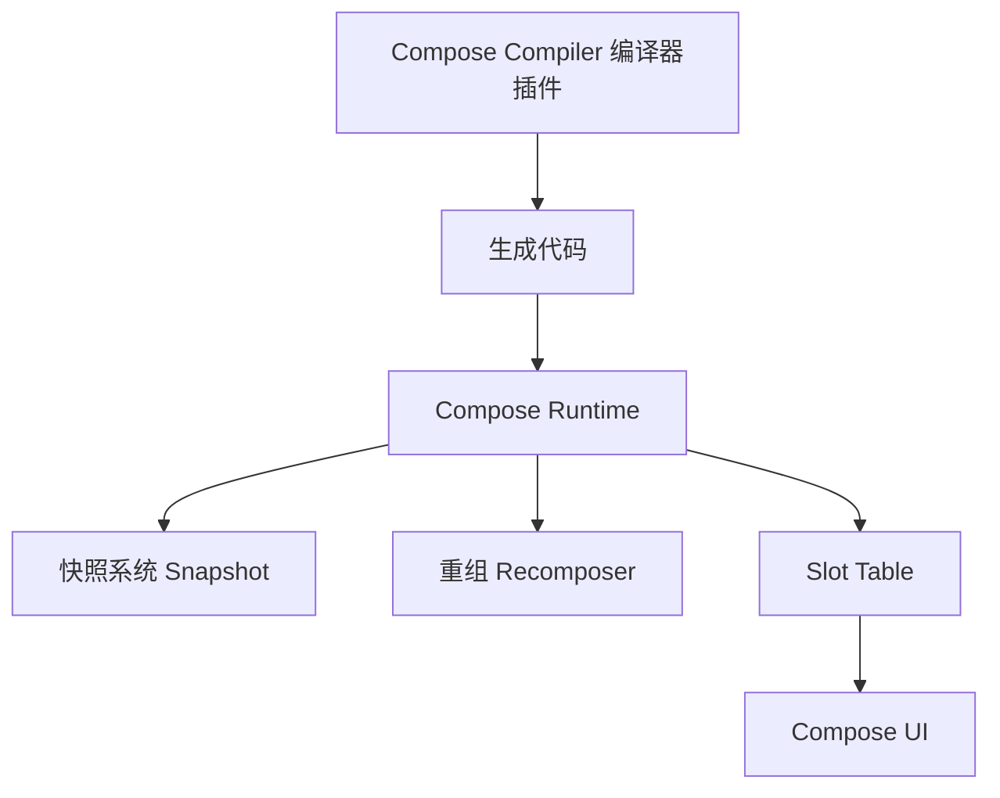
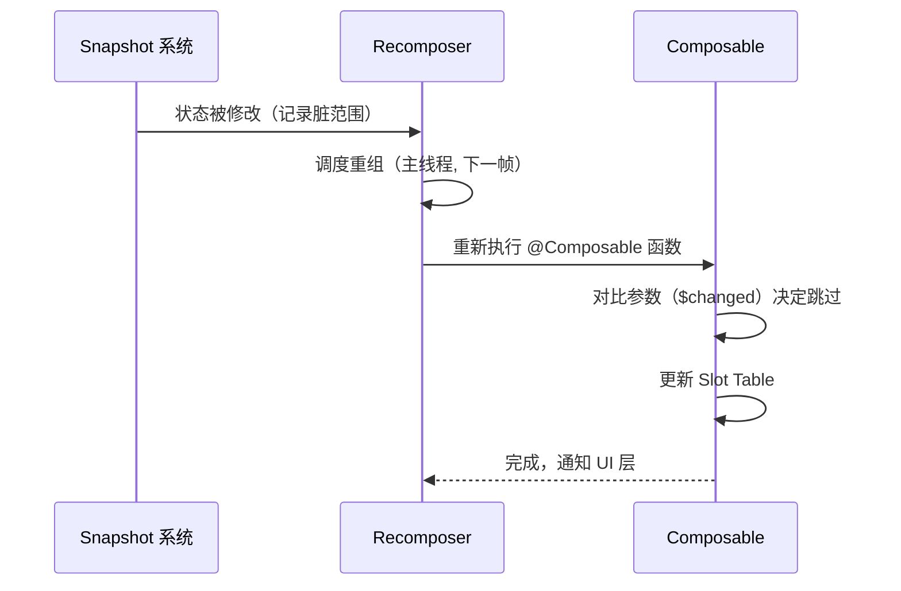
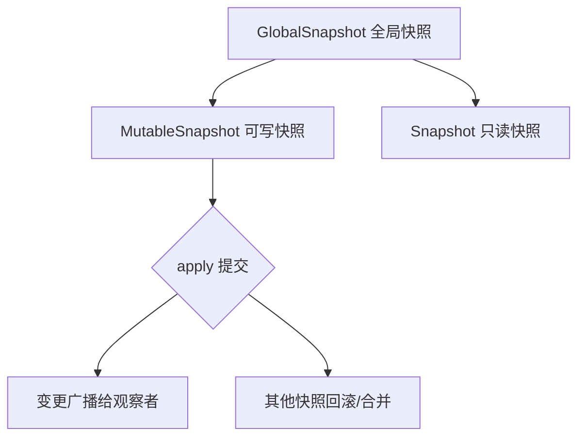
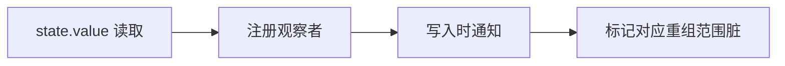
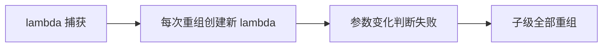

# Compose Runtime 原理

> 面试高频指数：极高
> 理解 Compose Runtime 才能回答"重组为什么这么快"这类灵魂拷问，也是性能优化的前提。

## 1. 总览：Compose 的三层架构



| 层 | 职责 | 关键类 |
| --- | --- | --- |
| Compiler | 编译期转换 | @Composable 代码重写 |
| Runtime | 状态管理 + 重组调度 | Snapshot / Recomposer / SlotTable |
| UI | 绘制与布局 | LayoutNode / DrawModifier |

核心问题：**状态变化时，如何只更新受影响的最小范围？**

## 2. 编译器插件做了什么

### 2.1 代码转换

@Composable 函数会被编译器改造成**接受额外参数**的重组函数：

::: code-tabs

@tab:active Java

```java
// Compose 为 Kotlin 编译器插件能力，Java 中无等价写法；
// 以下为原理示意（Kotlin 源码在右侧）。
```

@tab Kotlin

```kotlin
// 开发者写的代码
@Composable
fun Greeting(name: String) {
    Text(text = "Hello $name")
}

// 编译器转换后（简化示意）
@Composable
fun Greeting(name: String, $composer: Composer<*>, $changed: Int) {
    // 1. 记录调用（写入 Slot Table）
    $composer.startRestartGroup()          // 创建可重组范围
    $composer.changed(name)                // 记录参数变化
    Text(text = "Hello $name", $composer, 0b00001)
    $composer.endRestartGroup()            // 结束重组范围
}
```

:::

### 2.2 编译期信息

编译器还会分析函数的**稳定性**（后面详述）和参数使用情况，生成 `$changed` 位掩码，用于跳过不必要的重组。

## 3. 重组机制（Recomposition）

### 3.1 重组的触发



### 3.2 重组是"智能跳过"的

::: code-tabs

@tab:active Java

```java
// Compose 为 Kotlin 声明式 UI，Java 中无等价写法；
// 对比理解：View 体系 setText 只更新一个控件，
// Compose 重组只重执行受状态影响的函数。
```

@tab Kotlin

```kotlin
@Composable
fun Screen(count: Int, name: String) {
    // ① count 变化：整块重组
    Text("Count: $count")

    // ② name 变化：只有这个 Text 重组
    Text("Name: $name")
}
```

:::

**关键机制**：

- 重组范围：以 `startRestartGroup` 为边界的最小函数单元；
- 参数跳过：`$changed` 位掩码记录每个参数是否变化，未变化则跳过函数体；
- **跳过不等于不执行**：函数仍会被调用（可能返回同一个值），只是内部重组逻辑被跳过。

### 3.3 重组是同步的

- 重组**同步**发生在主线程（除非用 `LaunchedEffect` 等异步）；
- 状态修改 → 立即标记脏 → 主线程执行重组；
- 重组过程中可以再次读取状态（会形成新的订阅）。

## 4. 快照系统（Snapshot System）

### 4.1 为什么需要快照

- **多线程并发**：状态可在后台线程修改；
- **事务性**：多处修改要么全部生效要么全部回滚；
- **隔离**：重组期间读取的状态保持一致。

### 4.2 快照模型



| 类型 | 可写 | 用途 |
| --- | --- | --- |
| GlobalSnapshot | 全局最新 | 观察者获取最新状态 |
| MutableSnapshot | 是 | 事务性修改 |
| 只读 Snapshot | 否 | 重组期间一致性读取 |

### 4.3 状态的读写流程

::: code-tabs

@tab:active Java

```java
// Snapshot 为 Kotlin 协程/内建 API，Java 中无等价写法；
// 概念理解：状态读写在快照内完成，apply 时合并。
```

@tab Kotlin

```kotlin
val state = mutableStateOf(0)

// 后台线程修改（自动开快照）
state.value = 1

// 快照事务（手动控制）
Snapshot.withMutableSnapshot {
    state.value = 2
    otherState.value = 3
    // 全部生效或全部回滚
}
```

:::

### 4.4 状态对象的读取计数



- 每次读取 `state.value`，Compose 都会**记录**哪个组合在读取；
- 写入时，快照系统通知所有记录过的组合，标记其重组范围；
- 这就是"最小范围更新"的底层来源。

## 5. Slot Table（槽位表）

### 5.1 为什么需要 Slot Table

Compose 用 **位置记忆法**（Positional Memoization）：函数执行位置决定其状态存储位置，不依赖实例标识。


### 5.2 对比：View 树 vs Slot Table

| 对比项 | View 树 | Slot Table |
| --- | --- | --- |
| 结构 | 树状对象 | **线性数组** + 组标记 |
| 更新 | 增删 View 节点 | 修改槽位数据 |
| 对象创建 | 频繁 | 少（复用槽位） |
| 内存 | 高 | 低 |

### 5.3 位置记忆的意义

::: code-tabs

@tab:active Java

```java
// Compose 为 Kotlin 声明式 UI，Java 中无等价写法；
// 理解重点：remember 与位置绑定，不是与数据绑定。
```

@tab Kotlin

```kotlin
@Composable
fun Demo(show: Boolean) {
    if (show) {
        // remember 的位置固定，show 切换时状态仍保留
        val x = remember { mutableStateOf(0) }
        Text("A: ${x.value}")
    }
    // 注意：条件分支改变 remember 的位置是常见 bug 来源
    val y = remember { mutableStateOf(0) }
    Text("B: ${y.value}")
}
```

:::

**位置记忆陷阱**：在 `if` / `for` / 可组合函数切换位置使用 `remember`，状态会随位置漂移——这是"状态错乱"类 bug 的根源。

## 6. 稳定性推断（Stability）

### 6.1 稳定类型

编译器推断每个类型的**稳定性**，决定能否跳过重组：

| 类型 | 说明 | 例子 |
| --- | --- | --- |
| @Stable / @Immutable | 稳定 | 不可变数据、State |
| 不稳定（推断） | 编译器无法证明 | 公开类、可变字段 |

::: code-tabs

@tab:active Java

```java
// Compose 为 Kotlin 编译器能力，Java 中无等价写法；
// 注解作用在 Kotlin 类上。
```

@tab Kotlin

```kotlin
// 声明不可变：跳过重组的前提
@Immutable
data class User(val name: String, val age: Int)

// 不稳定类：每次都可能变化，无法跳过
class MutableUser {
    var name: String = ""
    var age: Int = 0
}
```

:::

### 6.2 稳定性不足的后果

- 参数不稳定 → `$changed` 无法证明未变 → **每次都重组**；
- 大量不稳定参数 → 重组范围扩大 → 性能下降；
- 解决：用 `@Stable` / `@Immutable`、不可变数据结构、`remember` 包装。

### 6.3 lambda 捕获问题



**解决**：`rememberUpdatedState`、`remember` lambda、稳定的 lambda 包装。

## 7. remember 与 derivedStateOf

### 7.1 remember 的本质


- `remember { mutableStateOf(0) }`：位置缓存状态对象；
- `remember(x) { ... }`：x 变化时重新计算；
- **remember 不感知状态变化**，只按 key 失效。

### 7.2 derivedStateOf 原理

::: code-tabs

@tab:active Java

```java
// derivedStateOf 为 Kotlin API，Java 中无等价写法；
// 语义：派生状态，只在依赖变化时重新计算。
```

@tab Kotlin

```kotlin
val list = remember { mutableStateOf(listOf(1, 2, 3)) }

// 派生：只关心"是否为空"
val isEmpty by remember {
    derivedStateOf { list.value.isEmpty() }
}

// 与直接 map 的区别：
// ① 缓存结果，list 变化但结果不变时不下发；
// ② 减少重组：只有 isEmpty 变化才触发。
```

:::

### 7.3 使用建议

| 场景 | 方案 |
| --- | --- |
| 派生自多个状态 | derivedStateOf |
| 输入框防抖 | snapshotFlow + debounce |
| 页面可见性 | rememberSaveable（进程恢复） |
| 大数据列表过滤 | derivedStateOf 缓存过滤结果 |

## 8. 面试高频题

::: details Q1：Compose 是如何实现只重组受影响的部分？

三层机制：① 编译器把 @Composable 函数改造成带 Composer 参数的重组函数，用 startRestartGroup 划分重组范围；② 快照系统记录"哪个组合读取了哪个状态"，写入时只标记对应范围脏；③ 执行时通过 $changed 位掩码判断参数是否变化，未变化的函数体跳过。三者配合实现最小范围更新。

:::

::: details Q2：快照系统解决了什么问题？

多线程一致性与事务性：① 后台线程可安全修改状态（快照隔离）；② 一次修改多处状态可以原子提交或回滚；③ 重组期间读取的状态保持一致性，避免读到中间值。GlobalSnapshot 是观察者读取最新状态的入口，MutableSnapshot 提供事务能力。

:::

::: details Q3：remember 与 rememberSaveable 的区别？

remember：位置记忆，进程内缓存，重建（旋转）后丢失；rememberSaveable：基于 Bundle 保存，进程重建后恢复。UI 状态（展开/收起）用 rememberSaveable，纯内存计算用 remember。

:::

::: details Q4：什么是稳定性？为什么不稳定的参数会导致性能问题？

稳定性是编译器推断的参数可变性标记：@Stable/@Immutable 类型编译器认为其不会（以不可观察的方式）变化，可以跳过重组。不稳定参数无法证明未变，每次都必须重组，导致"改一处全重组"。解决：不可变数据类、@Immutable 注解、remember 包装。

:::

::: details Q5：derivedStateOf 和直接计算有什么区别？

derivedStateOf 会**缓存派生结果**并去重：依赖变化时重新计算，但计算结果不变则不会通知下游重组。直接计算每次依赖变化都重新执行并可能触发多余重组。适合"大数据派生少量信息"（如列表过滤后判断是否为空）的场景。

:::

## 9. 小结

- **编译器**：@Composable 重写 + 稳定性推断；
- **重组**：最小范围更新，参数跳过机制；
- **快照**：多线程安全 + 事务性状态管理；
- **Slot Table**：位置记忆，线性存储，避免对象频繁创建；
- 面试高频：重组机制、快照、稳定性、remember 陷阱、derivedStateOf。

## 相关阅读

- [Compose 核心概念](compose-basics.md)
- [Compose 状态管理](compose-state.md)
- [Compose 性能优化](compose-performance.md)
- [Kotlin 协程与 Flow](/network/coroutine/)
