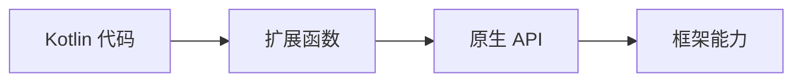

# Core KTX 扩展库

> 面试高频指数：中
> core-ktx 是 androidx.core 的 Kotlin 扩展库，让 API 更符合 Kotlin 习惯。

## 1. 什么是 KTX

KTX（Kotlin Extensions）是一系列 Kotlin 扩展函数，本质是**对现有 API 的封装**，不改变底层能力，只让调用更简洁。它的定位可以用一句话概括——Kotlin 代码通过扩展函数调用原生 API，最终仍走框架能力，零运行时开销：



| 好处 | 示例 |
| --- | --- |
| 更简洁 | `contentUri.toUri()` 替代 `Uri.parse()` |
| 更安全 | `bundleOf()` 类型安全构建 |
| 更 Kotlin | 支持 lambda、协程、作用域函数 |
| 零成本 | 编译期静态方法调用，无运行时开销 |

## 2. Context KTX

### 2.1 常用扩展

Context 相关的扩展让字符串转 Uri、读取系统属性等操作更顺手：

::: code-tabs

@tab:active Java

```java
// Java 中无 KTX 扩展；对应写法：
Uri uri = Uri.parse("content://com.example/data");
String mime = getContentResolver().getType(uri);
```

@tab Kotlin

```kotlin
// 字符串转 Uri
val uri = "content://com.example/data".toUri()

// 读取系统属性
val sdkInt = android.os.Build.VERSION.SDK_INT

// Context 扩展
val sharedPrefs = context.getSharedPreferences("name", Context.MODE_PRIVATE)

// 应用信息
val versionName = context.packageManager
    .getPackageInfo(context.packageName, 0).versionName
```

:::

### 2.2 Bundle 构建

`bundleOf` 用键值对一次构建 Bundle，相比 Java 的逐条 put 更简洁且类型安全：

::: code-tabs

@tab:active Java

```java
// Java 传统写法
Bundle bundle = new Bundle();
bundle.putString("name", "Alice");
bundle.putInt("age", 18);
bundle.putSerializable("list", new ArrayList<>(Arrays.asList("a", "b")));
```

@tab Kotlin

```kotlin
// bundleOf：类型安全且简洁
val bundle = bundleOf(
    "name" to "Alice",
    "age" to 18,
    "list" to listOf("a", "b")
)

// 读取（可空）
val name: String? = bundle.getString("name")
```

:::

## 3. View KTX

### 3.1 常用扩展

View KTX 把"布局完成、绘制前、可见性"等时机都封装成了回调，`doOnLayout` 里拿宽高、`isVisible` 一键控制显隐：

::: code-tabs

@tab:active Java

```java
// Java 传统写法
view.postDelayed(new Runnable() {
    @Override
    public void run() {
        // 动画结束后操作
    }
}, 300);
```

@tab Kotlin

```kotlin
// doOnLayout：布局完成后回调
view.doOnLayout {
    // 此时 view 已有宽高
    val width = it.width
}

// doOnPreDraw：绘制前回调（可用作入场动画）
view.doOnPreDraw { }

// 可见性控制
view.isVisible = true
view.isInvisible = false
view.isGone = true

// postDelayed + lambda
view.postDelayed({ /* 延迟操作 */ }, 300)

// View 树遍历
view.doOnAttach { }
view.doOnDetach { }
```

:::

### 3.2 手势处理

点击、长按、触摸、双击都能用 lambda 直写，最后一种要借助 `GestureDetector`：

::: code-tabs

@tab:active Java

```java
// Java 传统写法
view.setOnClickListener(new View.OnClickListener() {
    @Override
    public void onClick(View v) {
        // 处理点击
    }
});
```

@tab Kotlin

```kotlin
// 长按
view.setOnLongClickListener {
    // 返回 true 表示消费事件
    true
}

// 触摸
view.setOnTouchListener { v, event ->
    when (event.action) {
        MotionEvent.ACTION_DOWN -> true
        else -> false
    }
}

// 双击（需要 GestureDetector）
val detector = GestureDetector(context, object : GestureDetector.SimpleOnGestureListener() {
    override fun onDoubleTap(e: MotionEvent): Boolean = true
})
view.setOnTouchListener { _, event -> detector.onTouchEvent(event) }
```

:::

## 4. 协程与 Lifecycle KTX

### 4.1 viewModelScope / lifecycleScope

协程最怕"任务没结束，载体先没了"。`viewModelScope` 随 ViewModel 销毁自动取消，`lifecycleScope` 随生命周期销毁取消——**scope 即生命周期**：

::: code-tabs

@tab:active Java

```java
// Java 中无协程扩展；对应语义用回调 + 生命周期感知：
// LifecycleEventObserver 在 ON_DESTROY 时取消任务
lifecycle.addObserver(new LifecycleEventObserver() {
    @Override
    public void onStateChanged(@NonNull LifecycleOwner source,
                               @NonNull Lifecycle.Event event) {
        if (event == Lifecycle.Event.ON_DESTROY) {
            cancelTask();   // 取消后台任务
        }
    }
});
```

@tab Kotlin

```kotlin
class MainViewModel : ViewModel() {

    // viewModelScope：随 ViewModel 销毁自动取消
    fun loadData() {
        viewModelScope.launch {
            val data = repository.fetchData()   // 挂起函数
            _uiState.value = data
        }
    }
}

// lifecycleScope：随 Lifecycle 销毁自动取消
class MainActivity : AppCompatActivity() {
    override fun onCreate(savedInstanceState: Bundle?) {
        super.onCreate(savedInstanceState)
        lifecycleScope.launch {
            // 在 Activity 销毁时自动取消
            repeatOnLifecycle(Lifecycle.State.STARTED) {
                viewModel.uiState.collect { state ->
                    // 只在 STARTED 之后收集
                    render(state)
                }
            }
        }
    }
}
```

:::

### 4.2 Flow 收集

收集 Flow 也要考虑生命周期，几种方式按"要不要感知生命周期"区分：

| 收集方式 | 生命周期行为 |
| --- | --- |
| `collect` | 一直收集，无生命周期感知 |
| `repeatOnLifecycle(STARTED)` | STARTED 时收集，STOPPED 时取消 |
| `flowWithLifecycle` | 生命周期内收集，背压处理 |
| `StateFlow.collectAsState` | Compose 专用 |

## 5. 集合与工具 KTX

### 5.1 常用集合扩展

Kotlin 标准库的集合操作（map/filter/groupBy…）已经是日常标配，配合协程还能直接 `asFlow()` 流入数据管道：

::: code-tabs

@tab:active Java

```java
// Java 传统写法
List<String> list = Arrays.asList("a", "b", "c");
for (String s : list) {
    System.out.println(s.toUpperCase());
}
```

@tab Kotlin

```kotlin
val list = listOf("a", "b", "c")

list.map { it.uppercase() }        // 转换
list.filter { it != "b" }          // 过滤
list.firstOrNull()                 // 安全取首元素
list.groupBy { it.length }         // 分组
list.associateBy { it }            // 转 Map
list.chunked(2)                    // 分块
list.distinct()                    // 去重

// 与协程结合
list.asFlow()
    .map { it.uppercase() }
    .collect { println(it) }
```

:::

### 5.2 系统服务获取

`getSystemService(Class)` 传类名即可，返回值天然带类型，不用手动强转：

::: code-tabs

@tab:active Java

```java
// Java 传统写法
NotificationManager nm = (NotificationManager) context
        .getSystemService(Context.NOTIFICATION_SERVICE);
```

@tab Kotlin

```kotlin
// KTX 写法：类型安全，无需强转
val nm = context.getSystemService(NotificationManager::class.java)
val im = context.getSystemService(InputMethodManager::class.java)
val vibrator = context.getSystemService(Vibrator::class.java)
```

:::

## 6. 面试高频题

::: details Q1：KTX 扩展函数是如何实现的？有性能开销吗？

KTX 扩展函数本质是**静态方法**，编译期被调用点直接绑定（成员扩展除外），无运行时开销。它只是语法糖，不创建包装对象、不引入运行时依赖。所以可以放心在热路径使用。

:::

::: details Q2：viewModelScope 与 lifecycleScope 的区别？

viewModelScope 绑定 ViewModel（viewModelCleared 时取消），与 UI 无关，适合数据加载；lifecycleScope 绑定 LifecycleOwner（如 Activity/Fragment），销毁时取消，适合 UI 相关任务。两者都基于 Dispatchers.Main.immediate，且都会自动取消协程。

:::

::: details Q3：repeatOnLifecycle 解决了什么问题？

传统在 onStart 里 collect、onStop 里取消非常繁琐且容易遗漏。repeatOnLifecycle(STARTED) 把这一过程封装：进入 STARTED 自动开始收集，离开自动取消。避免了 Activity 不可见时仍处理 UI 更新的问题。

:::

::: details Q4：bundleOf 相比手动 Bundle 构建有什么优势？

① 语法简洁（to 表达式）；② 类型推断，写错类型会编译报错；③ 支持数组、List 等自动装箱转换；④ 返回值类型是 Bundle，可直接作为 Fragment arguments 使用。底层仍是 putXxx 实现，无性能差异。

:::

::: details Q5：core-ktx 与 AndroidX 其他库的 KTX 有什么关系？

core-ktx 只是 androidx.core 的 Kotlin 扩展；其他库各有自己的 KTX：lifecycle-ktx（repeatOnLifecycle）、fragment-ktx（viewModels 委托）、activity-ktx（viewModels）、datastore-ktx（preferencesDataStore）等。设计思路一致：封装底层 API，提供 Kotlin 惯用写法。

:::

## 7. 小结

- **KTX 本质是扩展函数**，零成本、更 Kotlin；
- 高频扩展：**bundleOf、toUri、viewModelScope、repeatOnLifecycle**；
- 生命周期感知收集是面试重点，**repeatOnLifecycle** 必须掌握；
- 其他 Jetpack 库也有各自的 KTX，思路一致。

## 相关阅读

- [App Startup 与 SplashScreen](startup-splashscreen.md)
- [Lifecycle 原理与使用](/jetpack/lifecycle-viewmodel/lifecycle.md)
- [Kotlin 扩展函数](/language/kotlin/)
