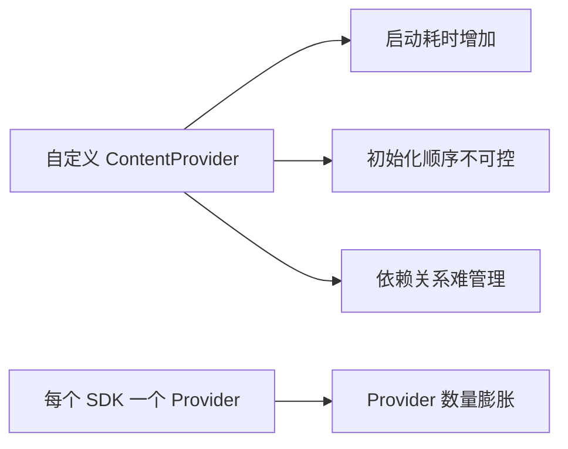
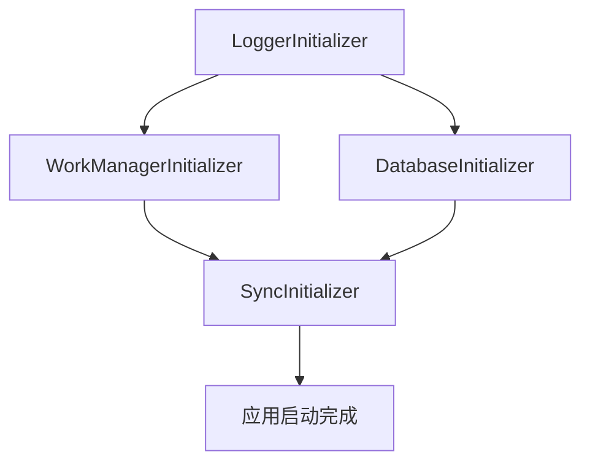
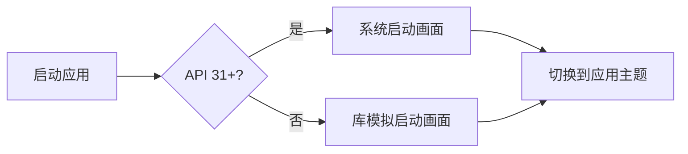

# App Startup 与 SplashScreen

> 面试高频指数：中
> App Startup 解决组件初始化顺序与性能问题，SplashScreen 提供统一启动画面。

## 1. App Startup 概览

### 1.1 传统初始化的痛点

Android 的 ContentProvider 机制被各 SDK 拿来"偷"初始化时机——谁都要一个 Provider，启动链路被拖垮：



传统方式：每个库自己写 `ContentProvider` 做初始化，导致：

| 问题 | 后果 |
| --- | --- |
| 启动变慢 | 所有 Provider 在 Application 前初始化 |
| 顺序混乱 | 依赖其他库的初始化无法保证 |
| 数量膨胀 | 十几个 Provider 串行启动 |
| 不可控 | 无法延迟或按需初始化 |

### 1.2 App Startup 的解决思路

App Startup 的解法很直接：

- 所有初始化器合并到**一个** `InitializationProvider`；
- 显式声明初始化依赖顺序；
- 支持手动按需初始化（`AppInitializer`）。

Provider 数量从"每库一个"变成"全局一个"，启动耗时、顺序、依赖全部可控。

## 2. 定义初始化器

### 2.1 实现 Initializer

每个库写一个 `Initializer`：`create` 里做初始化并返回结果，`dependencies` 声明"我依赖谁"：

::: code-tabs

@tab:active Java

```java
// 初始化器：返回初始化结果，声明依赖
public class WorkManagerInitializer implements Initializer<WorkManager> {

    @Override
    public WorkManager create(Context context) {
        // 在这里执行初始化逻辑
        Configuration config = new Configuration.Builder().build();
        return WorkManager.initialize(context, config);
    }

    @Override
    public List<Class<? extends Initializer<?>>> dependencies() {
        // 依赖的初始化器会先执行
        return Collections.singletonList(LoggerInitializer.class);
    }
}
```

@tab Kotlin

```kotlin
// 初始化器：返回初始化结果，声明依赖
class WorkManagerInitializer : Initializer<WorkManager> {

    override fun create(context: Context): WorkManager {
        // 在这里执行初始化逻辑
        val config = Configuration.Builder().build()
        return WorkManager.initialize(context, config)
    }

    override fun dependencies(): List<Class<out Initializer<*>>> {
        // 依赖的初始化器会先执行
        return listOf(LoggerInitializer::class.java)
    }
}
```

:::

### 2.2 在 Manifest 中合并

所有初始化器都在同一个 `InitializationProvider` 下以 `<meta-data>` 声明——这就是"合并"的实现方式：

```xml
<!-- AndroidManifest.xml -->
<provider
    android:name="androidx.startup.InitializationProvider"
    android:authorities="${applicationId}.androidx-startup"
    android:exported="false"
    tools:node="merge">

    <!-- 声明应用的初始化器（可多个） -->
    <meta-data
        android:name="com.example.MyInitializer"
        android:value="androidx.startup" />
</provider>
```

### 2.3 初始化顺序（依赖图）

依赖关系画出来是一张有向图：



App Startup 会做**拓扑排序**，保证依赖先于被依赖者执行。

## 3. 按需初始化

### 3.1 延迟初始化

不想启动就初始化的库，干脆不写进 Manifest，改成首次使用时手动触发：

::: code-tabs

@tab:active Java

```java
// 不在 Manifest 中声明，改为手动调用
public class MyInitializer implements Initializer<MyApi> {

    @Override
    public MyApi create(Context context) {
        return new MyApi(context);
    }

    @Override
    public List<Class<? extends Initializer<?>>> dependencies() {
        return Collections.emptyList();
    }

    // 手动触发（比如用户第一次用到时才初始化）
    public static MyApi get(Context context) {
        return AppInitializer.getInstance(context)
                .initializeComponent(MyInitializer.class);
    }
}
```

@tab Kotlin

```kotlin
// 不在 Manifest 中声明，改为手动调用
class MyInitializer : Initializer<MyApi> {

    override fun create(context: Context): MyApi {
        return MyApi(context)
    }

    override fun dependencies(): List<Class<out Initializer<*>>> {
        return emptyList()
    }

    companion object {
        // 手动触发（比如用户第一次用到时才初始化）
        fun get(context: Context): MyApi {
            return AppInitializer.getInstance(context)
                .initializeComponent(MyInitializer::class.java)
        }
    }
}
```

:::

### 3.2 关闭自动初始化

```xml
<!-- 只想手动初始化时，用 tools:node="remove" 移除 -->
<provider
    android:name="androidx.startup.InitializationProvider"
    android:authorities="${applicationId}.androidx-startup"
    tools:node="remove" />
```

## 4. SplashScreen 启动画面

### 4.1 为什么需要

- Android 12+ 系统强制启动画面（图标 + 品牌色）；
- 旧版本无统一规范，各自实现；
- 需要**一套代码兼容**所有版本。

### 4.2 基本配置

配置只需两步：主题继承 `Theme.SplashScreen` 并指定图标/背景，然后 `installSplashScreen()` 接管显示逻辑：

```xml
<!-- values/themes.xml：应用主题继承启动画面主题 -->
<style name="Theme.MyApp" parent="Theme.SplashScreen">
    <item name="windowSplashScreenBackground">@color/splash_bg</item>
    <item name="windowSplashScreenAnimatedIcon">@drawable/splash_icon</item>
    <item name="postSplashScreenTheme">@style/Theme.AppCompat</item>
</style>
```

::: code-tabs

@tab:active Java

```java
// 依赖：
// implementation("androidx.core:core-splashscreen:1.0.1")

// 代码中可选：控制启动画面保持时间
public class MainActivity extends AppCompatActivity {

    @Override
    protected void onCreate(Bundle savedInstanceState) {
        // 可选：设置保持条件（如等数据加载）
        installSplashScreen();
        super.onCreate(savedInstanceState);
        setContentView(R.layout.activity_main);
    }

    private void installSplashScreen() {
        // SplashScreen.Companion.installSplashScreen() 在 Java 中
        // 通过 SplashScreen.installSplashScreen(this) 调用
        // （core-splashscreen 1.0.1 提供）
    }
}
```

@tab Kotlin

```kotlin
// 依赖：
// implementation("androidx.core:core-splashscreen:1.0.1")

class MainActivity : AppCompatActivity() {

    override fun onCreate(savedInstanceState: Bundle?) {
        // 可选：设置保持条件（如等数据加载）
        val splash = installSplashScreen()
        splash.setKeepOnScreenCondition { !isDataReady }

        super.onCreate(savedInstanceState)
        setContentView(R.layout.activity_main)
    }
}
```

:::

### 4.3 兼容原理

一套代码兼容所有版本的关键，是"按 API 版本分流"：



| 系统版本 | 行为 |
| --- | --- |
| API 31+ | 直接用系统启动画面 |
| API 21-30 | core-splashscreen 模拟（全屏主题 + 图标） |
| 配置一致 | 图标、背景、时长体验统一 |

## 5. 面试高频题

::: details Q1：App Startup 相比自定义 ContentProvider 的优势？

① **合并**：所有初始化器收敛到一个 InitializationProvider，减少 Provider 数量（启动更快）；② **依赖管理**：显式声明 dependencies，自动拓扑排序；③ **按需初始化**：可移出 Manifest 手动触发，避免启动即初始化；④ 源码层面：使用 androidx.startup，初始化顺序确定。

:::

::: details Q2：Initializer 的 dependencies 有什么作用？

声明当前初始化器依赖的其他初始化器，App Startup 会保证依赖先执行完再执行当前。这解决了传统方式中"库 A 需要库 B 先初始化"却无法保证顺序的问题。注意避免循环依赖，会抛异常。

:::

::: details Q3：App Startup 如何优化启动时间？

① 减少自动初始化的初始化器数量（能延迟就延迟）；② 把非必要初始化改为手动调用（AppInitializer.initializeComponent）；③ 用 dependencies 控制顺序避免串行等待；④ 初始化器内部只做必要工作，重活放后台线程。本质是"能不用 ContentProvider 就不用"。

:::

::: details Q4：SplashScreen 库如何做到跨版本兼容？

API 31+ 直接使用系统启动画面；低版本通过主题模拟：全屏背景 + 动画图标 + 退出时切换到 postSplashScreenTheme。开发者只需配置一套主题属性，库内部按版本分支处理，保证体验一致。

:::

::: details Q5：setKeepOnScreenCondition 有什么用？

控制启动画面何时消失：返回 true 保持显示，false 进入应用。典型场景：启动时需要预加载配置/广告/首帧数据，可以保持启动画面直到数据就绪，避免闪一下空白页。注意不能无限期保持，要设置超时或确保条件最终满足。

:::

## 6. 小结

- **App Startup**：统一的组件初始化框架，解决顺序与性能问题；
- 核心 API：`Initializer`、`dependencies()`、`AppInitializer`；
- **SplashScreen**：跨版本一致的启动画面，Android 12+ 强制；
- 两者都强调**减少启动耗时**与**统一体验**。

## 相关阅读

- [Core KTX 扩展库](core-ktx.md)
- [Android 应用启动流程](/android/app/)
- [Lifecycle 原理与使用](/jetpack/lifecycle-viewmodel/lifecycle.md)
