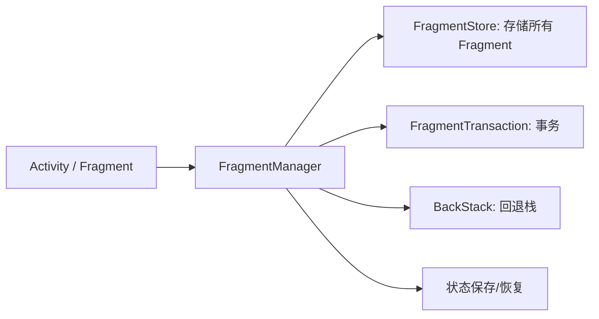
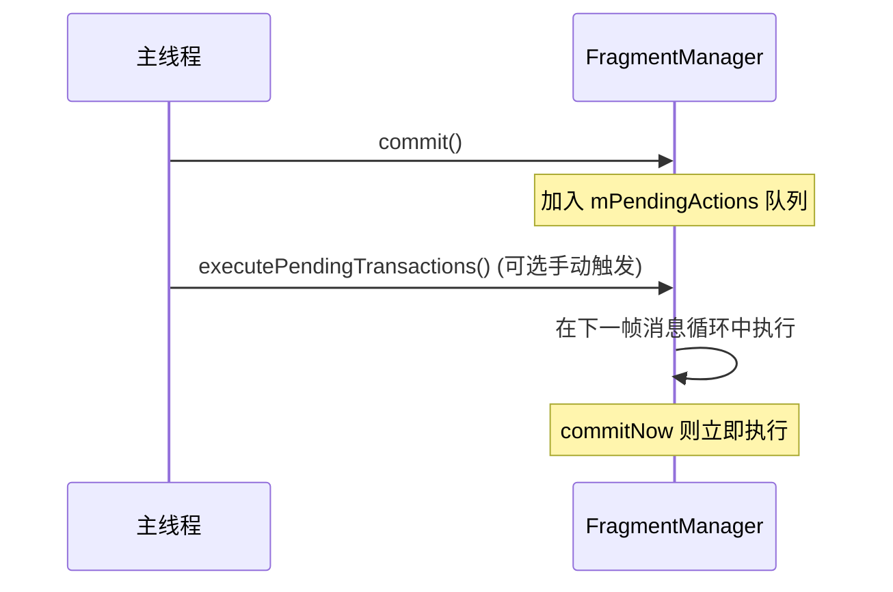
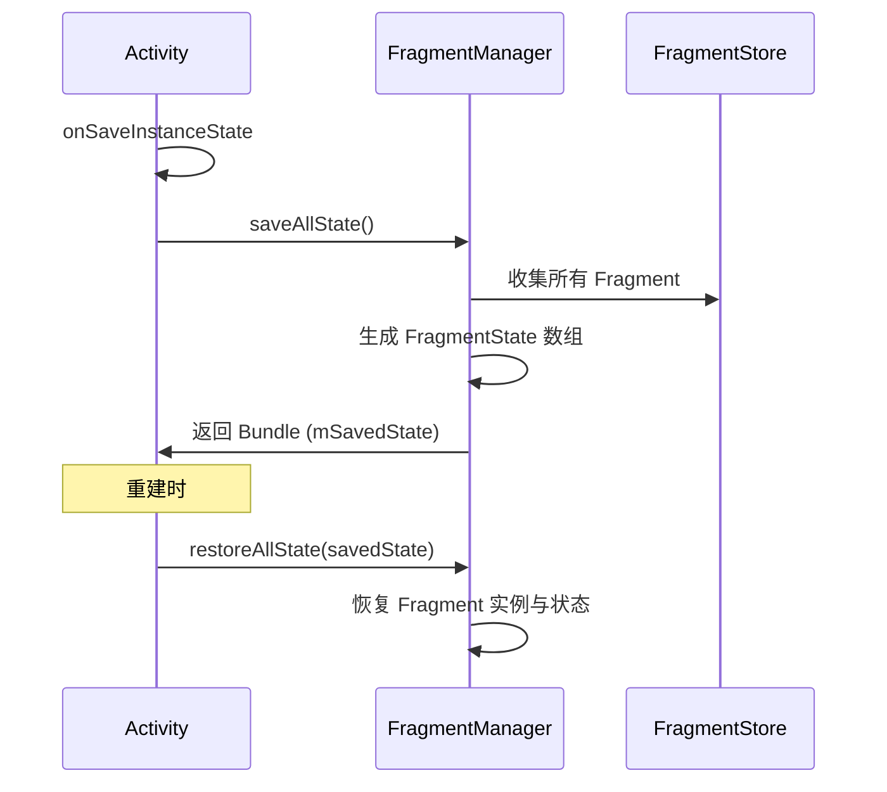
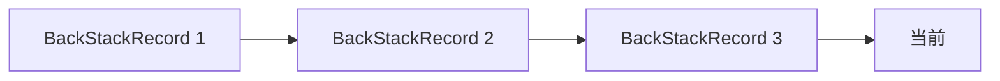

# FragmentManager 源码解析

> 面试高频指数：极高
> FragmentManager 是 Fragment 世界的核心，理解了它才能应对 Fragment 相关的所有疑难杂症。

## 1. FragmentManager 是什么

FragmentManager 是 Fragment 的**调度中心**：执行事务、管理生命周期、保存/恢复状态。



| 成员 | 职责 |
| --- | --- |
| `FragmentStore` | 用数组保存当前所有 Fragment 与 BackStackRecord |
| `FragmentFactory` | 创建 Fragment 实例的工厂 |
| `mPendingActions` | 待执行事务队列 |
| `mStateSaved` / `mStopped` | 生命周期锁定标记 |

## 2. 事务提交机制

### 2.1 事务是什么

::: code-tabs

@tab:active Java

```java
public class MainActivity extends AppCompatActivity {

    private void addFragment() {
        // beginTransaction 创建事务
        // add 添加操作
        // commit 提交（异步）
        getSupportFragmentManager().beginTransaction()
                .add(R.id.container, new ProfileFragment())
                .addToBackStack("profile")
                .commit();
    }
}
```

@tab Kotlin

```kotlin
class MainActivity : AppCompatActivity() {

    private fun addFragment() {
        // beginTransaction 创建事务
        // add 添加操作
        // commit 提交（异步）
        supportFragmentManager.beginTransaction()
            .add(R.id.container, ProfileFragment())
            .addToBackStack("profile")
            .commit()
    }
}
```

:::

### 2.2 commit 与 commitNow

| 方法 | 执行时机 | 场景 |
| --- | --- | --- |
| `commit()` | **异步**，主线程下一帧执行 | 常规添加/替换 |
| `commitNow()` | **同步**，立即执行 | 需要立刻生效 |
| `commitAllowingStateLoss()` | 异步，允许状态丢失时提交 | 极端场景慎用 |
| `commitNowAllowingStateLoss()` | 同步 + 允许状态丢失 | 同上 |



### 2.3 为什么 commit 是异步的

- 保证**状态一致性**：多个 commit 可以合并，批量执行避免中间态；
- 保证**生命周期安全**：在安全时机（moveToState）统一推进状态；
- 如果同步执行，可能出现状态保存期间修改导致崩溃。

## 3. 状态保存与恢复

### 3.1 保存的时机



### 3.2 FragmentState 保存了哪些内容

| 内容 | 说明 |
| --- | --- |
| Fragment 类名 | 用于重建实例 |
| arguments | 构造参数（Bundle） |
| SavedState | Fragment.onSaveInstanceState 的结果 |
| View 状态 | 通过 view hierarchy 自动保存 |
| 回退栈 | BackStackState 序列化 |

### 3.3 状态丢失的根源

| 场景 | 原因 | 解决 |
| --- | --- | --- |
| commit 后立即销毁 | 异步提交未执行完 | commitAllowingStateLoss 或延迟 |
| 状态保存后 commit | mStateSaved 为 true 抛异常 | 判断状态或用 allowStateLoss |
| 进程被杀 | 状态未保存 | onSaveInstanceState 手动保存关键数据 |

## 4. FragmentFactory

### 4.1 默认实例化方式

默认使用无参构造反射创建。自定义 Factory 可以：

- 传参构造（避免 setArguments 方式）；
- 依赖注入（Hilt 的 HiltFragmentFactory）；
- 统一逻辑（埋点、初始化）。

::: code-tabs

@tab:active Java

```java
public class MainActivity extends AppCompatActivity {

    @Override
    protected void onCreate(Bundle savedInstanceState) {
        super.onCreate(savedInstanceState);

        // 自定义 FragmentFactory
        getSupportFragmentManager().setFragmentFactory(
                new FragmentFactory() {
                    @NonNull
                    @Override
                    public Fragment instantiate(
                            @NonNull ClassLoader classLoader,
                            @NonNull String className) {
                        // 根据类名创建不同实例
                        if (className.equals(ProfileFragment.class.getName())) {
                            return new ProfileFragment("userId_123");
                        }
                        return super.instantiate(classLoader, className);
                    }
                });
    }
}
```

@tab Kotlin

```kotlin
class MainActivity : AppCompatActivity() {

    override fun onCreate(savedInstanceState: Bundle?) {
        super.onCreate(savedInstanceState)

        // 自定义 FragmentFactory
        supportFragmentManager.fragmentFactory = object : FragmentFactory() {
            override fun instantiate(classLoader: ClassLoader, className: String): Fragment {
                // 根据类名创建不同实例
                return if (className == ProfileFragment::class.java.name) {
                    ProfileFragment("userId_123")
                } else {
                    super.instantiate(classLoader, className)
                }
            }
        }
    }
}
```

:::

### 4.2 与 arguments 的取舍

| 方式 | 优点 | 缺点 |
| --- | --- | --- |
| arguments（传统） | 状态保存自动处理 | 传参繁琐、类型不安全 |
| FragmentFactory 构造传参 | 类型安全、直观 | 需要 Factory 支持重建 |

**推荐**：默认用 arguments（状态保存机制完善）；需要依赖注入时用 Factory。

## 5. 回退栈机制

### 5.1 基本操作

::: code-tabs

@tab:active Java

```java
// 入栈
getSupportFragmentManager().beginTransaction()
        .add(R.id.container, fragment)
        .addToBackStack(null)     // 入回退栈
        .commit();

// 出栈
getSupportFragmentManager().popBackStack();

// 指定出栈到某个标记
getSupportFragmentManager().popBackStack("profile",
        FragmentManager.POP_BACK_STACK_INCLUSIVE);
```

@tab Kotlin

```kotlin
// 入栈
supportFragmentManager.beginTransaction()
    .add(R.id.container, fragment)
    .addToBackStack(null)     // 入回退栈
    .commit()

// 出栈
supportFragmentManager.popBackStack()

// 指定出栈到某个标记
supportFragmentManager.popBackStack(
    "profile", FragmentManager.POP_BACK_STACK_INCLUSIVE
)
```

:::

### 5.2 回退栈原理



- 每个入栈事务是一个 `BackStackRecord`（Op 列表）；
- `popBackStack` 逆序执行 **反向操作**（add → remove）；
- 出栈会**重新走一遍 Fragment 生命周期**（不是恢复旧 View）；
- `popBackStack` 本身是**异步**的（post 到主线程）。

### 5.3 常用场景

| 场景 | 操作 |
| --- | --- |
| 返回上一页 | popBackStack() |
| 回到根 | popBackStack(null, POP_BACK_STACK_INCLUSIVE) |
| 判断栈空 | getBackStackEntryCount() == 0 |
| 监听变化 | addOnBackStackChangedListener |

## 6. 面试高频题

::: details Q1：FragmentManager 的 commit 为什么是异步的？

① 批量合并：多个事务可以合并到同一帧执行，减少状态切换次数；② 一致性：保证在 moveToState 的安全时机统一推进，避免执行一半时生命周期变化导致状态不一致；③ 安全性：状态保存后（mStateSaved）如果同步执行会直接崩溃，异步可以检查后丢弃或延迟。

:::

::: details Q2：commit 与 commitNow 的区别？什么时候用 commitNow？

commit 异步（加入 mPendingActions，下一帧执行），commitNow 同步立即执行。commitNow 用在需要马上生效的场景（如 Fragment 内立即 add child fragment），但注意 commitNow 不能和 addToBackStack 一起用。日常导航优先 commit。

:::

::: details Q3：Fragment 状态是如何保存和恢复的？

onSaveInstanceState 时 FragmentManager 调用 saveAllState，为每个 Fragment 生成 FragmentState（类名 + arguments + SavedState + View 状态），连同回退栈一起存入 Activity 的 Bundle。重建时 restoreAllState 依次恢复 Fragment 实例（通过 FragmentFactory 实例化）并恢复其状态。所以只要用 arguments 传参，重建后数据自动恢复。

:::

::: details Q4：为什么会出现"Fragment 重叠"问题？如何解决？

重叠的根本原因：状态保存后重复提交（或未做状态判断的 add），导致重建后旧 Fragment 与新 Fragment 并存。解决：① 提交前判断 savedInstanceState == null；② 用 arguments 保存数据而不是依赖字段；③ 避免在 onResume 等时机反复提交；④ 必要时用 hide/show 而不是反复 add。

:::

::: details Q5：FragmentFactory 有什么用？什么时候需要自定义？

默认通过无参构造反射创建 Fragment。自定义 Factory 可以：① 构造传参（类型安全）；② 接入依赖注入（Hilt）；③ 统一创建逻辑。FragmentFactory 在**状态恢复时也会被调用**，所以必须能处理重建场景（如根据 arguments 判断）。日常简单场景不需要自定义。

:::

## 7. 小结

- FragmentManager 是**调度中心**：事务、状态、回退栈都在这里；
- `commit` 异步、`commitNow` 同步，理解执行时机才能避免状态丢失；
- 状态保存走 **FragmentState**，用 arguments 传参是恢复的关键；
- `FragmentFactory` 是实例化入口，依赖注入与构造传参都靠它；
- 回退栈出栈会**重走生命周期**，不是简单恢复。

## 相关阅读

- [Fragment 生命周期与通信](/android/fragment/fragment-basics.md)
- [Fragment 常见坑点总结](/android/fragment/fragment-pitfalls.md)
- [Jetpack Navigation](/jetpack/paging-navigation/navigation.md)
- [Lifecycle 原理与使用](/jetpack/lifecycle-viewmodel/lifecycle.md)
