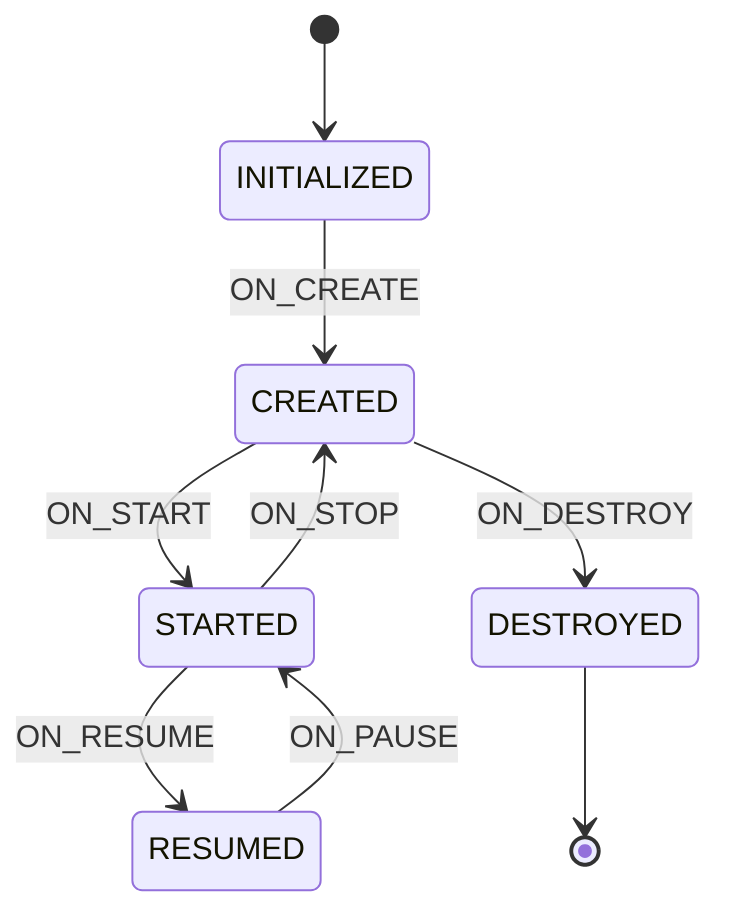

# Lifecycle 原理与使用

> 面试高频指数：极高
> Lifecycle 是 Jetpack 的基石组件，ViewModel、LiveData、协程都建立在它之上。

## 1. 为什么需要 Lifecycle

传统方式管理生命周期的问题：

```kotlin
// ✗ 传统方式：手动管理，容易遗漏
class MainActivity : AppCompatActivity() {

    private var locationListener: LocationListener? = null

    override fun onStart() {
        super.onStart()
        locationListener?.start()   // 忘记判断状态
    }

    override fun onStop() {
        super.onStop()
        locationListener?.stop()
    }
}
```

问题：

- 回调遗漏 → 内存泄漏、崩溃。
- 组件与 Activity 强耦合，无法复用。
- 测试困难。

**Lifecycle 的解决方案**：组件自己声明"我需要在哪些生命周期做哪些事"，由系统自动回调。

## 2. 核心概念

### 2.1 三个角色

| 角色 | 类 | 职责 |
| --- | --- | --- |
| 事件源 | `LifecycleOwner` | 拥有生命周期（Activity / Fragment） |
| 状态机 | `Lifecycle` | 维护生命周期状态并派发事件 |
| 观察者 | `LifecycleObserver` | 订阅生命周期事件 |

### 2.2 状态与事件

```text
事件（Event）：
ON_CREATE → ON_START → ON_RESUME → ON_PAUSE → ON_STOP → ON_DESTROY

状态（State）：
DESTROYED ← INITIALIZED ← CREATED ← STARTED ← RESUMED

对应关系：
| 状态        | 已触发事件                  |
|-------------|-----------------------------|
| CREATED     | ON_CREATE                   |
| STARTED     | ON_START                    |
| RESUMED     | ON_RESUME                   |
```

> **关键点**：状态是"结果"，事件是"动作"。例如 `ON_START` 事件发生后，状态变为 `STARTED`。

### 2.3 状态机迁移图



## 3. 使用方式

### 3.1 实现 LifecycleObserver

```kotlin
class LocationManager : LifecycleObserver {

    @OnLifecycleEvent(Lifecycle.Event.ON_START)
    fun start() {
        // 开始定位
    }

    @OnLifecycleEvent(Lifecycle.Event.ON_STOP)
    fun stop() {
        // 停止定位
    }
}

// 使用
class MainActivity : AppCompatActivity() {
    override fun onCreate(savedInstanceState: Bundle?) {
        super.onCreate(savedInstanceState)
        lifecycle.addObserver(LocationManager())
    }
}
```

### 3.2 现代写法：DefaultLifecycleObserver

```kotlin
class LocationManager : DefaultLifecycleObserver {

    override fun onStart(owner: LifecycleOwner) {
        // 开始定位
    }

    override fun onStop(owner: LifecycleOwner) {
        // 停止定位
    }
}
```

> `@OnLifecycleEvent` 注解已废弃，推荐实现 `DefaultLifecycleObserver` 接口。

## 4. 原理分析

### 4.1 LifecycleRegistry 状态同步

`LifecycleRegistry` 是 `Lifecycle` 的默认实现，核心机制：

```text
Activity onStart()
  → ReportFragment（注入的生命周期宿主）分发 ON_START 事件
  → LifecycleRegistry.handleLifecycleEvent(ON_START)
  → 更新 mState 为 STARTED
  → 遍历 Observer，逐个回调 onStateChanged
  → 若 Observer 未同步（如新建），会同步上调到当前状态
```

### 4.2 状态回退同步

```kotlin
// LifecycleRegistry 核心逻辑（伪代码）
private void sync() {
    while (!isSynced()) {
        mNewEventOccurred = false;
        if (mState.compareTo(mObserverMap.eldest().getValue().mState) < 0) {
            // 状态下降：倒序遍历，派发 ON_PAUSE / ON_STOP / ON_DESTROY
            backwardPass();
        } else {
            // 状态上升：正序遍历，派发 ON_CREATE / ON_START / ON_RESUME
            forwardPass();
        }
    }
}
```

### 4.3 使用 LinearLayout 的原因

- `ReportFragment`：通过向 Activity 注入无 UI Fragment 来接收生命周期回调（API < 29 时）。
- API 29+ 直接通过 `ComponentActivity` 自身的 `LifecycleRegistry` 分发。
- 使用 `LinearLayout` 保证**同步性**：在真正执行 onCreate 之前完成状态更新。

## 5. 常见应用场景

```kotlin
// 场景 1：摄像头/传感器释放
class CameraController : DefaultLifecycleObserver {
    override fun onStart(owner: LifecycleOwner) { camera.open() }
    override fun onStop(owner: LifecycleOwner) { camera.release() }
}

// 场景 2：定时器/轮询
class PollingManager : DefaultLifecycleObserver {
    private val scope = CoroutineScope(SupervisorJob() + Dispatchers.IO)
    override fun onResume(owner: LifecycleOwner) { startPolling() }
    override fun onPause(owner: LifecycleOwner) { stopPolling() }
}

// 场景 3：自定义 View 感知生命周期
class MyView(context: Context) : View(context), LifecycleOwner {
    private val lifecycleRegistry = LifecycleRegistry(this)
    override val lifecycle: Lifecycle get() = lifecycleRegistry
}
```

## 6. 高频面试题

**Q1：Lifecycle 的观察者模式体现在哪？**
A：`LifecycleOwner` 是事件源，`Lifecycle` 维护状态机，`LifecycleObserver` 是观察者。
状态变化时 `LifecycleRegistry` 遍历观察者列表并回调，观察者无需关心事件来自 Activity 还是 Fragment。

**Q2：为什么 ViewModel 能感知生命周期而不泄漏？**
A：ViewModel 不直接持有 Activity 引用。它通过 `ViewModelStore` 由 `ViewModelStoreOwner`
（Activity/Fragment）管理，`onDestroy` 时调用 `clear()` 释放。同时用 `Lifecycle` 感知
`ON_DESTROY` 事件，但**只在非配置变更的销毁时**才清空。

**Q3：ReportFragment 的作用？**
A：Android 10 之前，`ComponentActivity` 通过注入无 UI 的 `ReportFragment` 接收生命周期
回调并同步给 `LifecycleRegistry`；Android 10+ 改为直接分发，ReportFragment 仅用于
`ProcessLifecycleOwner` 等场景。

**Q4：自定义 LifecycleOwner 需要注意什么？**
A：① 必须用 `LifecycleRegistry` 并在合适时机调用 `handleLifecycleEvent`；
② 状态迁移要遵循状态机顺序（不能跳跃）；③ 记住在 `onDestroy` 置为 `DESTROYED`。

**Q5：ON_DESTROY 和 DESTROYED 状态的区别？**
A：`ON_DESTROY` 是事件（正在销毁，回调观察者）；`DESTROYED` 是状态（已销毁完成）。
观察者在 `ON_DESTROY` 中应释放资源，此时生命周期即将结束。

## 7. 小结

- Lifecycle = 状态机 + 观察者模式，解耦组件与生命周期。
- `LifecycleRegistry` 保证状态同步（上升/回退遍历）。
- 现代 API：`DefaultLifecycleObserver`，注解方式已废弃。
- 它是 ViewModel、LiveData、协程的生命周期基础。
