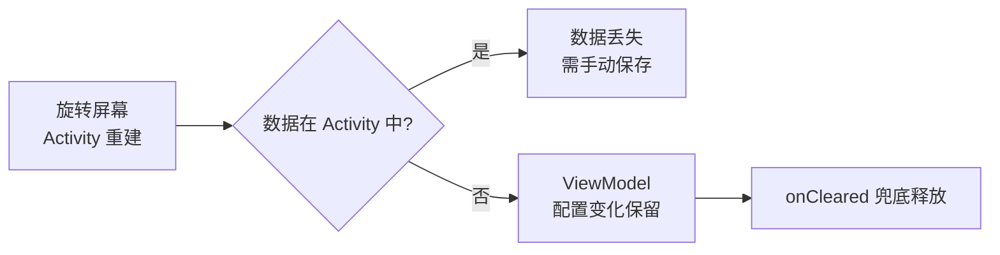
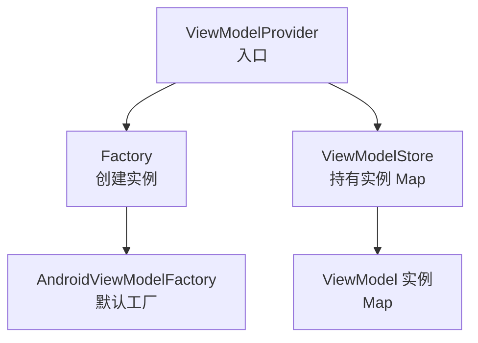
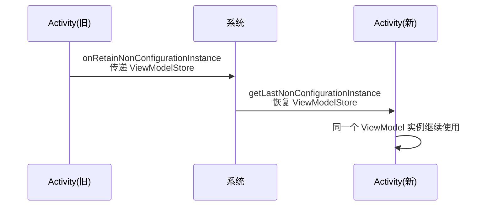
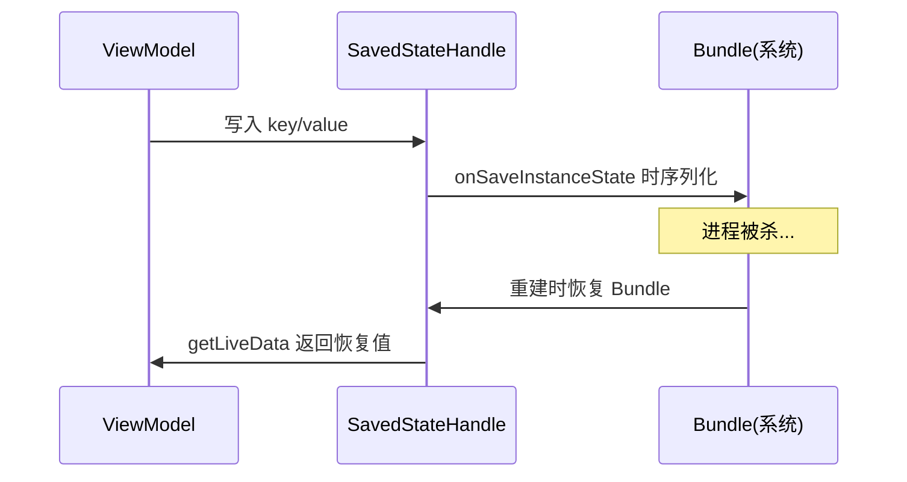

# ViewModel 源码解析

> ViewModel 为什么旋转屏幕不销毁?onCleared 到底什么时候调用?SavedStateHandle 如何做到进程死亡恢复?本文从源码彻底搞懂 ViewModel 机制。

## 一、ViewModel 解决了什么



**核心问题**:旋转屏幕时 Activity 销毁重建,UI 数据(列表加载一半、表单输入)会丢失。

**ViewModel 方案**:数据移出 UI,存到**不随配置变化销毁**的 ViewModelStore 中。

## 二、源码核心:ViewModelStore 与 ViewModelProvider

### 2.1 关键类关系



三个类的职责分工：**ViewModelProvider** 是入口，负责"取或建"；**Factory** 负责"建"（默认是 AndroidViewModelFactory，支持 Application/SavedStateHandle 参数）；**ViewModelStore** 负责"存"——本质就是一个 `HashMap<String, ViewModel>`。下面的源码展示了 Store 的容器本质：

::: code-tabs

@tab:active Java

```java
// 1. ViewModelStore:简单的 HashMap 容器
public class ViewModelStore {
    private final HashMap<String, ViewModel> mMap = new HashMap<>();

    final void put(String key, ViewModel viewModel) {
        ViewModel oldViewModel = mMap.put(key, viewModel);
        if (oldViewModel != null) oldViewModel.onCleared();  // 替换时清旧
    }

    final ViewModel get(String key) { return mMap.get(key); }

    public final void clear() {
        for (ViewModel vm : mMap.values()) vm.onCleared();  // 全部清理
        mMap.clear();
    }
}
```

@tab Kotlin

```kotlin
// 1. ViewModelStore:简单的 HashMap 容器
class ViewModelStore {
    private val mMap = HashMap<String, ViewModel>()

    internal fun put(key: String, viewModel: ViewModel) {
        val oldViewModel = mMap.put(key, viewModel)
        if (oldViewModel != null) oldViewModel.onCleared()  // 替换时清旧
    }

    internal fun get(key: String): ViewModel? = mMap[key]

    fun clear() {
        for (vm in mMap.values) vm.onCleared()  // 全部清理
        mMap.clear()
    }
}
```

:::

::: code-tabs

@tab:active Java

```java
// 2. ViewModelProvider.get 核心逻辑(简化)
public <T extends ViewModel> T get(String key, Class<T> modelClass) {
    ViewModel viewModel = mViewModelStore.get(key);
    if (modelClass.isInstance(viewModel)) {
        return (T) viewModel;           // 已有实例直接复用
    }
    ViewModel newViewModel = mFactory.create(modelClass);  // 工厂创建
    mViewModelStore.put(key, newViewModel);
    return (T) newViewModel;
}
```

@tab Kotlin

```kotlin
// 2. ViewModelProvider.get 核心逻辑(简化)
fun <T : ViewModel> get(key: String, modelClass: Class<T>): T {
    val viewModel = mViewModelStore.get(key)
    if (modelClass.isInstance(viewModel)) {
        return viewModel as T          // 已有实例直接复用
    }
    val newViewModel = mFactory.create(modelClass)  // 工厂创建
    mViewModelStore.put(key, newViewModel)
    return newViewModel as T
}
```

:::

### 2.2 为什么旋转不销毁

答案藏在 Activity 的 `NonConfigurationInstances` 机制里：配置变化时，系统在销毁旧 Activity 前调用 `onRetainNonConfigurationInstance`，允许把 ViewModelStore 等"非配置状态"交出来；新 Activity 创建后再通过 `getLastNonConfigurationInstance` 原样取回——ViewModel 就这样被"转交"而非"重建"：

::: code-tabs

@tab:active Java

```java
// ComponentActivity / Activity
// ViewModelStore 由 NonConfigurationInstances 持有
// —— Activity 重建时通过 retainNonConfigurationInstance 传递!
public final Object onRetainNonConfigurationInstance() {
    // 保存 ViewModelStore 等状态
    return new NonConfigurationInstances(mViewModelStore, ...);
}

protected void onCreate(Bundle savedInstanceState) {
    // 重建时从上一实例恢复 ViewModelStore
    NonConfigurationInstances nci = getLastNonConfigurationInstance();
    if (nci != null) mViewModelStore = nci.viewModelStore;
}
```

@tab Kotlin

```kotlin
// ComponentActivity / Activity
// ViewModelStore 由 NonConfigurationInstances 持有
// —— Activity 重建时通过 retainNonConfigurationInstance 传递!
fun onRetainNonConfigurationInstance(): Any? {
    // 保存 ViewModelStore 等状态
    return NonConfigurationInstances(mViewModelStore, ...)
}

protected fun onCreate(savedInstanceState: Bundle?) {
    // 重建时从上一实例恢复 ViewModelStore
    val nci = lastNonConfigurationInstance
    if (nci != null) mViewModelStore = nci.viewModelStore
}
```

:::

整个传递过程的时序如下——注意 ViewModelStore 只在"旧 Activity 与系统"之间转手，实例本身从未被销毁：



> **关键**:ViewModelStore 不挂在 Activity 实例上,而是通过 `NonConfigurationInstances` 在重建时**原样传递**,所以 ViewModel 不销毁。**只有 `finish()`(用户主动关闭)才会真正 clear**。

## 三、onCleared 调用时机

onCleared 的唯一触发入口是 `ViewModelStore.clear()`，而 clear 的调用条件藏在 ComponentActivity 的 onDestroy 里——**`!isChangingConfigurations()`**：配置变化销毁时这个标志为 true，跳过清理；用户 finish 时标志为 false，执行清理：

::: code-tabs

@tab:active Java

```java
// ComponentActivity 销毁逻辑
public void onDestroy() {
    super.onDestroy();
    if (!isChangingConfigurations()) {  // 关键判断!
        getViewModelStore().clear();    // 非配置变化销毁 → 清理 ViewModel
    }
}
```

@tab Kotlin

```kotlin
// ComponentActivity 销毁逻辑
override fun onDestroy() {
    super.onDestroy()
    if (!isChangingConfigurations) {  // 关键判断!
        viewModelStore.clear()        // 非配置变化销毁 → 清理 ViewModel
    }
}
```

:::

不同场景下是否触发 onCleared 可总结为下表：

| 场景 | isChangingConfigurations | onCleared |
|------|------------------------|-----------|
| 旋转屏幕/切换深色模式 | true | ✗ 不调用 |
| 用户按返回键 finish() | false | ✓ 调用 |
| 任务被移除 | false | ✓ 调用 |
| 进程被杀(无 onDestroy) | — | ✗ 不调用(进程直接没了) |

onCleared 的典型用途是"清理 ViewModel 独占的资源"：

::: code-tabs

@tab:active Java

```java
// onCleared 常见用途
public class TimerViewModel extends ViewModel {
    // 对应 Kotlin 的 SupervisorJob()：Java 侧可引入 kotlinx.coroutines 或改用线程池句柄
    private final Job job = SupervisorJob();

    public TimerViewModel() {
        // 启动一个后台任务（对应 viewModelScope.launch，Java 中可用线程池 + Handler）
        // viewModelScope.launch { /* ... */ }
    }

    @Override
    protected void onCleared() {
        super.onCleared();
        job.cancel();             // 取消协程
        player.release();         // 释放播放器
        // 移除监听器、关闭流等
    }
}
```

@tab Kotlin

```kotlin
// onCleared 常见用途
class TimerViewModel : ViewModel() {
    private val job = SupervisorJob()

    init {
        // 启动一个后台任务
        viewModelScope.launch { /* ... */ }
    }

    override fun onCleared() {
        super.onCleared()
        job.cancel()              // 取消协程
        player.release()          // 释放播放器
        // 移除监听器、关闭流等
    }
}
```

:::

>  **坑**:onCleared 不保证在进程被杀时调用(进程死亡无回调),所以关键数据要持久化到 SavedStateHandle/Room/DataStore。

## 四、Factory 与默认工厂

ViewModelProvider 需要两个东西：**ViewModelStore**（从 owner 获取）和 **Factory**（负责创建实例）。默认工厂（DefaultFactory/SavedStateViewModelFactory）能自动处理三种构造参数：`@Inject` 注解的依赖、`SavedStateHandle`、`Application`。当 ViewModel 需要自定义参数（如 userId）时，就必须自己实现 Factory：

::: code-tabs

@tab:active Java

```java
// ViewModelProvider 构造
public ViewModelProvider(ViewModelStoreOwner owner, Factory factory) {
    this(owner.getViewModelStore(), factory);
}

// 默认工厂:根据构造参数类型自动提供
public static class DefaultFactory extends SavedStateViewModelFactory {
    // 支持 @Inject 构造 / SavedStateHandle / Application 参数
}
```

@tab Kotlin

```kotlin
// ViewModelProvider 构造
class ViewModelProvider(owner: ViewModelStoreOwner, factory: Factory) {
    // 内部使用 owner.getViewModelStore()
}

// 默认工厂:根据构造参数类型自动提供
class DefaultFactory : SavedStateViewModelFactory() {
    // 支持 @Inject 构造 / SavedStateHandle / Application 参数
}
```

:::

::: code-tabs

@tab:active Java

```java
// 自定义 Factory:带参 ViewModel
public class DetailViewModel extends ViewModel {
    private final long userId;
    private final UserRepository repository;

    public DetailViewModel(long userId, UserRepository repository) {
        this.userId = userId;
        this.repository = repository;
    }
}

public class DetailViewModelFactory implements ViewModelProvider.Factory {
    private final long userId;
    private final UserRepository repository;

    public DetailViewModelFactory(long userId, UserRepository repository) {
        this.userId = userId;
        this.repository = repository;
    }

    @NonNull
    @Override
    public <T extends ViewModel> T create(@NonNull Class<T> modelClass) {
        return (T) new DetailViewModel(userId, repository);
    }
}

// 使用
new ViewModelProvider(this, new DetailViewModelFactory(userId, repo))
        .get(DetailViewModel.class);
```

@tab Kotlin

```kotlin
// 自定义 Factory:带参 ViewModel
class DetailViewModel(
    private val userId: Long,
    private val repository: UserRepository
) : ViewModel()

class DetailViewModelFactory(
    private val userId: Long,
    private val repository: UserRepository
) : ViewModelProvider.Factory {
    override fun <T : ViewModel> create(modelClass: Class<T>): T {
        return DetailViewModel(userId, repository) as T
    }
}

// 使用
viewModels { DetailViewModelFactory(userId, repo) }
```

:::

## 五、viewModelScope 原理

`viewModelScope` 本质是 ViewModel 的扩展属性：首次访问时创建 `CloseableCoroutineScope(SupervisorJob() + Dispatchers.Main.immediate)`，并以 `JOB_KEY` 为 tag 存进 ViewModel 的 `mBagOfTags`。选择 `SupervisorJob` 是为了"一个子协程失败不影响兄弟协程"；选择 `Main.immediate` 是因为 UI 层默认要在主线程收集结果。源码如下：

::: code-tabs

@tab:active Java

```java
// 源码:ViewModel 的 viewModelScope 扩展属性（Java 侧编译为静态方法）
public static CoroutineScope getViewModelScope(ViewModel viewModel) {
    CloseableCoroutineScope scope =
            (CloseableCoroutineScope) viewModel.getTag(JOB_KEY);
    if (scope != null) return scope;
    return viewModel.setTagIfAbsent(JOB_KEY,
            new CloseableCoroutineScope(
                    SupervisorJob() + Dispatchers.Main.INSTANCE.getImmediate()));
}
```

@tab Kotlin

```kotlin
// 源码:ViewModel 扩展属性
public val ViewModel.viewModelScope: CoroutineScope
    get() {
        val scope = this.getTag(JOB_KEY) as? CloseableCoroutineScope
        if (scope != null) return scope
        return setTagIfAbsent(JOB_KEY,
            CloseableCoroutineScope(
                SupervisorJob() + Dispatchers.Main.immediate))
    }
```

:::

销毁时的清理也很简单——`clear()` 时把 `JOB_KEY` 对应的 Closeable 关掉，整个 scope 的协程随之取消：

::: code-tabs

@tab:active Java

```java
// 关键:ViewModel 销毁时关闭 scope
public void clear() {
    // ...
    Closeable closeable = mBagOfTags.remove(JOB_KEY);
    if (closeable != null) closeable.close();   // 取消 viewModelScope
}
```

@tab Kotlin

```kotlin
// 关键:ViewModel 销毁时关闭 scope
fun clear() {
    // ...
    val closeable = mBagOfTags.remove(JOB_KEY)
    closeable?.close()   // 取消 viewModelScope
}
```

:::

> `viewModelScope` 使用 `SupervisorJob + Main.immediate`。ViewModel 清除时自动取消,无需手动管理协程生命周期。注意:网络请求放 viewModelScope 会在离开页面时自动取消(合理),但**轮询/下载**等需特殊处理。

## 六、SavedStateHandle 原理

SavedStateHandle 的内部结构并不复杂：一个普通 Map（`mRegular`）存值，外加一个 `SavedStateProvider` 负责与系统状态保存机制对接。当 Activity 执行 `onSaveInstanceState` 时，系统会调用所有注册的 Provider 收集状态，SavedStateHandle 就把 Map 里的值写进 Bundle；进程死亡重建后，Bundle 恢复回来，`getLiveData`/`get` 自然读到旧值：

::: code-tabs

@tab:active Java

```java
// SavedStateHandle:进程死亡恢复的核心
public final class SavedStateHandle {
    private final Map<String, Object> mRegular;    // 普通值
    private final SavedStateRegistry.SavedStateProvider mSavedStateProvider;

    // getLiveData:把值包装成 LiveData
    public <T> MutableLiveData<T> getLiveData(String key) {
        // 存在则复用,否则创建并注册 SavedStateProvider
    }

    // 进程恢复流程
    // onSaveInstanceState → 保存 mRegular → 重建时恢复
}
```

@tab Kotlin

```kotlin
// SavedStateHandle:进程死亡恢复的核心
class SavedStateHandle {
    private val mRegular: Map<String, Any?>    // 普通值
    private val mSavedStateProvider: SavedStateRegistry.SavedStateProvider

    // getLiveData:把值包装成 LiveData
    fun <T> getLiveData(key: String): MutableLiveData<T> {
        // 存在则复用,否则创建并注册 SavedStateProvider
    }

    // 进程恢复流程
    // onSaveInstanceState → 保存 mRegular → 重建时恢复
}
```

:::

::: code-tabs

@tab:active Java

```java
public class MainViewModel extends ViewModel {
    private final SavedStateHandle savedStateHandle;
    // 初始化读取(进程死亡恢复)
    private final MutableLiveData<Integer> count;

    public MainViewModel(SavedStateHandle savedStateHandle) {
        this.savedStateHandle = savedStateHandle;
        this.count = savedStateHandle.getLiveData("count");
    }

    public MutableLiveData<Integer> getCount() { return count; }

    public void addCount() {
        Integer cur = count.getValue();
        count.setValue((cur != null ? cur : 0) + 1);
    }
}
```

@tab Kotlin

```kotlin
class MainViewModel(
    private val savedStateHandle: SavedStateHandle
) : ViewModel() {

    // 初始化读取(进程死亡恢复)
    val count = savedStateHandle.getLiveData<Int>("count")

    fun addCount() {
        count.value = (count.value ?: 0) + 1
    }
}
```

:::

整个"写入 → 序列化 → 恢复"的时序如下：



## 七、高频面试题

### Q1：ViewModel 为什么旋转屏幕不销毁?
::: details 查看答案
ViewModel 实例存储在 ViewModelStore 中,而 ViewModelStore 通过 Activity 的 onRetainNonConfigurationInstance 在配置变化时传递给新 Activity 实例(getLastNonConfigurationInstance 恢复),因此 ViewModel 不随 Activity 重建销毁。ViewModelStore.clear() 只在 !isChangingConfigurations() 时(即用户主动 finish)调用,配置变化时不会 clear。
:::

### Q2：onCleared 什么时候调用?进程被杀会调用吗?
::: details 查看答案
onCleared 在 ViewModelStore.clear() 时调用,即 Activity/Fragment 真正销毁且不是配置变化时:用户按返回键、finish() 被调用、任务移除。旋转屏幕等配置变化不调用。进程被杀(系统回收)不会回调 onCleared(进程直接终止),所以不能在 onCleared 里依赖持久化,关键数据要用 SavedStateHandle/Room 保存。onCleared 典型用途:取消协程、释放播放器、移除监听器。
:::

### Q3：viewModelScope 是怎么自动取消的?
::: details 查看答案
viewModelScope 是 ViewModel 的扩展属性,内部创建 CloseableCoroutineScope(SupervisorJob() + Dispatchers.Main.immediate)并作为 tag 存入 ViewModel。ViewModel.clear() 时会关闭该 Closeable,从而取消整个 scope 的协程。因此放 viewModelScope 的协程在 ViewModel 销毁时自动取消,无需手动 cancel。注意 SupervisorJob 使一个子协程失败不影响兄弟协程。
:::

### Q4：ViewModel 中可以持有 Activity/View 引用吗?为什么?
::: details 查看答案
不能。ViewModel 生命周期比 Activity/View 长(配置变化时 ViewModel 存活而 View 重建),持有 View 引用会导致内存泄漏——View 无法被 GC。正确做法:ViewModel 只暴露 StateFlow/LiveData,View 通过 observe/collect 订阅;需要 Context 时用 AndroidViewModel(Application 级别)或用 SavedStateHandle;需要一次性事件用 Channel 等。
:::

### Q5：SavedStateHandle 如何实现进程死亡恢复?和 onSaveInstanceState 什么关系?
::: details 查看答案
SavedStateHandle 内部维护一个普通 Map(mRegular)并注册为 SavedStateRegistry 的 SavedStateProvider。Activity 执行 onSaveInstanceState 时,系统收集所有 provider 的 Bundle,SavedStateHandle 把自己的值写入;进程被杀后重建时,系统把恢复的 Bundle 交回 SavedStateHandle,getLiveData/get 就能读到之前的值。本质是"把 ViewModel 数据纳入系统级状态保存机制",相比手动 onSaveInstanceState 更集中、类型安全。
:::

## 小结

- ViewModelStore(HashMap)+ 工厂创建 + NonConfigurationInstances 传递 = 配置变化不销毁
- 只有非配置变化的销毁(finish)才触发 onCleared
- 进程被杀无回调,关键数据必须持久化
- 自定义 Factory 支持带参构造;Hilt @HiltViewModel 自动生成
- viewModelScope = SupervisorJob + Main,clear 时自动取消
- SavedStateHandle 通过 SavedStateRegistry 桥接系统状态保存

> 进阶阅读：[ViewModel + LiveData](/jetpack/lifecycle-viewmodel/viewmodel-livedata.md) | [SavedStateHandle 状态保存](/jetpack/lifecycle-viewmodel/savedstate.md) | [Lifecycle 组件详解](/jetpack/lifecycle-viewmodel/lifecycle.md)
