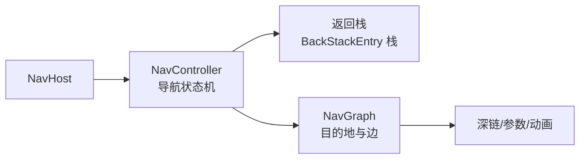
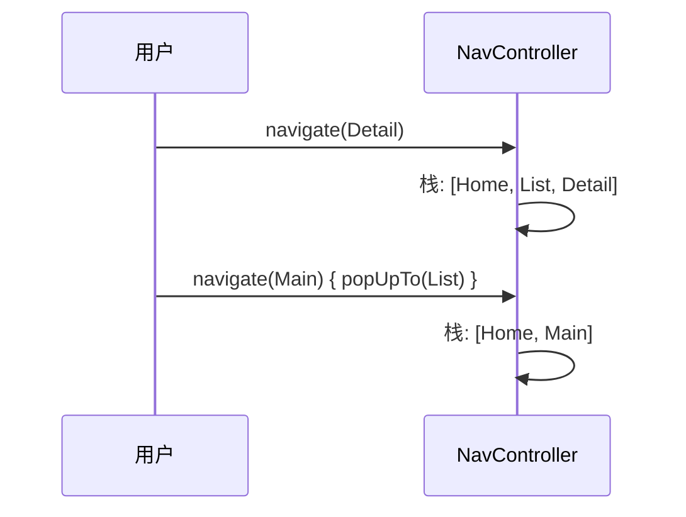

# Navigation 高级进阶

> 从"搭个导航图"到"掌控导航架构":类型安全导航、Deep Link、返回栈精细控制、嵌套导航图与 Compose Navigation 深度集成。

## 一、Navigation 核心概念



| 概念 | 说明 |
|------|------|
| NavController | 导航控制器,管理返回栈 |
| NavGraph | 导航图(目的地集合) |
| NavDestination | 目的地(Composable/Fragment/Activity) |
| NavBackStackEntry | 返回栈中的一帧(携带参数/状态) |
| NavOptions | 导航选项(动画/返回行为) |

## 二、类型安全导航(官方推荐)

> Navigation 2.8+ 的**类型安全路由**:用 Kotlin 类表示目的地,替代字符串路由。

```kotlin
// 1. 定义路由(Serializable 对象)
@Serializable
data object HomeRoute

@Serializable
data class UserDetailRoute(
    val userId: Long,
    val userName: String = "未知"   // 默认参数
)

// 2. NavHost 中注册
NavHost(navController = navController, startDestination = HomeRoute) {
    composable<HomeRoute> {
        HomeScreen(
            onUserClick = { user ->
                navController.navigate(UserDetailRoute(user.id, user.name))
            }
        )
    }
    composable<UserDetailRoute> { backStackEntry ->
        val route: UserDetailRoute = backStackEntry.toRoute()
        UserDetailScreen(userId = route.userId)
    }
}
```

### 类型安全 vs 字符串路由

| 维度 | 字符串路由 | 类型安全路由 |
|------|-----------|-------------|
| 类型检查 | 运行时才报错 | 编译期校验 |
| 参数传递 | 拼字符串易错 | 类型安全对象 |
| 重构 | 改字符串可能漏 | 编译器全量提示 |
| 深链 | 手动定义 | @Serializable 自动支持 |

## 三、Deep Link 深链

### 3.1 声明深链

```kotlin
// 类型安全方式:声明 @DeepLink
@Serializable
@DeepLink("app://example.com/user/{userId}")
data class UserDeepLink(val userId: Long)

composable<UserDeepLink>(
    deepLinks = listOf(
        navDeepLink<UserDeepLink> { uriPattern = "app://example.com/user/{userId}" }
    )
) {
    // ...
}
```

### 3.2 manifest 配置(应用外启动)

```xml
<activity
    android:name=".MainActivity"
    android:launchMode="singleTask">
    <intent-filter>
        <action android:name="android.intent.action.VIEW" />
        <category android:name="android.intent.category.DEFAULT" />
        <category android:name="android.intent.category.BROWSABLE" />
        <data android:scheme="app" android:host="example.com" />
    </intent-filter>
</activity>
```

```kotlin
// 3.3 Activity 中处理深链
class MainActivity : ComponentActivity() {
    override fun onCreate(savedInstanceState: Bundle?) {
        super.onCreate(savedInstanceState)
        val intent = intent
        // 深链参数自动进入 NavController
        // 也可手动读取
        intent.data?.let { uri ->
            // 例如:统计/埋点
            trackDeepLink(uri.toString())
        }
    }
}
```

### 深链类型

| 类型 | 说明 |
|------|------|
| 应用内深链 | NavController.navigate 到带参数路由 |
| 系统深链 | 通知/网页/二维码启动应用 |
| 动态链接 | Firebase Dynamic Links(未安装跳商店) |

## 四、返回栈管理

### 4.1 NavOptions 控制

```kotlin
// 1. 弹出至指定目的地(去重)
navController.navigate(HomeRoute) {
    popUpTo(HomeRoute) { inclusive = true }  // 把 Home 也弹出
    launchSingleTop = true                    // 栈顶去重
}

// 2. 登录后清空登录页
navController.navigate(MainRoute) {
    popUpTo(LoginRoute) { inclusive = true }
}

// 3. 保存状态(底部导航切换)
navController.navigate(ProfileRoute) {
    popUpTo(navController.graph.findStartDestination().id) {
        saveState = true
    }
    launchSingleTop = true
    restoreState = true
}
```

### 4.2 返回栈常用 API

| API | 作用 |
|-----|------|
| `popBackStack()` | 弹出栈顶 |
| `popBackStack(route, inclusive)` | 弹到指定目的地 |
| `navigateUp()` | 向上导航(Activity 返回) |
| `saveState/restoreState` | 底部导航状态保持 |
| `currentBackStackEntry` | 当前栈帧 |



## 五、嵌套导航图

```kotlin
// 底部导航 + 嵌套图:每个 Tab 独立返回栈
navigation<MainTab1Route>(startDestination = Tab1HomeRoute) {
    composable<Tab1HomeRoute> { Tab1Home() }
    composable<Tab1DetailRoute> { Tab1Detail() }
}
navigation<MainTab2Route>(startDestination = Tab2HomeRoute) {
    composable<Tab2HomeRoute> { Tab2Home() }
    composable<Tab2DetailRoute> { Tab2Detail() }
}

// 导航到嵌套图(切 Tab)
navController.navigate(MainTab2Route) {
    popUpTo(navController.graph.findStartDestination().id) {
        saveState = true
    }
    launchSingleTop = true
    restoreState = true
}
```

> 嵌套图的优势:每个 Tab 有自己的返回栈,切换 Tab 不丢状态;导航图可复用、可模块化(配合 Hilt 多模块)。

## 六、与 ViewModel 集成

```kotlin
// 1. 每个目的地独立 ViewModel
composable<UserDetailRoute> { backStackEntry ->
    // 作用域是当前返回栈条目
    val viewModel: UserDetailViewModel = hiltViewModel()
    // ...
}

// 2. 共享 ViewModel(父子图/同一图内多个目的地)
composable<HomeRoute> { entry ->
    val parentEntry = remember(entry) {
        navController.getBackStackEntry<MainTab1Route>()  // 上级图作用域
    }
    val sharedVm: SharedViewModel = hiltViewModel(parentEntry)
}
```

## 七、高频面试题

### Q1：Navigation 组件相比 FragmentManager 手动管理有什么优势?
::: details 查看答案
① 声明式导航图:可视化地描述目的地与关系;② 安全的返回栈管理:popUpTo/launchSingleTop 等避免重复入栈;③ 参数类型安全:类型安全路由编译期校验;④ 深链统一:一处声明,应用内/系统统一处理;⑤ 与 Compose/ViewModel 深度集成:每目的地独立 ViewModel,保存/恢复状态;⑥ 嵌套图支持模块化;⑦ 动画与转场统一配置。缺点:过度依赖单一导航结构,特殊场景(如 WebView 返回键)需自定义。
:::

### Q2：底部导航 + Navigation 如何保持各 Tab 状态?
::: details 查看答案
用嵌套导航图,每个 Tab 一个子图;切换时 navigate 到对应子图并用 popUpTo(起始目的地) { saveState = true } + restoreState = true + launchSingleTop = true。这样切换 Tab 时旧 Tab 的返回栈被保存(而非销毁),切回时恢复,滚动位置与 ViewModel 状态都保留。
:::

### Q3：Navigation 的返回栈是什么?popUpTo 的 inclusive 参数有什么用?
::: details 查看答案
返回栈是 NavBackStackEntry 的栈,记录导航历史,back 键逐帧弹出。popUpTo(route) 把栈弹到指定目的地(该目的地保留);inclusive=true 则把该目的地也弹出。典型场景:登录页 → 主页时 popUpTo(登录页) { inclusive = true } 清空登录栈,防止返回键回到登录页。
:::

### Q4：类型安全路由相比字符串路由的好处?
::: details 查看答案
① 编译期检查:目的地类型错误、参数缺失、参数类型不匹配都编译报错;② 重构安全:修改路由类,所有引用点编译器提示;③ 参数传递简洁:对象直接传,无需手动拼字符串/类型转换;④ 深链自动支持:@Serializable + @DeepLink 组合;⑤ IDE 支持:跳转、查看定义。注意:路由类需 @Serializable,参数类型需可序列化(Bundle 支持的类型)。
:::

### Q5：深链启动 App 后如何导航到对应页面?
::: details 查看答案
① 类型安全方式:composable 的 deepLinks 声明 uriPattern,系统深链进入后 NavController 自动匹配并导航,参数自动解析;② 需在 AndroidManifest 为入口 Activity 配置 intent-filter(scheme/host);③ launchMode 建议 singleTask,避免深链重复创建;④ 可在 Activity onCreate 读取 intent.data 做埋点/登录校验,未登录时先跳登录再回目标页;⑤ 注意深链未匹配时的兜底处理(跳首页)。
:::

## 小结

- NavController + NavGraph + 返回栈构成导航架构核心
- 类型安全路由(@Serializable)是官方推荐的新方式
- Deep Link 统一应用内/系统级导航入口
- popUpTo + saveState/restoreState 管理返回栈与 Tab 状态
- 嵌套图支撑底部导航与模块化
- 每目的地 ViewModel 自动绑定返回栈生命周期

> 进阶阅读：[Navigation 导航组件](/jetpack/paging-navigation/navigation.md) | [Paging 3 分页加载](/jetpack/paging-navigation/paging3.md) | [Hilt 依赖注入进阶](/jetpack/workmanager-hilt/hilt-advanced.md)
