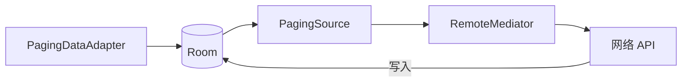

# Paging 3 分页加载详解

> 面试高频指数：高
> 列表分页加载是 App 标配功能，Paging 3 是官方标准方案。

## 1. Paging 3 架构总览

```text
数据源（网络/数据库）
    │
    ▼
PagingSource（按需加载一页）
    │
    ▼
PagingData（不可变数据流）
    │
    ▼
PagingDataAdapter（RecyclerView 适配器）
    │
    ▼
UI（自动处理加载更多/刷新/错误重试）
```

## 2. 核心组件

### 2.1 PagingSource（数据源）

```kotlin
class UserPagingSource(
    private val api: ApiService
) : PagingSource<Int, User>() {

    override suspend fun load(params: LoadParams<Int>): LoadResult<Int, User> {
        return try {
            // params.key：加载的页码（首次为 null）
            val page = params.key ?: 1
            val pageSize = params.loadSize

            val response = api.getUsers(page, pageSize)

            LoadResult.Page(
                data = response.users,
                prevKey = if (page > 1) page - 1 else null,   // 向前翻页
                nextKey = if (response.hasMore) page + 1 else null  // 向后翻页
            )
        } catch (e: IOException) {
            LoadResult.Error(e)      // 网络错误：可重试
        } catch (e: HttpException) {
            LoadResult.Error(e)
        }
    }

    // 列表更新/失效时重新加载
    override fun getRefreshKey(state: PagingState<Int, User>): Int? {
        return state.anchorPosition?.let { anchorPosition ->
            state.closestPageToPosition(anchorPosition)?.prevKey?.plus(1)
                ?: state.closestPageToPosition(anchorPosition)?.nextKey?.minus(1)
        }
    }
}
```

### 2.2 ViewModel 中组装 PagingData

```kotlin
class UserListViewModel(
    private val repository: UserRepository
) : ViewModel() {

    val pagingDataFlow = Pager(
        config = PagingConfig(
            pageSize = 20,             // 每页数量
            prefetchDistance = 5,       // 距底部多近时预加载
            enablePlaceholders = false  // 不使用占位符
        ),
        pagingSourceFactory = { repository.getUsersPagingSource() }
    ).flow
        .cachedIn(viewModelScope)      // 缓存，旋转屏幕不重新加载
}
```

### 2.3 UI 层展示

```kotlin
class UserListFragment : Fragment() {

    private val viewModel: UserListViewModel by viewModels()

    override fun onViewCreated(view: View, savedInstanceState: Bundle?) {
        val adapter = UserAdapter()

        viewLifecycleOwner.lifecycleScope.launch {
            viewModel.pagingDataFlow.collectLatest { pagingData ->
                adapter.submitData(pagingData)   // 提交分页数据
            }
        }

        // 加载状态处理
        viewLifecycleOwner.lifecycleScope.launch {
            adapter.loadStateFlow.collect { loadState ->
                when {
                    loadState.refresh is LoadState.Loading ->
                        showLoading()   // 首次加载
                    loadState.append is LoadState.Loading ->
                        showLoadMore()  // 加载更多
                    loadState.refresh is LoadState.Error ->
                        showError(loadState.refresh as LoadState.Error)
                    loadState.append is LoadState.Error ->
                        showRetry()
                }
            }
        }
    }
}
```

### 2.4 Adapter

```kotlin
class UserAdapter :
    PagingDataAdapter<User, UserAdapter.UserViewHolder>(UserDiffCallback) {

    override fun onCreateViewHolder(parent: ViewGroup, viewType: Int): UserViewHolder {
        val binding = ItemUserBinding.inflate(LayoutInflater.from(parent.context), parent, false)
        return UserViewHolder(binding)
    }

    override fun onBindViewHolder(holder: UserViewHolder, position: Int) {
        holder.bind(getItem(position))   // getItem 自动处理占位符
    }

    object UserDiffCallback : DiffUtil.ItemCallback<User>() {
        override fun areItemsTheSame(oldItem: User, newItem: User) = oldItem.id == newItem.id
        override fun areContentsTheSame(oldItem: User, newItem: User) = oldItem == newItem
    }
}
```

## 3. RemoteMediator：网络 + 数据库缓存

推荐架构：**数据库作为单一数据源**，网络结果先存库再刷新 UI。

```kotlin
class UserRemoteMediator(
    private val db: AppDatabase,
    private val api: ApiService
) : RemoteMediator<Int, User>() {

    override suspend fun load(
        loadType: LoadType,
        state: PagingState<Int, User>
    ): MediatorResult {
        return try {
            val page = when (loadType) {
                LoadType.REFRESH -> 1
                LoadType.PREPEND -> return MediatorResult.Success(
                    endOfPaginationReached = true
                )
                LoadType.APPEND -> {
                    val lastUser = state.lastItemOrNull()
                    // 从数据库读取的页码元信息
                    getPageKey(lastUser) ?: return MediatorResult.Success(true)
                }
            }

            val response = api.getUsers(page, state.config.pageSize)

            db.withTransaction {
                if (loadType == LoadType.REFRESH) db.userDao().clearAll()
                db.userDao().insertAll(response.users)
            }

            MediatorResult.Success(
                endOfPaginationReached = response.users.isEmpty()
            )
        } catch (e: Exception) {
            MediatorResult.Error(e)
        }
    }
}

// 使用
val pagingDataFlow = Pager(
    config = PagingConfig(pageSize = 20),
    remoteMediator = UserRemoteMediator(db, api),
    pagingSourceFactory = { db.userDao().pagingSource() }
).flow
```

**架构图**：



## 4. LoadState 详解

| LoadState 类型 | 含义 |
| --- | --- |
| `refresh` | 首次加载/刷新（整个列表） |
| `prepend` | 向前加载（更早数据） |
| `append` | 向后加载（更多数据） |

每个都有 `Loading` / `NotLoading` / `Error` 三种状态。

```kotlin
// 组合头部加载状态（下拉刷新指示器）
adapter.addLoadStateListener { combinedLoadStates ->
    val refreshState = combinedLoadStates.refresh
    if (refreshState is LoadState.Loading) {
        swipeRefresh.isRefreshing = true
    } else {
        swipeRefresh.isRefreshing = false
    }
}
```

## 5. 高频面试题

**Q1：Paging 3 相比 Paging 2 的核心变化？**
A：① `DataSource` → `PagingSource`（更简单，支持 suspend 协程）；② 分离了
`PagingData`（数据流）与 UI；③ 新增 `RemoteMediator` 统一处理网络+数据库；
④ 支持 Flow（`Pager.flow`），与协程架构无缝集成。

**Q2：cachedIn 的作用？**
A：缓存 `PagingData`，旋转屏幕/重建 UI 时**不重新加载网络**。但注意：它缓存的是
"数据流+已加载页面"，如果数据过期需要手动刷新（invalidating）。

**Q3：getRefreshKey 的作用？**
A：当列表数据失效（如刷新、删改）需要重新加载时，决定**回到哪一页**。
默认回到锚点页（当前可见位置附近），避免刷新后跳回第一页。

**Q4：enablePlaceholders 设 false 有什么影响？**
A：false 时未加载区域不显示占位 item，数据项较少、加载更快；但滚动条长度不准确、
不支持按位置跳转。true 时占位符占位但需 item 数预估（totalCount 未知时无法用）。

**Q5：RemoteMediator 的 PREPEND 何时返回 endOfPaginationReached？**
A：向前加载（更早数据）通常不支持，直接返回 `Success(true)` 表示没有更早数据，
避免无限循环请求。

## 6. 小结

- 核心链路：PagingSource → PagingData → PagingDataAdapter。
- 推荐架构：Room 单一数据源 + RemoteMediator 同步网络。
- 关键 API：`cachedIn`、`getRefreshKey`、`LoadState`、`DiffUtil`。
