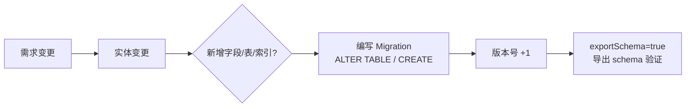

# Room 高级进阶

> 从"能用 Room"到"用好 Room":实体关系建模、复杂类型转换、安全迁移、事务与 Flow 响应式查询,以及性能陷阱。本文是 Room 的中高级完全指南。

## 一、实体关系建模

### 1.1 一对多:嵌套对象与关系

"一个用户多只宠物"是典型的一对多。建表时用外键表达归属关系，注意两点：`onDelete = CASCADE` 让删用户时宠物级联删除；**外键列必须建索引**，否则 JOIN 查询会全表扫描：

::: code-tabs

@tab:active Java

```java
@Entity(tableName = "users")
public class User {
    @PrimaryKey
    public long id;
    public String name;

    public User(long id, String name) {
        this.id = id;
        this.name = name;
    }
}

@Entity(tableName = "pets",
    foreignKeys = @ForeignKey(
        entity = User.class,
        parentColumns = {"id"},
        childColumns = {"ownerId"},
        onDelete = ForeignKey.CASCADE
    ),
    indices = {@Index("ownerId")}   // 外键查询必须建索引!
)
public class Pet {
    @PrimaryKey
    public long id;
    public long ownerId;
    public String name;

    public Pet(long id, long ownerId, String name) {
        this.id = id;
        this.ownerId = ownerId;
        this.name = name;
    }
}
```

@tab Kotlin

```kotlin
@Entity(tableName = "users")
data class User(
    @PrimaryKey val id: Long,
    val name: String
)

@Entity(tableName = "pets",
    foreignKeys = [ForeignKey(
        entity = User::class,
        parentColumns = ["id"],
        childColumns = ["ownerId"],
        onDelete = ForeignKey.CASCADE
    )],
    indices = [Index("ownerId")]   // 外键查询必须建索引!
)
data class Pet(
    @PrimaryKey val id: Long,
    val ownerId: Long,
    val name: String
)
```

:::

### 1.2 关系查询:@Embedded + @Relation

建好表后怎么"一次查出用户和他的宠物"？`@Embedded` 把 User 平铺进结果对象，`@Relation` 声明关联列，两者组合就是一条查询。**必须加 `@Transaction`**——@Relation 内部会执行多次 SQL，需要原子性：

::: code-tabs

@tab:active Java

```java
// 查询结果:一个用户 + 其所有宠物
public class UserWithPets {
    @Embedded
    public User user;

    @Relation(parentColumn = "id", entityColumn = "ownerId")
    public List<Pet> pets;
}

@Dao
public interface UserDao {
    @Transaction   // 一对多查询必须加 @Transaction(多次查询原子化)
    @Query("SELECT * FROM users WHERE id = :id")
    UserWithPets getUserWithPets(long id);   // suspend → Java 同步/Executor 调用
}
```

@tab Kotlin

```kotlin
// 查询结果:一个用户 + 其所有宠物
data class UserWithPets(
    @Embedded val user: User,
    @Relation(parentColumn = "id", entityColumn = "ownerId")
    val pets: List<Pet>
)

@Dao
interface UserDao {
    @Transaction   // 一对多查询必须加 @Transaction(多次查询原子化)
    @Query("SELECT * FROM users WHERE id = :id")
    suspend fun getUserWithPets(id: Long): UserWithPets?
}
```

:::

### 1.3 多对多:关联表

"我关注了谁"这种多对多关系，需要一张关联表存"谁关注了谁"，再 JOIN 查出结果：

::: code-tabs

@tab:active Java

```java
@Entity(tableName = "user_follow")
public class UserFollow {
    @PrimaryKey(autoGenerate = true)
    public long id;
    public long followerId;
    public long followeeId;

    public UserFollow(long followerId, long followeeId) {
        this.followerId = followerId;
        this.followeeId = followeeId;
    }
}

// 查询我关注的所有用户
@Query("SELECT users.* FROM users " +
       "INNER JOIN user_follow ON users.id = user_follow.followeeId " +
       "WHERE user_follow.followerId = :followerId")
List<User> getFollowing(long followerId);
```

@tab Kotlin

```kotlin
@Entity(tableName = "user_follow")
data class UserFollow(
    @PrimaryKey(autoGenerate = true) val id: Long,
    val followerId: Long,
    val followeeId: Long
)

// 查询我关注的所有用户
@Query("""
    SELECT users.* FROM users
    INNER JOIN user_follow ON users.id = user_follow.followeeId
    WHERE user_follow.followerId = :followerId
""")
fun getFollowing(followerId: Long): List<User>
```

:::

## 二、TypeConverter 类型转换

SQLite 只存基础类型，`List`、`Date` 这类复杂类型要用 `TypeConverter` 桥接——下面把 `List<String>` 序列化成 JSON 字符串存储：

::: code-tabs

@tab:active Java

```java
// 存储 List<String> 为 JSON 字符串
public class StringListConverter {
    @TypeConverter
    public String fromList(List<String> value) {
        return new Gson().toJson(value);
    }

    @TypeConverter
    public List<String> toList(String value) {
        Type type = new TypeToken<List<String>>() {}.getType();
        return new Gson().fromJson(value, type);
    }
}

@Database(
    entities = {User.class},
    version = 2,
    exportSchema = true
)
@TypeConverters(StringListConverter.class)   // 全局注册
public abstract class AppDatabase extends RoomDatabase {
    public abstract UserDao userDao();
}
```

@tab Kotlin

```kotlin
// 存储 List<String> 为 JSON 字符串
class StringListConverter {
    @TypeConverter
    fun fromList(value: List<String>): String = Gson().toJson(value)

    @TypeConverter
    fun toList(value: String): List<String> =
        Gson().fromJson(value, object : TypeToken<List<String>>() {}.type)
}

@Database(
    entities = [User::class],
    version = 2,
    exportSchema = true
)
@TypeConverters(StringListConverter::class)   // 全局注册
abstract class AppDatabase : RoomDatabase() {
    abstract fun userDao(): UserDao
}
```

:::

常见场景一览：

| 场景 | Converter 示例 |
|------|---------------|
| List/Set/Map | JSON 序列化 |
| Date | Long 时间戳 |
| UUID | String |
| 枚举 | String/Int |
| 自定义对象 | 平铺为多个字段或 JSON |

>  TypeConverter 常见坑:查询条件也要转换(如 `WHERE date = :date` 传 Date 对象);转换在 Java/Kotlin 层进行,大数据量时注意性能。

## 三、数据库迁移

### 3.1 为什么必须写迁移

> 直接改实体再 `fallbackToDestructiveMigration()` 会**清空用户数据**。生产应用必须提供 Migration 保数据。

迁移就是给数据库"打补丁"而不是"重建"——`ALTER TABLE` 加列、`CREATE TABLE` 建新表，逐版本递进：

::: code-tabs

@tab:active Java

```java
// v1 → v2:新增 age 列
public static final Migration MIGRATION_1_2 = new Migration(1, 2) {
    @Override
    public void migrate(SupportSQLiteDatabase db) {
        db.execSQL("ALTER TABLE users ADD COLUMN age INTEGER NOT NULL DEFAULT 0");
    }
};

// v2 → v3:新建表
public static final Migration MIGRATION_2_3 = new Migration(2, 3) {
    @Override
    public void migrate(SupportSQLiteDatabase db) {
        db.execSQL("CREATE TABLE pets (id INTEGER PRIMARY KEY NOT NULL, ownerId INTEGER NOT NULL, name TEXT)");
    }
};

Room.databaseBuilder(context, AppDatabase.class, "app.db")
    .addMigrations(MIGRATION_1_2, MIGRATION_2_3)
    .build();
```

@tab Kotlin

```kotlin
// v1 → v2:新增 age 列
val MIGRATION_1_2 = object : Migration(1, 2) {
    override fun migrate(db: SupportSQLiteDatabase) {
        db.execSQL("ALTER TABLE users ADD COLUMN age INTEGER NOT NULL DEFAULT 0")
    }
}

// v2 → v3:新建表
val MIGRATION_2_3 = object : Migration(2, 3) {
    override fun migrate(db: SupportSQLiteDatabase) {
        db.execSQL("CREATE TABLE pets (id INTEGER PRIMARY KEY NOT NULL, ownerId INTEGER NOT NULL, name TEXT)")
    }
}

Room.databaseBuilder(context, AppDatabase::class.java, "app.db")
    .addMigrations(MIGRATION_1_2, MIGRATION_2_3)
    .build()
```

:::

### 3.2 迁移原则

实体一改，迁移流程就启动了——从需求变更到 schema 验证的完整链路：



| 原则 | 说明 |
|------|------|
| 版本号单调递增 | 每个版本一个 Migration |
| 迁移幂等 | 重复执行不报错(IF NOT EXISTS) |
| 保留旧数据 | ALTER 而非重建表 |
| schema 导出 | exportSchema=true 配合 room-compiler 生成 json 校验 |
| 测试迁移 | MigrationTestHelper 自动化验证 |

## 四、事务与性能

### 4.1 事务使用

"转账扣分"这类多步写操作，任何一步失败都要整体回滚——用 `@Transaction` 包裹：

::: code-tabs

@tab:active Java

```java
@Dao
public interface UserDao {
    // suspend 事务方法 → Java 中用 default 方法包装，保证原子性
    @Transaction
    default void transferPoints(long from, long to, int amount) {
        // 两个操作原子执行,要么都成功要么都回滚
        subtractPoints(from, amount);
        addPoints(to, amount);
    }

    @Query("UPDATE users SET points = points - :amount WHERE id = :from")
    void subtractPoints(long from, int amount);

    @Query("UPDATE users SET points = points + :amount WHERE id = :to")
    void addPoints(long to, int amount);
}
```

@tab Kotlin

```kotlin
@Dao
interface UserDao {
    @Transaction
    suspend fun transferPoints(from: Long, to: Long, amount: Int) {
        // 两个操作原子执行,要么都成功要么都回滚
        subtractPoints(from, amount)
        addPoints(to, amount)
    }

    @Query("UPDATE users SET points = points - :amount WHERE id = :from")
    suspend fun subtractPoints(from: Long, amount: Int)

    @Query("UPDATE users SET points = points + :amount WHERE id = :to")
    suspend fun addPoints(to: Long, amount: Int)
}
```

:::

是否需要事务，取决于"操作是否涉及多步"：

| 场景 | 是否用事务 |
|------|-----------|
| 单条写操作 | ✗ 不需要 |
| 多条写操作 | ✓ 必须(原子性) |
| 一对多关系查询 | ✓ @Transaction 避免中间态 |
| 批量插入 | ✓ 提升性能(单事务) |

### 4.2 批量操作性能

循环单条插入每条都开一个事务，慢得可怕；一次性 `insertAll` 合并成单事务，能快 10-50 倍：

::: code-tabs

@tab:active Java

```java
// ✗ 循环单条插入(每条一个事务,慢)
for (User user : users) {
    dao.insert(user);
}

// ✓ 批量插入(单事务,快 10-50 倍)
dao.insertAll(users);

@Dao
public interface UserDao {
    @Insert(onConflict = OnConflictStrategy.REPLACE)
    void insertAll(List<User> users);
}
```

@tab Kotlin

```kotlin
// ✗ 循环单条插入(每条一个事务,慢)
users.forEach { dao.insert(it) }

// ✓ 批量插入(单事务,快 10-50 倍)
dao.insertAll(users)

@Dao
interface UserDao {
    @Insert(onConflict = OnConflictStrategy.REPLACE)
    suspend fun insertAll(users: List<User>)
}
```

:::

## 五、Flow 响应式查询

DAO 方法返回 `Flow` 后，**任何写操作都会自动触发重新查询**，UI 订阅即自动刷新：

::: code-tabs

@tab:active Java

```java
@Dao
public interface UserDao {
    // 返回 Flow:表数据变化自动重新查询
    @Query("SELECT * FROM users WHERE id = :id")
    Flow<User> observeUser(long id);

    @Query("SELECT * FROM users ORDER BY createTime DESC")
    Flow<List<User>> observeAllUsers();
}

// ViewModel 中（对应 stateIn：Java 侧用 LiveData 承载最新值）
public class UserViewModel extends ViewModel {
    private final MutableLiveData<List<User>> users = new MutableLiveData<>();

    public UserViewModel(UserDao dao) {
        // 对应 observeAllUsers().map{...}.stateIn(...)：
        // 通过协程桥接收集 Flow 后 setValue(转换结果)，或直接用 Room 的 LiveData 返回
    }

    public LiveData<List<User>> getUsers() {
        return users;
    }
}
```

@tab Kotlin

```kotlin
@Dao
interface UserDao {
    // 返回 Flow:表数据变化自动重新查询
    @Query("SELECT * FROM users WHERE id = :id")
    fun observeUser(id: Long): Flow<User?>

    @Query("SELECT * FROM users ORDER BY createTime DESC")
    fun observeAllUsers(): Flow<List<User>>
}

// ViewModel 中
class UserViewModel(private val dao: UserDao) : ViewModel() {
    val users: StateFlow<List<User>> = dao.observeAllUsers()
        .map { list -> list.map { it.copy(name = it.name.uppercase()) } }
        .stateIn(viewModelScope, SharingStarted.WhileSubscribed(5000), emptyList())
}
```

:::

> Flow 查询的优势:任何 `@Insert/@Update/@Delete` 变更都会**自动触发重新查询**,UI 自动刷新,无需手动 notify。

## 六、性能优化清单

性能优化集中在"查询怎么走索引、写怎么合并事务"两点：

| 优化 | 说明 |
|------|------|
| 索引 | WHERE/JOIN 字段加 `@Index` |
| 主键合理 | 业务主键优先,避免自增主键 JOIN |
| 避免 N+1 查询 | @Relation 一次取全部 |
| 批量事务 | 批量插入/更新合并事务 |
| 只查所需列 | 不要 SELECT * 全表 |
| Paging 配合 | 大表用 PagingSource 分页 |
| 避免转换开销 | Converter 少做复杂序列化 |
| 关闭调试日志 | 生产关闭 Room 日志 |

## 七、高频面试题

### Q1：Room 相比 SQLiteOpenHelper/GreenDAO 的优势?
::: details 查看答案
① 编译期检查:SQL 语法、表名、列名在编译时校验,KSP 生成代码,错误早发现;② 与协程/Flow 深度集成:挂起函数、Flow 响应式查询、事务;③ 官方维护:与 Architecture Components 生态(ViewModel/WorkManager)无缝衔接;④ 迁移体系完善:Migration 机制保数据;⑤ 自动生成样板代码:DAO/Entity 定义即用。缺点:灵活性不如裸 SQLite(复杂 SQL 场景)。
:::

### Q2：Room 的 @Relation 是做什么的?为什么要加 @Transaction?
::: details 查看答案
@Relation 用于一对多/多对一关联查询,与 @Embedded 组合,把"用户+宠物列表"作为一个结果对象返回。加 @Transaction 是因为 @Relation 内部会执行多次 SQL 查询(先查用户再查宠物),@Transaction 保证这些查询在同一个事务中执行,避免并发修改导致的数据不一致。
:::

### Q3：数据库升级时为什么要写 Migration?fallbackToDestructiveMigration 有什么问题?
::: details 查看答案
数据库版本变化时,如果没提供对应 Migration,Room 默认抛异常;fallbackToDestructiveMigration 会直接删除旧表重建,导致**用户数据全部丢失**,生产环境不可接受。正确做法:每个版本变更编写 Migration(ALTER TABLE 等),并通过 MigrationTestHelper 写测试验证迁移后数据完整。
:::

### Q4：Room 的 Flow 查询是怎么自动更新的?
::: details 查看答案
Room 对 Flow 查询建立 InvalidationTracker:当数据库有任何写操作(Insert/Update/Delete)时,Room 记录失效的表;Flow 收到失效信号后重新执行查询,并把结果发射给收集者。配合 StateFlow.stateIn 可缓存最新值。注意:数据量大的查询每次变化都会重查,可配合 distinctUntilChanged 或分页优化。
:::

### Q5：Room 如何避免主线程卡顿?有哪些性能陷阱?
::: details 查看答案
① 禁止主线程数据库操作:DAO 方法用 suspend 或返回 Flow/LiveData(自动切 IO);② 陷阱:无索引的 JOIN 查询慢、循环单条插入慢(应批量)、@Relation 不加 @Transaction、SELECT * 全表加载、Converter 里做重序列化;③ 优化:字段加索引、批量事务、只查所需列、大表分页。SQLite 是磁盘 IO,复杂查询耗时可能达几百毫秒,必须异步。
:::

## 小结

- 关系建模:@Embedded + @Relation(一对多)/ 关联表(多对多)
- TypeConverter 桥接复杂类型,注意查询条件转换
- Migration 保数据,exportSchema 导出 schema 做版本校验
- @Transaction 保证原子性,批量操作合并事务提速
- Flow 查询自动响应数据库变更,UI 无需手动刷新
- 索引/批量/只查所需列是三大性能基石

> 进阶阅读：[Room 数据库详解](/jetpack/room-datastore/room-guide.md) | [DataStore 使用指南](/jetpack/room-datastore/datastore-guide.md) | [Paging 3 分页加载](/jetpack/paging-navigation/paging3.md)
