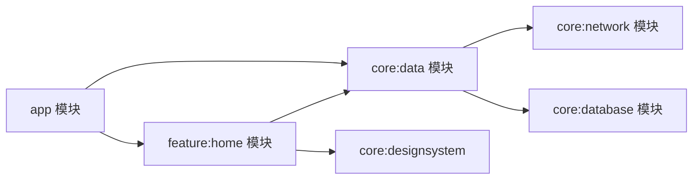

# Hilt 依赖注入进阶

> 从"会用 @Inject/@Module"到"设计好依赖图":多模块组织、自定义 Qualifier/Component、与协程结合、测试替身注入。本文是 Hilt 进阶完全指南。

## 一、Hilt 核心回顾

```mermaid
flowchart TD
    A[Hilt] --> B[组件层级<br>SingletonComponent → ActivityComponent → ...]
    A --> C[绑定方式<br>@Inject 构造 / @Provides 模块]
    A --> D[作用域<br>@Singleton / @ActivityScoped ...]
    A --> E[限定符<br>@Named / 自定义 @Qualifier]
    A --> F[注入点<br>Activity/Fragment/ViewModel/Service]
```

| 组件 | 生命周期 | 对应作用域 |
|------|---------|-----------|
| SingletonComponent | Application | `@Singleton` |
| ActivityRetainedComponent | 配置变更保留 | `@ActivityRetainedScoped` |
| ActivityComponent | Activity | `@ActivityScoped` |
| ViewModelComponent | ViewModel | `@ViewModelScoped` |
| FragmentComponent | Fragment | `@FragmentScoped` |

## 二、多模块组织

### 2.1 模块间依赖



```kotlin
// core:network 模块:网络层只暴露接口
interface ApiService {
    suspend fun fetchUsers(): List<User>
}

// 提供绑定的模块(在 network 模块内)
@Module
@InstallIn(SingletonComponent::class)
object NetworkModule {
    @Provides
    @Singleton
    fun provideOkHttpClient(): OkHttpClient = OkHttpClient.Builder()
        .connectTimeout(10, TimeUnit.SECONDS)
        .build()

    @Provides
    @Singleton
    fun provideRetrofit(client: OkHttpClient): Retrofit =
        Retrofit.Builder()
            .baseUrl(BuildConfig.BASE_URL)
            .client(client)
            .addConverterFactory(GsonConverterFactory.create())
            .build()
}
```

### 2.2 接口与实现分离

```kotlin
// 业务接口
interface UserRepository {
    suspend fun getUsers(): List<User>
}

// 远程实现
class RemoteUserRepository @Inject constructor(
    private val api: ApiService
) : UserRepository {
    override suspend fun getUsers() = api.fetchUsers()
}

// 本地实现(测试/离线模式)
class LocalUserRepository @Inject constructor(
    private val dao: UserDao
) : UserRepository {
    override suspend fun getUsers() = dao.getAll()
}

// 绑定模块:运行时选择实现
@Module
@InstallIn(SingletonComponent::class)
abstract class RepositoryModule {
    @Binds
    @Singleton
    abstract fun bindUserRepository(impl: RemoteUserRepository): UserRepository
}
```

## 三、自定义 Qualifier 与 Named

```kotlin
// 自定义限定符:区分同一类型的多个绑定
@Qualifier
@Retention(AnnotationRetention.RUNTIME)
annotation class BaseUrl

@Qualifier
@Retention(AnnotationRetention.RUNTIME)
annotation class DebugInterceptor

@Module
@InstallIn(SingletonComponent::class)
object NetworkModule {
    @Provides
    @Singleton
    @BaseUrl
    fun provideBaseUrl(): String = "https://api.example.com/"

    @Provides
    @Singleton
    @Named("cdn")          // 或用 @Named
    fun provideCdnUrl(): String = "https://cdn.example.com/"

    @Provides
    @Singleton
    @DebugInterceptor
    fun provideInterceptor(): Interceptor = HttpLoggingInterceptor().apply {
        level = HttpLoggingInterceptor.Level.BODY
    }
}

// 使用
class ApiClient @Inject constructor(
    @BaseUrl private val baseUrl: String,
    @Named("cdn") private val cdnUrl: String,
    @DebugInterceptor private val interceptor: Interceptor
)
```

| 方式 | 适用 | 说明 |
|------|------|------|
| `@Named("tag")` | 快速区分 | 字符串易错,不推荐复杂场景 |
| 自定义 `@Qualifier` | 语义化区分 | 类型安全、可读性好 |

## 四、与协程结合

```kotlin
// 自定义 dispatcher 绑定
@Qualifier
annotation class IoDispatcher

@Module
@InstallIn(SingletonComponent::class)
object DispatcherModule {
    @Provides
    @IoDispatcher
    fun provideIoDispatcher(): CoroutineDispatcher = Dispatchers.IO
}

// 注入使用
class UserRepository @Inject constructor(
    private val api: ApiService,
    @IoDispatcher private val ioDispatcher: CoroutineDispatcher
) {
    suspend fun getUsers(): List<User> = withContext(ioDispatcher) {
        api.fetchUsers()
    }
}
```

### 5.0 @HiltViewModel

```kotlin
@HiltViewModel
class HomeViewModel @Inject constructor(
    private val repository: UserRepository,
    private val savedStateHandle: SavedStateHandle
) : ViewModel() {

    val users = repository.getUsers()
        .stateIn(viewModelScope, SharingStarted.WhileSubscribed(5000), emptyList())
}

// Compose 中注入
@Composable
fun HomeScreen(viewModel: HomeViewModel = hiltViewModel()) {
    val users by viewModel.users.collectAsState()
    // ...
}

// 或传统 View 中
class HomeFragment : Fragment() {
    private val viewModel: HomeViewModel by viewModels()
}
```

## 五、测试替身注入

```kotlin
// 测试模块:替换网络为 Fake
@Module
@TestInstallIn(
    components = [SingletonComponent::class],
    replaces = [NetworkModule::class]   // 替换生产模块
)
object FakeNetworkModule {
    @Provides
    @Singleton
    fun provideApiService(): ApiService = FakeApiService()   // 内存假实现
}

// 测试中加载
@HiltAndroidTest
class UserRepositoryTest {
    @get:Rule
    val hiltRule = HiltAndroidRule(this)

    @Inject
    lateinit var repository: UserRepository

    @Before
    fun setup() {
        hiltRule.inject()
    }

    @Test
    fun getUsers_returnsFakeData() = runBlocking {
        val users = repository.getUsers()
        assertEquals(3, users.size)
    }
}
```

## 六、常见错误与排查

| 错误 | 原因 | 解决 |
|------|------|------|
| `Dagger/MissingBinding` | 依赖未提供 | 检查 @Inject/@Provides/@Binds |
| `Cannot be provided without an @Provides` | 接口无绑定 | 添加 @Binds 模块 |
| `Duplicate bindings` | 同一类型两个绑定 | 用 @Qualifier 区分 |
| `cannot be scoped with @Singleton` | 无对应组件 | @InstallIn(SingletonComponent) |
| `KAPT/KSP 生成失败` | 注解处理配置问题 | 检查 kapt 插件与依赖 |
| `HiltViewModel 无法注入` | 未加 @HiltViewModel | 添加注解并继承 ViewModel |

## 七、高频面试题

### Q1：Hilt 的组件层级是怎样的?为什么需要作用域?
::: details 查看答案
Hilt 组件层级:SingletonComponent(Application) → ActivityRetainedComponent → ActivityComponent → FragmentComponent,还有 ViewModelComponent/ServiceComponent 等。作用域让绑定生命周期与组件一致:@Singleton 全局单例,@ActivityScoped 随 Activity 销毁重建。无作用域绑定每次注入都新建。正确作用域可控制内存占用,防止长生命周期持有短生命周期引用(如 Activity 泄漏)。
:::

### Q2：@Binds 与 @Provides 的区别?
::: details 查看答案
@Binds:用于接口绑定到实现类,方法只声明参数,实现类需有 @Inject 构造(纯声明,无代码);@Provides:用于工厂方法提供绑定,可在方法中写构建逻辑(如 Retrofit/OkHttp 创建)。@Binds 更简洁且编译期效率更高,能提供实现的必须是接口或抽象类。两者都要放在 @Module 抽象类/object 中,并用 @InstallIn 指定组件。
:::

### Q3：什么时候用自定义 Qualifier?和 @Named 有什么区别?
::: details 查看答案
当同一类型(如 String/Interceptor)需要多个不同绑定时必须用限定符区分:@Named 是 Dagger 内置的字符串限定符,简单但字符串拼写错误只能运行时发现;自定义 @Qualifier 注解语义清晰、编译期校验,推荐用于多 BaseUrl、多 Dispatcher、多 Repository 实现等场景。实际项目常混合使用。
:::

### Q4：Hilt 如何支持多模块项目?
::: details 查看答案
① 每个模块用 @InstallIn 指定组件,绑定可跨模块注入;② 接口与实现分离:核心模块只暴露接口,实现模块提供 @Binds;③ 避免循环依赖:模块间依赖单向,用 interface 解耦;④ 功能模块可配置性:用 @Module(includes=...) 组合绑定;⑤ 测试用 @TestInstallIn replaces 生产模块替换 Fake 实现。关键是依赖方向一致,接口定义在底层模块。
:::

### Q5：Hilt 与协程/测试怎么配合?
::: details 查看答案
协程:通过 @Qualifier 绑定 Dispatchers(如 @IoDispatcher),便于测试时替换为 TestDispatcher;Repository 方法用 suspend + withContext 切线程。测试:HiltAndroidTest + HiltAndroidRule 初始化依赖图;@TestInstallIn 用 Fake 模块替换网络/数据库;ViewModel 测试用 hiltViewModel() 注入真实 ViewModel + 假 Repository;标准单元测试可用 @UninstallModules 或直接 new 构造(推荐后者更轻量)。
:::

## 小结

- 组件层级决定绑定生命周期,作用域控制单例与释放
- 多模块:接口下沉、@Binds 绑定、@InstallIn 组装
- 自定义 Qualifier 解决同类型多绑定
- 协程 Dispatcher 通过 Qualifier 注入便于测试替换
- @HiltViewModel 无缝桥接 Compose/ViewModel
- @TestInstallIn 实现依赖图级测试替身

> 进阶阅读：[Hilt 依赖注入](/jetpack/workmanager-hilt/hilt.md) | [WorkManager 后台任务](/jetpack/workmanager-hilt/workmanager.md) | [ViewModel 源码解析](/jetpack/lifecycle-viewmodel/viewmodel-source.md)
