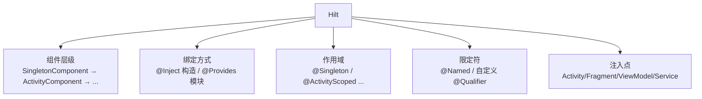
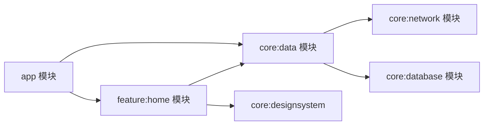

# Hilt 依赖注入进阶

> 从"会用 @Inject/@Module"到"设计好依赖图":多模块组织、自定义 Qualifier/Component、与协程结合、测试替身注入。本文是 Hilt 进阶完全指南。

## 一、Hilt 核心回顾



> Hilt 的依赖图可以概括为五个要素：**组件（Component）** 决定绑定的作用域与生命周期，**绑定方式（@Inject/@Provides）** 决定对象如何创建，**作用域**控制单例的存活范围，**限定符**解决同一类型的多绑定问题，**注入点**则是依赖被消费的位置（Activity、Fragment、ViewModel、Service）。五者相互配合——组件提供"容器"，绑定与作用域决定"内容"及其"寿命"，限定符保证"取用无误"。

| 组件 | 生命周期 | 对应作用域 |
|------|---------|-----------|
| SingletonComponent | Application | `@Singleton` |
| ActivityRetainedComponent | 配置变更保留 | `@ActivityRetainedScoped` |
| ActivityComponent | Activity | `@ActivityScoped` |
| ViewModelComponent | ViewModel | `@ViewModelScoped` |
| FragmentComponent | Fragment | `@FragmentScoped` |

值得注意的是：**ViewModelComponent 独立于 ActivityComponent 存在**，它依托于 `ActivityRetainedComponent`（配置变更时保留），因此 ViewModel 不会因屏幕旋转而重建；而 FragmentComponent 是 ActivityComponent 的子组件，生命周期随 Fragment 走。理解这张表的层级关系是设计正确作用域的前提——如果给一个应当随页面销毁的对象打上 `@Singleton`，就会造成泄漏。

## 二、多模块组织

### 2.1 模块间依赖

在真实项目中，依赖注入的价值体现在多模块协作上：`app` 壳工程负责组装，`feature` 模块提供页面能力，`core` 模块沉淀可复用的数据与基础设施。模块间必须保持**依赖方向一致**——上层（app/feature）依赖下层（core），下层绝不反向依赖上层，否则会产生循环依赖，Gradle 构建直接失败。这也是"接口下沉"原则的由来：接口定义在底层模块，实现与绑定由上层提供。



上图中的依赖关系体现了两个关键实践：一是 `core:network` 与 `core:database` 彼此互不依赖，数据源实现完全解耦；二是 `feature:home` 同时依赖多个 core 模块却不会被 app 直接引用，页面能力以模块为单位独立演进。当某个依赖方向需要"反向"时，正确的做法不是打破依赖方向，而是把共享的接口抽象下沉到更底层的模块。

::: code-tabs

@tab:active Java

```java
// core:network 模块:网络层只暴露接口
// （suspend 方法在 Java 中体现为带 Continuation 参数或回调）
public interface ApiService {
    List<User> fetchUsers();
}

// 提供绑定的模块(在 network 模块内)
@Module
@InstallIn(SingletonComponent.class)
public class NetworkModule {

    @Provides
    @Singleton
    public static OkHttpClient provideOkHttpClient() {
        return new OkHttpClient.Builder()
                .connectTimeout(10, TimeUnit.SECONDS)
                .build();
    }

    @Provides
    @Singleton
    public static Retrofit provideRetrofit(OkHttpClient client) {
        return new Retrofit.Builder()
                .baseUrl(BuildConfig.BASE_URL)
                .client(client)
                .addConverterFactory(GsonConverterFactory.create())
                .build();
    }
}
```

@tab Kotlin

```kotlin
// core:network 模块:网络层只暴露接口
interface ApiService {
    suspend fun fetchUsers(): List<User>
}

// 提供绑定的模块(在 network 模块内)
@Module
@InstallIn(SingletonComponent::class)
object NetworkModule {
    @Provides
    @Singleton
    fun provideOkHttpClient(): OkHttpClient = OkHttpClient.Builder()
        .connectTimeout(10, TimeUnit.SECONDS)
        .build()

    @Provides
    @Singleton
    fun provideRetrofit(client: OkHttpClient): Retrofit =
        Retrofit.Builder()
            .baseUrl(BuildConfig.BASE_URL)
            .client(client)
            .addConverterFactory(GsonConverterFactory.create())
            .build()
}
```

:::

### 2.2 接口与实现分离

模块解耦的最终形态是"**依赖接口，不依赖实现**"：业务层只认识 `UserRepository` 接口，至于数据来自网络（`RemoteUserRepository`）还是本地数据库（`LocalUserRepository`），由运行时决定。Hilt 用 `@Binds` 完成这种绑定——它把接口与某个 `@Inject` 构造的实现类连接起来，方法体为空、纯粹声明，比 `@Provides` 更简洁，也保留了编译期校验能力。切换实现时只需改 `RepositoryModule` 一处，业务代码零改动：

::: code-tabs

@tab:active Java

```java
// 业务接口（suspend → Java 同步/回调）
public interface UserRepository {
    List<User> getUsers();
}

// 远程实现
public class RemoteUserRepository implements UserRepository {
    private final ApiService api;

    @Inject
    public RemoteUserRepository(ApiService api) {
        this.api = api;
    }

    @Override
    public List<User> getUsers() {
        return api.fetchUsers();
    }
}

// 本地实现(测试/离线模式)
public class LocalUserRepository implements UserRepository {
    private final UserDao dao;

    @Inject
    public LocalUserRepository(UserDao dao) {
        this.dao = dao;
    }

    @Override
    public List<User> getUsers() {
        return dao.getAll();
    }
}

// 绑定模块:运行时选择实现
@Module
@InstallIn(SingletonComponent.class)
public abstract class RepositoryModule {
    @Binds
    @Singleton
    public abstract UserRepository bindUserRepository(RemoteUserRepository impl);
}
```

@tab Kotlin

```kotlin
// 业务接口
interface UserRepository {
    suspend fun getUsers(): List<User>
}

// 远程实现
class RemoteUserRepository @Inject constructor(
    private val api: ApiService
) : UserRepository {
    override suspend fun getUsers() = api.fetchUsers()
}

// 本地实现(测试/离线模式)
class LocalUserRepository @Inject constructor(
    private val dao: UserDao
) : UserRepository {
    override suspend fun getUsers() = dao.getAll()
}

// 绑定模块:运行时选择实现
@Module
@InstallIn(SingletonComponent::class)
abstract class RepositoryModule {
    @Binds
    @Singleton
    abstract fun bindUserRepository(impl: RemoteUserRepository): UserRepository
}
```

:::

## 三、自定义 Qualifier 与 Named

当同一个类型需要提供多个不同的值（比如两个 `String`：BaseUrl 与 CDN 地址，或两个 `Interceptor`：日志拦截与鉴权拦截）时，仅靠类型已经无法区分，此时必须引入**限定符**。`@Named` 是 Dagger 内置的字符串限定符，开箱即用但靠字符串匹配，拼写错误要到运行时才暴露；自定义 `@Qualifier` 注解则把语义固化在类型层面，编译期即可校验，是生产环境的推荐做法。下面演示两种方式共存时的写法：

::: code-tabs

@tab:active Java

```java
// 自定义限定符:区分同一类型的多个绑定
@Qualifier
@Retention(RetentionPolicy.RUNTIME)
public @interface BaseUrl {
}

@Qualifier
@Retention(RetentionPolicy.RUNTIME)
public @interface DebugInterceptor {
}

@Module
@InstallIn(SingletonComponent.class)
public class NetworkModule {

    @Provides
    @Singleton
    @BaseUrl
    public static String provideBaseUrl() {
        return "https://api.example.com/";
    }

    @Provides
    @Singleton
    @Named("cdn")          // 或用 @Named
    public static String provideCdnUrl() {
        return "https://cdn.example.com/";
    }

    @Provides
    @Singleton
    @DebugInterceptor
    public static Interceptor provideInterceptor() {
        HttpLoggingInterceptor interceptor = new HttpLoggingInterceptor();
        interceptor.setLevel(HttpLoggingInterceptor.Level.BODY);
        return interceptor;
    }
}

// 使用
public class ApiClient {
    @Inject
    public ApiClient(
            @BaseUrl String baseUrl,
            @Named("cdn") String cdnUrl,
            @DebugInterceptor Interceptor interceptor) {
        // ...
    }
}
```

@tab Kotlin

```kotlin
// 自定义限定符:区分同一类型的多个绑定
@Qualifier
@Retention(AnnotationRetention.RUNTIME)
annotation class BaseUrl

@Qualifier
@Retention(AnnotationRetention.RUNTIME)
annotation class DebugInterceptor

@Module
@InstallIn(SingletonComponent::class)
object NetworkModule {
    @Provides
    @Singleton
    @BaseUrl
    fun provideBaseUrl(): String = "https://api.example.com/"

    @Provides
    @Singleton
    @Named("cdn")          // 或用 @Named
    fun provideCdnUrl(): String = "https://cdn.example.com/"

    @Provides
    @Singleton
    @DebugInterceptor
    fun provideInterceptor(): Interceptor = HttpLoggingInterceptor().apply {
        level = HttpLoggingInterceptor.Level.BODY
    }
}

// 使用
class ApiClient @Inject constructor(
    @BaseUrl private val baseUrl: String,
    @Named("cdn") private val cdnUrl: String,
    @DebugInterceptor private val interceptor: Interceptor
)
```

:::

两种限定符各有适用场景：**`@Named("tag")`** 胜在简单，适合临时快速区分；但它本质是字符串，一旦拼写错误只能到运行时才发现，且读代码时无法直接从类型上看出语义，因此不推荐在复杂场景使用。**自定义 `@Qualifier`** 把区分语义固化到注解类型上（如 `@BaseUrl`、`@DebugInterceptor`），类型安全、可读性更好，IDE 也能直接跳转定位，是多 BaseUrl、多 Dispatcher 这类场景的首选。实际项目中两者常混合使用：简单场景用 `@Named`，核心语义用自定义注解。

## 四、与协程结合

协程的 `Dispatcher` 决定代码在哪个线程执行，而这恰恰是测试中最想替换的部分——单元测试希望切到 `TestDispatcher`，生产环境则用 `Dispatchers.IO`。**不要在任何类里直接写死 `Dispatchers.IO`**，而是通过 `@Qualifier`（如 `@IoDispatcher`）注入，这样测试时只需替换一个模块即可全局切换线程策略，这是 Hilt 与协程结合的黄金实践：

::: code-tabs

@tab:active Java

```java
// 自定义 dispatcher 绑定（@Qualifier 注解可用 Java 定义）
@Qualifier
@Retention(RetentionPolicy.RUNTIME)
public @interface IoDispatcher {
}

@Module
@InstallIn(SingletonComponent.class)
public class DispatcherModule {

    @Provides
    @IoDispatcher
    public static CoroutineDispatcher provideIoDispatcher() {
        return Dispatchers.getIO();
    }
}

// 注入使用（withContext 为 Kotlin 协程 API，Java 中需协程桥接层调用）
public class UserRepository {
    private final ApiService api;
    private final CoroutineDispatcher ioDispatcher;

    @Inject
    public UserRepository(ApiService api, @IoDispatcher CoroutineDispatcher ioDispatcher) {
        this.api = api;
        this.ioDispatcher = ioDispatcher;
    }
}
```

@tab Kotlin

```kotlin
// 自定义 dispatcher 绑定
@Qualifier
annotation class IoDispatcher

@Module
@InstallIn(SingletonComponent::class)
object DispatcherModule {
    @Provides
    @IoDispatcher
    fun provideIoDispatcher(): CoroutineDispatcher = Dispatchers.IO
}

// 注入使用
class UserRepository @Inject constructor(
    private val api: ApiService,
    @IoDispatcher private val ioDispatcher: CoroutineDispatcher
) {
    suspend fun getUsers(): List<User> = withContext(ioDispatcher) {
        api.fetchUsers()
    }
}
```

:::

### 5.0 @HiltViewModel

ViewModel 的注入经历了从"手写工厂"到"注解生成"的演进：过去需要自定义 `ViewModelProvider.Factory` 把仓库手动塞进 ViewModel，样板代码多且容易遗漏。`@HiltViewModel` 配合 `@Inject constructor` 后，Hilt 自动生成工厂，Compose 里一行 `hiltViewModel()` 即可取到带依赖的实例，传统 View 体系则通过 `by viewModels()` 或 `ViewModelProvider` 完成同样的注入：

::: code-tabs

@tab:active Java

```java
@HiltViewModel
public class HomeViewModel extends ViewModel {
    private final UserRepository repository;
    private final SavedStateHandle savedStateHandle;

    @Inject
    public HomeViewModel(UserRepository repository, SavedStateHandle savedStateHandle) {
        this.repository = repository;
        this.savedStateHandle = savedStateHandle;
    }
}

// Compose 中注入（hiltViewModel() 为 Compose DSL，仅支持 Kotlin）

// 传统 View 中
@AndroidEntryPoint
public class HomeFragment extends Fragment {
    private HomeViewModel viewModel;

    @Override
    public void onViewCreated(View view, Bundle savedInstanceState) {
        viewModel = new ViewModelProvider(this).get(HomeViewModel.class);
    }
}
```

@tab Kotlin

```kotlin
@HiltViewModel
class HomeViewModel @Inject constructor(
    private val repository: UserRepository,
    private val savedStateHandle: SavedStateHandle
) : ViewModel() {

    val users = repository.getUsers()
        .stateIn(viewModelScope, SharingStarted.WhileSubscribed(5000), emptyList())
}

// Compose 中注入
@Composable
fun HomeScreen(viewModel: HomeViewModel = hiltViewModel()) {
    val users by viewModel.users.collectAsState()
    // ...
}

// 或传统 View 中
class HomeFragment : Fragment() {
    private val viewModel: HomeViewModel by viewModels()
}
```

:::

## 五、测试替身注入

单元测试最怕"真网络、真数据库"——慢且不稳定。Hilt 的 `@TestInstallIn` 允许在测试环境下**替换整个生产模块**：用内存里的 `FakeApiService` 替换 `NetworkModule` 提供的真实实现，业务代码完全无感知。配合 `@HiltAndroidTest` + `HiltAndroidRule`，测试就能在完整依赖图（而非手工 new 的碎片）上运行，验证的是真实的装配关系：

::: code-tabs

@tab:active Java

```java
// 测试模块:替换网络为 Fake
@Module
@TestInstallIn(
    components = SingletonComponent.class,
    replaces = NetworkModule.class   // 替换生产模块
)
public class FakeNetworkModule {
    @Provides
    @Singleton
    public static ApiService provideApiService() {
        return new FakeApiService();   // 内存假实现
    }
}

// 测试中加载（runBlocking → Java 直接同步调用；suspend 方法需协程桥接）
@HiltAndroidTest
public class UserRepositoryTest {
    @Rule
    public HiltAndroidRule hiltRule = new HiltAndroidRule(this);

    @Inject
    UserRepository repository;

    @Before
    public void setup() {
        hiltRule.inject();
    }

    @Test
    public void getUsers_returnsFakeData() {
        List<User> users = repository.getUsers();
        assertEquals(3, users.size());
    }
}
```

@tab Kotlin

```kotlin
// 测试模块:替换网络为 Fake
@Module
@TestInstallIn(
    components = [SingletonComponent::class],
    replaces = [NetworkModule::class]   // 替换生产模块
)
object FakeNetworkModule {
    @Provides
    @Singleton
    fun provideApiService(): ApiService = FakeApiService()   // 内存假实现
}

// 测试中加载
@HiltAndroidTest
class UserRepositoryTest {
    @get:Rule
    val hiltRule = HiltAndroidRule(this)

    @Inject
    lateinit var repository: UserRepository

    @Before
    fun setup() {
        hiltRule.inject()
    }

    @Test
    fun getUsers_returnsFakeData() = runBlocking {
        val users = repository.getUsers()
        assertEquals(3, users.size)
    }
}
```

:::

## 六、常见错误与排查

编译期 Hilt/Dagger 报错通常都能从错误信息直接定位根因，下面列出最常遇到的几类以及对应的修复路径：

| 错误 | 原因 | 解决 |
|------|------|------|
| `Dagger/MissingBinding` | 依赖未提供 | 检查 @Inject/@Provides/@Binds |
| `Cannot be provided without an @Provides` | 接口无绑定 | 添加 @Binds 模块 |
| `Duplicate bindings` | 同一类型两个绑定 | 用 @Qualifier 区分 |
| `cannot be scoped with @Singleton` | 无对应组件 | @InstallIn(SingletonComponent) |
| `KAPT/KSP 生成失败` | 注解处理配置问题 | 检查 kapt 插件与依赖 |
| `HiltViewModel 无法注入` | 未加 @HiltViewModel | 添加注解并继承 ViewModel |

## 七、高频面试题

### Q1：Hilt 的组件层级是怎样的?为什么需要作用域?
::: details 查看答案
Hilt 组件层级:SingletonComponent(Application) → ActivityRetainedComponent → ActivityComponent → FragmentComponent,还有 ViewModelComponent/ServiceComponent 等。作用域让绑定生命周期与组件一致:@Singleton 全局单例,@ActivityScoped 随 Activity 销毁重建。无作用域绑定每次注入都新建。正确作用域可控制内存占用,防止长生命周期持有短生命周期引用(如 Activity 泄漏)。
:::

### Q2：@Binds 与 @Provides 的区别?
::: details 查看答案
@Binds:用于接口绑定到实现类,方法只声明参数,实现类需有 @Inject 构造(纯声明,无代码);@Provides:用于工厂方法提供绑定,可在方法中写构建逻辑(如 Retrofit/OkHttp 创建)。@Binds 更简洁且编译期效率更高,能提供实现的必须是接口或抽象类。两者都要放在 @Module 抽象类/object 中,并用 @InstallIn 指定组件。
:::

### Q3：什么时候用自定义 Qualifier?和 @Named 有什么区别?
::: details 查看答案
当同一类型(如 String/Interceptor)需要多个不同绑定时必须用限定符区分:@Named 是 Dagger 内置的字符串限定符,简单但字符串拼写错误只能运行时发现;自定义 @Qualifier 注解语义清晰、编译期校验,推荐用于多 BaseUrl、多 Dispatcher、多 Repository 实现等场景。实际项目常混合使用。
:::

### Q4：Hilt 如何支持多模块项目?
::: details 查看答案
① 每个模块用 @InstallIn 指定组件,绑定可跨模块注入;② 接口与实现分离:核心模块只暴露接口,实现模块提供 @Binds;③ 避免循环依赖:模块间依赖单向,用 interface 解耦;④ 功能模块可配置性:用 @Module(includes=...) 组合绑定;⑤ 测试用 @TestInstallIn replaces 生产模块替换 Fake 实现。关键是依赖方向一致,接口定义在底层模块。
:::

### Q5：Hilt 与协程/测试怎么配合?
::: details 查看答案
协程:通过 @Qualifier 绑定 Dispatchers(如 @IoDispatcher),便于测试时替换为 TestDispatcher;Repository 方法用 suspend + withContext 切线程。测试:HiltAndroidTest + HiltAndroidRule 初始化依赖图;@TestInstallIn 用 Fake 模块替换网络/数据库;ViewModel 测试用 hiltViewModel() 注入真实 ViewModel + 假 Repository;标准单元测试可用 @UninstallModules 或直接 new 构造(推荐后者更轻量)。
:::

## 小结

- 组件层级决定绑定生命周期,作用域控制单例与释放
- 多模块:接口下沉、@Binds 绑定、@InstallIn 组装
- 自定义 Qualifier 解决同类型多绑定
- 协程 Dispatcher 通过 Qualifier 注入便于测试替换
- @HiltViewModel 无缝桥接 Compose/ViewModel
- @TestInstallIn 实现依赖图级测试替身

> 进阶阅读：[Hilt 依赖注入](/jetpack/workmanager-hilt/hilt.md) | [WorkManager 后台任务](/jetpack/workmanager-hilt/workmanager.md) | [ViewModel 源码解析](/jetpack/lifecycle-viewmodel/viewmodel-source.md)
