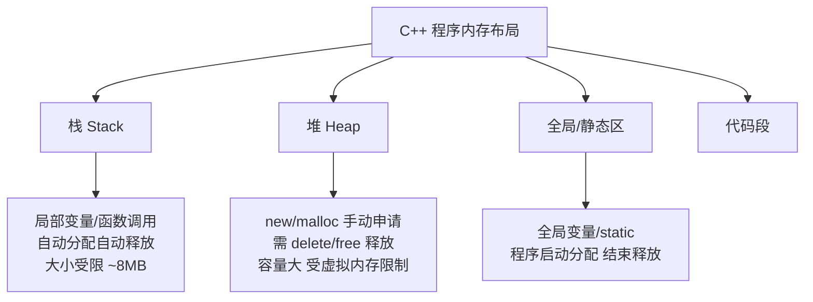
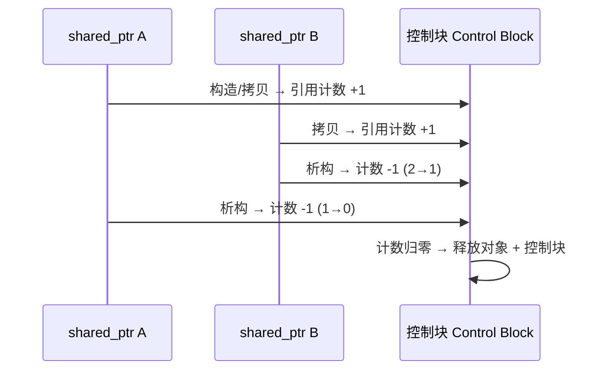
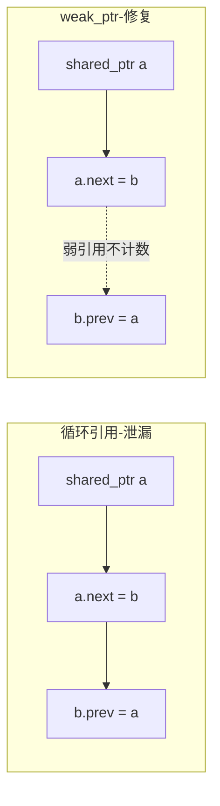

# C++ 内存管理与智能指针

> C++ 的威力与痛苦都源于手动内存管理。理解栈/堆分配、RAII 资源管理，掌握三种智能指针的语义与选型，是写出无泄漏、无悬垂的 NDK 代码的前提。

## 一、内存分区



| 区域 | 分配方式 | 生命周期 | 大小 |
|------|---------|---------|------|
| 栈 | 自动 | 作用域结束自动释放 | 小（MB 级） |
| 堆 | `new`/`malloc` | 手动释放，否则泄漏 | 大（GB 级） |
| 全局/静态 | 编译期确定 | 程序运行期间 | 固定 |
| 代码段 | — | 只读 | 固定 |

```cpp
int globalVal = 1;            // 全局/静态区
static int staticVal = 2;     // 全局/静态区

void func() {
    int local = 3;            // 栈
    int* p = new int(4);      // 堆，指针 p 在栈上
    // 忘记 delete p → 内存泄漏！
    delete p;                 // 必须手动释放
}
```

## 二、new/delete 与 malloc/free 的区别

| 对比项 | `new`/`delete` | `malloc`/`free` |
|--------|----------------|-----------------|
| 语言 | C++ 操作符 | C 库函数 |
| 调用构造/析构 | ✓ 会调用 | ✗ 不会 |
| 返回类型 | 类型安全（`T*`） | `void*` 需强转 |
| 失败行为 | 抛 `bad_alloc` | 返回 `nullptr` |
| 初始化 | 可带初值 `new int(5)` | 不初始化 |

```cpp
std::string* s = new std::string("hi");  // 调用构造函数
delete s;                                 // 调用析构函数

int* arr = new int[10];   // 数组
delete[] arr;             // 数组释放必须用 delete[]
```

>  **new/delete 与 malloc/free 不可混用**：`new` 出来的用 `delete`，`malloc` 出来的用 `free`，`new[]` 用 `delete[]`，否则 UB（未定义行为）。

## 三、RAII：资源管理核心思想

**RAII（Resource Acquisition Is Initialization）**：在构造函数中获取资源，在析构函数中释放资源。资源随对象生命周期自动管理，异常安全。

```cpp
class FileGuard {
public:
    explicit FileGuard(const char* path) : fp_(fopen(path, "r")) {
        if (!fp_) throw std::runtime_error("open failed");
    }
    ~FileGuard() {
        if (fp_) fclose(fp_);   // 析构自动释放，无论正常返回还是异常
    }
    // 禁止拷贝（防止双重释放）
    FileGuard(const FileGuard&) = delete;
    FileGuard& operator=(const FileGuard&) = delete;
private:
    FILE* fp_;
};

void process(const char* path) {
    FileGuard guard(path);   // 构造获取
    // ... 任意代码，即使抛异常，guard 析构也会关闭文件
}                            // 作用域结束自动释放
```

**没有 RAII 的问题**：

```cpp
void bad(const char* path) {
    FILE* fp = fopen(path, "r");
    // ... 如果这里抛异常或提前 return，fp 永远不会被关闭
    fclose(fp);
}
```

## 四、智能指针总览

C++11 标准库提供了三种智能指针，都是 RAII 的封装：

| 智能指针 | 所有权语义 | 引用计数 | 场景 |
|---------|-----------|---------|------|
| `std::unique_ptr` | 独占 | 无 | 默认首选 |
| `std::shared_ptr` | 共享 | 有（线程安全计数） | 多所有者 |
| `std::weak_ptr` | 弱引用 | 不增加计数 | 打破循环引用 |

## 五、unique_ptr：独占所有权

```cpp
#include <memory>

std::unique_ptr<int> p = std::make_unique<int>(42);
// 不能拷贝（独占）
// std::unique_ptr<int> p2 = p;  // ✗ 编译错误
// 可以移动
std::unique_ptr<int> p2 = std::move(p);   // p 变为 nullptr
```

### 常用操作

```cpp
class Widget { /* ... */ };

std::unique_ptr<Widget> w = std::make_unique<Widget>();

// 工厂函数返回：所有权转移自然发生
std::unique_ptr<Widget> createWidget() {
    return std::make_unique<Widget>();   // 返回值优化，无拷贝
}

// 数组
std::unique_ptr<int[]> arr = std::make_unique<int[]>(100);

// 自定义删除器
std::unique_ptr<FILE, decltype(&fclose)> file(fopen("a.txt", "r"), &fclose);
```

## 六、shared_ptr：共享所有权

```cpp
std::shared_ptr<Widget> a = std::make_shared<Widget>();
std::shared_ptr<Widget> b = a;      // 引用计数 2
{
    std::shared_ptr<Widget> c = b;  // 引用计数 3
}                                   // c 析构，计数 2
                                    // a、b 析构后计数归 0，才真正释放
```

### 引用计数原理



### 控制块与 make_shared 优化

```cpp
std::shared_ptr<Widget> p1(new Widget());        // 对象 + 控制块两次分配
std::shared_ptr<Widget> p2 = std::make_shared<Widget>();  // 一次分配，更优
```

> **优先用 `make_shared`**：① 只做一次内存分配，减少内存碎片；② 异常安全（`f(shared_ptr<A>(new A), shared_ptr<B>(new B))` 在 C++17 前的求值顺序可能泄漏）。

## 七、weak_ptr：打破循环引用

```cpp
struct Node {
    std::shared_ptr<Node> next;
    std::weak_ptr<Node> prev;   // 弱引用避免循环
    ~Node() { std::cout << "Node destroyed\n"; }
};

// 循环引用 → 泄漏
struct BadNode {
    std::shared_ptr<BadNode> next;
    std::shared_ptr<BadNode> prev;   // ✗ 互相持有 shared_ptr → 计数永不归零
};

int main() {
    auto a = std::make_shared<BadNode>();
    auto b = std::make_shared<BadNode>();
    a->next = b;
    b->prev = a;    // a 和 b 循环引用，析构函数永远不会被调用！
}
```



### weak_ptr 使用

```cpp
std::weak_ptr<Widget> wptr;

{
    auto sp = std::make_shared<Widget>();
    wptr = sp;                    // 不增加引用计数
    std::cout << sp.use_count();  // 1（不是 2）
}

// 使用前必须 lock()，防止对象已被释放
if (auto locked = wptr.lock()) {
    locked->doSomething();        // 安全使用
} else {
    // 对象已被释放
}
```

>  **weak_ptr 不能直接解引用**，必须 `lock()` 提升为 shared_ptr 才能使用，这正是为了检查对象是否还存活。

## 八、Android NDK 中的实践

### 8.1 JNI 引用管理（全局/局部引用）

```cpp
extern "C" JNIEXPORT jstring JNICALL
Java_com_example_NativeBridge_getString(JNIEnv* env, jobject thiz) {
    // 局部引用：函数返回后由 JVM 自动释放
    jstring result = env->NewStringUTF("hello");
    return result;
}

// 全局引用：需手动 DeleteGlobalRef
jclass globalClass = (jclass)env->NewGlobalRef(localClass);
// ...
env->DeleteGlobalRef(globalClass);   // 忘记释放 → 类无法被卸载
```

### 8.2 C++ 智能指针与 JNI 对象结合

```cpp
// 用 unique_ptr 管理 Native 层资源，异常安全
std::unique_ptr<OpenGLRenderer> g_renderer;

void Java_..._init(JNIEnv* env, jobject thiz, jobject surface) {
    try {
        g_renderer = std::make_unique<OpenGLRenderer>();
        g_renderer->init(surface);
    } catch (const std::exception& e) {
        // 记录错误，避免 native crash
    }
}
```

| 场景 | 推荐 |
|------|------|
| Native 层独占资源（GL 上下文、文件句柄） | `unique_ptr` |
| 回调闭包捕获对象 | `shared_ptr` |
| 观察者/回调弱引用 | `weak_ptr` |
| JNI 全局引用 | 手动管理 + RAII 封装 |

## 九、常见内存问题

| 问题 | 表现 | 原因 | 对策 |
|------|------|------|------|
| 内存泄漏 | 内存持续增长 | new 未 delete | 智能指针 |
| 悬垂指针 | 野值/崩溃 | 释放后继续使用 | 智能指针 + 作用域 |
| 双重释放 | 崩溃 double free | 两次 delete | unique_ptr 独占 |
| 循环引用 | 泄漏 | shared_ptr 环 | weak_ptr 打破 |
| 越界访问 | ASan 报错 | 数组越界 | 用容器 + 边界检查 |

## 十、高频面试题

### Q1：`new`/`delete` 和 `malloc`/`free` 有什么区别？
::: details 查看答案
① `new` 是 C++ 操作符，`malloc` 是 C 库函数；② `new` 会调用构造函数、`delete` 调用析构函数，`malloc`/`free` 只分配/释放内存；③ `new` 返回类型安全指针，`malloc` 返回 `void*`；④ `new` 失败抛 `bad_alloc` 异常，`malloc` 失败返回 `nullptr`；⑤ 分配数组需 `new[]`/`delete[]`。两者不可混用。
:::

### Q2：unique_ptr、shared_ptr、weak_ptr 各自的作用和使用场景？
::: details 查看答案
`unique_ptr` 独占所有权，不可拷贝只能移动，默认首选，零开销；`shared_ptr` 共享所有权，引用计数归零时释放，适合多个所有者共享资源（如缓存、回调捕获）；`weak_ptr` 不增加引用计数，配合 shared_ptr 打破循环引用，使用时必须 `lock()` 提升。Android NDK 中：资源独占用 unique_ptr，回调共享用 shared_ptr，观察关系用 weak_ptr。
:::

### Q3：什么是 RAII？为什么它能保证异常安全？
::: details 查看答案
RAII 是"资源获取即初始化"：在构造函数中获取资源、析构函数中释放资源。由于 C++ 保证**栈对象离开作用域时一定会调用析构函数（无论正常 return 还是异常栈展开）**，所以资源释放与对象生命周期绑定，天然异常安全。智能指针、`std::lock_guard`、`std::ofstream` 都是 RAII 的体现。
:::

### Q4：shared_ptr 循环引用为什么会导致泄漏？如何解决？
::: details 查看答案
两个对象互相持有 shared_ptr 时，各自的引用计数永远至少为 1（对方持有自己），析构时无法归零，对象永不释放。解决：把其中一个方向的引用改为 `weak_ptr`，弱引用不增加计数，打破环。典型场景：链表/树的父子互指、观察者模式中观察者持有被观察者的弱引用。
:::

### Q5：Android JNI 中局部引用和全局引用有什么区别？
::: details 查看答案
局部引用在函数返回后由 JVM 自动释放，但如果创建过多（如循环中反复创建字符串）会导致本地引用表溢出，超过 512 个（Android 默认限制）会崩溃；全局引用需要手动 `DeleteGlobalRef` 释放，用于跨函数/跨线程持有对象。JNI 开发建议：及时释放、用 RAII 封装 JNI 引用、必要时用 `PushLocalFrame`/`PopLocalFrame` 控制局部引用生命周期。
:::

## 小结

- 内存分栈/堆/全局/代码四区，堆需手动管理
- RAII：构造获取、析构释放，异常安全的核心思想
- `unique_ptr` 独占、`shared_ptr` 共享（引用计数）、`weak_ptr` 弱引用（破环）
- `make_shared` 一次分配更优；优先智能指针而非裸指针
- NDK 开发注意 JNI 局部/全局引用与 Native 资源双重管理

> 进阶阅读：[C++ 核心知识点](/language/cpp/cpp-basics.md) | [JNI 与 NDK 开发](/language/cpp/jni-ndk.md)
