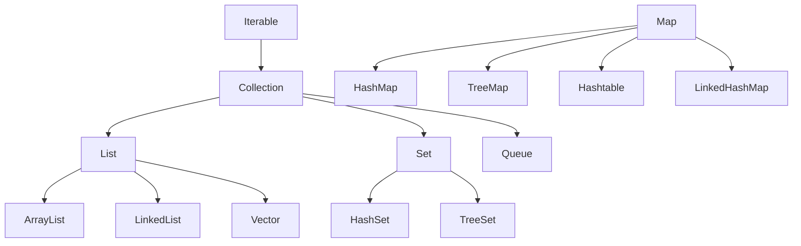

# 集合框架总览

> Java 集合框架位于 `java.util` 包，整体分为五大块：List、Set、Map、迭代器、工具类。

## 整体框架

集合类主要分为两大类：**Collection** 和 **Map**。

集合框架的整体构成关系如下：



## List（列表）

- 元素**可以重复**、有序
- 常用实现：`ArrayList`、`LinkedList`，不常用 `Vector`
- `LinkedList` 还实现了 `Queue` 接口，可作为队列使用
- 有专属迭代器 `ListIterator`，支持逆序迭代、通过迭代器设置元素值

## Set（集合）

- 元素**不允许重复**（通过 hashCode 和 equals 保证）
- `HashSet` 基于 `HashMap` 实现，`TreeSet` 基于 `TreeMap` 实现
- `TreeSet` 实现 `SortedSet` 接口，是有序集合（元素需实现 `Comparable` 或提供 `Comparator`）

## Map（映射）

- 每个元素都是 key-value 键值对
- 常用实现：`HashMap`、`TreeMap`、`LinkedHashMap`、`WeakHashMap`，均继承 `AbstractMap`（适配器模式）
- `Hashtable`（JDK 1.0 引入）直接实现 `Map` 接口，与 `Vector` 同期

## 抽象类的适配器模式

`AbstractCollection`、`AbstractList`、`AbstractSet` 分别实现 Collection、List、Set 接口，在抽象类中实现部分方法，子类只需继承并实现自己需要的方法——这是集合框架中广泛使用的**适配器设计模式**。

## Iterator（迭代器）

- 遍历 Collection 的迭代器（**不能遍历 Map**，只用来遍历 Collection）
- Collection 实现类都实现了 `iterator()` 返回 Iterator 对象
- `ListIterator` 专门遍历 List
- `Enumeration` 是 JDK 1.0 引入的，功能比 Iterator 少，只能在 Hashtable、Vector、Stack 中使用

使用 Iterator 遍历集合的示例代码如下：

::: code-tabs

@tab:active Java

```java
Iterator it = collection.iterator();
while (it.hasNext()) {
    Object obj = it.next();
}
```

@tab Kotlin

```kotlin
val it = collection.iterator()
while (it.hasNext()) {
    val obj = it.next()
}
```

:::

## 工具类

- **Arrays**：操作数组，如 `Arrays.copyOf()`
- **Collections**：操作集合，如返回各集合的 synchronized 线程安全版本；需要线程安全集合时首选 `java.util.concurrent` 并发包下的对应类

## Collection 接口要点

- 最基本的集合接口，继承 `Iterable`
- 子接口：List、Set、Queue
- 所有实现类都有两个构造方法：无参构造 + 以另一个 Collection 为参数的构造
- 集合运算：`retainAll(c)` 交、`addAll(c)` 并、`removeAll(c)` 差
