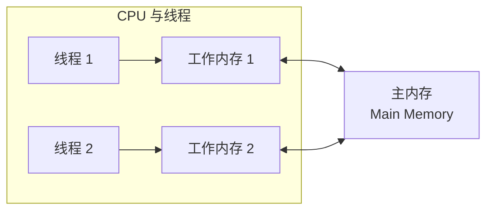
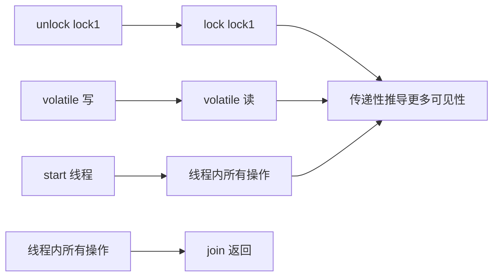
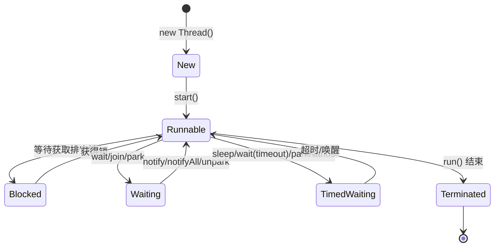

# Java 内存模型与线程

> Java 内存模型（JMM）是并发编程的理论基石：变量如何在主内存与工作内存间流转、volatile 到底保证什么、什么情况下重排序是安全的。理解 JMM，才能写出线程安全的代码。

## 一、主内存与工作内存



- 所有变量存储于**主内存**（Main Memory）
- 每条线程拥有自己的**工作内存**（Working Memory），保存变量主内存副本
- 线程对变量的所有操作必须在工作内存进行，**不能直接读写主内存**
- 线程间变量传递需通过主内存完成

::: tip
JMM 是**抽象模型**，对应到实际硬件：主内存 ≈ 物理内存，工作内存 ≈ CPU 寄存器与高速缓存。
:::

## 二、内存间交互操作（八种）

| 操作 | 作用对象 | 含义 |
|------|----------|------|
| `lock` | 主内存 | 标识变量为线程独占 |
| `unlock` | 主内存 | 释放锁定状态 |
| `read` | 主内存 | 把变量值从主内存传输到工作内存 |
| `load` | 工作内存 | 把 read 得到的值放入变量副本 |
| `use` | 工作内存 | 把变量值传给执行引擎 |
| `assign` | 工作内存 | 把执行引擎的值赋给变量 |
| `store` | 工作内存 | 把变量值传送到主内存 |
| `write` | 主内存 | 把 store 得到的值放入主内存变量 |

**核心规则**：

- `read` 与 `load`、`store` 与 `write` 必须按顺序执行（**不要求连续**）
- 变量只能在主内存"诞生"（`new` 出的对象先写入主内存）
- `lock` 可重入但 `unlock` 次数需匹配
- `unlock` 前必须先同步回主内存

## 三、volatile 的特殊规则

| 特性 | 说明 |
|------|------|
| **可见性** | volatile 变量修改对其他线程立即可见 |
| **不保证原子性** | 复合操作（`i++`）仍需加锁 |
| **禁止重排序** | 写操作插入内存屏障，性能略低于普通变量，但整体优于锁 |

### 安全使用 volatile 的两个条件

1. 运算结果**不依赖变量当前值**，或只有单线程修改
2. 变量**不与其他状态变量共同参与不变约束**

```kotlin
// ✓ 安全：只有单线程写
@Volatile var ready = false

// ✗ 不安全：复合操作依赖当前值
@Volatile var count = 0
count++ // 读-改-写三步，非原子
```

### long 与 double 的特殊性

- 允许虚拟机将非 volatile 的 64 位读写拆分为**两次 32 位操作**（不保证原子性）
- 实际主流 JVM 实现通常已原子化，但规范层面不保证——**共享的 long/double 建议加 volatile**

## 四、先行发生原则（happens-before）

如果操作 A happens-before 操作 B，则 A 的结果对 B 可见，且 A 的执行顺序先于 B。

| 规则 | 内容 |
|------|------|
| 程序次序 | 线程内按控制流顺序，前者先行发生于后者 |
| 管程锁定 | `unlock` 先行发生于对同一锁的后续 `lock` |
| volatile 变量 | 写先行发生于对同一变量的后续读 |
| 线程启动 | `start()` 先行发生于线程内所有动作 |
| 线程终止 | 线程内所有操作先行发生于终止检测（`join()` / `isAlive()`） |
| 线程中断 | `interrupt()` 先行发生于检测到中断（`interrupted()`） |
| 对象终结 | 构造完成先行发生于 `finalize()` |
| 传递性 | A 先行于 B、B 先行于 C ⇒ A 先行于 C |



## 五、线程的实现与调度

### 实现方式

| 方式 | 映射 | 特点 |
|------|------|------|
| 内核线程实现 | 1:1 | 线程映射到内核线程，由内核调度，Java 主流采用 |
| 用户线程实现 | 1:N | 在用户空间实现，无需内核支持，但调度与切换复杂 |
| 混合实现 | N:M | 用户线程 + 少量内核线程复用，兼顾两者 |

### 调度方式

| 方式 | 特点 |
|------|------|
| 协同式 | 线程自己控制执行时间、主动让出；实现简单、无同步问题，但执行时间不可控（一个线程卡住拖垮全部） |
| 抢占式 | 系统分配执行时间，线程无法自行获取；**Java 采用抢占式** |

## 六、线程状态转换



| 状态 | 进入方式 | 说明 |
|------|----------|------|
| 新建（New） | `new Thread()` | 创建后尚未启动 |
| 运行（Runnable） | `start()` | 含 Running 与 Ready，可能正在执行或等待 CPU |
| 无限期等待（Waiting） | `wait()` / `join()` / `LockSupport.park()` | 需被显式唤醒 |
| 限期等待（Timed Waiting） | `sleep()` / 带超时的 `wait()/join()` / `parkNanos()` | 到时自动唤醒 |
| 阻塞（Blocked） | 等待获取排它锁 | 锁释放时进入 Runnable |
| 结束（Terminated） | `run()` 返回或异常 | 已终止 |

::: tip
`wait()` 与 `sleep()` 的区别：`wait` 释放锁且需 notify 唤醒（配合 `synchronized` 使用）；`sleep` 不释放锁、到时自动唤醒。
:::

## 七、高频面试题

### Q1：volatile 能保证原子性吗？

::: details 查看答案
不能。volatile 只保证**可见性**和**禁止重排序**，不保证复合操作（如 `i++` 的读-改-写）的原子性。只有当运算结果不依赖当前值、或只有单线程修改、且变量不参与其他不变约束时，才能不加锁使用 volatile。
:::

### Q2：什么是 happens-before 原则？

::: details 查看答案
happens-before 是 JMM 定义的操作间偏序关系：若 A happens-before B，则 A 的结果对 B 可见且 A 先于 B 执行。八大规则包括程序次序、管程锁定、volatile 变量、线程启动/终止/中断、对象终结与传递性。满足 happens-before 的代码无需额外同步即可保证可见性。
:::

### Q3：`wait` 和 `sleep` 有什么区别？

::: details 查看答案
`wait` 是 Object 方法，必须在持有锁（synchronized 块）内调用，调用后**释放锁**并进入等待，需 `notify/notifyAll` 唤醒；`sleep` 是 Thread 静态方法，不释放锁，到时间自动唤醒。使用场景：wait 用于线程间协作，sleep 用于简单延时。
:::

### Q4：Java 线程为什么采用抢占式调度？

::: details 查看答案
抢占式调度由系统统一分配 CPU 时间片，线程无法独占 CPU，避免了协同式调度中"线程不主动让出导致其他线程饿死"的问题，保证系统公平性与响应性。这也是 JVM 规范要求的默认方式。
:::

### Q5：long/double 为什么可能不是原子的？

::: details 查看答案
JMM 规范允许虚拟机将非 volatile 的 64 位读写拆分为两次 32 位操作，理论上可能出现读到"前 32 位是旧值、后 32 位是新值"的中间状态。虽然主流 64 位 JVM 实际已原子化，但跨平台代码仍建议对共享的 long/double 加 volatile 保证原子读写。
:::

## 小结

- JMM 三要素：**主内存/工作内存模型、八种交互操作、happens-before 规则**
- volatile 保证可见性与有序性，**不保证原子性**，使用需满足两个安全条件
- 线程状态：New → Runnable ⇄ (Blocked / Waiting / Timed Waiting) → Terminated

> 进阶阅读：[JVM 内存区域与内存溢出](JVM内存区域与内存溢出.md) | [Java 并发基础](/language/java/java-concurrency.md) | [线程池与并发](/network/thread/)
