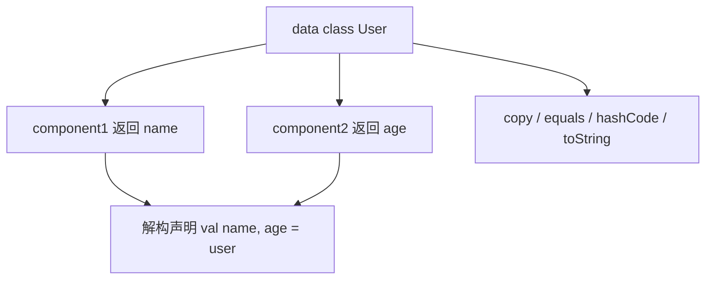

# Kotlin 委托机制与内联函数

> 委托（Delegation）是 Kotlin 减少样板代码的利器：类委托、属性委托、`lazy`/`by viewModels()` 等扩展背后都是它。理解委托机制，才能真正读懂 Compose、协程等现代框架的源码。

## 一、类委托（Class Delegation）

**组合优于继承**，但手写组合需要转发所有方法。`by` 关键字自动生成转发：

::: code-tabs

@tab:active Java

```java
interface IAnimal {
    void eat();
    void sleep();
}

class Dog implements IAnimal {
    @Override public void eat() { System.out.println("Dog eats bone"); }
    @Override public void sleep() { System.out.println("Dog sleeps"); }
}

// 类委托等价写法：手动实现组合转发
class PetShop implements IAnimal {
    private final Dog dog;

    PetShop(Dog dog) { this.dog = dog; }

    // 覆写个别方法
    @Override public void eat() { System.out.println("PetShop: feed the dog"); }
    // 转发给 dog
    @Override public void sleep() { dog.sleep(); }
}

void main() {
    PetShop shop = new PetShop(new Dog());
    shop.eat();    // PetShop: feed the dog（覆写生效）
    shop.sleep();  // Dog sleeps（转发给 dog）
}
```

@tab Kotlin

```kotlin
interface IAnimal {
    fun eat()
    fun sleep()
}

class Dog : IAnimal {
    override fun eat() = println("Dog eats bone")
    override fun sleep() = println("Dog sleeps")
}

// 类委托：所有 IAnimal 方法自动转发给 dog
class PetShop(dog: Dog) : IAnimal by dog {
    // 可以覆写个别方法
    override fun eat() = println("PetShop: feed the dog")
}

fun main() {
    val shop = PetShop(Dog())
    shop.eat()    // PetShop: feed the dog（覆写生效）
    shop.sleep()  // Dog sleeps（转发给 dog）
}
```

:::

### 应用场景

类委托的典型应用场景说明如下：

| 场景 | 说明 |
|------|------|
| 装饰器模式 | 不修改原类增强功能 |
| 集合包装 | 继承 `MutableList` 的委托实现 |
| 接口多实现 | 一个类委托给多个对象分别实现不同接口 |

> **Kotlin 集合源码**大量使用委托：`List` 实现类内部对 `arrayListOf` 等委托转发。

## 二、属性委托（Property Delegation）

**属性委托**把属性的 getter/setter 交给委托对象实现：

::: code-tabs

@tab:active Java

```java
// 属性委托等价写法：getter/setter 转发给委托对象
class Person {
    private final NameDelegate delegate = new NameDelegate();
    public String getName() { return delegate.getValue(); }
    public void setName(String value) { delegate.setValue(value); }
}

class NameDelegate {
    private String value = "";
    public String getValue() {
        System.out.println("读取 name");
        return value;
    }
    public void setValue(String value) {
        System.out.println("写入 name = " + value);
        this.value = value;
    }
}

// 使用
Person p = new Person();
p.setName("tom");   // 写入 name = tom
System.out.println(p.getName());  // 读取 name → tom
```

@tab Kotlin

```kotlin
class Person {
    var name: String by NameDelegate()   // get/set 交给 NameDelegate
}

class NameDelegate {
    private var value = ""
    operator fun getValue(thisRef: Any?, property: KProperty<*>): String {
        println("读取 ${property.name}")
        return value
    }
    operator fun setValue(thisRef: Any?, property: KProperty<*>, value: String) {
        println("写入 ${property.name} = $value")
        this.value = value
    }
}

// 使用
val p = Person()
p.name = "tom"   // 写入 name = tom
println(p.name)  // 读取 name → tom
```

:::

### 语法要求

委托对象必须实现两个操作符：

::: code-tabs

@tab:active Java

```java
// 委托对象等价接口（Java 无属性委托，getter/setter 需手动转发）
interface Delegate<T> {
    T getValue(Object thisRef, KProperty<?> property);
    void setValue(Object thisRef, KProperty<?> property, T value);  // var 需要
}
```

@tab Kotlin

```kotlin
operator fun getValue(thisRef: Any?, property: KProperty<*>): T
operator fun setValue(thisRef: Any?, property: KProperty<*>, value: T)   // var 需要
```

:::

## 三、标准库属性委托

### 3.1 `lazy` 惰性初始化

`lazy` 惰性初始化的标准写法如下：

::: code-tabs

@tab:active Java

```java
// 等价写法：第一次访问才初始化，之后缓存
class MainActivity extends AppCompatActivity {
    private MainViewModel mViewModel;

    private MainViewModel getViewModel() {
        if (mViewModel == null) {
            mViewModel = new ViewModelProvider(this).get(MainViewModel.class);
        }
        return mViewModel;
    }
}
```

@tab Kotlin

```kotlin
// 第一次访问才初始化，之后缓存（线程安全默认）
class MainActivity : AppCompatActivity() {
    private val mViewModel: MainViewModel by lazy {
        ViewModelProvider(this)[MainViewModel::class.java]
    }
}
```

:::

各 `lazy` 模式的线程安全说明如下：

| `lazy` 模式 | 线程安全 | 场景 |
|-------------|---------|------|
| `LazyThreadSafetyMode.SYNCHRONIZED`（默认） | ✓ 加锁 | 多线程并发访问 |
| `PUBLICATION` | ✓ 无锁 | 允许重复计算 |
| `NONE` | ✗ | 单线程（如主线程） |

### 3.2 `observable` / `vetoable` 观察属性变化

`observable` 与 `vetoable` 的用法示例如下：

::: code-tabs

@tab:active Java

```java
// 等价写法：setter 中手动做观察与校验
private int score = 0;
public void setScore(int newValue) {
    int old = score;
    score = newValue;
    System.out.println("score: " + old + " -> " + newValue);
}

private int age = 18;
public void setAge(int newValue) {
    if (newValue < 0 || newValue > 150) return;   // 不在 0..150 则拒绝赋值
    age = newValue;
}

setAge(200);   // 被拒绝，仍是 18
```

@tab Kotlin

```kotlin
var score by observable(0) { _, old, new ->
    println("score: $old -> $new")
}

var age by vetoable(18) { _, _, new ->
    new in 0..150    // 返回 false 则拒绝赋值
}

age = 200   // 被拒绝，仍是 18
```

:::

### 3.3 `by map` 委托给 Map

`by map` 委托的标准写法如下：

::: code-tabs

@tab:active Java

```java
// 等价写法：从 Map 读取属性
class Config {
    private final Map<String, Object> map;
    Config(Map<String, Object> map) { this.map = map; }
    public String getName() { return (String) map.get("name"); }
    public int getVersion() { return (int) map.get("version"); }
}

Map<String, Object> map = new HashMap<>();
map.put("name", "app");
map.put("version", 1);
Config cfg = new Config(map);
System.out.println(cfg.getName());    // app（从 map 读取）
```

@tab Kotlin

```kotlin
class Config(map: Map<String, Any?>) {
    val name: String by map
    val version: Int by map
}
val cfg = Config(mapOf("name" to "app", "version" to 1))
println(cfg.name)    // app（从 map 读取）
```

:::

> 经典应用：Gson 解析、Bundle/Intent extras 封装、SharedPreferences 封装都可用 `by map` 或自定义委托。

## 四、`by lazy` vs `lateinit`

`by lazy` 与 `lateinit` 的对比说明如下：

| 对比项 | `lateinit var` | `by lazy` |
|--------|---------------|-----------|
| 适用类型 | var（非空、非基本类型） | val |
| 初始化时机 | 手动在代码中赋值 | 第一次访问时自动 |
| 线程安全 | 无 | 默认 SYNCHRONIZED |
| 反初始化 | 可判断 `::x.isInitialized` | 无 |
| 典型场景 | DI 注入、findViewById | ViewModel、昂贵资源 |

两种初始化方式的实际写法如下：

::: code-tabs

@tab:active Java

```java
// lateinit 等价写法：可空字段 + 判空
RecyclerView.Adapter<?> adapter = null;
if (adapter != null) { /* 已初始化 */ }

// lazy 等价写法：首次访问时初始化并缓存
private UserRepository repository;
private UserRepository getRepository() {
    if (repository == null) {
        repository = new UserRepository();   // 惰性初始化
    }
    return repository;
}
```

@tab Kotlin

```kotlin
// lateinit：必须手动赋值
lateinit var adapter: RecyclerView.Adapter<*>
if (::adapter.isInitialized) { /* 已初始化 */ }

// lazy：自动惰性初始化
val repository: UserRepository by lazy { UserRepository() }
```

:::

## 五、委托在 Android 生态的应用

### 5.1 `by viewModels()`

`by viewModels()` 的标准写法如下：

::: code-tabs

@tab:active Java

```java
// 等价写法：手动通过 ViewModelProvider 获取
class MainActivity extends AppCompatActivity {
    private MainViewModel vm = new ViewModelProvider(this).get(MainViewModel.class);
}
```

@tab Kotlin

```kotlin
// activity-ktx / fragment-ktx
class MainActivity : AppCompatActivity() {
    private val vm: MainViewModel by viewModels()
}
```

:::

本质是属性委托：`getValue` 时通过 `ViewModelProvider` 获取实例。

### 5.2 `by lazy` + `binding`

ViewBinding 与 `by lazy` 组合的写法如下：

::: code-tabs

@tab:active Java

```java
// 等价写法：首次访问时初始化并缓存
private ActivityMainBinding binding;
private ActivityMainBinding getBinding() {
    if (binding == null) {
        binding = ActivityMainBinding.inflate(getLayoutInflater());
    }
    return binding;
}
```

@tab Kotlin

```kotlin
private val binding: ActivityMainBinding by lazy {
    ActivityMainBinding.inflate(layoutInflater)
}
```

:::

### 5.3 自定义委托封装 SharedPreferences

自定义委托封装 SharedPreferences 的实现如下：

::: code-tabs

@tab:active Java

```java
// 等价写法：手动读写 SharedPreferences 的辅助类
class PrefDelegate<T> {
    private final SharedPreferences prefs;
    private final String key;
    private final T defaultValue;

    PrefDelegate(SharedPreferences prefs, String key, T defaultValue) {
        this.prefs = prefs;
        this.key = key;
        this.defaultValue = defaultValue;
    }

    @SuppressWarnings("unchecked")
    T getValue() {
        Object value;
        if (defaultValue instanceof Integer) {
            value = prefs.getInt(key, (Integer) defaultValue);
        } else if (defaultValue instanceof String) {
            value = prefs.getString(key, (String) defaultValue);
        } else if (defaultValue instanceof Boolean) {
            value = prefs.getBoolean(key, (Boolean) defaultValue);
        } else {
            throw new IllegalArgumentException();
        }
        return (T) value;
    }

    void setValue(T value) {
        SharedPreferences.Editor editor = prefs.edit();
        if (value instanceof Integer) {
            editor.putInt(key, (Integer) value);
        } else if (value instanceof String) {
            editor.putString(key, (String) value);
        } else if (value instanceof Boolean) {
            editor.putBoolean(key, (Boolean) value);
        }
        editor.apply();
    }
}

// 使用
PrefDelegate<String> userName = new PrefDelegate<>(prefs, "user_name", "");
```

@tab Kotlin

```kotlin
class PrefDelegate<T>(
    private val prefs: SharedPreferences,
    private val key: String,
    private val default: T
) {
    @Suppress("UNCHECKED_CAST")
    operator fun getValue(thisRef: Any?, p: KProperty<*>): T {
        val value = when (default) {
            is Int -> prefs.getInt(key, default as Int)
            is String -> prefs.getString(key, default as String)
            is Boolean -> prefs.getBoolean(key, default as Boolean)
            else -> throw IllegalArgumentException()
        }
        return value as T
    }
    operator fun setValue(thisRef: Any?, p: KProperty<*>, value: T) {
        prefs.edit().apply {
            when (value) {
                is Int -> putInt(key, value)
                is String -> putString(key, value)
                is Boolean -> putBoolean(key, value)
            }
        }.apply()
    }
}

// 使用
var userName: String by PrefDelegate(prefs, "user_name", "")
```

:::

## 六、数据类与解构

`data class` 自动生成 `componentN()` 支持解构：

::: code-tabs

@tab:active Java

```java
// data class 等价写法：手动生成 getter/equals/hashCode/toString
class User {
    private final String name;
    private final int age;

    User(String name, int age) { this.name = name; this.age = age; }

    public String getName() { return name; }
    public int getAge() { return age; }
    // equals / hashCode / toString 省略
}

User user = new User("tom", 20);
String name = user.getName();   // 等价于 component1()
int age = user.getAge();        // 等价于 component2()
```

@tab Kotlin

```kotlin
data class User(val name: String, val age: Int)

val (name, age) = User("tom", 20)   // 解构声明
// 等价于 val name = user.component1(); val age = user.component2()
```

:::

data class 解构的构成关系如下：



### 解构的应用

解构在实际开发中的应用示例如下：

::: code-tabs

@tab:active Java

```java
// Map 遍历
for (Map.Entry<String, Integer> entry : Map.of("a", 1).entrySet()) { }

// 返回两个值（Java 无解构，用 Map.Entry 或自定义类）
Map.Entry<Integer, Integer> pos = getPosition();   // 返回 Pair 等价物

// 集合转换
String name = (String) list.get(0);   // 手动取元素
int age = (Integer) list.get(1);
```

@tab Kotlin

```kotlin
// Map 遍历
for ((key, value) in mapOf("a" to 1)) { }

// 返回两个值
val (x, y) = getPosition()   // 返回 Pair 或自定义类

// 集合转换
val (name, age) = listOf("tom", 20).let { it[0] to it[1] }
```

:::

## 七、内联函数与 reified 回顾

`reified` 泛型结合委托的回顾示例如下：

::: code-tabs

@tab:active Java

```java
// reified 等价写法：显式传入 Class 参数
static <T> T sysService(Context context, Class<T> clazz) {
    String serviceName;
    if (clazz == LayoutInflater.class) {
        serviceName = Context.LAYOUT_INFLATER_SERVICE;
    } else {
        return null;
    }
    return clazz.cast(context.getSystemService(serviceName));
}

// 使用
LayoutInflater inflater = sysService(context, LayoutInflater.class);
```

@tab Kotlin

```kotlin
// inline + reified 是委托与泛型操作的黄金搭档
inline fun <reified T> Context.sysService(): T? {
    val serviceName: String = when (T::class) {
        LayoutInflater::class -> Context.LAYOUT_INFLATER_SERVICE
        else -> return null
    }
    return getSystemService(serviceName) as? T
}

// 使用
val inflater: LayoutInflater? = sysService<LayoutInflater>()
```

:::

## 八、高频面试题

### Q1：`by lazy` 和 `lateinit` 有什么区别？
::: details 查看答案
① 修饰类型：`lazy` 用于 `val`（不可变），`lateinit` 用于 `var`（可变）；② 初始化时机：`lazy` 第一次访问时自动初始化，`lateinit` 必须手动赋值；③ 线程安全：`lazy` 默认同步锁（SYNCHRONIZED 模式），`lateinit` 无任何保护；④ 判空：`lateinit` 可用 `::x.isInitialized` 判断，`lazy` 不能；⑤ `lateinit` 不支持基本类型（Int/Long 等）。Android 中 DI 注入用 `lateinit`，昂贵延迟资源用 `lazy`。
:::

### Q2：类委托 `by` 与继承有什么区别？为什么 Kotlin 推荐组合？
::: details 查看答案
继承是 is-a 关系，子类与父类强耦合，Java 只允许单继承；委托是 has-a 关系，`by` 自动生成转发方法，实现接口级复用，多个接口可委托给不同对象（多组合）。委托不破坏封装、灵活可替换，符合"组合优于继承"原则。Kotlin 默认类为 final，也侧面推动使用委托。
:::

### Q3：属性委托的实现原理？委托对象需要实现什么方法？
::: details 查看答案
属性委托是把属性的读写操作**重定向**到委托对象。委托对象需要实现 `getValue(thisRef: KProperty, property: KProperty<*>)` 操作符，`var` 属性还需 `setValue`。编译后，属性的 getter 内部调用委托的 `getValue`，setter 调用 `setValue`。`by lazy`、`by viewModels()`、`by map` 都是标准库或框架提供的委托实现。
:::

### Q4：`lazy` 的三种线程模式分别是什么？
::: details 查看答案
`SYNCHRONIZED`（默认）：初始化加锁，多线程并发访问时只初始化一次，线程安全；`PUBLICATION`：无锁，允许多线程同时初始化，但只有一个结果被采用，适合并发竞争少的场景；`NONE`：完全不加锁，仅限单线程场景（如主线程），否则存在竞态条件。
:::

### Q5：数据类自动生成哪些方法？解构的原理是什么？
::: details 查看答案
`data class` 自动生成：`equals`/`hashCode`（基于所有主构造属性）、`toString`、`copy`（拷贝时可按参数名只改部分字段）、`component1()..componentN()`（按属性声明顺序）。解构声明 `val (a, b) = obj` 编译后就是调用 `component1()`/`component2()`。所以任何提供 componentN 的类（不限于 data class）都可以解构。
:::

## 小结

- 类委托 `by` 实现接口复用，优于继承
- 属性委托把 get/set 交给 `getValue`/`setValue` 委托对象
- 标准库委托：`lazy`、`observable`/`vetoable`、`by map`
- `lateinit` 与 `by lazy` 按可变性/初始化时机/线程安全选型
- `by viewModels()`、SharedPreferences 封装都是委托的实际应用
- `data class` 的 `componentN()` 支撑解构声明

> 进阶阅读：[Kotlin 扩展函数](/language/kotlin/kotlin-extensions.md) | [Kotlin 泛型详解](/language/kotlin/kotlin-generics.md) | [Kotlin 函数式编程与高阶函数](/language/kotlin/kotlin-functional.md)
