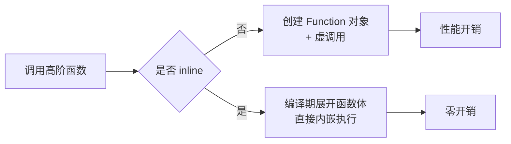

# Kotlin 函数式编程与高阶函数

> Kotlin 是一门融合了面向对象与函数式编程的语言。掌握高阶函数、Lambda 与集合操作符，是写出简洁、优雅、不易出错代码的关键，也是现代 Android 开发（Compose、协程、Flow）的地基。

## 一、函数也是一等公民

在 Kotlin 中，**函数可以被赋值给变量、作为参数传递、作为返回值返回**——这就是"函数一等公民"。

函数一等公民的完整示例代码如下：

::: code-tabs

@tab:active Java

```java
// 函数引用等价写法：方法引用赋值给变量
static boolean isEven(int x) { return x % 2 == 0; }

Predicate<Integer> predicate = Functional::isEven;   // 方法引用赋值给变量

// 函数作为参数
static List<Integer> filter(List<Integer> list, Predicate<Integer> pred) {
    return list.stream().filter(pred).collect(Collectors.toList());
}

// 函数作为返回值
static Function<Integer, Integer> makeAdder(int x) {
    return y -> x + y;
}

void main() {
    Function<Integer, Integer> add5 = makeAdder(5);
    System.out.println(add5.apply(3));   // 8
    System.out.println(filter(Arrays.asList(1, 2, 3, 4), Functional::isEven));  // [2, 4]
}
```

@tab Kotlin

```kotlin
// 函数引用（可调用引用）
fun isEven(x: Int): Boolean = x % 2 == 0

val predicate: (Int) -> Boolean = ::isEven   // 函数引用赋值给变量

// 函数作为参数
fun filter(list: List<Int>, pred: (Int) -> Boolean): List<Int> =
    list.filter(pred)

// 函数作为返回值
fun makeAdder(x: Int): (Int) -> Int = { y -> x + y }

fun main() {
    val add5 = makeAdder(5)
    println(add5(3))   // 8
    println(filter(listOf(1, 2, 3, 4), ::isEven))  // [2, 4]
}
```

:::

### 函数类型语法

函数类型的标准写法如下：

::: code-tabs

@tab:active Java

```java
// 等价写法：java.util.function 函数式接口
BiFunction<Integer, Integer, Integer> f1 = (a, b) -> a + b;
Runnable f2 = () -> System.out.println("hello");
Consumer<String> f3 = it -> System.out.println(it);   // 单参数可用任意名字
```

@tab Kotlin

```kotlin
// (参数类型...) -> 返回类型
val f1: (Int, Int) -> Int = { a, b -> a + b }
val f2: () -> Unit = { println("hello") }
val f3: (String) -> Unit = { println(it) }   // 单参数可用 it
```

:::

常见函数类型的含义说明如下：

| 写法 | 含义 |
|------|------|
| `(Int, Int) -> Int` | 两个 Int 参数，返回 Int |
| `() -> Unit` | 无参数无返回值 |
| `(String) -> Unit` | 一个参数，`it` 是默认参数名 |
| `(Int) -> ((Int) -> Int)` | 返回函数的函数（柯里化） |

## 二、Lambda 表达式

### 2.1 语法要点

Lambda 的完整写法与简化写法如下：

::: code-tabs

@tab:active Java

```java
// 完整写法
BiFunction<Integer, Integer, Integer> sum = (a, b) -> a + b;

// 简化：Lambda 参数类型可推断时省略
BiFunction<Integer, Integer, Integer> sum2 = (a, b) -> a + b;

// 单参数
Consumer<String> printIt = it -> System.out.println(it);

// 无参数
Runnable greet = () -> System.out.println("hi");
```

@tab Kotlin

```kotlin
// 完整写法
val sum = { a: Int, b: Int -> a + b }

// 简化：参数类型可推断时省略
val sum: (Int, Int) -> Int = { a, b -> a + b }

// 唯一参数用 it
val printIt: (String) -> Unit = { println(it) }

// 无参数
val greet = { println("hi") }
```

:::

### 2.2 尾随 Lambda（Trailing Lambda）

**当 Lambda 是函数最后一个参数时，可以移出括号**：

::: code-tabs

@tab:active Java

```java
// Java 无尾随 Lambda 语法，Lambda 始终在括号内
Arrays.asList(1, 2, 3).stream().map(x -> x * 2).collect(Collectors.toList());
Arrays.asList(1, 2, 3).stream().reduce(0, (acc, x) -> acc + x);

// 自定义函数等价写法
static <T> void myForEach(List<T> list, Consumer<T> action) {
    for (T item : list) action.accept(item);
}
Arrays.asList("a", "b").forEach(it -> System.out.println(it));
```

@tab Kotlin

```kotlin
// 标准库经典用法
listOf(1, 2, 3).map { it * 2 }          // 等价于 .map({ it * 2 })
listOf(1, 2, 3).fold(0) { acc, x -> acc + x }

// 自定义函数
fun <T> List<T>.myForEach(action: (T) -> Unit) {
    for (item in this) action(item)
}
listOf("a", "b").myForEach { println(it) }
```

:::

### 2.3 匿名函数

匿名函数的写法示例如下：

::: code-tabs

@tab:active Java

```java
// 匿名函数等价写法：Lambda（Java 中无独立匿名函数语法）
Function<Integer, Integer> f = x -> x * 2;
```

@tab Kotlin

```kotlin
val f = fun(x: Int): Int = x * 2   // 匿名函数，可显式声明返回类型
```

:::

> 与 Lambda 的区别：匿名函数可以显式指定返回类型；Lambda 的 `return` 返回外层函数（见下文"非局部返回"）。

## 三、集合操作符全家桶

函数式编程在集合处理上威力最大：

### 3.1 转换类

转换类操作符的示例如下：

::: code-tabs

@tab:active Java

```java
List<Integer> list = Arrays.asList(1, 2, 3, 4, 5);

list.stream().map(x -> x * 2).collect(Collectors.toList());           // [2, 4, 6, 8, 10]  一一映射
list.stream().flatMap(x -> Arrays.asList(x, x * 10).stream()).collect(Collectors.toList());  // 拍平再映射 [1,10,2,20,...]
list.stream().collect(Collectors.groupingBy(x -> x % 2));             // {0=[2,4], 1=[1,3,5]} 分组
list.stream().collect(Collectors.toMap(x -> x, x -> x * x));          // {1=1, 2=4, ...} 以元素为键
// zip 配对：Java 无内置，用索引循环
List<String> letters = Arrays.asList("a", "b", "c");
List<Map.Entry<Integer, String>> zipped = new ArrayList<>();
for (int i = 0; i < Math.min(list.size(), letters.size()); i++) {
    zipped.add(new AbstractMap.SimpleEntry<>(list.get(i), letters.get(i)));  // [(1,a),(2,b),(3,c)]
}
// 带索引
IntStream.range(0, list.size())
    .mapToObj(i -> i + ":" + list.get(i))
    .collect(Collectors.toList());
```

@tab Kotlin

```kotlin
val list = listOf(1, 2, 3, 4, 5)

list.map { it * 2 }          // [2, 4, 6, 8, 10]  一一映射
list.flatMap { listOf(it, it * 10) }   // 拍平再映射 [1,10,2,20,...]
list.groupBy { it % 2 }      // {0=[2,4], 1=[1,3,5]} 分组
list.associateWith { it * it }  // {1=1, 2=4, ...} 以元素为键
list.zip(listOf("a","b","c"))   // [(1,a),(2,b),(3,c)] 配对
list.mapIndexed { i, v -> "$i:$v" }  // 带索引
```

:::

### 3.2 过滤类

过滤类操作符的示例如下：

::: code-tabs

@tab:active Java

```java
list.stream().filter(x -> x % 2 == 0).collect(Collectors.toList());      // [2, 4]
list.stream().filter(x -> x % 2 != 0).collect(Collectors.toList());      // [1, 3, 5]
list.stream().filter(Objects::nonNull).collect(Collectors.toList());     // 过滤 null
list.stream().limit(3).collect(Collectors.toList());                     // 前 3 个
list.stream().skip(2).collect(Collectors.toList());                      // 去掉前 2 个
list.stream().distinct().collect(Collectors.toList());                   // 去重
// single：恰好一个满足，否则抛异常
List<Integer> singles = list.stream().filter(x -> x > 4).collect(Collectors.toList());
if (singles.size() != 1) throw new IllegalStateException();
```

@tab Kotlin

```kotlin
list.filter { it % 2 == 0 }      // [2, 4]
list.filterNot { it % 2 == 0 }   // [1, 3, 5]
list.filterNotNull()             // 过滤 null
list.take(3)                     // 前 3 个
list.drop(2)                     // 去掉前 2 个
list.distinct()                  // 去重
list.single { it > 4 }           // 恰好一个满足，否则抛异常
```

:::

### 3.3 聚合类

聚合类操作符的示例如下：

::: code-tabs

@tab:active Java

```java
list.stream().mapToInt(Integer::intValue).sum();                          // 15
list.stream().reduce((acc, x) -> acc + x).orElse(0);                      // 15（首元素作为初值）
list.stream().reduce(10, (acc, x) -> acc + x);                            // 25（指定初值 10）
list.stream().filter(x -> x > 3).count();                                 // 2
list.stream().max(Integer::compare).orElse(null);                         // 5
list.stream().min(Integer::compare).orElse(null);                         // 1
list.stream().mapToInt(Integer::intValue).average().orElse(0);            // 3.0
```

@tab Kotlin

```kotlin
list.sum()                       // 15
list.reduce { acc, x -> acc + x }  // 15（首元素作为初值）
list.fold(10) { acc, x -> acc + x }  // 25（指定初值 10）
list.count { it > 3 }            // 2
list.maxOrNull()                 // 5
list.minOrNull()                 // 1
list.average()                   // 3.0
```

:::

### 3.4 顺序与条件

顺序与条件判断操作符的示例如下：

::: code-tabs

@tab:active Java

```java
list.stream().sorted().collect(Collectors.toList());                     // 升序
list.stream().sorted(Comparator.reverseOrder()).collect(Collectors.toList());  // 按属性排序（降序）
list.stream().anyMatch(x -> x > 4);                                      // true
list.stream().allMatch(x -> x > 0);                                      // true
list.stream().noneMatch(x -> x > 10);                                    // true
list.stream().filter(x -> x > 3).findFirst().orElse(null);               // 4
// 安全取值
Integer v = 99 < list.size() ? list.get(99) : null;                      // null（安全取值）
```

@tab Kotlin

```kotlin
list.sorted()                    // 升序
list.sortedBy { -it }            // 按属性排序
list.any { it > 4 }              // true
list.all { it > 0 }              // true
list.none { it > 10 }            // true
list.firstOrNull { it > 3 }      // 4
list.elementAtOrNull(99)         // null（安全取值）
```

:::

### 3.5 惰性序列 `asSequence()`

**大量数据时避免中间集合创建**：

::: code-tabs

@tab:active Java

```java
// Java：集合操作多为立即创建新集合（Eager）
List<Integer> eager = new ArrayList<>();
for (int i = 1; i <= 1000000; i++) eager.add(i * 2);   // 创建 100w 元素的中间集合
// filter 又创建 100w 元素
List<Integer> filtered = new ArrayList<>();
for (int x : eager) if (x % 3 == 0) filtered.add(x);

// 优化：Java 8 Stream 惰性求值（Lazy），只在终端操作时执行
List<Integer> result = IntStream.rangeClosed(1, 1000000).boxed()
    .map(x -> x * 2)
    .filter(x -> x % 3 == 0)
    .collect(Collectors.toList());   // 只在最终 collect 时一次性执行
```

@tab Kotlin

```kotlin
// 问题：每个操作符都会创建新 List（Eager）
listOf(1, 2, ..., 1000000)
    .map { it * 2 }        // 创建 100w 元素的中间集合
    .filter { it % 3 == 0 }// 又创建 100w 元素

// 优化：Sequence 惰性求值（Lazy）
listOf(1, 2, ..., 1000000)
    .asSequence()
    .map { it * 2 }
    .filter { it % 3 == 0 }
    .toList()              // 只在最终 toList 时一次性执行
```

:::

集合操作符与 Sequence 的适用场景对比说明如下：

| 场景 | 集合操作符 | Sequence |
|------|-----------|----------|
| 数据量小 | ✓ 简单直观 | 不必要 |
| 数据量大 | ✗ 中间集合浪费内存 | ✓ 惰性省内存 |
| 需要短路 | ✗ 全量处理 | ✓ `take(3)` 提前终止 |
| 多次遍历 | 每次新建 | 单次遍历 |

## 四、作用域函数

`let / run / with / apply / also` 是 Kotlin 最常用的内联作用域函数：

| 函数 | 引用方式 | 返回值 | 典型场景 |
|------|---------|--------|---------|
| `let` | `it` | Lambda 结果 | 非空判断 + 转换 |
| `run` | `this` | Lambda 结果 | 配置对象并返回结果 |
| `with` | `this` | Lambda 结果 | 对同一对象多次操作 |
| `apply` | `this` | **对象本身** | 初始化/配置对象 |
| `also` | `it` | **对象本身** | 副作用（日志、校验） |

各作用域函数的实际用法示例如下：

::: code-tabs

@tab:active Java

```java
// let 等价写法：判空 + 转换
int length = name != null ? name.length() : 0;

// apply 等价写法：Builder 配置
AlertDialog.Builder builder = new AlertDialog.Builder(context);
builder.setTitle("提示");
builder.setMessage("确定删除？");
builder.setPositiveButton("确定", (d, w) -> { });
AlertDialog dialog = builder.create();

// also 等价写法：调试日志
User user = new User("tom");
Log.d("TAG", "created: " + user);

// with 等价写法：同一对象多次操作
builder.add(1);
builder.add(2);
Object result = builder.build();
```

@tab Kotlin

```kotlin
// let：安全调用 + 转换
val length = name?.let { it.length } ?: 0

// apply：配置对象（Builder 风格）
val dialog = AlertDialog.Builder(context).apply {
    setTitle("提示")
    setMessage("确定删除？")
    setPositiveButton("确定") { _, _ -> }
}.create()

// also：调试日志
val user = User("tom").also {
    Log.d("TAG", "created: $it")
}

// with：同一对象多次操作
val result = with(builder) {
    add(1)
    add(2)
    build()
}
```

:::

> 进阶阅读：[Kotlin 基础语法详解](/language/kotlin/kotlin-basics.md)、[Kotlin 协程从入门到进阶](/language/kotlin/kotlin-coroutines.md)

## 五、非局部返回与标签

Lambda 中的 `return` 默认返回**外层函数**（非局部返回），因为 Lambda 被内联：

::: code-tabs

@tab:active Java

```java
// 非局部返回等价写法：普通循环 + return
static int findFirst(List<Integer> list) {
    for (int it : list) {
        if (it == 3) return it;   // 直接返回外层函数 findFirst！
    }
    return -1;
}

// 标签返回等价写法：continue 跳过本次迭代
static void test(List<Integer> list) {
    for (int it : list) {
        if (it == 3) continue;    // 只跳过本次循环
        System.out.println(it);
    }
    System.out.println("done");  // 会执行
}
```

@tab Kotlin

```kotlin
fun findFirst(list: List<Int>): Int {
    list.forEach {
        if (it == 3) return it   // 直接返回外层函数 findFirst！
    }
    return -1
}

// 不想返回外层函数时用标签
fun test(list: List<Int>) {
    list.forEach lit@{
        if (it == 3) return@lit   // 只跳过本次循环
        println(it)
    }
    println("done")  // 会执行
}
```

:::

**注意**：只有 `inline` 函数（如 `forEach`、`map`）才支持非局部返回；非内联函数会编译报错。

## 六、内联函数与性能

高阶函数创建 Lambda 会产生**匿名内部类或 Function 对象**，内联可消除该开销：

::: code-tabs

@tab:active Java

```java
// 等价写法：普通方法 + Runnable 参数（每次调用创建函数对象）
static void repeat(int n, Runnable action) {
    for (int i = 0; i < n; i++) action.run();
}

// Java 无 inline 关键字：编译期无展开，由 JIT 决定是否内联
static void repeatInline(int n, Runnable action) {
    for (int i = 0; i < n; i++) action.run();
}
```

@tab Kotlin

```kotlin
// 未内联：每次调用都创建 Function 对象
fun repeat(n: Int, action: () -> Unit) { for (i in 0 until n) action() }

// 内联：编译期展开，无对象创建
inline fun repeatInline(n: Int, action: () -> Unit) { for (i in 0 until n) action() }
```

:::

内联与未内联的调用开销对比流程如下：



普通函数与 `inline` 函数的特性对比说明如下：

| 特性 | 普通函数 | `inline` 函数 |
|------|---------|--------------|
| 运行时开销 | 有（对象创建） | 无（编译期展开） |
| 非局部返回 | 不支持 | 支持 |
| 代码体积 | 小 | 增大（每个调用点复制） |
| 适用场景 | 常规 | 高频调用 + Lambda 参数 |

### noinline 与 crossinline

`noinline` 与 `crossinline` 的用法示例如下：

::: code-tabs

@tab:active Java

```java
// Java 无 inline/noinline/crossinline：Lambda 始终是对象，可存储/传递
static void f(Runnable a, Runnable b) {
    // a 与 b 均为函数对象，可被存储/传递
}

static void g(Runnable h) {
    // Lambda 内 return 仅返回 Lambda 本身（Java 无非局部返回）
    Runnable r = () -> h.run();
}
```

@tab Kotlin

```kotlin
inline fun f(a: () -> Unit, noinline b: () -> Unit) {
    // a 内联展开；b 保持函数对象（可被存储/传递）
}

inline fun g(crossinline h: () -> Unit) {
    // 禁止 h 内非局部返回（如在内部对象/协程中使用）
    object : Runnable { override fun run() = h() }
}
```

:::

## 七、reified 泛型

内联函数配合 `reified` 可在运行时获取泛型类型：

::: code-tabs

@tab:active Java

```java
// reified 等价写法：显式传入 Class 参数（Java 类型擦除无 reified）
static <T> T fromJson(Gson gson, String json, Class<T> clazz) {
    return gson.fromJson(json, clazz);
}

// 使用
User user = fromJson(gson, "{\"name\":\"tom\"}", User.class);
```

@tab Kotlin

```kotlin
// 普通泛型：类型被擦除，无法 T::class
// inline + reified：编译期替换为真实类型
inline fun <reified T> Gson.fromJson(json: String): T =
    fromJson(json, T::class.java)

// 使用
val user: User = gson.fromJson("""{"name":"tom"}""")
```

:::

> Gson/Moshi 的扩展函数、协程的 `launch`、Compose 的 `remember` 都大量使用 reified。

## 八、高频面试题

### Q1：`let`、`run`、`with`、`apply`、`also` 有什么区别？
::: details 查看答案
**核心区别在两点**：① Lambda 内是 `it` 还是 `this`；② 返回值是 Lambda 结果还是对象本身。

各函数的接收者与返回值对比说明如下：

| 函数 | 接收者 | 返回值 |
|------|--------|--------|
| `let` | `it` | Lambda 结果 |
| `run` | `this` | Lambda 结果 |
| `with` | `this` | Lambda 结果 |
| `apply` | `this` | 对象本身 |
| `also` | `it` | 对象本身 |

记忆口诀：**有 also/apply 返回自己，有 with/run 用 this，let 用 it**。`apply` 用于初始化配置，`let` 用于空安全 + 转换，`also` 用于副作用。
:::

### Q2：`map` 和 `flatMap` 的区别？
::: details 查看答案
`map` 对每个元素做**一一映射**，结果个数不变；`flatMap` 先对每个元素映射为一个集合，再**拍平**所有集合，结果个数可能变多。例如 `listOf(1,2).flatMap { listOf(it, it*10) }` 得到 `[1,10,2,20]`。`flatMap` 常用于一对多关系（如一个用户的多张订单）。
:::

### Q3：集合操作符和 Sequence 有什么区别？什么时候用 Sequence？
::: details 查看答案
集合操作符是**立即求值**的，每个操作符都会产生新的中间集合，数据量大时浪费内存；Sequence 是**惰性求值**的，操作符只是记录"处理步骤"，直到 `toList()` 等终端操作才一次性处理，且支持 `take` 提前短路。当数据量很大（如大文件逐行处理）、操作符链较长、或需要提前终止时使用 Sequence。
:::

### Q4：什么是非局部返回？哪些函数支持？
::: details 查看答案
Lambda 内的 `return` 默认返回**包含它的外层函数**，这就是非局部返回。只有 `inline` 函数（编译期把 Lambda 展开到调用点）才支持非局部返回；普通函数参数里的 Lambda 会报错。如果不想返回外层函数，可以用标签 `return@forEach`，或使用 `crossinline` 禁止非局部返回。
:::

### Q5：`inline` 关键字的作用和代价？
::: details 查看答案
作用：① 消除 Lambda 创建 Function 对象的运行时开销（编译期展开）；② 支持非局部返回；③ 支持 `reified` 具体化泛型。代价：每个调用点都会复制函数体，**代码体积增大**；且内联后不能再访问函数内部私有成员。因此只对"参数含 Lambda 且高频调用"的函数使用 inline。
:::

## 小结

- Kotlin 函数是一等公民：可赋值、可传参、可返回
- Lambda 支持尾随语法、`it` 简写、标签返回
- 集合操作符分转换/过滤/聚合/条件四类，大数据用 Sequence 惰性求值
- 五个作用域函数按"接收者 + 返回值"两个维度记忆
- `inline` 消除 Lambda 开销、支持非局部返回与 `reified` 泛型

> 进阶阅读：[Kotlin 泛型详解](/language/kotlin/kotlin-generics.md) | [Kotlin 扩展函数](/language/kotlin/kotlin-extensions.md) | [Kotlin 委托机制与内联函数](/language/kotlin/kotlin-delegation.md)
