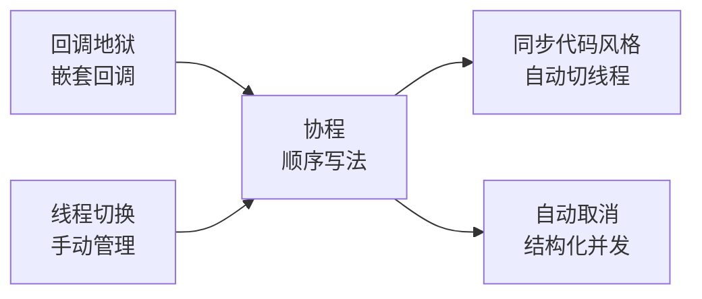
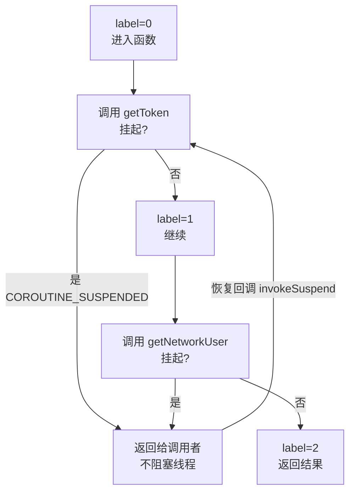
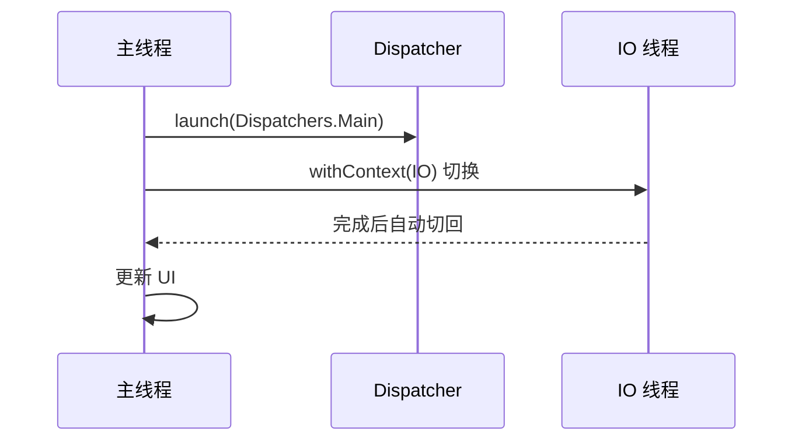
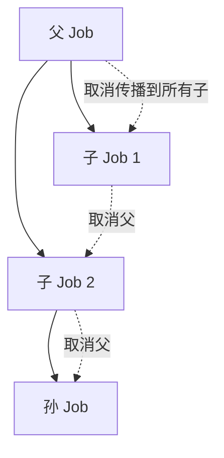
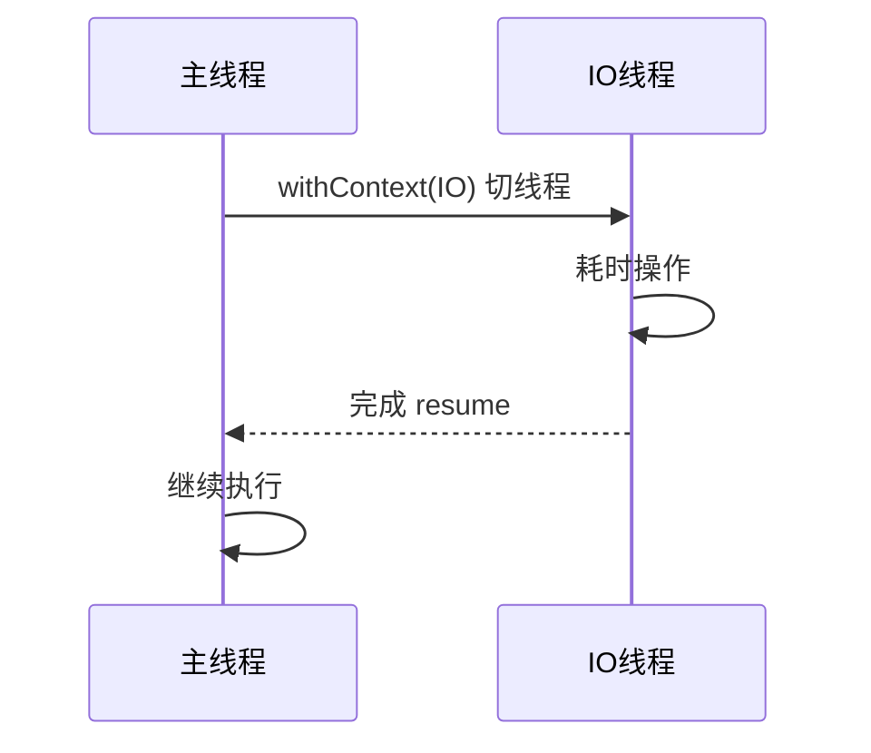

# 协程原理深入

> 为什么协程"看起来同步、跑起来异步"?挂起函数到底做了什么?本文从编译原理(CPS/状态机)、运行时(调度器/上下文)深入协程本质。

## 一、协程解决什么问题

协程解决的问题的整体流程如下：



线程与协程的对比说明如下：

| 对比 | 线程 | 协程 |
|------|------|------|
| 单位 | 操作系统线程 | 用户态协程 |
| 切换成本 | 高(内核态) | 低(用户态) |
| 数量级 | 千级别 | 百万级别 |
| 阻塞 | 阻塞线程 | 挂起不阻塞 |
| 取消 | 手动/interrupt | 结构化自动取消 |

## 二、挂起函数的本质:CPS + 状态机

### 2.1 suspend 关键字编译后变成什么?

suspend 函数编译前后的等价写法如下：

::: code-tabs

@tab:active Java

```java
// 等价写法:回调 + 状态标记(Java 无挂起函数,用回调表达挂起点)
public void fetchUser(long id, Callback<User> callback) {
    getToken(new Callback<String>() {          // 挂起点 1(回调)
        @Override
        public void onSuccess(String token) {
            getNetworkUser(id, token, new Callback<User>() {   // 挂起点 2
                @Override
                public void onSuccess(User user) {
                    callback.onSuccess(user);
                }
            });
        }
    });
}
```

@tab Kotlin

```kotlin
// 源码:挂起函数
suspend fun fetchUser(id: Long): User {
    val token = getToken()        // 挂起点 1
    val user = getNetworkUser(id, token)   // 挂起点 2
    return user
}
```

:::

**编译后(简化 CPS 变换)**:

::: code-tabs

@tab:active Java

```java
// CPS 变换后的等价结构(示意):回调 + 状态机
public Object fetchUser(long id, Continuation<User> cont) {
    // ① 把函数体拆成状态机:每个挂起点一个状态
    // ② 参数追加 Continuation(回调)
    // ③ 返回值改成 Object(结果或 COROUTINE_SUSPENDED 标记)
    class FetchUserStateMachine extends CoroutineImpl {
        int label = 0;
        @Override
        public Object invokeSuspend(Object result) {
            switch (label) {
                case 0:
                    label = 1; token = getToken(this);
                    if (token == COROUTINE_SUSPENDED) return token;
                case 1:
                    label = 2; user = getNetworkUser(id, token, this);
                    if (user == COROUTINE_SUSPENDED) return user;
                case 2:
                    return user;
            }
        }
    }
}
```

@tab Kotlin

```kotlin
fun fetchUser(id: Long, cont: Continuation<User>): Any? {
    // ① 把函数体拆成状态机:每个挂起点一个状态
    // ② 参数追加 Continuation(回调)
    // ③ 返回值改成 Any?(结果或 COROUTINE_SUSPENDED 标记)
    class FetchUserStateMachine : CoroutineImpl(cont) {
        var label = 0
        override fun invokeSuspend(result: Result<Any?>): Any? {
            when (label) {
                0 -> { label = 1; token = getToken(this); if (token == COROUTINE_SUSPENDED) return token }
                1 -> { label = 2; user = getNetworkUser(id, token, this); if (user == COROUTINE_SUSPENDED) return user }
                2 -> return user
            }
        }
    }
}
```

:::

挂起与恢复的状态机流程如下：



> **挂起的本质**:函数执行到挂起点,**不是阻塞等待**,而是**立即返回 COROUTINE_SUSPENDED**,把"剩余代码"封装成 Continuation 存起来;异步任务完成后调用 continuation.resume() 恢复执行。线程在此期间可以干别的——这就是"非阻塞"。

### 2.2 挂起 vs 阻塞

阻塞与挂起的对比说明如下：

| 行为 | 阻塞(Thread.sleep) | 挂起(delay) |
|------|-------------------|-------------|
| 线程 | 占用线程不能做别的 | 释放线程 |
| 底层 | 内核休眠 | 回调 + 状态机 |
| 性能 | 高成本 | 几乎零成本 |
| 代码位置 | 任意 | 仅 suspend 函数/协程内 |

## 三、调度器:谁在哪个线程跑

各调度器的标准写法如下：

::: code-tabs

@tab:active Java

```java
// 等价写法:线程池 + 回调(协程调度器对应的 Java 方案)
ExecutorService defaultPool = Executors.newFixedThreadPool(4);  // 对应 Dispatchers.Default(CPU 密集型)
ExecutorService ioPool = Executors.newCachedThreadPool();       // 对应 Dispatchers.IO(网络/磁盘)
Handler mainHandler = new Handler(Looper.getMainLooper());      // 对应 Dispatchers.Main(UI 操作)

// 切换线程:提交到 IO 线程池,完成后切回主线程(对应 withContext)
public void loadData(final Callback<Data> callback) {
    ioPool.execute(() -> {
        Data data = networkService.fetch();   // 在 IO 线程执行
        mainHandler.post(() -> callback.onSuccess(data));  // 完成后自动回到调用方线程
    });
}
```

@tab Kotlin

```kotlin
// 调度器:决定协程运行的线程池
Dispatchers.Main      // Android 主线程(UI 操作)
Dispatchers.IO        // IO 线程池(网络/磁盘)
Dispatchers.Default   // CPU 密集型线程池
Dispatchers.Unconfined   // 不限制(少用)

// 切换线程:withContext(挂起但不阻塞)
suspend fun loadData(): Data = withContext(Dispatchers.IO) {
    // 在 IO 线程执行,完成后自动回到调用方线程
    networkService.fetch()
}
```

:::

withContext 切换线程的时序如下：



### Dispatchers 实现原理

各 Dispatchers 的底层实现说明如下：

| 调度器 | 底层 | 说明 |
|--------|------|------|
| Main | Handler(Looper) | 通过 Handler post 到主线程 |
| IO | 线程池(上限 64) | 复用 Default 线程池,限流 |
| Default | 线程池(核心数) | CPU 密集型 |
| 自定义 | CoroutineDispatcher | 可定制限流/优先级 |

## 四、协程上下文与 Job

协程上下文与 Job 的等价写法如下：

::: code-tabs

@tab:active Java

```java
// 等价写法:线程池 + Future(组合配置)
ExecutorService executor = Executors.newFixedThreadPool(4);   // 对应 Dispatchers.IO

// 对应 Job:Future 管理任务生命周期 + 取消
Future<?> job = executor.submit(() -> { ... });
job.cancel(true);          // 对应 Job.cancel()(取消任务)

// 对应 CoroutineName:命名线程便于调试
ThreadFactory factory = r -> new Thread(r, "load");           // 调试名称

// 对应 CoroutineExceptionHandler:统一异常处理
Thread.setDefaultUncaughtExceptionHandler((t, e) -> Log.e("TAG", "异常", e));
```

@tab Kotlin

```kotlin
// CoroutineContext = 多个元素的集合
launch(
    context = Dispatchers.IO + CoroutineName("load") + SupervisorJob()
) { ... }

// 关键元素
Job:               // 协程生命周期 + 父子层级 + 取消
CoroutineDispatcher: // 线程调度
CoroutineName:     // 调试名称
CoroutineExceptionHandler:  // 异常处理
```

:::

### Job 层级与取消传播

Job 层级的构成关系如下：



取消传播的行为说明如下：

| 行为 | 说明 |
|------|------|
| 父取消 → 子全部取消 | 结构化并发保证 |
| 子失败 → 父取消 | launch 默认传播 |
| 子失败 → 父不受影响 | SupervisorJob(隔离) |
| 子取消 → 父不受影响 | 正常行为 |

## 五、协程的执行模型

协程执行模型的完整示例代码如下：

::: code-tabs

@tab:active Java

```java
// 等价写法:线程池 + 回调(完整例子)
public static void main(String[] args) {
    ExecutorService ioExecutor = Executors.newCachedThreadPool();
    Handler mainHandler = new Handler(Looper.getMainLooper());
    System.out.println("开始: " + Thread.currentThread().getName());

    // 对应 withContext(Dispatchers.IO):IO 线程执行耗时操作
    ioExecutor.execute(() -> {
        try {
            Thread.sleep(1000);   // 对应 delay(1000)(阻塞 IO 线程,该线程可被其他任务使用)
            String result = "数据";
            // 回到原上下文继续
            mainHandler.post(() -> System.out.println("结果: " + result));
        } catch (InterruptedException e) {
            Thread.currentThread().interrupt();
        }
    });
}
```

@tab Kotlin

```kotlin
// 一个完整例子
fun main() = runBlocking {
    println("开始: ${Thread.currentThread().name}")

    val result = withContext(Dispatchers.IO) {
        // 1. 挂起主线程协程(不阻塞主线程)
        // 2. 在 IO 线程执行耗时操作
        delay(1000)   // 挂起,IO 线程空闲可做别的
        "数据"
    }

    println("结果: $result")   // 回到原上下文继续
}
```

:::

withContext 切线程的完整时序如下：



## 六、高频面试题

### Q1：协程的挂起(suspend)是什么意思?和线程阻塞有什么区别?
::: details 查看答案
挂起是"暂停执行但不占线程":函数执行到挂起点时立即返回 COROUTINE_SUSPENDED,把剩余代码存为 Continuation,线程释放去做别的;异步完成后再 resume 恢复。线程阻塞是"占着线程等":Thread.sleep 让线程休眠,不能执行其他任务。挂起底层是回调+状态机,成本极低,可支撑百万协程;阻塞占用线程资源,成本高。
:::

### Q2：suspend 函数编译后变成了什么?
::: details 查看答案
编译时 Kotlin 编译器做 CPS(Continuation Passing Style)变换:① 函数追加 Continuation 参数(回调);② 函数体拆成状态机(每个挂起点一个状态,用 label 记录);③ 返回类型变为 Any?(结果或 COROUTINE_SUSPENDED)。每次执行到挂起点返回 COROUTINE_SUSPENDED,恢复时通过 invokeSuspend 按 label 继续执行剩余代码。这就是协程"非阻塞 + 顺序写法"的编译基础。
:::

### Q3：withContext 和 launch 的区别?
::: details 查看答案
withContext:挂起函数,切换上下文执行一段代码并**返回结果**,执行完成后自动恢复调用方上下文,不创建新协程(同一协程内切换);launch:创建**新协程**启动协程体,不阻塞调用方,返回 Job。典型用法:withContext(Dispatchers.IO) 做耗时操作拿结果;launch 启动独立异步任务(如发事件)。用 withContext 而非 launch+join 是避免多余协程开销。
:::

### Q4：协程的取消是怎么实现的?为什么 delay 能响应取消?
::: details 查看答案
取消通过 Job.cancel() 传播:父 Job 取消时子 Job 全部取消。实现:协程在挂起点检查取消状态,取消时抛出 CancellationException 停止执行。delay/suspendCancellableCoroutine 等挂起函数内部注册了取消回调,取消时立即恢复并抛异常。注意:CPU 密集循环(无挂起点)不自动响应取消,需检查 isActive 或 ensureActive();finally 中做清理,但不能再挂起(可用 NonCancellable)。
:::

### Q5：协程与线程池的关系?协程比线程好在哪?
::: details 查看答案
协程最终跑在线程上:调度器把协程体派发到线程池执行(IO/Default/Main)。优势:① 挂起替代阻塞,线程利用率高(100 个线程可支撑上万并发任务);② 顺序代码风格,无回调地狱;③ 结构化并发,生命周期与取消自动管理;④ 上下文切换成本低(用户态状态机 vs 内核线程切换);⑤ 内置超时/并发限制/组合等高级工具(withTimeout/async/awaitAll)。但 CPU 密集型计算仍靠线程/线程池并行。
:::

## 小结

- 协程 = 用户态轻量任务,挂起不阻塞,非阻塞的本质是回调+状态机
- suspend 函数编译:追加 Continuation + 状态机拆分 + COROUTINE_SUSPENDED 标记
- Dispatchers 决定线程,withContext 切换上下文并返回结果
- Job 层级实现结构化并发与取消传播
- 取消在挂起点生效,需 isActive/ensureActive 配合
- 协程底层仍是线程池,只是把"等"变成了"让"

> 进阶阅读：[协程 Flow 进阶](/network/coroutine/flow-advanced.md) | [结构化并发与作用域](/network/coroutine/structured-concurrency.md) | [Retrofit 动态代理原理](/network/http/retrofit-source.md)
