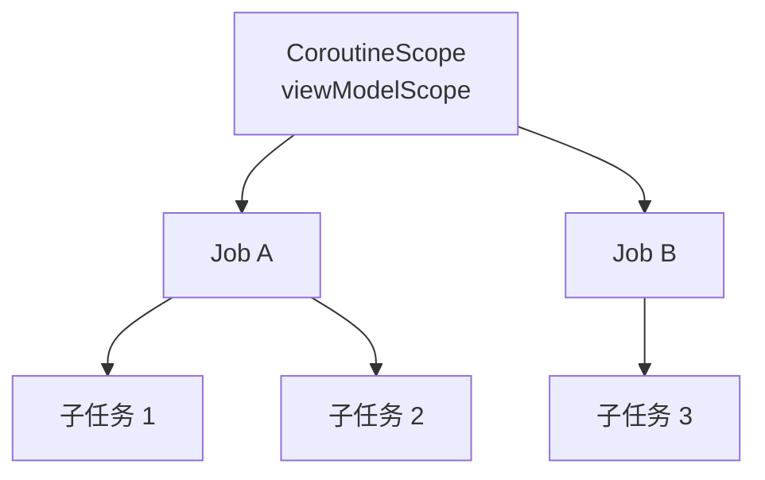
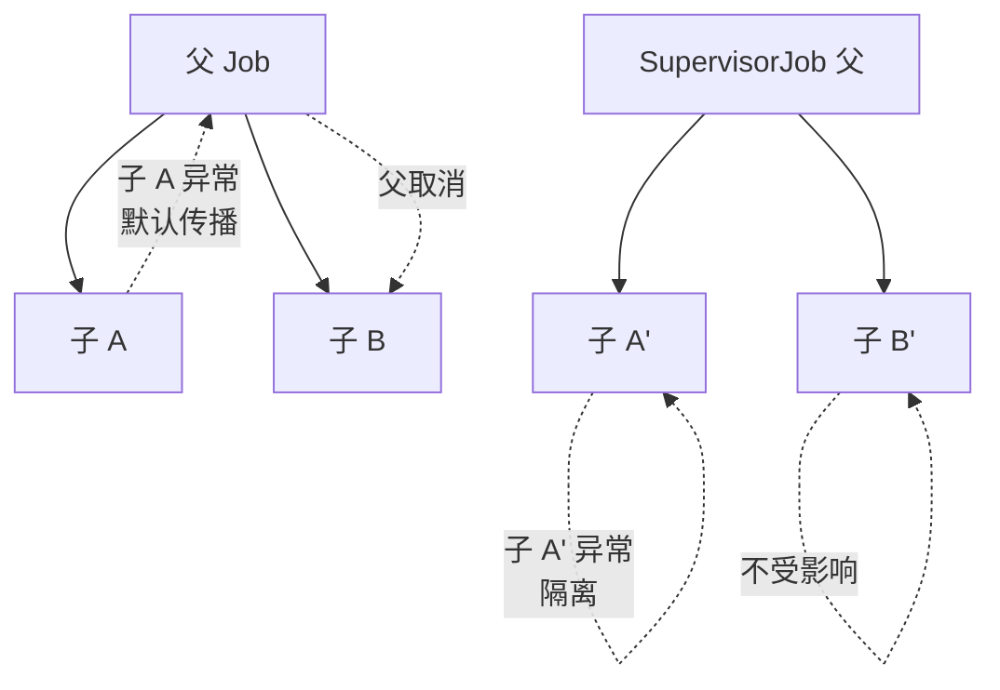

# 结构化并发与作用域

> 协程最强大的特性不是"轻量",而是**结构化并发**:协程的生命周期、取消、异常遵循代码结构自动管理。本文深入 Scope/Job/取消传播与并发组合的最佳实践。

## 一、什么是结构化并发

**原则**:协程必须在其父作用域中启动,父作用域结束,子协程自动取消。



| 好处 | 说明 |
|------|------|
| 自动取消 | 页面销毁 → 协程全部取消,无泄漏 |
| 错误传播 | 子协程异常按结构传播 |
| 生命周期绑定 | scope 生命周期 = 业务生命周期 |
| 可观察 | 层级结构清晰,调试方便 |

## 二、作用域生命周期绑定

::: code-tabs

@tab:active Java

```java
// 等价写法:回调 + 生命周期管理(无协程作用域,手动管理)
public class MainActivity extends ComponentActivity {
    @Override
    protected void onCreate(Bundle savedInstanceState) {
        // ① 对应 viewModelScope:ViewModel 销毁时自动取消(用回调 + 生命周期观察)
        viewModel.loadData(new Callback<Data>() {
            @Override public void onSuccess(Data data) { render(data); }
        });

        // ② 对应 lifecycleScope:只在 STARTED 时活跃
        getLifecycle().addObserver(new LifecycleEventObserver() {
            @Override
            public void onStateChanged(@NonNull LifecycleOwner source, @NonNull Lifecycle.Event event) {
                if (event == Lifecycle.Event.ON_START) { /* 只在 STARTED 时活跃 */ }
            }
        });
    }
}

// ③ 自定义作用域:手动管理(线程池 + 关闭)
class MyScope {
    private final ExecutorService executor = Executors.newSingleThreadExecutor();

    public void onDestroy() {
        executor.shutdownNow();   // 手动取消/关闭
    }
}
```

@tab Kotlin

```kotlin
// Android 中常用作用域
class MainActivity : ComponentActivity() {
    override fun onCreate(savedInstanceState: Bundle?) {
        // ① viewModelScope:ViewModel 销毁自动取消
        viewModelScope.launch { loadData() }

        // ② lifecycleScope:生命周期到达 DESTROYED 取消
        lifecycleScope.launch {
            repeatOnLifecycle(Lifecycle.State.STARTED) {
                // 只在 STARTED 时活跃
            }
        }
    }
}

// ③ 自定义作用域:手动管理
class MyScope {
    val scope = CoroutineScope(SupervisorJob() + Dispatchers.Main)

    fun onDestroy() {
        scope.cancel()   // 手动取消
    }
}
```

:::

| 作用域 | 生命周期 | 用途 |
|--------|---------|------|
| `viewModelScope` | ViewModel 清除时 | 业务逻辑/状态加载 |
| `lifecycleScope` | Lifecycle 销毁时 | UI 相关短任务 |
| `repeatOnLifecycle` | STARTED/RESUMED 区间 | 安全的 UI 收集 |
| `rememberCoroutineScope` | Composable 退出时 | Compose 中启动协程 |

## 三、Job 层级与取消传播

### 3.1 Job 关系

::: code-tabs

@tab:active Java

```java
// 等价写法:Future/线程池管理父子任务
ExecutorService scope = Executors.newFixedThreadPool(4);

// 启动任务返回 Future,可管理生命周期
Future<?> parentJob = scope.submit(() -> {
    Future<?> jobA = scope.submit(() -> taskA());   // 子任务 A
    Future<?> jobB = scope.submit(() -> taskB());   // 子任务 B
});
parentJob.cancel(true);   // 取消父 → 子任务也受影响(线程池关闭需自行管理)

// 子任务取消 → 父不受影响
Future<?> job = scope.submit(() -> taskA());
job.cancel(true);      // 只取消 taskA
// 继续执行
```

@tab Kotlin

```kotlin
// 启动协程返回 Job,父子自动关联
val parentJob = scope.launch {
    launch { taskA() }    // 子 Job
    launch { taskB() }    // 子 Job
}
parentJob.cancel()   // 取消父 → 子全部取消

// 子协程取消 → 父不受影响
scope.launch {
    val job = launch { taskA() }
    job.cancel()      // 只取消 taskA
    // 继续执行
}
```

:::

### 3.2 取消传播规则

| 场景 | 行为 |
|------|------|
| 父 Job.cancel() | 所有子 Job 递归取消 |
| 子协程抛异常 | 默认向上传播,父及兄弟全部取消 |
| SupervisorJob 下子异常 | 只取消自己,父与兄弟不受影响 |
| 子 Job.cancel() | 不影响父与兄弟 |
| 协程被取消后挂起 | 抛 CancellationException |



## 四、SupervisorJob 与异常隔离

::: code-tabs

@tab:active Java

```java
// 等价写法:独立线程池隔离任务(一个任务失败不影响其他)
ExecutorService scope = Executors.newFixedThreadPool(2);

// 每个任务独立提交,互不影响
scope.execute(() -> {
    throw new RuntimeException("任务 A 失败");   // 只影响自己
});
scope.execute(() -> {
    try { Thread.sleep(100); } catch (InterruptedException ignored) {}
    System.out.println("任务 B 正常执行");       // ✓ 不受影响
});

// 注意:协程的 SupervisorJob 让子任务失败互不传播,线程池天然是隔离的
```

@tab Kotlin

```kotlin
// 场景:一个协程失败不应影响其他任务
val scope = CoroutineScope(SupervisorJob() + Dispatchers.IO)

scope.launch {
    throw RuntimeException("任务 A 失败")   // 只影响自己
}
scope.launch {
    delay(100)
    println("任务 B 正常执行")               // ✓ 不受影响
}

// 对比:普通 Job 下,任务 A 失败会取消整个作用域
// 注意:viewModelScope 内部就是 SupervisorJob + Main
```

:::

| 场景 | 用 Job | 用 SupervisorJob |
|------|--------|-----------------|
| 任务组必须全部成功 | ✓ | |
| 独立任务(互不影响) | | ✓ |
| ViewModel 多任务 | | ✓(官方默认) |
| 并发请求(一个失败全部取消) | ✓ | |

## 五、async/await 组合并发

::: code-tabs

@tab:active Java

```java
// 等价写法:ExecutorService + Future(并发执行,等待全部结果)
public Dashboard loadDashboard() throws ExecutionException, InterruptedException {
    ExecutorService scope = Executors.newFixedThreadPool(3);
    try {
        Future<User> userFuture = scope.submit(() -> fetchUser());   // 并行
        Future<Feed> feedFuture = scope.submit(() -> fetchFeed());
        Future<Stats> statsFuture = scope.submit(() -> fetchStats());

        // 并行执行,全部完成返回(阻塞等待各结果)
        return new Dashboard(
            userFuture.get(),
            feedFuture.get(),
            statsFuture.get()
        );
    } finally {
        scope.shutdown();
    }
}
```

@tab Kotlin

```kotlin
// 并发执行多个任务,等待全部结果
suspend fun loadDashboard(): Dashboard {
    coroutineScope {              // 结构化:异常/取消按层级传播
        val userDeferred = async { fetchUser() }
        val feedDeferred = async { fetchFeed() }
        val statsDeferred = async { fetchStats() }

        // 并行执行,全部完成返回
        Dashboard(
            user = userDeferred.await(),
            feed = feedDeferred.await(),
            stats = statsDeferred.await()
        )
    }
}
```

:::

### 并发 API 对比

| API | 行为 | 场景 |
|-----|------|------|
| `async { } + await()` | 并发执行,收集结果 | 并行请求合并 |
| `coroutineScope { }` | 子任务失败全部取消 | 强一致性组合 |
| `supervisorScope { }` | 子任务失败互相隔离 | 部分成功可接受 |
| `withContext(IO)` | 切换线程执行一段 | 单任务耗时 |
| `launch { }` | 并发但不等待 | 发事件/日志 |
| `awaitAll()` | 批量等待 List 结果 | N 个同构任务 |

## 六、异常处理最佳实践

::: code-tabs

@tab:active Java

```java
// ① 顶层异常处理:UncaughtExceptionHandler
Thread.setDefaultUncaughtExceptionHandler((t, e) ->
    Log.e("TAG", "线程异常: " + e.getMessage())
);

ExecutorService scope = Executors.newFixedThreadPool(2);
scope.execute(() -> {
    throw new IllegalStateException("boom");
});

// ② 局部 try-catch
scope.execute(() -> {
    try {
        Data data = repository.load();
        uiState.setValue(Success.of(data));
    } catch (Exception e) {
        uiState.setValue(Error.of(e.getMessage()));
    }
});

// ③ 方法内处理:返回包装结果
public Result<Data> safeLoad() {
    try {
        return Result.success(repository.load());
    } catch (Exception e) {
        return Result.failure(e);
    }
}
```

@tab Kotlin

```kotlin
// ① 顶层异常处理:CoroutineExceptionHandler
val handler = CoroutineExceptionHandler { _, throwable ->
    Log.e("TAG", "协程异常: ${throwable.message}")
}

val scope = CoroutineScope(SupervisorJob() + Dispatchers.Main + handler)
scope.launch {
    throw IllegalStateException("boom")
}

// ② 局部 try-catch
scope.launch {
    try {
        val data = repository.load()
        uiState.value = Success(data)
    } catch (e: Exception) {
        uiState.value = Error(e.message)
    }
}

// ③ 挂起函数内处理
suspend fun safeLoad(): Result<Data> = runCatching {
    repository.load()
}
```

:::

| 异常处理方式 | 适用 |
|-------------|------|
| try-catch 局部 | 业务可控异常 |
| CoroutineExceptionHandler | 全局兜底(launch 顶层) |
| runCatching / Result | 挂起函数包装 |
| supervisorScope | 隔离部分失败 |
| withTimeout 超时保护 | 防挂死 |

## 七、常见陷阱

| 陷阱 | 说明 | 解决 |
|------|------|------|
| 协程泄漏 | 协程比页面活得久 | 绑定生命周期作用域 |
| GlobalScope 滥用 | 不受控、难取消 | 禁止生产使用 |
| 取消后写 UI | 取消时更新界面 | 检查 isActive/coroutineContext |
| 异常吞掉 | 捕获后无提示 | 记录日志/上报 |
| 重复启动 | 点击多次启动多次请求 | Job 保存 + cancel 再启动 |
| 在 finally 中挂起 | 取消后挂起抛异常 | 用 NonCancellable 包裹 |

::: code-tabs

@tab:active Java

```java
// 防重复提交示例(等价写法)
private Future<?> loadJob;

public void loadData() {
    if (loadJob != null) loadJob.cancel(true);          // 取消上一次
    loadJob = executor.submit(() -> {                   // 重新启动
        uiState.setValue(Loading.INSTANCE);
        try {
            uiState.setValue(Success.of(repository.load()));
        } catch (Exception e) {
            uiState.setValue(Error.of(e));
        }
    });
}
```

@tab Kotlin

```kotlin
// 防重复提交示例
private var loadJob: Job? = null

fun loadData() {
    loadJob?.cancel()                       // 取消上一次
    loadJob = viewModelScope.launch {       // 重新启动
        uiState.value = Loading
        uiState.value = try {
            Success(repository.load())
        } catch (e: Exception) {
            Error(e)
        }
    }
}
```

:::

## 八、高频面试题

### Q1：什么是结构化并发?为什么重要?
::: details 查看答案
结构化并发:协程必须在作用域中启动,作用域负责管理其生命周期——作用域结束自动取消所有子协程,子协程异常按结构向上传播。重要性:① 防止协程泄漏(页面销毁任务还在跑);② 取消自动传播,无需手动管理;③ 错误处理符合直觉(代码块内异常按块传播);④ 代码结构与并发结构一致,可读可维护。GlobalScope 违反该原则,生产环境应避免。
:::

### Q2：SupervisorJob 和普通 Job 的区别?
::: details 查看答案
普通 Job:子协程异常会取消父 Job,进而取消所有兄弟协程(失败扩散);SupervisorJob:子协程异常只取消自己,父与兄弟不受影响(失败隔离)。选择:任务组强一致(全成功才成功)用 Job;独立任务(互不影响)用 SupervisorJob。viewModelScope 内部默认使用 SupervisorJob,所以 ViewModel 中一个任务失败不会影响其他任务。
:::

### Q3：coroutineScope 与 supervisorScope 的区别?
::: details 查看答案
两者都挂起等待所有子协程完成并返回结果。区别在异常传播:coroutineScope 中任一子协程抛异常,整个 scope 取消,异常向外抛出(其余子任务被取消);supervisorScope 中子协程异常不传播,只取消自己,其他子任务继续,异常单独处理。场景:并行请求必须全部成功用 coroutineScope;多个独立任务(如批量上报)用 supervisorScope。
:::

### Q4：async/await 和 launch 有什么区别?什么场景用哪个?
::: details 查看答案
async 启动协程并返回 Deferred,通过 await() 挂起获取结果,适合"并发执行并收集结果"(并行请求、任务拆分合并);launch 启动协程不返回结果,适合"发起即忘"任务(日志、事件、UI 更新)。组合:并发请求用 async+await(或 awaitAll),并行子任务不关心结果用 launch。注意 async 异常在 await() 时抛出,必须 try-catch 或结构化 scope 处理。
:::

### Q5：如何避免协程泄漏?页面销毁时协程一定取消吗?
::: details 查看答案
避免泄漏:① 使用绑定生命周期的作用域(viewModelScope/lifecycleScope/rememberCoroutineScope),不要用 GlobalScope;② 自定义 scope 时在 onDestroy 调用 scope.cancel();③ 长任务检查 isActive 及时退出。页面销毁时:viewModelScope 在 ViewModel.clear() 时取消;lifecycleScope 在 DESTROYED 时取消;但**进程被杀**时无回调,无需担心协程(进程都没了);真正要注意的是 Activity 重建(旋转)场景,协程应绑定 ViewModel 而非 Activity。
:::

## 小结

- 结构化并发:作用域管理生命周期,取消自动传播
- viewModelScope/lifecycleScope 是 Android 标准作用域
- SupervisorJob 隔离子异常,普通 Job 传播异常
- async/await 组合并发,coroutineScope/supervisorScope 控制错误语义
- 顶层异常用 CoroutineExceptionHandler 兜底
- 绑定生命周期 + 检查 isActive 防泄漏

> 进阶阅读：[协程原理深入](/network/coroutine/coroutine-principle.md) | [协程 Flow 进阶](/network/coroutine/flow-advanced.md) | [ViewModel 源码解析](/jetpack/lifecycle-viewmodel/viewmodel-source.md)
