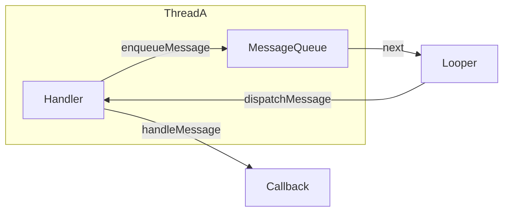

# Handler 消息机制源码解析

> Handler 是 Android 线程间通信的核心，几乎每次面试都会问到它的源码原理。

## 一、整体架构



**四大角色**：

| 角色 | 职责 |
|------|------|
| `Message` | 消息载体（what / obj / arg1 / arg2） |
| `MessageQueue` | 消息队列（单链表，按时间排序） |
| `Looper` | 循环从队列取消息并分发 |
| `Handler` | 发送消息 + 处理消息 |

## 二、Looper 源码核心

::: code-tabs

@tab:active Java

```java
// 每个线程只能有一个 Looper（ThreadLocal 实现）
static final ThreadLocal<Looper> sThreadLocal = new ThreadLocal<>();

public static void prepare() {
    if (sThreadLocal.get() != null) {
        throw new RuntimeException("Only one Looper may be created per thread");
    }
    sThreadLocal.set(new Looper(true));
}

public static void loop() {
    final Looper me = Looper.myLooper();
    for (;;) {                    // 死循环
        Message msg = queue.next(); // 没有消息时阻塞（epoll）
        if (msg == null) return;
        msg.target.dispatchMessage(msg); // 分发消息
        msg.recycleUnchecked();
    }
}
```

@tab Kotlin

```kotlin
// 每个线程只能有一个 Looper（ThreadLocal 实现）
private val sThreadLocal = ThreadLocal<Looper>()

fun prepare() {
    if (sThreadLocal.get() != null) {
        throw RuntimeException("Only one Looper may be created per thread")
    }
    sThreadLocal.set(Looper(true))
}

fun loop() {
    val me = Looper.myLooper()
    while (true) {                    // 死循环
        val msg = queue.next()        // 没有消息时阻塞（epoll）
        if (msg == null) return
        msg.target.dispatchMessage(msg) // 分发消息
        msg.recycleUnchecked()
    }
}
```

:::

## 三、MessageQueue 的阻塞机制

::: code-tabs

@tab:active Java

```java
Message next() {
    for (;;) {
        // 1. 有消息：计算等待时间（按消息时间排序）
        // 2. 无消息：nativePollOnce(ptr, -1) 进入阻塞
        // 3. 底层用 epoll 机制，空闲时休眠不耗 CPU
        nativePollOnce(mPtr, nextPollTimeoutMillis);
    }
}
```

@tab Kotlin

```kotlin
fun next(): Message? {
    while (true) {
        // 1. 有消息：计算等待时间（按消息时间排序）
        // 2. 无消息：nativePollOnce(ptr, -1) 进入阻塞
        // 3. 底层用 epoll 机制，空闲时休眠不耗 CPU
        nativePollOnce(mPtr, nextPollTimeoutMillis)
    }
}
```

:::

::: tip 面试点睛
- `next()` 阻塞时线程挂起，**不消耗 CPU**
- 主线程死循环由系统设计保证（有消息就处理，没消息就休眠）
- `IdleHandler` 在队列空闲时执行（可用于启动优化延迟加载）
:::

## 四、Handler 发送与处理

::: code-tabs

@tab:active Java

```java
// 发送消息
public boolean sendMessageAtTime(Message msg, long uptimeMillis) {
    MessageQueue queue = mQueue;
    return enqueueMessage(queue, msg, uptimeMillis);
}

// 处理消息
public void dispatchMessage(Message msg) {
    if (msg.callback != null) {   // 1. Runnable 优先级最高
        handleCallback(msg);
    } else {
        if (mCallback != null) {  // 2. Handler.Callback 其次
            if (mCallback.handleMessage(msg)) return;
        }
        handleMessage(msg);       // 3. 子类重写的 handleMessage 最后
    }
}
```

@tab Kotlin

```kotlin
// 发送消息
fun sendMessageAtTime(msg: Message, uptimeMillis: Long): Boolean {
    val queue = mQueue
    return enqueueMessage(queue, msg, uptimeMillis)
}

// 处理消息
fun dispatchMessage(msg: Message) {
    if (msg.callback != null) {   // 1. Runnable 优先级最高
        handleCallback(msg)
    } else {
        if (mCallback != null) {  // 2. Handler.Callback 其次
            if (mCallback.handleMessage(msg)) return
        }
        handleMessage(msg)        // 3. 子类重写的 handleMessage 最后
    }
}
```

:::

## 五、ThreadLocal 原理

- 每个线程维护自己的 `ThreadLocalMap`
- `Looper.myLooper()` 通过 ThreadLocal 获取当前线程的 Looper
- 保证 **主线程 Looper 与子线程 Looper 互不干扰**

## 六、内存泄漏问题

::: code-tabs

@tab:active Java

```java
// 错误写法：非静态内部类持有外部 Activity 引用
Handler handler = new Handler() {
    @Override public void handleMessage(Message msg) { ... }
};
```

@tab Kotlin

```kotlin
// 错误写法：非静态内部类持有外部 Activity 引用
val handler = object : Handler() {
    override fun handleMessage(msg: Message) { ... }
}
```

:::

**解决**：使用静态内部类 + `WeakReference`，或在 `onDestroy` 中 `removeCallbacksAndMessages(null)`。

## 七、面试高频追问

1. 为什么主线程 Looper 死循环不会 ANR？
2. `Handler.postDelayed` 的延迟原理？（按时间排序 + 等待）
3. `sendMessage` 与 `post` 的区别？（callback 处理优先级）
4. 子线程如何创建 Handler？（先 `Looper.prepare()` + `Looper.loop()`）
5. `MessageQueue.next()` 为什么用 `nativePollOnce` 而非 `wait()`？

> 进阶阅读：[HandlerThread 使用详解](handlerthread.md) | [线程池与并发](/network/thread/)
