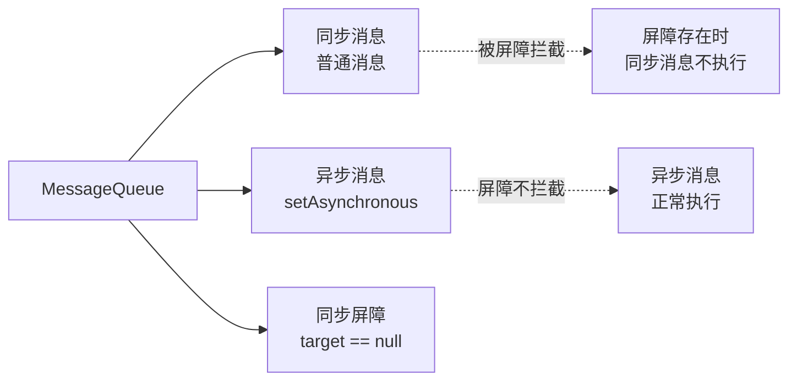
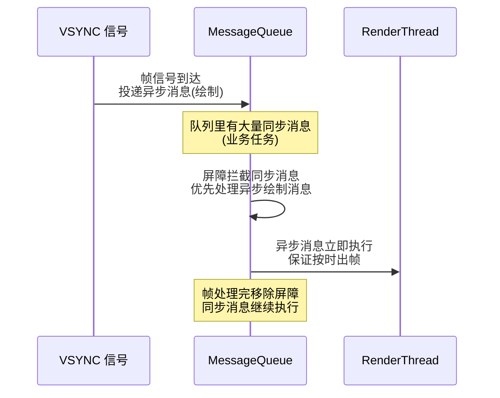
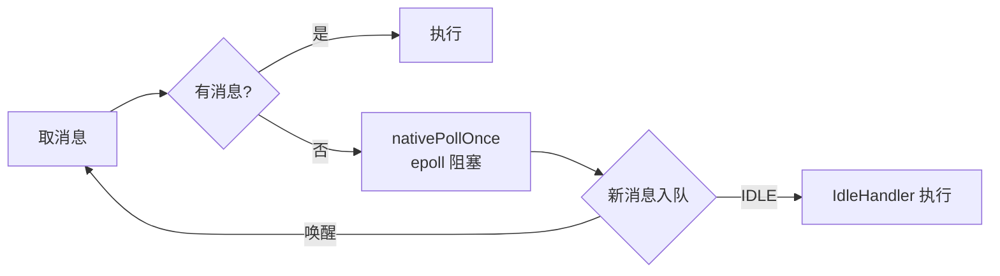

# 消息同步屏障与 IdleHandler

> Handler 消息机制除了 Looper/MessageQueue/Handler 三件套,还有三个进阶神器:**同步屏障(SyncBarrier)、异步消息、IdleHandler**。它们是帧刷新、空闲优化、vsync 对齐的底层支撑。

## 一、消息队列的三种消息



| 类型 | 特征 | 优先级 |
|------|------|--------|
| 同步消息 | 普通 handler 发送 | 被屏障拦截 |
| 异步消息 | `setAsynchronous(true)` | 屏障下仍执行 |
| 同步屏障 | target 为 null | 拦截所有同步消息 |

## 二、同步屏障原理

### 2.1 屏障是什么

> 同步屏障是 target 为 null 的特殊 Message。插入屏障后,**队列中的同步消息全部被"冻结"**,只执行异步消息;移除屏障后恢复。

::: code-tabs

@tab:active Java

```java
// MessageQueue.postSyncBarrier(源码简化)
private int postSyncBarrier(long when) {
    synchronized (this) {
        final int token = mNextBarrierToken++;
        // 创建 target == null 的消息
        Message msg = Message.obtain();
        msg.markInUse();
        msg.when = when;
        msg.arg1 = token;
        // 按时间插入队列头部
        Message prev = null;
        Message p = mMessages;
        if (when != 0) {
            while (p != null && p.when <= when) { prev = p; p = p.next; }
        }
        if (prev != null) { msg.next = p; prev.next = msg; }
        else { msg.next = p; mMessages = msg; }
        return token;
    }
}

// 移除屏障
void removeSyncBarrier(int token) { ... }
```

@tab Kotlin

```kotlin
// MessageQueue.postSyncBarrier(源码简化)
private fun postSyncBarrier(when: Long): Int {
    synchronized(this) {
        val token = mNextBarrierToken++
        // 创建 target == null 的消息
        val msg = Message.obtain()
        msg.markInUse()
        msg.when = when
        msg.arg1 = token
        // 按时间插入队列头部
        var prev: Message? = null
        var p = mMessages
        if (when != 0L) {
            while (p != null && p.when <= when) { prev = p; p = p.next }
        }
        if (prev != null) { msg.next = p; prev.next = msg }
        else { msg.next = p; mMessages = msg }
        return token
    }
}

// 移除屏障
fun removeSyncBarrier(token: Int) { ... }
```

:::

::: code-tabs

@tab:active Java

```java
// 取消息时:遇到屏障跳过同步消息(核心逻辑)
Message next() {
    for (;;) {
        // 1. 检查是否有同步屏障
        if (msg != null && msg.target == null) {
            // 屏障存在:跳过所有同步消息,找异步消息
            do {
                prevMsg = msg;
                msg = msg.next;
            } while (msg != null && !msg.isAsynchronous());
        }
        // 2. 找到可执行消息(异步 或 无屏障时的同步)
    }
}
```

@tab Kotlin

```kotlin
// 取消息时:遇到屏障跳过同步消息(核心逻辑)
fun next(): Message? {
    while (true) {
        // 1. 检查是否有同步屏障
        if (msg != null && msg.target == null) {
            // 屏障存在:跳过所有同步消息,找异步消息
            do {
                prevMsg = msg
                msg = msg.next
            } while (msg != null && !msg.isAsynchronous())
        }
        // 2. 找到可执行消息(异步 或 无屏障时的同步)
    }
}
```

:::

### 2.2 为什么需要屏障?



> **核心用途**:UI 线程在帧刷新前插入同步屏障,保证**绘制相关的异步消息优先执行**,避免被业务消息阻塞导致掉帧。这就是"帧消息与业务消息隔离"的关键机制。

## 三、系统哪里用到了屏障

| 场景 | 说明 |
|------|------|
| Choreographer | 帧回调(FrameCallback)用异步消息投递 |
| View 绘制 | 布局/绘制调度优先于业务消息 |
| 触摸事件 | Input 事件处理高优先级 |
| 动画 | Animation 回调保证帧率 |

::: code-tabs

@tab:active Java

```java
// Choreographer 投递帧回调(使用异步消息)
private void postCallbackDelayedInternal(...) {
    // 同步屏障 + 异步消息
    if (mFramesScheduled) { ... }
    Message msg = mHandler.obtainMessage(MSG_DO_FRAME, callback);
    msg.setAsynchronous(true);       // 异步消息!
    mHandler.sendMessageAtTime(msg, dueTime);
}
```

@tab Kotlin

```kotlin
// Choreographer 投递帧回调(使用异步消息)
private fun postCallbackDelayedInternal(...) {
    // 同步屏障 + 异步消息
    if (mFramesScheduled) { ... }
    val msg = mHandler.obtainMessage(MSG_DO_FRAME, callback)
    msg.isAsynchronous = true        // 异步消息!
    mHandler.sendMessageAtTime(msg, dueTime)
}
```

:::

## 四、IdleHandler 空闲回调

### 4.1 用法

::: code-tabs

@tab:active Java

```java
// 队列空闲时执行(非紧急任务)
Looper.myQueue().addIdleHandler(() -> {
    // 返回 true:继续观察空闲;false:只执行一次后移除
    preloadData();      // 预加载/预创建等
    return false;
});

// 示例:列表预加载
class MainActivity extends AppCompatActivity {
    @Override
    protected void onCreate(Bundle savedInstanceState) {
        super.onCreate(savedInstanceState);
        // 等首帧绘制完成、队列空闲后执行
        Looper.myLooper().getQueue().addIdleHandler(() -> {
            preloadNextPageData();
            return false;
        });
    }
}
```

@tab Kotlin

```kotlin
// 队列空闲时执行(非紧急任务)
Looper.myQueue().addIdleHandler {
    // 返回 true:继续观察空闲;false:只执行一次后移除
    preloadData()      // 预加载/预创建等
    false
}

// 示例:列表预加载
class MainActivity : AppCompatActivity() {
    override fun onCreate(savedInstanceState: Bundle?) {
        super.onCreate(savedInstanceState)
        // 等首帧绘制完成、队列空闲后执行
        Looper.myLooper()?.queue?.addIdleHandler {
            preloadNextPageData()
            false
        }
    }
}
```

:::

### 4.2 IdleHandler 特性

| 特性 | 说明 |
|------|------|
| 触发时机 | 消息队列**无消息可执行**时 |
| 执行顺序 | 在阻塞等待(epoll)之前执行 |
| 返回值 | true=继续观察;false=执行一次移除 |
| 场景 | 预加载、懒初始化、非紧急统计 |
| 风险 | 耗时操作会阻塞队列(延迟后续消息) |

>  **注意**:IdleHandler 执行时主线程仍被占用,不能做耗时操作,否则反而拖慢界面;不执行不代表"卡死",队列非空时不触发。

## 五、MessageQueue 阻塞与唤醒

::: code-tabs

@tab:active Java

```java
// 无消息时阻塞:epoll 等待,不占 CPU
Message next() {
    for (;;) {
        if (msg != null) { ... }
        // 没有消息:进入阻塞
        nativePollOnce(ptr, nextPollTimeoutMillis);   // 阻塞等待(epoll)
    }
}

// 入队时唤醒
boolean enqueueMessage(Message msg, long when) {
    // ...
    if (needWake) {
        nativeWake(mPtr);   // 唤醒阻塞的 next()
    }
}
```

@tab Kotlin

```kotlin
// 无消息时阻塞:epoll 等待,不占 CPU
fun next(): Message? {
    while (true) {
        if (msg != null) { ... }
        // 没有消息:进入阻塞
        nativePollOnce(ptr, nextPollTimeoutMillis)   // 阻塞等待(epoll)
    }
}

// 入队时唤醒
fun enqueueMessage(msg: Message, when: Long): Boolean {
    // ...
    if (needWake) {
        nativeWake(mPtr)   // 唤醒阻塞的 next()
    }
}
```

:::



## 六、高频面试题

### Q1：什么是同步屏障?为什么要引入它?
::: details 查看答案
同步屏障是 target 为 null 的特殊消息,插入队列后拦截所有同步消息,只放行异步消息,直到 removeSyncBarrier 移除。用途:保证高优先级任务(如帧绘制)不被业务消息阻塞——Choreographer 在帧信号到达时插入屏障,用异步消息投递 FrameCallback,绘制优先执行,避免掉帧。
:::

### Q2：如何发送异步消息?
::: details 查看答案
① Message.setAsynchronous(true) 标记消息为异步;② 自定义 Handler 时覆写 createMessage,设置 msg.isAsynchronous = true;③ 系统 Choreographer 内部就是通过 Handler.postCallbackDelayedInternal 用 setAsynchronous(true) 投递帧回调。注意:普通业务代码很少直接发送异步消息,它主要配合同步屏障做优先级调度。
:::

### Q3：IdleHandler 是什么?有什么使用场景?
::: details 查看答案
IdleHandler 是 MessageQueue 的空闲回调:队列没有消息可执行(即将阻塞)时触发。返回 true 保留继续观察,false 执行一次移除。场景:首帧后预加载数据、懒初始化(如启动时延后创建重对象)、空闲时统计上报、回收缓存。注意:回调仍占用主线程,不能做耗时操作;可用于优化启动,但别滥用。
:::

### Q4：MessageQueue 没有消息时会怎样?如何实现阻塞与唤醒?
::: details 查看答案
没有消息时 next() 调用 nativePollOnce 进入阻塞,底层用 Linux epoll 机制等待(不占用 CPU);新消息 enqueueMessage 时如果队列为空或需要立即处理,调用 nativeWake 唤醒阻塞线程。这是"Handler 线程空闲不耗电"的基础。nativePollOnce 还支持超时(延迟消息的等待时间),IdleHandler 在阻塞前执行。
:::

### Q5：屏障和 IdleHandler 在性能优化上怎么用?
::: details 查看答案
屏障:系统用来保证绘制/输入优先(帧率稳定),开发者一般不用手动插屏障;IdleHandler:开发者可用的空闲时机——启动优化中把非关键任务(统计、预加载、数据库预热)延迟到首帧后的空闲期执行,避免阻塞启动;也可在列表滚动停止后做图片预解码。两者本质都是"优先级/时机调度",正确使用能显著提升流畅度与启动速度。
:::

## 小结

- 消息队列三种消息:同步 / 异步 / 屏障(target=null)
- 同步屏障拦截同步消息,保证异步绘制优先
- Choreographer 用屏障+异步消息投递帧回调,防掉帧
- IdleHandler 在队列空闲时执行,用于预加载/懒初始化
- 空闲时 epoll 阻塞,入队 nativeWake 唤醒,不占 CPU
- 进阶用法:启动优化(IdleHandler)、帧率保障(屏障)

> 进阶阅读：[Handler 消息机制源码解析](/network/handler/handler-source.md) | [HandlerThread 详解](/network/handler/handlerthread.md) | [渲染原理与硬件加速](/ui/render/render-principle.md)
