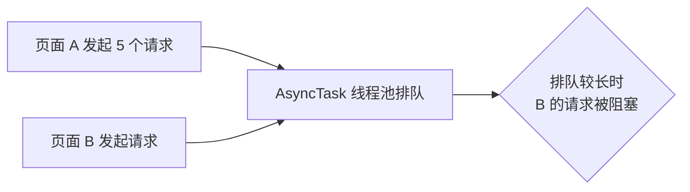
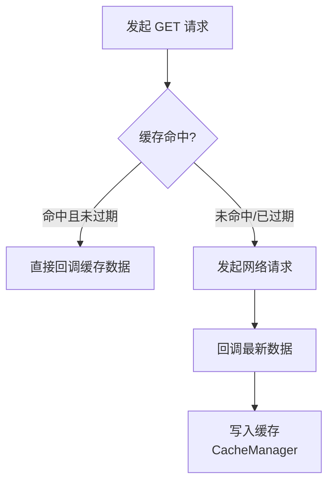
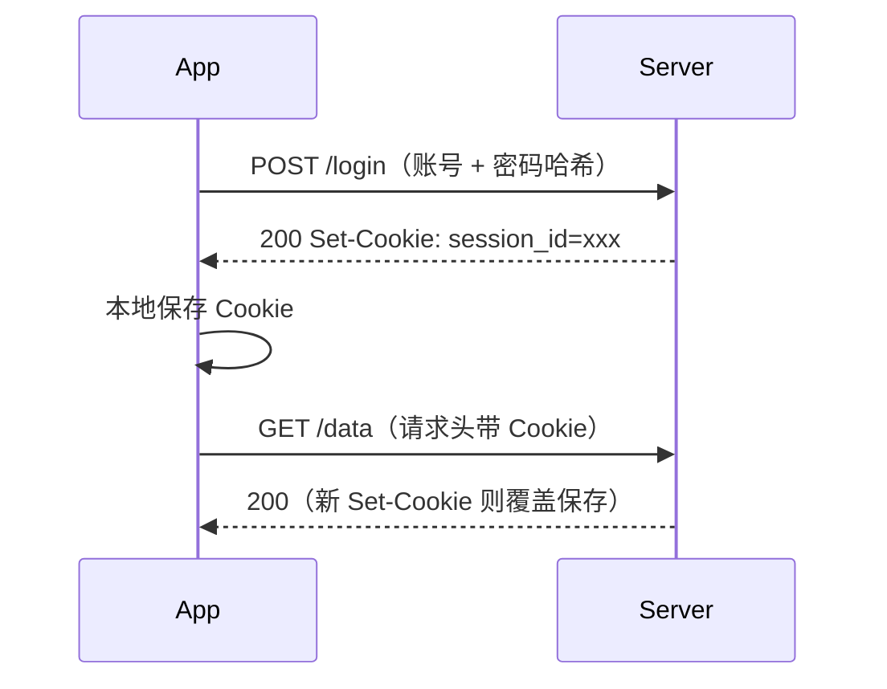

# 网络请求设计与缓存策略

> 网络层设计决定 App 的稳定性与体验：请求怎么封装、错误怎么统一处理、数据怎么缓存、后端没就绪怎么办。本文给出一套完整的网络架构方案。

## 一、Request / Response 规范

### 请求规范

GET 与 POST 的参数传递约定如下：

| 方法 | 参数传递 | 说明 |
|------|----------|------|
| GET | `k=v` 键值对放 URL | 便于做缓存，参数尽量简单类型 |
| POST | 键值对放 Form，复杂数据转 JSON | 修改数据不缓存 |

### 统一 Response 结构

```json
{
  "isError": false,
  "errorType": 0,
  "errorMessage": "",
  "result": { "...": "业务数据" }
}
```

统一 Response 结构中各字段的含义如下：

| 字段 | 含义 |
|------|------|
| `isError` | 是否出错 |
| `errorType` | 错误类型，**0 为成功** |
| `errorMessage` | 错误描述 |
| `result` | 业务数据 |

### 错误类型约定

错误码的正负分区约定如下：

| 错误码区间 | 含义 | 示例 |
|------------|------|------|
| **正数** | 服务端自定义错误 | `1` = Cookie 过期、`2` = 参数错误 |
| **负数** | 客户端网络异常 | `-1` = 无网络、`-2` = 超时 |

::: tip
正负分区的意义：客户端拿到错误码即可判断是**重试/降级**（负数）还是**引导用户**（正数，如重新登录）。
:::

## 二、网络底层封装

### 为什么弃用 AsyncTask

AsyncTask 线程池阻塞请求的完整链路如下：



- AsyncTask 无法灵活控制内部线程池，也无法取消请求
- 页面 A 发起多个请求后跳转 B，A 的请求仍在线程池排队，**阻塞 B 的请求**
- 改用 **`ThreadPoolExecutor` + Runnable + Handler** 原生封装，可控、可取消

网络底层的线程池封装实现如下：

::: code-tabs

@tab:active Java

```java
class NetworkManager {

    private static final NetworkManager INSTANCE = new NetworkManager();

    private final ExecutorService executor = new ThreadPoolExecutor(
        4,                          // corePoolSize
        8,                          // maximumPoolSize
        60L, TimeUnit.SECONDS,      // keepAliveTime
        new LinkedBlockingQueue<>(64)   // workQueue
    );

    private final Handler mainHandler = new Handler(Looper.getMainLooper());

    public <T> void enqueue(Request<T> request, Callback<T> callback) {
        executor.execute(() -> {
            try {
                T result = execute(request); // 网络请求（子线程）
                mainHandler.post(() -> { if (callback != null) callback.onSuccess(result); });
            } catch (Exception e) {
                mainHandler.post(() -> { if (callback != null) callback.onFail(e); });
            }
        });
    }
}
```

@tab Kotlin

```kotlin
class NetworkManager private constructor() {

    private val executor = ThreadPoolExecutor(
        corePoolSize = 4,
        maximumPoolSize = 8,
        keepAliveTime = 60L, TimeUnit.SECONDS,
        workQueue = LinkedBlockingQueue(64)
    )

    private val mainHandler = Handler(Looper.getMainLooper())

    fun <T> enqueue(request: Request<T>, callback: Callback<T>?) {
        executor.execute {
            try {
                val result = execute(request) // 网络请求（子线程）
                mainHandler.post { callback?.onSuccess(result) }
            } catch (e: Exception) {
                mainHandler.post { callback?.onFail(e) }
            }
        }
    }
}
```

:::

### 封装优化点

各封装优化点的做法说明如下：

| 优化点 | 做法 |
|--------|------|
| `onFail` 统一处理 | BaseActivity 定义 `AbstractRequestCallback`，默认统一错误提示，子类按需重写 |
| `UrlConfigManager` | 启动时一次性将 url.xml 读入内存集合，避免频繁读文件；集合为空时重新加载 |
| 可选回调 | 打点等无需结果的请求传 `null` 回调，底层需判空 |
| ProgressBar | 统一定义在 BaseActivity；**不要把 Dialog 的 show/dismiss 封装进网络底层**（子线程不能操作 UI） |

## 三、App 数据缓存设计

### 缓存策略

GET 请求的缓存命中与更新流程如下：



缓存策略的规则说明如下：

| 规则 | 说明 |
|------|------|
| 仅缓存 **GET** | POST 是修改数据，不缓存 |
| 按即时性定过期 | 即时性低的数据缓存 5~10 分钟；频繁变动的数据短缓存或不缓存 |
| URL 作 key | 相同接口不同参数对应不同缓存；**key 需排序保证唯一** |
| 存 SD 卡 | 数据量大，不存内存 |
| 过期时间配置 | url.xml 中为每个接口配置 `Expires` |

### 强制更新

强制更新时跳过缓存的实现如下：

::: code-tabs

@tab:active Java

```java
public void invoke(String url, Map<String, Object> params, boolean forceUpdate, Callback callback) {
    long expires = forceUpdate ? 0L : UrlConfigManager.getExpires(url);
    // expires = 0 跳过缓存，直接走网络
    Object cached = expires > 0 ? CacheManager.read(url) : null;
    if (cached != null) { if (callback != null) callback.onSuccess(cached); return; }
    // ... 发起网络请求，成功后写缓存
    CacheManager.write(url, result);
}
```

@tab Kotlin

```kotlin
fun invoke(url: String, params: Map<String, Any>, forceUpdate: Boolean, callback: Callback?) {
    val expires = if (forceUpdate) 0L else UrlConfigManager.getExpires(url)
    // expires = 0 跳过缓存，直接走网络
    val cached = if (expires > 0) CacheManager.read(url) else null
    if (cached != null) { callback?.onSuccess(cached); return }
    // ... 发起网络请求，成功后写缓存
    CacheManager.write(url, result)
}
```

:::

## 四、MockService：后端未就绪时模拟数据

- url.xml 中通过 `MockClass` 属性指定接口对应的 Mock 类
- `MockService` 基类定义抽象方法 `getJsonData()`，各接口子类返回假 JSON

Mock 数据源的标准写法如下：

::: code-tabs

@tab:active Java

```java
abstract class MockService {
    public abstract String getJsonData();
}

class LoginMockService extends MockService {
    @Override
    public String getJsonData() {
        return "{\"isError\":false,\"errorType\":0,\"result\":{\"token\":\"mock-token\"}}";
    }
}
```

@tab Kotlin

```kotlin
abstract class MockService {
    abstract fun getJsonData(): String
}

class LoginMockService : MockService() {
    override fun getJsonData() = """{"isError":false,"errorType":0,"result":{"token":"mock-token"}}"""
}
```

:::

Mock 与真实请求的切换逻辑如下：

::: code-tabs

@tab:active Java

```java
// 反射实例化：有 MockClass 走假数据，否则走真实请求
String mockClass = UrlConfigManager.getMockClass(url);
if (mockClass != null) {
    MockService service = (MockService) Class.forName(mockClass).getDeclaredConstructor().newInstance();
    callback.onSuccess(service.getJsonData());
} else {
    enqueueRealRequest(url, params, callback);
}
```

@tab Kotlin

```kotlin
// 反射实例化：有 MockClass 走假数据，否则走真实请求
val mockClass = UrlConfigManager.getMockClass(url)
if (mockClass != null) {
    val service = Class.forName(mockClass).getDeclaredConstructor().newInstance() as MockService
    callback.onSuccess(service.getJsonData())
} else {
    enqueueRealRequest(url, params, callback)
}
```

:::

## 五、Cookie 登录与自动登录

### 三种登录场景

1. 登录成功直接进入目标页
2. 跳转 B 页时发现未登录 → 先登录 → **回调后继续跳转**（`startActivityForResult` + `setResult`）
3. 执行某操作时未登录 → 登录 → 返回后继续执行

通过上个页面传入的 `needCallback` 变量整合三种逻辑。

### 不保存明文密码

- 明文密码易被窃取；对称加密也不可靠（源码泄露即可反推密钥）
- 正确方案：密码用**哈希散列（不可逆）**加密存储与传输，服务器比对哈希值

### Cookie / Token 机制

Cookie 登录与自动携带的完整时序如下：



- 登录成功后服务端返回 **Cookie/Token**（HTTP Response header 的 `Set-Cookie`），App 存本地
- 每次请求把本地 Cookie 放入请求 header；每次响应后取出新 Cookie 覆盖保存
- 用 Cookie 机制替代"每次启动模拟登录"，配合验证码等安全机制

## 六、高频面试题

### Q1：为什么 GET 可以缓存而 POST 不缓存？

::: details 查看答案
GET 语义是"获取资源"，参数在 URL 中、无副作用，同一 URL 结果可复用，因此适合缓存；POST 语义是"提交修改"，每次调用都可能改变服务器状态，缓存会导致数据不一致，所以只对 GET 做缓存。
:::

### Q2：缓存 key 为什么需要对参数排序？

::: details 查看答案
URL 参数的顺序不影响服务端结果，但 `a=1&b=2` 与 `b=2&a=1` 是不同的字符串。如果不排序，同一请求会因参数顺序不同命中不同缓存，造成重复存储与缓存失效。排序后同一逻辑请求 key 唯一。
:::

### Q3：为什么不在网络底层封装里直接显示加载 Dialog？

::: details 查看答案
网络请求在子线程执行，而 Dialog 的 show/dismiss 必须在主线程；若把 Dialog 逻辑封装进网络底层，一是线程问题需要额外处理，二是底层无法知道每个页面的 UI 状态（页面可能已销毁），三是违背单一职责。正确做法是 BaseActivity 统一管理进度条，回调中切回主线程再显示。
:::

### Q4：为什么不用 AsyncTask 做网络请求？

::: details 查看答案
AsyncTask 内部线程池不可控（无法调整核心线程数、队列策略），无法取消已提交的请求；多个页面共用同一线程池时，先发起的慢请求会阻塞后续请求；且 AsyncTask 生命周期与 Activity 不同步，容易造成回调更新已销毁页面。应使用可配置的 ThreadPoolExecutor + 协程。
:::

### Q5：如何实现"自动登录"而不泄露密码？

::: details 查看答案
本地不保存明文密码，保存服务端下发的 Cookie/Token（随响应 Set-Cookie 下发）。每次请求携带 Cookie，服务端校验会话有效性；Cookie 过期时用错误码（如 errorType=1）引导用户重新登录。传输阶段密码也要哈希处理，避免被窃听还原。
:::

## 小结

- 请求规范：GET 参数进 URL、POST 进 Body，统一 Response 包装 + 正负错误码分区
- 网络封装：线程池 + 主线程回调、onFail 统一处理、UrlConfigManager 内存缓存配置
- 缓存只做 GET：URL 排序 key + Expires 过期 + forceUpdate 强制更新
- 登录安全：不存明文密码，Cookie/Token 会话机制实现自动登录

> 进阶阅读：[OkHttp 拦截器机制（缓存拦截器）](okhttp-interceptor.md) | [HTTP/HTTPS 协议详解（Cookie 与 Session）](http-protocol.md) | [OkHttp 源码解析（Cache 实现）](okhttp-source.md)
