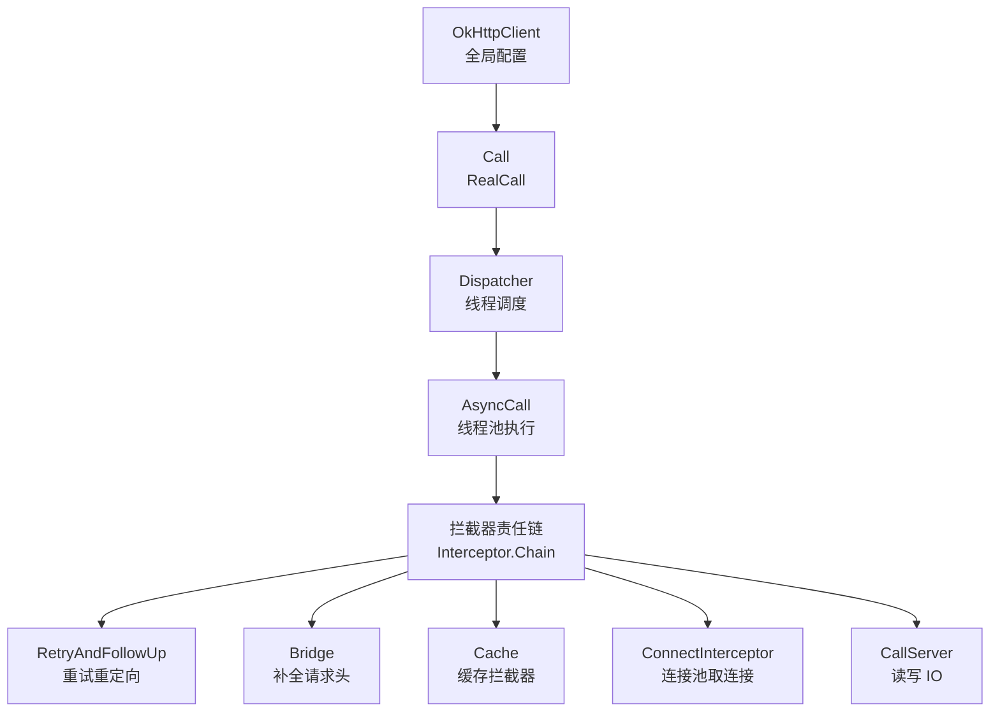
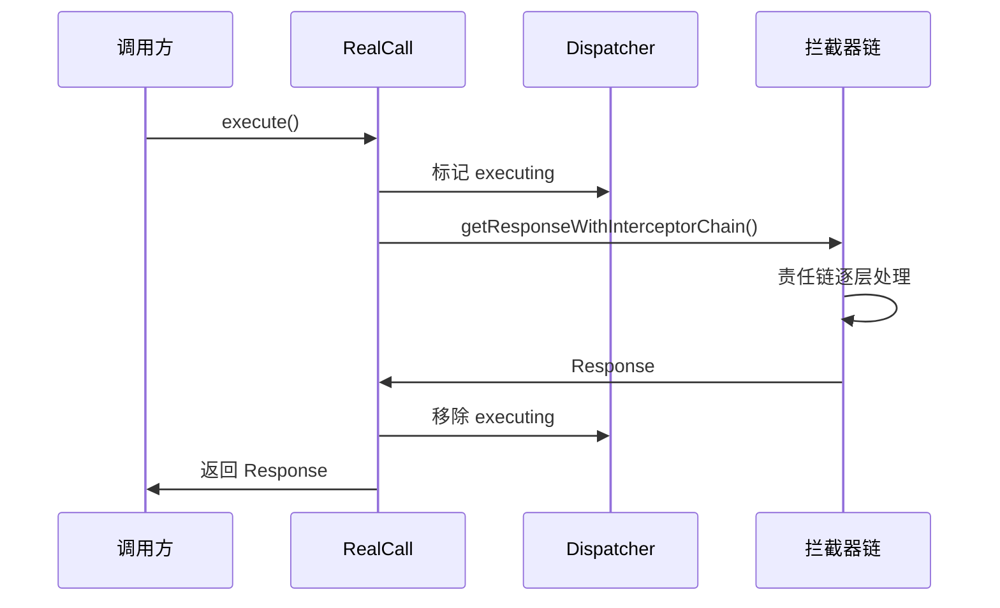
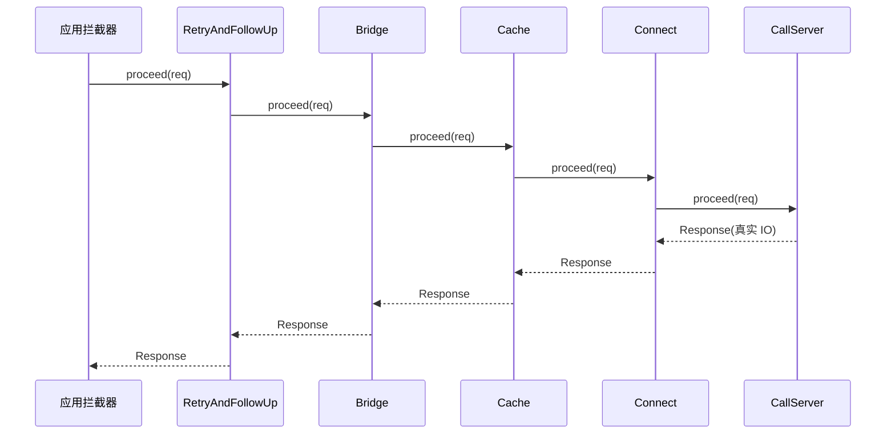

# OkHttp 源码解析

> OkHttp 是 Android 网络请求的事实标准。从 `client.newCall(request).execute()` 到拿到 Response,中间经过 Dispatcher 调度、拦截器责任链、连接池复用。本文源码级拆解 OkHttp 核心设计。

## 一、OkHttp 整体架构



| 组件 | 职责 |
|------|------|
| OkHttpClient | 全局配置(超时/缓存/拦截器/连接池) |
| Call | 一次请求的抽象(execute 同步 / enqueue 异步) |
| Dispatcher | 异步任务调度(线程池 + 队列) |
| Interceptor | 责任链:逐层处理请求 |
| ConnectionPool | 连接复用,减少握手开销 |

## 二、请求执行流程

### 2.1 同步请求 execute



### 2.2 异步请求 enqueue

::: code-tabs

@tab:active Java

```java
// RealCall.enqueue 核心
@Override
public void enqueue(Callback responseCallback) {
    synchronized (this) { ... }
    // 包装成 AsyncCall 交给 Dispatcher
    client.dispatcher().enqueue(new AsyncCall(responseCallback));
}

// Dispatcher.enqueue
void enqueue(AsyncCall call) {
    synchronized (this) {
        readyAsyncCalls.add(call);          // 加入等待队列
        if (!call.get().isRunning()) { ... }
    }
    promoteAndExecute();                    // 尝试执行
}
```

@tab Kotlin

```kotlin
// RealCall.enqueue 核心
override fun enqueue(responseCallback: Callback) {
    synchronized(this) { ... }
    // 包装成 AsyncCall 交给 Dispatcher
    client.dispatcher().enqueue(AsyncCall(responseCallback))
}

// Dispatcher.enqueue
fun enqueue(call: AsyncCall) {
    synchronized(this) {
        readyAsyncCalls.add(call)          // 加入等待队列
        if (!call.get().isRunning()) { ... }
    }
    promoteAndExecute()                    // 尝试执行
}
```

:::

## 三、Dispatcher 线程调度

::: code-tabs

@tab:active Java

```java
public final class Dispatcher {
    // 异步任务执行线程池:核心线程 0,最大 Integer.MAX,保活 60s
    private ExecutorService executorService;

    private int maxRequests = 64;           // 同时执行任务上限
    private int maxRequestsPerHost = 5;     // 每主机并发上限

    private final Deque<AsyncCall> readyAsyncCalls = new ArrayDeque<>();   // 等待队列
    private final Deque<AsyncCall> runningAsyncCalls = new ArrayDeque<>(); // 执行队列
    private final Deque<RealCall> runningSyncCalls = new ArrayDeque<>();   // 同步队列

    private void promoteAndExecute() {
        // 从等待队列取出任务,满足条件则启动
        while (executableCalls < maxRequests && !readyAsyncCalls.isEmpty()) {
            AsyncCall call = readyAsyncCalls.poll();
            if (runningCallsForHost(call) < maxRequestsPerHost) {
                runningAsyncCalls.add(call);
                executorService.execute(call);   // 线程池执行
            }
        }
    }
}
```

@tab Kotlin

```kotlin
class Dispatcher {
    // 异步任务执行线程池:核心线程 0,最大 Integer.MAX,保活 60s
    private var executorService: ExecutorService? = null

    private var maxRequests = 64           // 同时执行任务上限
    private var maxRequestsPerHost = 5     // 每主机并发上限

    private val readyAsyncCalls = ArrayDeque<AsyncCall>()   // 等待队列
    private val runningAsyncCalls = ArrayDeque<AsyncCall>() // 执行队列
    private val runningSyncCalls = ArrayDeque<RealCall>()   // 同步队列

    private fun promoteAndExecute() {
        // 从等待队列取出任务,满足条件则启动
        while (executableCalls < maxRequests && !readyAsyncCalls.isEmpty()) {
            val call = readyAsyncCalls.poll()
            if (runningCallsForHost(call) < maxRequestsPerHost) {
                runningAsyncCalls.add(call)
                executorService.execute(call)   // 线程池执行
            }
        }
    }
}
```

:::

> **关键设计**:Dispatcher 用两个队列(等待/执行)+ 两个上限(64 总并发、5 每主机)控制并发,避免主机被打爆。

## 四、拦截器责任链

### 4.1 链的构建

::: code-tabs

@tab:active Java

```java
// RealCall.getResponseWithInterceptorChain
Response getResponseWithInterceptorChain() throws IOException {
    List<Interceptor> interceptors = new ArrayList<>();
    interceptors.addAll(client.interceptors());              // ① 应用拦截器(自定义)
    interceptors.add(retryAndFollowUpInterceptor);           // ② 重试与重定向
    interceptors.add(new BridgeInterceptor(client.cookieJar()));   // ③ 桥接(补请求头/压缩)
    interceptors.add(new CacheInterceptor(client.internalCache())); // ④ 缓存
    interceptors.add(new ConnectInterceptor(client));        // ⑤ 连接
    if (!forWebSocket) {
        interceptors.addAll(client.networkInterceptors());   // ⑥ 网络拦截器
    }
    interceptors.add(new CallServerInterceptor(forWebSocket));      // ⑦ 最终 IO
    Interceptor.Chain chain = new RealInterceptorChain(interceptors, ...);
    return chain.proceed(originalRequest);
}
```

@tab Kotlin

```kotlin
// RealCall.getResponseWithInterceptorChain
fun getResponseWithInterceptorChain(): Response {
    val interceptors = mutableListOf<Interceptor>()
    interceptors.addAll(client.interceptors)               // ① 应用拦截器(自定义)
    interceptors.add(retryAndFollowUpInterceptor)          // ② 重试与重定向
    interceptors.add(BridgeInterceptor(client.cookieJar()))       // ③ 桥接(补请求头/压缩)
    interceptors.add(CacheInterceptor(client.internalCache()))    // ④ 缓存
    interceptors.add(ConnectInterceptor(client))           // ⑤ 连接
    if (!forWebSocket) {
        interceptors.addAll(client.networkInterceptors())  // ⑥ 网络拦截器
    }
    interceptors.add(CallServerInterceptor(forWebSocket))  // ⑦ 最终 IO
    val chain = RealInterceptorChain(interceptors, ...)
    return chain.proceed(originalRequest)
}
```

:::

### 4.2 责任链执行模型



> **责任链本质**:每个拦截器在 `proceed()` 前后做处理(前置逻辑 → 调用下一个 → 后置逻辑),像洋葱一样层层包裹。

### 4.3 各拦截器职责

| 拦截器 | 职责 |
|--------|------|
| 自定义应用拦截器 | 日志/鉴权/加密(只调用一次) |
| RetryAndFollowUp | 失败重试、重定向(30x)、切换域名 |
| Bridge | 补全 Content-Length/Header、gzip 解压、Cookie |
| Cache | 磁盘缓存命中/写入(基于 HTTP 缓存头) |
| Connect | 从连接池取连接或新建,建立 TLS |
| 网络拦截器 | 每次真实网络请求都调用(可观察重试) |
| CallServer | 写请求、读响应、解析 |

## 五、连接池复用

::: code-tabs

@tab:active Java

```java
public final class ConnectionPool {
    // 空闲连接队列 + 清理线程
    private final Deque<RealConnection> connections = new ArrayDeque<>();

    // 获取连接:复用相同地址的空闲连接
    RealConnection get(Address address, StreamAllocation allocation, Route route) {
        for (RealConnection connection : connections) {
            if (connection.isEligible(address, route)) {
                allocation.acquire(connection, ...);
                return connection;
            }
        }
        return null;   // 无可用 → 新建
    }
}
```

@tab Kotlin

```kotlin
class ConnectionPool {
    // 空闲连接队列 + 清理线程
    private val connections = ArrayDeque<RealConnection>()

    // 获取连接:复用相同地址的空闲连接
    fun get(address: Address, allocation: StreamAllocation, route: Route): RealConnection? {
        for (connection in connections) {
            if (connection.isEligible(address, route)) {
                allocation.acquire(connection, ...)
                return connection
            }
        }
        return null   // 无可用 → 新建
    }
}
```

:::

> **连接池价值**:HTTP 建连成本高(TCP 握手 + TLS 握手),复用连接(Keep-Alive)大幅降低延迟。默认保活 5 分钟、最多 5 个空闲连接,空闲连接由后台线程清理。

## 六、OkHttp 版本演进

| 版本 | 变化 |
|------|------|
| 3.x | 经典 Java 实现,Interceptor 责任链 |
| 4.x | 全面 Kotlin 重写,API 基本兼容 |
| 5.x(预览) | 挂起函数支持、Kotlin 协程集成 |

## 七、高频面试题

### Q1：OkHttp 的异步请求是如何调度的?如何控制并发?
::: details 查看答案
Dispatcher 维护三个队列:readyAsyncCalls(等待)、runningAsyncCalls(执行)、runningSyncCalls(同步)。enqueue 把 AsyncCall 加入等待队列,然后 promoteAndExecute 检查:总并发 < maxRequests(64)且每主机 < maxRequestsPerHost(5)时,从等待队列取出任务交给线程池执行。线程池是核心线程 0、最大线程 Integer.MAX_VALUE、保活 60s 的 SynchronousQueue 线程池。超过上限的任务在等待队列中排队。
:::

### Q2：OkHttp 的拦截器链是如何工作的?
::: details 查看答案
OkHttp 用责任链模式:请求从第一个拦截器开始,每个拦截器调用 chain.proceed(request) 把请求传给下一个,并接收下一个返回的 Response,在 proceed 前后可做处理(前置:加工请求;后置:处理响应)。默认链:应用拦截器 → RetryAndFollowUp(重试重定向) → Bridge(补头/解压) → Cache(缓存) → Connect(连接) → 网络拦截器 → CallServer(IO)。应用拦截器只调用一次,网络拦截器每次真实请求都调用。
:::

### Q3：OkHttp 连接池的作用和原理?
::: details 查看答案
连接池复用 TCP/TLS 连接,避免每次请求重复三次握手/SSL 握手,大幅降低延迟。原理:ConnectionPool 用 Deque 存空闲连接,新请求先查找同地址可复用连接,没有才新建;空闲连接后台线程定期清理(默认保活 5 分钟,最多 5 个空闲连接)。HTTP/1.1 Keep-Alive 与 HTTP/2 多路复用都依赖连接复用。
:::

### Q4：OkHttp 的缓存机制是怎样的?
::: details 查看答案
CacheInterceptor 基于 HTTP 缓存规范:请求前检查缓存(缓存头 Expires/Cache-Control/ETag/Last-Modified),命中且未过期直接返回;过期则发条件请求(If-None-Match/If-Modified-Since),服务器返回 304 则用缓存+更新头,否则用新响应并写入缓存。缓存文件用 DiskLruCache 实现。注意:缓存需要服务器配合返回缓存头,POST 默认不缓存。
:::

### Q5：OkHttp 如何实现重试和重定向?
::: details 查看答案
RetryAndFollowUpInterceptor 在 proceed 抛出 IOException 时判断是否可重试(请求可重发、已建立的连接可重连、非用户取消),最多默认重试 1 次;对 3xx 重定向(301/302/303/307/308)自动跟进 Location 新地址,对 401 带鉴权重试,对 408 超时重试。followUpRequest 决定是否需要跟进,需要则用新请求重新走一遍责任链。
:::

## 小结

- OkHttp = Client + Call + Dispatcher + 拦截器链 + 连接池
- Dispatcher 双队列 + 双上限控制异步并发
- 责任链:应用拦截器 → 重试 → 桥接 → 缓存 → 连接 → 网络拦截器 → IO
- 连接池复用 TCP/TLS,降低握手成本
- 缓存基于 HTTP 缓存头 + DiskLruCache
- 重试/重定向/鉴权都在责任链中统一处理

> 进阶阅读：[OkHttp 拦截器深入](/network/http/okhttp-interceptor.md) | [Retrofit + OkHttp 详解](/network/http/retrofit-okhttp.md) | [Retrofit 动态代理原理](/network/http/retrofit-source.md)
