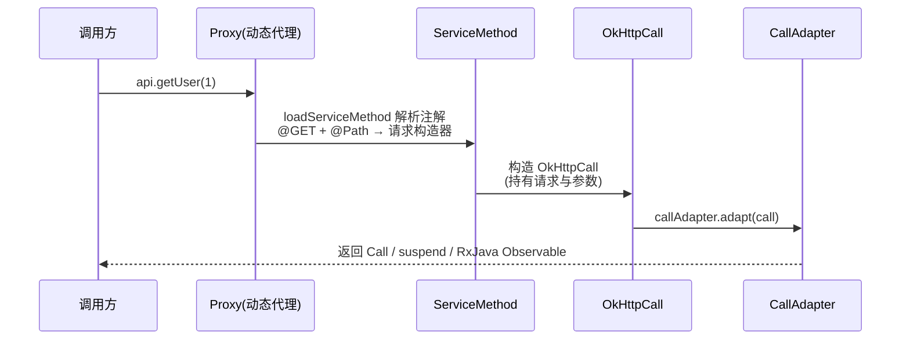
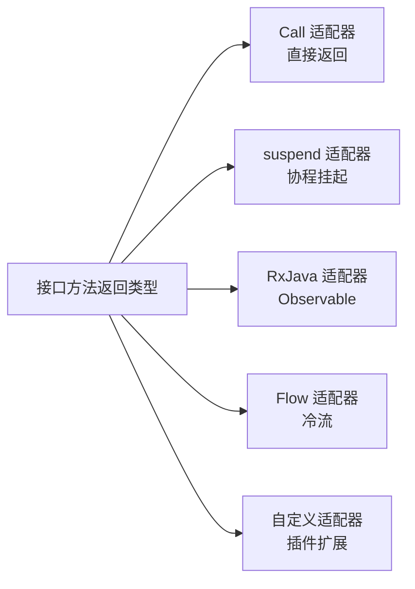
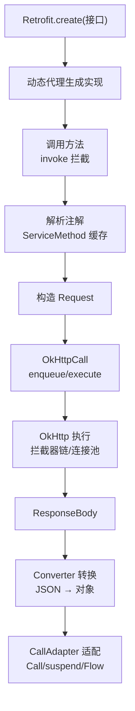

# Retrofit 动态代理原理

> 为什么定义一个接口加几个注解,Retrofit 就能自动发请求?答案在 Java 动态代理 + 注解解析 + 适配器模式。本文彻底拆解 Retrofit 的核心魔法。

## 一、Retrofit 做了什么

Retrofit 接口的定义与使用方式如下：

::: code-tabs

@tab:active Java

```java
public interface ApiService {
    @GET("users/{id}")
    Call<User> getUser(@Path("id") long id);
}

// 使用:一行代码拿到实现
ApiService api = retrofit.create(ApiService.class);
User user = api.getUser(1).execute().body();   // 实际发生了网络请求!
```

@tab Kotlin

```kotlin
interface ApiService {
    @GET("users/{id}")
    suspend fun getUser(@Path("id") id: Long): User
}

// 使用:一行代码拿到实现
val api = retrofit.create(ApiService::class.java)
val user = api.getUser(1)   // 实际发生了网络请求!
```

:::

**问题**:`ApiService` 是接口,没有实现类,`create()` 返回的对象是什么?

**答案**:Retrofit 用 **动态代理** 在运行时生成了接口的实现——所有方法调用都会被拦截,解析注解后构造 OkHttp 请求。

## 二、动态代理核心

动态代理的核心实现如下：

::: code-tabs

@tab:active Java

```java
// Retrofit.create 源码(核心逻辑)
public <T> T create(final Class<T> service) {
    // 校验接口...
    return (T) Proxy.newProxyInstance(
        service.getClassLoader(),
        new Class<?>[]{service},
        new InvocationHandler() {
            @Override
            public Object invoke(Object proxy, Method method, Object[] args) {
                // ① 每个方法调用都进入这里
                ServiceMethod<T> serviceMethod = loadServiceMethod(method);  // 解析注解
                OkHttpCall okHttpCall = new OkHttpCall<>(serviceMethod, args); // 包装参数
                return serviceMethod.callAdapter.adapt(okHttpCall);          // 适配返回类型
            }
        });
}
```

@tab Kotlin

```kotlin
// Retrofit.create 源码(核心逻辑)
fun <T> create(service: Class<T>): T {
    // 校验接口...
    return Proxy.newProxyInstance(
        service.classLoader,
        arrayOf<Class<*>>(service),
        object : InvocationHandler {
            override fun invoke(proxy: Any, method: Method, args: Array<out Any>?): Any {
                // ① 每个方法调用都进入这里
                val serviceMethod = loadServiceMethod<T>(method)  // 解析注解
                val okHttpCall = OkHttpCall<Any>(serviceMethod, args) // 包装参数
                return serviceMethod.callAdapter.adapt(okHttpCall)   // 适配返回类型
            }
        }) as T
}
```

:::

动态代理的完整调用链路如下：



## 三、ServiceMethod:注解 → 请求

ServiceMethod 的核心实现如下：

::: code-tabs

@tab:active Java

```java
final class ServiceMethod {
    final okhttp3.Call.Factory callFactory;   // OkHttpClient
    final CallAdapter<?, ?> callAdapter;       // 返回类型适配器
    final Converter<ResponseBody, ?> responseConverter;  // 响应转换器

    // 把方法注解 + 参数注解解析为 HttpUrl 请求
    Request toRequest(Object[] args) {
        RequestBuilder requestBuilder = ...;
        for (Annotation annotation : methodAnnotations) {
            // @GET/@POST/@PUT... → 请求方法
            // @Path/@Query/@Body/@Header... → 参数绑定
        }
        return requestBuilder.build();
    }
}
```

@tab Kotlin

```kotlin
class ServiceMethod {
    val callFactory: okhttp3.Call.Factory   // OkHttpClient
    val callAdapter: CallAdapter<*, *>       // 返回类型适配器
    val responseConverter: Converter<ResponseBody, *>  // 响应转换器

    // 把方法注解 + 参数注解解析为 HttpUrl 请求
    fun toRequest(args: Array<Any>): Request {
        val requestBuilder = ...
        for (annotation in methodAnnotations) {
            // @GET/@POST/@PUT... → 请求方法
            // @Path/@Query/@Body/@Header... → 参数绑定
        }
        return requestBuilder.build()
    }
}
```

:::

### 注解解析规则

各注解的解析规则说明如下：

| 注解 | 作用 | 示例 |
|------|------|------|
| `@GET/@POST/@PUT/@DELETE/@PATCH/@HEAD` | HTTP 方法 | `@GET("users")` |
| `@Path` | URL 路径参数 | `users/{id}` |
| `@Query` | 查询参数 | `?page=1` |
| `@Body` | 请求体(经 Converter 序列化) | JSON body |
| `@Header` | 请求头 | `@Header("Authorization")` |
| `@Field` + `@FormUrlEncoded` | 表单 | `name=xxx` |
| `@Multipart + @Part` | 文件上传 | `file=@xxx` |

## 四、CallAdapter:返回类型适配

CallAdapter 的核心实现如下：

::: code-tabs

@tab:active Java

```java
// 接口:把 OkHttpCall 适配成各种返回类型
public interface CallAdapter<R, T> {
    Type responseType();          // 响应类型(如 User)
    T adapt(Call<R> call);        // 适配(如 Call → suspend → Observable)
}

// 内置:普通 Call
class DefaultCallAdapterFactory implements CallAdapter.Factory {
    // adapt: 直接返回 call
}

// 协程支持:KotlinExtensions
// suspend 方法 → 内部 await() 挂起等待
```

@tab Kotlin

```kotlin
// 接口:把 OkHttpCall 适配成各种返回类型
interface CallAdapter<R, T> {
    fun responseType(): Type      // 响应类型(如 User)
    fun adapt(call: Call<R>): T   // 适配(如 Call → suspend → Observable)
}

// 内置:普通 Call
class DefaultCallAdapterFactory : CallAdapter.Factory {
    // adapt: 直接返回 call
}

// 协程支持:KotlinExtensions
// suspend 方法 → 内部 await() 挂起等待
```

:::

### 返回类型对照

各返回类型的适配方式说明如下：

| 接口方法返回类型 | 适配方式 |
|-----------------|---------|
| `Call<User>` | 直接返回 Call,手动 enqueue/execute |
| `suspend fun ...: User` | 自动切 IO 线程,await 结果 |
| `suspend fun ...: Response<User>` | 返回完整响应(含状态码) |
| `Observable<User>` (RxJava) | RxJavaCallAdapterFactory |
| `Flow<User>` | FlowCallAdapterFactory |

各返回类型的适配链路如下：



## 五、Converter:响应体转换

Converter 的核心实现如下：

::: code-tabs

@tab:active Java

```java
// 接口:把 ResponseBody 转成目标类型
public interface Converter<F, T> {
    T convert(F value) throws IOException;
}

// Gson 转换器:JSON → 对象
final class GsonResponseBodyConverter<T> implements Converter<ResponseBody, T> {
    @Override
    public T convert(ResponseBody value) throws IOException {
        return gson.fromJson(value.charStream(), type);  // JSON 反序列化
    }
}
```

@tab Kotlin

```kotlin
// 接口:把 ResponseBody 转成目标类型
interface Converter<F, T> {
    @Throws(IOException::class)
    fun convert(value: F): T
}

// Gson 转换器:JSON → 对象
class GsonResponseBodyConverter<T> : Converter<ResponseBody, T> {
    @Throws(IOException::class)
    override fun convert(value: ResponseBody): T {
        return gson.fromJson(value.charStream(), type)  // JSON 反序列化
    }
}
```

:::

常用 Converter 的对比说明如下：

| Converter | 用途 |
|-----------|------|
| GsonConverterFactory | JSON(Gson) |
| MoshiConverterFactory | JSON(Moshi,Kotlin 友好) |
| kotlinx.serialization | Kotlin 原生序列化 |
| SimpleXmlConverterFactory | XML |
| ProtobufConverterFactory | Protobuf |
| 自定义 | 任意格式 |

## 六、Retrofit 整体流程

Retrofit 的整体流程如下：



> **设计精髓**:Retrofit 本身不发网络请求——它把"接口声明"翻译成 OkHttp 的 Request,执行交给 OkHttp;返回类型和响应格式通过 CallAdapter/Converter 插件化扩展,天然支持协程/RxJava/任意序列化。

## 七、高频面试题

### Q1：Retrofit 是如何用动态代理实现接口的?
::: details 查看答案
Retrofit.create() 用 Proxy.newProxyInstance 为接口生成动态代理对象,所有方法调用都进入 InvocationHandler.invoke:① loadServiceMethod(method) 解析方法注解(带缓存);② 把参数封装成 OkHttpCall;③ callAdapter.adapt 适配返回类型。代理对象没有真实实现,方法调用被"翻译"成网络请求。动态代理是 Java 原生能力,Retrofit 在其上叠加了注解解析与适配器体系。
:::

### Q2：Retrofit 如何支持 suspend 函数?
::: details 查看答案
Retrofit 对 suspend 方法做特殊处理:接口方法若有 suspend 修饰(最后一个参数是 Continuation),ServiceMethod 使用 suspend 适配器——内部调用 OkHttp 的 enqueue 异步请求,通过 await() 挂起协程等待结果,完成后 resume。网络请求自动发生在 OkHttp 的线程,结果回到协程上下文,无需手动切线程。响应体转换同样经过 Converter。
:::

### Q3：CallAdapter 和 Converter 的作用和区别?
::: details 查看答案
CallAdapter:适配"如何发起和接收请求",把 OkHttpCall 转成接口声明的返回类型(Call/suspend/Observable/Flow),控制异步模型;Converter:适配"数据格式",把 ResponseBody 转成目标对象、把请求体序列化(JSON/XML/Protobuf)。CallAdapter 决定"怎么调",Converter 决定"怎么转",两者都是插件化扩展点,通过 Factory 注册。
:::

### Q4：Retrofit 请求流程是怎样的?和 OkHttp 什么关系?
::: details 查看答案
Retrofit 把接口方法解析成 OkHttp 的 Request(方法/URL/参数/头),用 OkHttpCall 包装后交给 OkHttp 执行(拦截器责任链、连接池复用、缓存),拿到 ResponseBody 后用 Converter 反序列化为目标对象,再经 CallAdapter 适配返回。Retrofit 是"接口层",OkHttp 是"执行层",Retrofit 自身不做网络 IO。
:::

### Q5：如何自定义一个 CallAdapter?
::: details 查看答案
实现 CallAdapter.Factory:① create 方法中判断返回类型是否匹配(如返回 `MyResult<T>`),不匹配返回 null;② 实现 CallAdapter:responseType() 返回泛型 T,adapt(call) 把 Call 包装成目标类型(可包装为 Result 类、自定义流等);③ 用 Retrofit.Builder().addCallAdapterFactory(factory) 注册。扩展点类似:自定义 Converter 实现 parse 响应为任意格式(如自动解包 data 字段)。
:::

## 小结

- Retrofit 用动态代理把接口方法调用翻译成网络请求
- ServiceMethod 负责解析注解(@GET/@Path/@Query/@Body)
- CallAdapter 适配返回类型(Call/suspend/RxJava/Flow)
- Converter 负责数据格式转换(JSON/XML/自定义)
- Retrofit 专注声明,OkHttp 专注执行,各司其职
- 两套 Factory 机制让生态无限扩展

> 进阶阅读：[Retrofit + OkHttp 详解](/network/http/retrofit-okhttp.md) | [OkHttp 源码解析](/network/http/okhttp-source.md) | [协程原理深入](/network/coroutine/coroutine-principle.md)
