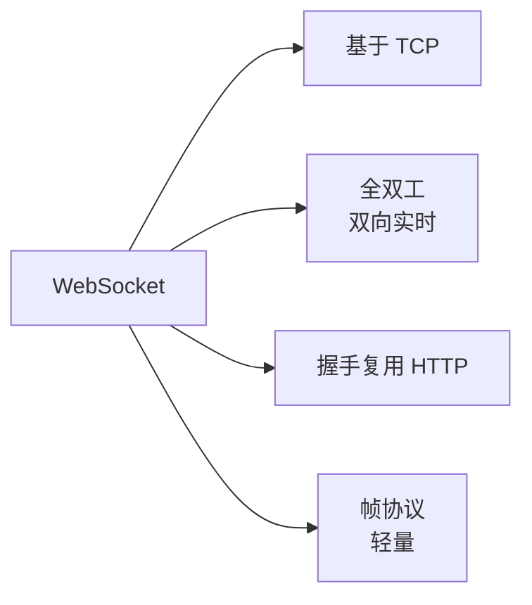
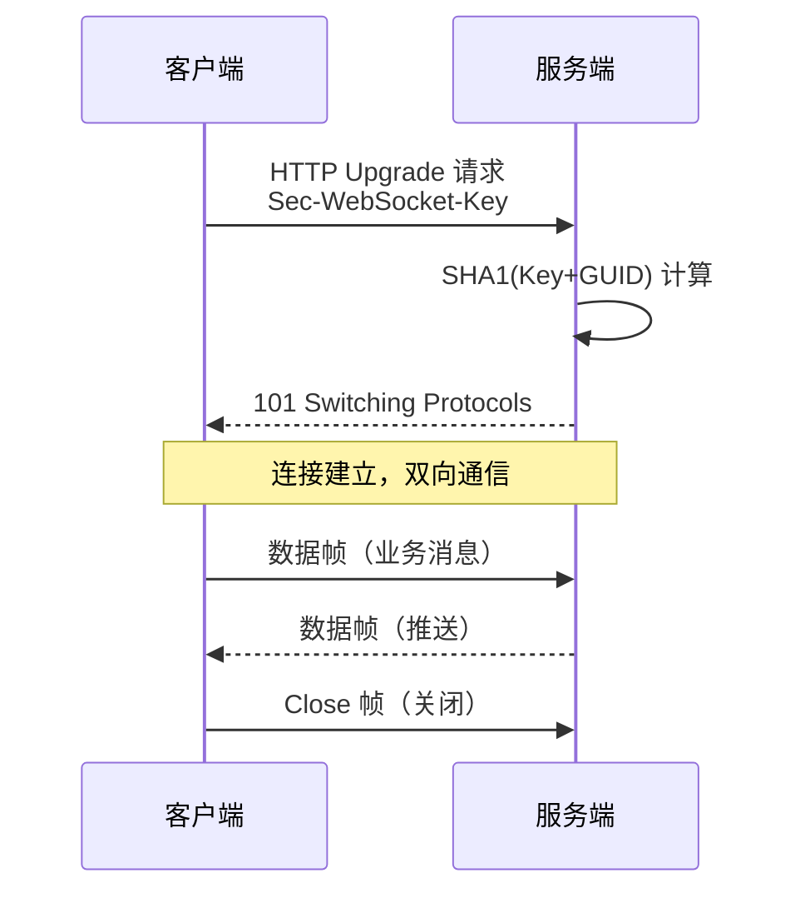
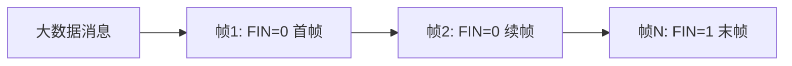
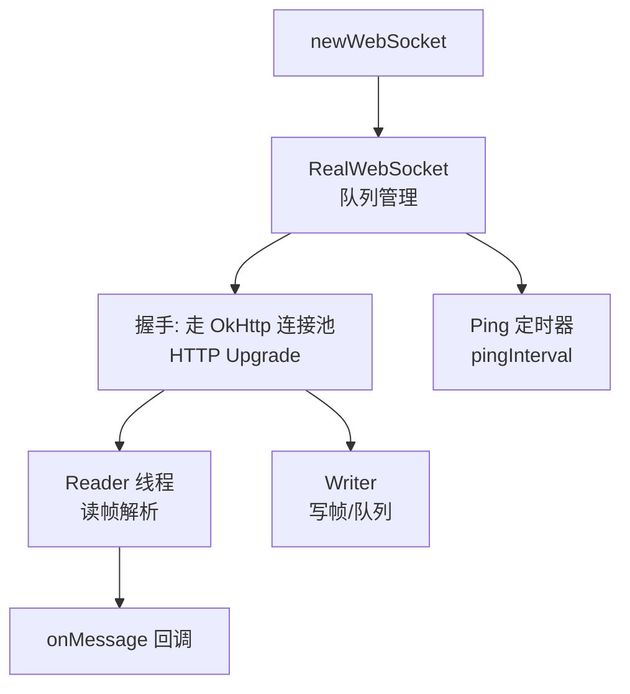
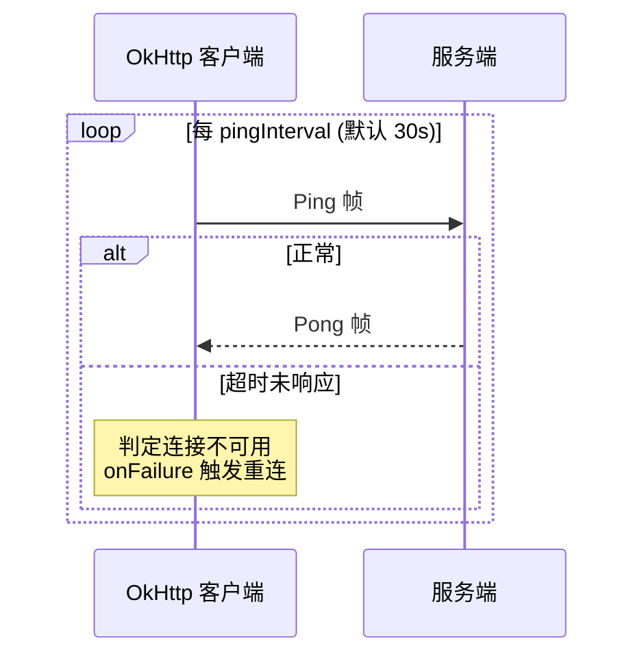

# WebSocket 原理与 OkHttp 实现

> 面试高频指数：中 — "WebSocket 和 HTTP 什么关系？握手流程？心跳怎么实现？OkHttp 的 WebSocket 怎么用？"是网络层高频考点。

## 一、为什么需要 WebSocket

### 1.1 HTTP 的局限

各场景下 HTTP 方案的痛点对比说明如下：

| 场景 | HTTP 方案 | 痛点 |
|------|-----------|------|
| 实时消息 | 轮询 | 延迟高、浪费流量 |
| 长轮询 | 挂起连接 | 超时重连复杂 |
| 服务端推送 | SSE（单向） | 只能服务端到客户端 |
| 双向实时 | 无 | — |

### 1.2 WebSocket 定位

WebSocket 的定位关系如下：



WebSocket 的核心特性说明如下：

| 特性 | 说明 |
|------|------|
| 全双工 | 客户端与服务端可同时互发 |
| 低开销 | 帧头 2~14 字节 |
| 长连接 | 一次握手，持续通信 |
| 跨域 | 基于 HTTP 升级，同源策略宽松 |

## 二、握手协议

### 2.1 握手请求（HTTP Upgrade）

```http
GET /chat HTTP/1.1
Host: server.example.com
Upgrade: websocket
Connection: Upgrade
Sec-WebSocket-Key: dGhlIHNhbXBsZSBub25jZQ==
Sec-WebSocket-Version: 13
Origin: http://example.com
```

### 2.2 握手响应

```http
HTTP/1.1 101 Switching Protocols
Upgrade: websocket
Connection: Upgrade
Sec-WebSocket-Accept: s3pPLMBiTxaQ9kYGzzhZRbK+xOo=
```

**Sec-WebSocket-Accept 计算**：

```text
Accept = base64( SHA1( Key + "258EAFA5-E914-47DA-95CA-C5AB0DC85B11" ) )
```

其中 `258EAFA5-E914-47DA-95CA-C5AB0DC85B11` 是协议规定的固定 GUID。

WebSocket 的握手流程如下：



## 三、帧格式

### 3.1 帧结构

```text
 0                   1                   2                   3
 0 1 2 3 4 5 6 7 8 9 0 1 2 3 4 5 6 7 8 9 0 1 2 3 4 5 6 7 8 9 0 1
+-+-+-+-+-------+-+-------------+-------------------------------+
|F|R|R|R| opcode|M| Payload len |    Extended payload length    |
|I|S|S|S|  (4)  |A|     (7)     |             (16/64)           |
|N|V|V|V|       |S|             |   (if payload len==126/127)   |
| |1|2|3|       |K|             |                               |
+-+-+-+-+-------+-+-------------+ - - - - - - - - - - - - - - - +
```

帧结构中各字段的说明如下：

| 字段 | 位数 | 说明 |
|------|------|------|
| FIN | 1 | 是否为最后一帧 |
| opcode | 4 | 0=续帧 1=文本 2=二进制 8=关闭 9=Ping 10=Pong |
| MASK | 1 | 客户端发帧必须为 1（掩码） |
| Payload len | 7 | 负载长度（126 表示扩展 16 位，127 表示 64 位） |
| Masking-key | 32 | 掩码密钥（客户端必须） |

### 3.2 消息与分片

消息分片的流程如下：



> 关键点：协议层面消息可拆分为多个帧传输，opcode=0 表示续帧；服务端到客户端不必掩码，客户端到服务端必须掩码（防止代理缓存投毒）。

## 四、OkHttp WebSocket 实现

### 4.1 使用方式

OkHttp WebSocket 的使用方式如下：

::: code-tabs

@tab:active Java

```java
OkHttpClient client = new OkHttpClient.Builder()
    .pingInterval(30, TimeUnit.SECONDS)   // 30s 自动 Ping 心跳
    .readTimeout(0, TimeUnit.SECONDS)     // 长连接不读超时
    .build();

Request request = new Request.Builder()
    .url("wss://example.com/chat")
    .build();

WebSocketListener listener = new WebSocketListener() {
    @Override
    public void onOpen(WebSocket webSocket, Response response) {
        // 连接建立
        webSocket.send("hello");
    }

    @Override
    public void onMessage(WebSocket webSocket, String text) {
        // 收到文本消息
    }

    @Override
    public void onMessage(WebSocket webSocket, ByteString bytes) {
        // 收到二进制消息
    }

    @Override
    public void onClosing(WebSocket webSocket, int code, String reason) {
        // 服务端请求关闭
        webSocket.close(1000, null);
    }

    @Override
    public void onClosed(WebSocket webSocket, int code, String reason) {
        // 连接已关闭
    }

    @Override
    public void onFailure(WebSocket webSocket, Throwable t, Response response) {
        // 失败：网络断开等，可重连
    }
};

WebSocket webSocket = client.newWebSocket(request, listener);
```

@tab Kotlin

```kotlin
val client = OkHttpClient.Builder()
    .pingInterval(30, TimeUnit.SECONDS)   // 30s 自动 Ping 心跳
    .readTimeout(0, TimeUnit.SECONDS)     // 长连接不读超时
    .build()

val request = Request.Builder()
    .url("wss://example.com/chat")
    .build()

val listener = object : WebSocketListener() {
    override fun onOpen(webSocket: WebSocket, response: Response) {
        // 连接建立
        webSocket.send("hello")
    }

    override fun onMessage(webSocket: WebSocket, text: String) {
        // 收到文本消息
    }

    override fun onMessage(webSocket: WebSocket, bytes: ByteString) {
        // 收到二进制消息
    }

    override fun onClosing(webSocket: WebSocket, code: Int, reason: String) {
        // 服务端请求关闭
        webSocket.close(1000, null)
    }

    override fun onClosed(webSocket: WebSocket, code: Int, reason: String) {
        // 连接已关闭
    }

    override fun onFailure(webSocket: WebSocket, t: Throwable, response: Response?) {
        // 失败：网络断开等，可重连
    }
}

val webSocket = client.newWebSocket(request, listener)
```

:::

### 4.2 内部实现

OkHttp WebSocket 的内部实现结构如下：



各模块的职责说明如下：

| 模块 | 职责 |
|------|------|
| RealWebSocket | 状态机 + 消息队列 |
| WebSocketReader | 读帧、校验、回调 |
| WebSocketWriter | 队列化写帧、同步 |
| Ping 机制 | 定时心跳保活 |

### 4.3 心跳机制

心跳机制的交互流程如下：



## 五、断线重连与保活优化

### 5.1 重连策略

断线重连的示例代码如下：

::: code-tabs

@tab:active Java

```java
class ReconnectingWebSocket {
    private WebSocket webSocket;
    private int reconnectCount = 0;
    private final int maxRetry = 5;

    public void connect() {
        WebSocketListener listener = new WebSocketListener() {
            @Override
            public void onFailure(WebSocket webSocket, Throwable t, Response response) {
                scheduleReconnect();
            }

            @Override
            public void onClosed(WebSocket webSocket, int code, String reason) {
                if (code != 1000) scheduleReconnect();  // 非正常关闭重连
            }
        };
        webSocket = client.newWebSocket(request, listener);
    }

    private void scheduleReconnect() {
        // 指数退避：1s, 2s, 4s, 8s...
        long delay = (1L << Math.min(reconnectCount, maxRetry)) * 1000;
        new Handler(Looper.getMainLooper()).postDelayed(this::connect, delay);
    }
}
```

@tab Kotlin

```kotlin
class ReconnectingWebSocket {
    private var webSocket: WebSocket? = null
    private var reconnectCount = 0
    private val maxRetry = 5

    fun connect() {
        val listener = object : WebSocketListener() {
            override fun onFailure(webSocket: WebSocket, t: Throwable, response: Response?) {
                scheduleReconnect()
            }

            override fun onClosed(webSocket: WebSocket, code: Int, reason: String) {
                if (code != 1000) scheduleReconnect()  // 非正常关闭重连
            }
        }
        webSocket = client.newWebSocket(request, listener)
    }

    private fun scheduleReconnect() {
        // 指数退避：1s, 2s, 4s, 8s...
        val delay = (1L shl reconnectCount.coerceAtMost(maxRetry)) * 1000
        Handler(Looper.getMainLooper()).postDelayed({ connect() }, delay)
    }
}
```

:::

### 5.2 保活优化清单

各保活优化手段的说明如下：

| 手段 | 说明 |
|------|------|
| Ping 心跳 | OkHttp pingInterval 自动 |
| 业务心跳 | 应用层定时发业务消息 |
| 断线重连 | 指数退避 + 随机抖动 |
| 网络监听 | ConnectivityManager 恢复时重连 |
| 前后台切换 | 前台立即重连 |
| 连接池复用 | OkHttp 连接复用 TCP |

## 六、高频面试题

### Q1：WebSocket 和 HTTP 是什么关系？为什么要用 HTTP 握手？
::: details 查看答案
WebSocket 基于 HTTP 升级：握手阶段就是一次 HTTP 请求（带 Upgrade: websocket 头），服务端返回 101 Switching Protocols 后连接升级为 WebSocket 全双工通道，后续通信不再走 HTTP 语义。复用 HTTP 握手的好处：① 复用 80/443 端口和现有 HTTP 基础设施（代理、负载均衡、防火墙）；② 通过 TLS（wss）直接复用 HTTPS 加密通道；③ Origin 头做同源校验，支持鉴权 Cookie。升级后：无 HTTP 头开销，帧头 2~14 字节，全双工双向推送，适合聊天、股票行情、协同编辑等实时场景。
:::

### Q2：WebSocket 的握手流程是怎样的？Sec-WebSocket-Accept 怎么算？
::: details 查看答案
① 客户端发 HTTP Upgrade 请求：Upgrade: websocket、Connection: Upgrade、Sec-WebSocket-Key（16 字节随机数 Base64）、Sec-WebSocket-Version: 13；② 服务端校验版本和 Key，计算 Sec-WebSocket-Accept = Base64(SHA1(Key + 固定 GUID "258EAFA5-E914-47DA-95CA-C5AB0DC85B11"))；③ 返回 101 Switching Protocols 并带 Accept；④ 客户端校验 Accept，握手成功，连接升级为 WebSocket；⑤ 后续双向发送数据帧。握手失败（非 101）则回退为普通 HTTP 响应。注意：WSS 握手走 TLS，防止中间人篡改。
:::

### Q3：WebSocket 的帧格式是怎样的？为什么客户端要掩码？
::: details 查看答案
帧结构：FIN（1 位，是否最后一片）+ opcode（4 位：0 续帧/1 文本/2 二进制/8 关闭/9 Ping/10 Pong）+ MASK（1 位，客户端必须为 1）+ Payload len（7 位，126/127 时扩展为 16/64 位）+ Masking-Key（4 字节）+ 掩码后的负载。客户端必须掩码的原因：防止"缓存投毒攻击"——攻击者伪造 WebSocket 帧欺骗中间的 HTTP 代理缓存污染响应，掩码使代理无法预测帧内容。服务端到客户端不必掩码。另外 Ping/Pong 用于心跳保活，Close 帧带状态码（1000 正常、1001 离开等）。
:::

### Q4：OkHttp 的 WebSocket 实现要点有哪些？心跳是怎么做的？
::: details 查看答案
OkHttp 用 RealWebSocket 管理状态机与消息队列：① 连接：newWebSocket 发 HTTP 握手，复用 OkHttp 连接池与 TLS；② 读写分离：Reader 线程阻塞读帧解析回调，Writer 队列化写帧保证线程安全；③ 心跳：pingInterval 设置后，每隔该间隔自动发 Ping 帧，若等待 Pong 超时判定连接不可用触发 onFailure；④ 消息发送：send 入队，按序输出，支持文本/二进制；⑤ 关闭：close(code, reason) 发 Close 帧，等待对端 Close 后彻底关闭。断线后 OkHttp 不会自动重连，需业务层在 onFailure/onClosed 中实现指数退避重连。
:::

### Q5：长连接保活都有哪些方案？怎么避免无效长连接占用资源？
::: details 查看答案
保活方案：① TCP 层：TCP KeepAlive（默认 2 小时，偏长）；② 应用层心跳：WebSocket Ping/Pong 或业务 ping 消息，间隔 30~60s；③ 网络变化监听：ConnectivityManager 检测网络恢复立即重连；④ 前后台切换监听：回到前台立即校验连接。避免无效连接：① 心跳超时快速关闭（如 3 次未 Pong 即断）；② 指数退避 + 随机抖动重连，避免"重连风暴"；③ 空闲降级：无消息时延长心跳或转入推送通道（FCM/厂商推送）；④ 限制重连次数，失败后转轮询兜底。
:::

## 七、小结

WebSocket 要点：

1. 握手 = HTTP Upgrade + 101，Accept 由 SHA1(Key+GUID) 生成
2. 帧：FIN/opcode/掩码/长度，客户端必须掩码
3. OkHttp 的 RealWebSocket 负责握手、心跳、读写队列
4. 心跳：Ping/Pong 定时保活，超时判死
5. 断线重连：指数退避 + 网络监听 + 抖动防风暴

相关阅读：[HTTP 协议与 HTTPS 原理](/network/http/http-protocol.md)、[OkHttp 源码解析](/network/http/okhttp-source.md)、[OkHttp 拦截器机制](/network/http/okhttp-interceptor.md)、[网络缓存与离线策略](/network/http/network-cache.md)。
