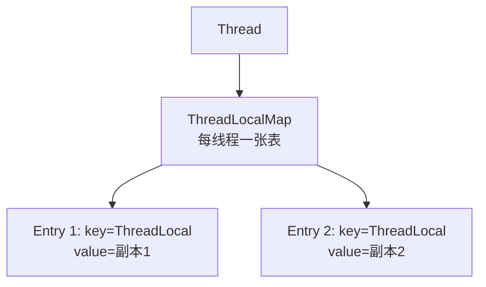
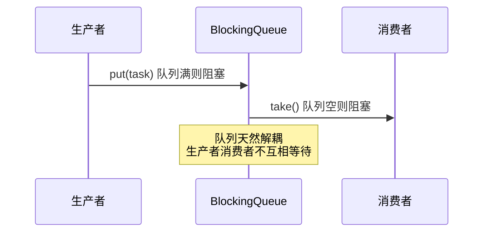

# 并发编程实战与线程中断

> 锁与线程池是基础,实战中更常遇到:线程中断、ThreadLocal 隔离、并发容器选型、生产者消费者、Android 特有的并发场景。本文是并发编程实战指南。

## 一、线程中断机制

### 1.1 中断的本质

```java
// 中断不是"强制停止",而是"协作式"信号
Thread thread = new Thread(() -> {
    while (!Thread.currentThread().isInterrupted()) {   // 检查中断标志
        // 执行任务...
        try {
            Thread.sleep(100);
        } catch (InterruptedException e) {
            // sleep/wait/join 会响应中断:抛出异常并清除标志
            Thread.currentThread().interrupt();   // 重新设置标志(保持中断状态)
            break;
        }
    }
});
thread.start();
thread.interrupt();   // 设置中断标志,线程自己决定何时退出
```

| API | 作用 |
|-----|------|
| `interrupt()` | 设置线程的中断标志 |
| `isInterrupted()` | 查询中断标志(不清除) |
| `interrupted()` | 查询并清除中断标志 |
| `InterruptedException` | sleep/wait/join 被中断时抛出 |

### 1.2 中断 vs 停止

| 方式 | 机制 | 安全 |
|------|------|------|
| `Thread.stop()` | 强制终止(已废弃) | ✗ 可能破坏数据一致性 |
| `interrupt()` | 协作式信号 | ✓ 线程自主响应 |
| 标志位 | 自定义 volatile flag | ✓ 灵活 |

>  **关键**:`Thread.stop()` 被废弃,因为它在任意位置终止线程,可能导致锁未释放、数据不一致。正确方式是 interrupt + 线程内检查。

## 二、ThreadLocal 线程隔离

```kotlin
// ThreadLocal:每个线程一份独立副本
class RequestContext {
    companion object {
        val userId = ThreadLocal<String>()
        val traceId = ThreadLocal<String>()
    }
}

// 主线程设置
RequestContext.userId.set("10001")

// 线程池中读取:各线程互不影响
fun handleRequest() {
    val id = RequestContext.userId.get()   // 当前线程的副本
}
```

### 2.1 ThreadLocal 实现原理



| 特性 | 说明 |
|------|------|
| 线程隔离 | 每个线程独立值 |
| 原理 | Thread 内部持有 ThreadLocalMap |
| 内存泄漏 | Entry 的 key 是弱引用,需 remove() |
| 场景 | 请求上下文、连接管理、线程安全工具 |

>  **ThreadLocal 泄漏**:线程池中线程常驻,若不 remove(),ThreadLocal 值无法回收(Thread 强引用 ThreadLocalMap)。用完必须 `remove()`。

## 三、并发容器选型

| 容器 | 线程安全机制 | 场景 |
|------|-------------|------|
| `ConcurrentHashMap` | 分段锁/CAS | 高并发读写 Map |
| `CopyOnWriteArrayList` | 写时复制 | 读多写极少(监听器列表) |
| `ConcurrentLinkedQueue` | CAS 无锁 | 高并发队列 |
| `BlockingQueue` 家族 | 锁+条件 | 生产者消费者 |
| `SynchronizedList/Map` | 全锁 | 简单低频场景 |

```java
// 正确选择:根据读写比例
// 读多写少(配置缓存) → CopyOnWriteArrayList / ConcurrentHashMap
// 读写均衡(业务数据) → ConcurrentHashMap
// 队列(任务调度) → BlockingQueue(ArrayBlockingQueue / LinkedBlockingQueue)
// 并发统计(计数器) → LongAdder
```

## 四、生产者消费者模式

```java
// BlockingQueue 实现:无需手动同步
class TaskQueue {
    private final BlockingQueue<Task> queue = new LinkedBlockingQueue<>(100);

    // 生产者
    public void produce(Task task) throws InterruptedException {
        queue.put(task);        // 队列满则阻塞
    }

    // 消费者
    public Task consume() throws InterruptedException {
        return queue.take();    // 队列空则阻塞
    }
}

// 使用:单生产者 + 多消费者
ExecutorService consumers = Executors.newFixedThreadPool(4);
for (int i = 0; i < 4; i++) {
    consumers.execute(() -> {
        while (true) {
            Task task = queue.consume();
            process(task);
        }
    });
}
```



## 五、Android 并发实战场景

### 5.1 场景清单

| 场景 | 推荐方案 |
|------|---------|
| 网络请求 | 协程 + OkHttp(挂起而非阻塞) |
| 后台任务 | WorkManager / 协程 |
| 定时任务 | Handler / AlarmManager |
| 线程池 | 协程 Dispatchers(替代手写线程池) |
| 共享数据 | StateFlow / Room(自动线程安全) |
| 进程间通信 | Binder / ContentProvider |
| 数据库操作 | Room 挂起 DAO(自动切 IO) |

### 5.2 线程池最佳实践

```kotlin
// Android 中推荐使用协程替代裸线程池
viewModelScope.launch(Dispatchers.IO) {
    // 耗时操作
}

// 仍需线程池时的规范
val threadPool = ThreadPoolExecutor(
    4,                          // 核心线程
    8,                          // 最大线程
    60, TimeUnit.SECONDS,       // 保活时间
    LinkedBlockingQueue(100),   // 有界队列
    ThreadFactory { r -> Thread(r, "worker-${counter.incrementAndGet()}").apply {
        isDaemon = true         // 守护线程,不阻止进程退出
    }},
    ThreadPoolExecutor.CallerRunsPolicy   // 拒绝策略:调用者执行
)
```

## 六、并发实战常见坑

| 坑 | 原因 | 解决 |
|----|------|------|
| 死锁 | 锁顺序不一致 | 统一加锁顺序/超时锁 |
| 活锁 | 反复重试失败 | 随机退避 |
| 饥饿 | 高优先级任务不停抢占 | 公平锁/限流 |
| 内存可见性 | 未用 volatile | volatile/CAS/锁 |
| 竞态条件 | 检查-执行非原子 | synchronized/原子类 |
| ThreadLocal 泄漏 | 线程池未 remove | finally 中 remove |

```java
// 死锁示例与解决
// ✗ 两个线程互相持有对方需要的锁
// ✓ 方案:所有线程按同一顺序获取锁(A → B)
public void transfer(Account from, Account to, int amount) {
    synchronized (from) {
        synchronized (to) {   // 若其它线程先锁 to 再锁 from → 死锁
            from.debit(amount);
            to.credit(amount);
        }
    }
}
```

## 七、高频面试题

### Q1：interrupt() 是如何工作的?和 stop() 有什么区别?
::: details 查看答案
interrupt() 只是设置线程的中断标志,不会强制停止:线程在可中断方法(sleep/wait/join)中会抛 InterruptedException,或在循环中通过 isInterrupted() 检查标志自行退出。stop() 已废弃:它在任意位置强制终止,可能导致锁未释放、数据不一致、资源未清理。协作式中断更安全:线程自己决定何时、在哪退出,可做好清理工作。
:::

### Q2：ThreadLocal 的实现原理?为什么会内存泄漏?
::: details 查看答案
原理:每个 Thread 内部持有 ThreadLocalMap(Thread → ThreadLocalMap),以 ThreadLocal 为 key、值为 value。取值时从当前线程的 map 中查,实现线程隔离。泄漏:ThreadLocalMap 的 Entry 继承 WeakReference(key 弱引用),但 value 是强引用——若 ThreadLocal 被回收而线程(如线程池常驻线程)仍存活,value 无法回收。解决:不用时调用 remove(),或用 try-finally 包裹。
:::

### Q3：ConcurrentHashMap 如何保证线程安全?和 Hashtable 区别?
::: details 查看答案
ConcurrentHashMap(JDK8)用 CAS + synchronized:桶数组无冲突时 CAS 插入,冲突时锁单个桶(细粒度锁),读操作无锁(volatile 保证可见性)。Hashtable 所有操作锁整个表(全局锁),并发度低。ConcurrentHashMap 支持高并发读写,迭代时弱一致性(不抛 ConcurrentModificationException)。JDK8 的 size() 用 baseCount + CounterCell 优化,并发统计场景可用 LongAdder。
:::

### Q4：生产者消费者模式怎么实现?BlockingQueue 有什么用?
::: details 查看答案
核心:生产者往队列放数据,消费者从队列取数据,通过队列解耦。BlockingQueue 内置同步:put() 队列满阻塞、take() 队列空阻塞,自动处理等待唤醒(基于锁+Condition),无需手写 wait/notify。可选实现:ArrayBlockingQueue(有界数组)、LinkedBlockingQueue(链表,可设容量)、SynchronousQueue(直接传递,无缓冲)。也常配合线程池作为任务队列。
:::

### Q5：Android 中还有必要用线程池吗?和协程怎么选?
::: details 查看答案
现代 Android 推荐协程:协程基于线程池但提供挂起/取消/结构化并发,Dispatchers.IO/Default 就是封装好的线程池,代码更简洁、生命周期自动管理。仍需线程池的场景:纯 Java 代码库、CPU 密集计算需要精确控制、第三方库要求 Executor。原则:新代码用协程,旧代码用线程池,尽量统一异步模型。注意无论哪种,都要防泄漏(协程绑作用域、线程池要 shutdown)。
:::

## 小结

- interrupt 是协作式中断信号,stop 已废弃
- ThreadLocal 线程隔离,用完必须 remove 防泄漏
- 并发容器按读写比例选型,并发队列用 BlockingQueue
- 生产者消费者用 BlockingQueue 自动同步
- Android 首选协程,线程池用于特定场景
- 死锁/可见性/竞态是并发三大坑,锁顺序与原子性要严谨

> 进阶阅读：[线程池详解](/network/thread/thread-pool.md) | [锁机制详解](/network/thread/locks.md) | [Java 并发工具类](/network/thread/concurrency-tools.md)
