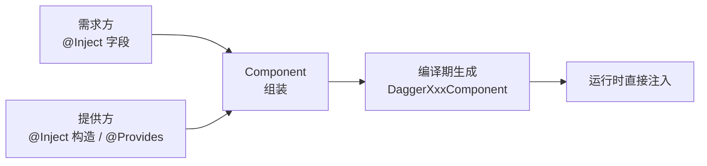
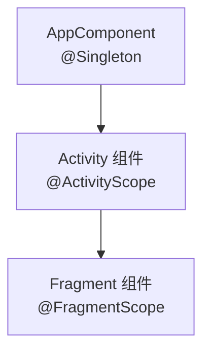

# Dagger2 依赖注入框架

> 面试高频指数：中

> Dagger2 是 Google 维护的编译期依赖注入框架，由 Square 的 Dagger1 演进而来。它用注解声明依赖关系，编译期生成依赖注入代码：提升开发效率、自动管理类的实例、实现模块解耦，且运行时零反射。

## 一、组件定位

### 1.1 为什么需要依赖注入

传统手动管理依赖：对象在哪个类创建、何时创建、如何传递，全靠手写，耦合严重且难以测试。

::: code-tabs

@tab:active Java

```java
// 手动管理：处处 new，耦合高
public class LoginViewModel {
    private final ApiService apiService;
    private final UserRepository userRepository;

    public LoginViewModel() {
        // 手动创建所有依赖
        this.apiService = new ApiService();
        this.userRepository = new UserRepository(apiService);
    }
}
```

@tab Kotlin

```kotlin
// 手动管理：处处 new，耦合高
class LoginViewModel {
    private val apiService: ApiService
    private val userRepository: UserRepository

    init {
        // 手动创建所有依赖
        apiService = ApiService()
        userRepository = UserRepository(apiService)
    }
}
```

:::

Dagger2 的目标：**你只声明「要什么」，Dagger 负责「怎么造」**。

### 1.2 三个核心注解

| 注解 | 作用 | 类比 |
|------|------|------|
| @Inject | 标记「要注入的依赖」或「可提供的构造方法」 | 需求清单 |
| @Module + @Provides | 为无法用 @Inject 的类（第三方库）提供实例 | 工厂 |
| @Component | 连接「需求方」与「提供方」的桥梁 | 装配工 |



## 二、基本使用

### 2.1 声明依赖

::: code-tabs

@tab:active Java

```java
// 1. 可注入的构造方法
public class ApiService {
    @Inject
    public ApiService() { }
}

// 2. 需要注入的字段
public class LoginViewModel {
    @Inject
    ApiService apiService;

    public void login() {
        // apiService 已被注入
    }
}

// 3. 组装组件
@Component
public interface AppComponent {
    void inject(MainActivity activity);
}
```

@tab Kotlin

```kotlin
// 1. 可注入的构造方法
class ApiService @Inject constructor() { }

// 2. 需要注入的字段
class LoginViewModel {
    @Inject
    lateinit var apiService: ApiService

    fun login() {
        // apiService 已被注入
    }
}

// 3. 组装组件
@Component
interface AppComponent {
    fun inject(activity: MainActivity)
}
```

:::

### 2.2 编译期生成什么

Dagger2 在编译期为每个 Component 生成 `DaggerXxxComponent`：

::: code-tabs

@tab:active Java

```java
// 编译期生成的 DaggerAppComponent（简化）
public final class DaggerAppComponent implements AppComponent {
    @Override
    public void inject(MainActivity activity) {
        injectMainActivity(activity);
    }

    private MainActivity injectMainActivity(MainActivity instance) {
        // 直接调用构造方法创建实例并赋值
        MainActivity_MembersInjector.injectApiService(
                instance, new ApiService());
        return instance;
    }
}
```

@tab Kotlin

```kotlin
// 编译期生成的 DaggerAppComponent（示意）
class DaggerAppComponent : AppComponent {
    override fun inject(activity: MainActivity) {
        injectMainActivity(activity)
    }

    private fun injectMainActivity(instance: MainActivity): MainActivity {
        // 直接调用构造方法创建实例并赋值
        MainActivity_MembersInjector.injectApiService(
            instance, ApiService()
        )
        return instance
    }
}
```

:::

## 三、核心机制

### 3.1 编译期生成 vs 反射

| 对比项 | 反射注入 | Dagger2 |
|--------|----------|---------|
| 时机 | 运行时解析 | 编译期生成代码 |
| 性能 | 慢 | 接近手写 |
| 错误发现 | 运行时崩溃 | 编译期报错 |
| 混淆 | 需配置规则 | 无需特别处理 |

### 3.2 作用域与单例

| 注解 | 作用 |
|------|------|
| @Singleton | 全局单例，Component 内共享同一实例 |
| @ActivityScope | 每个 Activity 一个实例 |
| @FragmentScope | 每个 Fragment 一个实例 |
| @Reusable | 可复用但不保证单例 |



作用域层级必须与 Component 嵌套关系一致：子 Component 依赖父 Component，父级提供全局单例，子级提供局部实例。

### 3.3 @Module 的使用场景

第三方类无法加 @Inject 构造方法时（如 OkHttp、Retrofit、Gson），用 @Module + @Provides 提供：

::: code-tabs

@tab:active Java

```java
@Module
public class NetworkModule {

    @Provides
    @Singleton
    OkHttpClient provideOkHttpClient() {
        return new OkHttpClient.Builder()
                .connectTimeout(10, TimeUnit.SECONDS)
                .build();
    }

    @Provides
    @Singleton
    Retrofit provideRetrofit(OkHttpClient client) {
        return new Retrofit.Builder()
                .baseUrl("https://api.example.com/")
                .client(client)
                .build();
    }
}
```

@tab Kotlin

```kotlin
@Module
class NetworkModule {

    @Provides
    @Singleton
    fun provideOkHttpClient(): OkHttpClient {
        return OkHttpClient.Builder()
            .connectTimeout(10, TimeUnit.SECONDS)
            .build()
    }

    @Provides
    @Singleton
    fun provideRetrofit(client: OkHttpClient): Retrofit {
        return Retrofit.Builder()
            .baseUrl("https://api.example.com/")
            .client(client)
            .build()
    }
}
```

:::

## 四、Dagger2 与 Hilt 的关系

| 对比项 | Dagger2 | Hilt |
|--------|---------|------|
| 定位 | 通用 DI 框架 | Dagger2 的 Android 封装 |
| 使用成本 | 需手写 Component 层级 | 注解自动生成 |
| 生命周期 | 手动管理 | 自动绑定 Android 生命周期 |
| 官方推荐 | 已被 Hilt 取代 | Google 官方推荐 |

> Hilt 底层仍是 Dagger2，理解 Dagger2 的 Component / Module / Inject 模型，学习 Hilt 事半功倍。

## 五、高频面试题

### Q1：Dagger2 是如何工作的？为什么快？

::: details 查看答案

Dagger2 用注解（@Inject / @Module / @Component）声明依赖图，编译期通过注解处理器生成 DaggerXxxComponent 等代码，运行时直接调用构造方法完成注入，零反射。因为依赖关系在编译期就已确定并生成代码，所以性能接近手写，且依赖缺失会编译报错而非运行时崩溃。

:::

### Q2：@Inject、@Module、@Component 各自的作用是什么？

::: details 查看答案

@Inject 标记需要注入的依赖，或标记可被 Dagger 调用的构造方法；@Module + @Provides 用于为无法用 @Inject 的类（如第三方库）提供实例；@Component 是连接需求与提供的组装桥梁，声明依赖图入口。三者配合，Dagger 才能在编译期生成完整的注入代码。

:::

### Q3：Dagger2 的 @Singleton 是怎么实现的？

::: details 查看答案

@Singleton 是一种作用域注解。Dagger 在为 @Singleton 标注的依赖生成代码时，会在 Component 中缓存实例（生成的 Provider 持有单例引用），同一 Component 生命周期内多次请求返回同一实例；而不同 Component 各自持有一份，互不共享。

:::

### Q4：作用域注解使用时要注意什么？

::: details 查看答案

作用域必须与 Component 层级对应：父 Component 提供 @Singleton，子 Component 提供 @ActivityScope 等局部作用域；若在子 Component 中请求父作用域的依赖，或作用域层级颠倒，编译会报错。同时注意子 Component 请求父级实例时，父级不能请求子级的局部作用域依赖，否则造成依赖环。

:::

### Q5：Dagger2 相比手动 new 依赖有什么好处？

::: details 查看答案

一是解耦：类只声明依赖不关心创建方式；二是效率：自动管理实例创建、复用与销毁时机；三是可测试：依赖可方便替换为 Mock；四是编译期检查：依赖缺失、循环依赖直接编译失败。代价是需要理解注解模型，学习成本较高，这也是 Hilt 出现的原因。

:::

## 小结

- Dagger2 = @Inject + @Module/@Provides + @Component，编译期生成注入代码。
- 运行时零反射，性能接近手写，编译期即可发现依赖错误。
- 作用域注解（@Singleton / @ActivityScope）配合 Component 层级管理实例生命周期。
- Hilt 是 Dagger2 的 Android 封装，理解 Dagger2 是掌握 Hilt 的前提。

> 进阶阅读：[Hilt 依赖注入指南](/jetpack/workmanager-hilt/hilt.md) | [Hilt 进阶：自定义绑定与组件](/jetpack/workmanager-hilt/hilt-advanced.md) | [ButterKnife 视图注入框架](butterknife.md)
