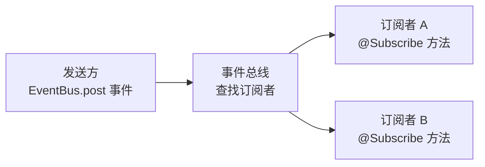
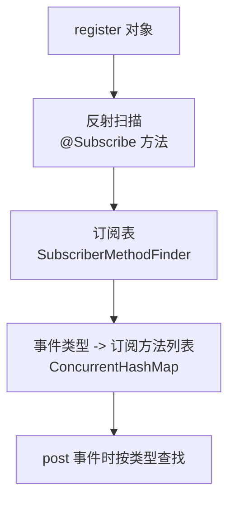
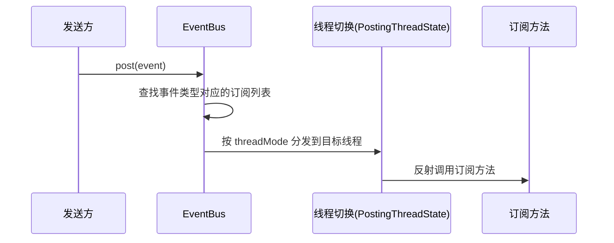

# EventBus 事件总线

> 面试高频指数：高

> EventBus 是 greenrobot 出品的事件总线框架，使用**扩展的观察者模式**实现组件间通信，是 Android 广播的替代者。它以「发布/订阅」模型解耦组件：发送方只需要 post 事件，接收方只需订阅事件，双方互不感知。

## 一、组件定位

### 1.1 解决什么问题

组件间通信的痛点：Intent 传参繁琐、回调嵌套过深、广播注册反注册麻烦。EventBus 让通信变成「发事件 + 收事件」两步：



| 能力 | 说明 |
|------|------|
| 解耦 | 发送方与接收方互不持有引用 |
| 线程调度 | 事件可在任意线程发送，指定线程回调 |
| 粘性事件 | 先发后订阅也能收到 |
| 优先级 | 支持订阅优先级与事件拦截 |

### 1.2 基础使用

::: code-tabs

@tab:active Java

```java
// 1. 注册与注销
@Override
protected void onStart() {
    super.onStart();
    EventBus.getDefault().register(this);
}

@Override
protected void onStop() {
    EventBus.getDefault().unregister(this);
    super.onStop();
}

// 2. 订阅事件（线程模型：主线程）
@Subscribe(threadMode = ThreadMode.MAIN)
public void onMessage(MessageEvent event) {
    // 主线程处理，可安全更新 UI
}

// 3. 发送事件
EventBus.getDefault().post(new MessageEvent("hello"));
```

@tab Kotlin

```kotlin
// 1. 注册与注销
override fun onStart() {
    super.onStart()
    EventBus.getDefault().register(this)
}

override fun onStop() {
    EventBus.getDefault().unregister(this)
    super.onStop()
}

// 2. 订阅事件（线程模型：主线程）
@Subscribe(threadMode = ThreadMode.MAIN)
fun onMessage(event: MessageEvent) {
    // 主线程处理，可安全更新 UI
}

// 3. 发送事件
EventBus.getDefault().post(MessageEvent("hello"))
```

:::

## 二、核心原理：扩展的观察者模式

### 2.1 注册与订阅表

register() 时，EventBus 通过反射扫描对象中带 @Subscribe 注解的方法，建立「事件类型 → 订阅方法列表」的映射：



### 2.2 post 事件分发



| 组件 | 职责 |
|------|------|
| EventBus | 单例总线，维护订阅表与事件队列 |
| SubscriberMethodFinder | 反射查找 @Subscribe 方法并缓存 |
| PostingThreadState | 当前线程的事件队列与分发状态 |
| Subscription | 订阅者 + 订阅方法 + 线程模型 |

## 三、线程模型

| ThreadMode | 回调线程 | 适用场景 |
|------------|----------|----------|
| POSTING | 与发送线程一致 | 默认，轻量快速 |
| MAIN | 主线程 | 更新 UI |
| MAIN_ORDERED | 主线程（有序） | 有序更新 UI |
| BACKGROUND | 后台线程（串行排队） | 耗时操作 |
| ASYNC | 独立线程（可并行） | 并行耗时任务 |

## 四、粘性事件

| 概念 | 说明 |
|------|------|
| 普通事件 | 先订阅后发送才能收到 |
| 粘性事件 | postSticky 发送后缓存，后订阅者立即收到最新值 |

::: code-tabs

@tab:active Java

```java
// 发送粘性事件
EventBus.getDefault().postSticky(new ConfigChanged("dark"));

// 订阅粘性事件
@Subscribe(sticky = true, threadMode = ThreadMode.MAIN)
public void onConfigChanged(ConfigChanged event) { }
```

@tab Kotlin

```kotlin
// 发送粘性事件
EventBus.getDefault().postSticky(ConfigChanged("dark"))

// 订阅粘性事件
@Subscribe(sticky = true, threadMode = ThreadMode.MAIN)
fun onConfigChanged(event: ConfigChanged) { }
```

:::

> 适合「跨页面传递最新状态」的场景，如登录状态、主题切换。

## 五、EventBus 与广播对比

| 对比项 | EventBus | 广播（BroadcastReceiver） |
|--------|----------|---------------------------|
| 进程范围 | 进程内 | 可跨进程 |
| 性能 | 反射查表，快 | 系统级传递，相对慢 |
| 使用成本 | 注册 + 注解 | 注册 + IntentFilter |
| 系统事件 | 不支持 | 支持（开机、网络变化等） |
| 解耦程度 | 完全解耦 | 依赖 Intent 协议 |

## 六、源码解析指引

> EventBus 的注册、订阅表构建、线程切换与粘性事件的源码细节，见 [EventBus 源码分析](/advanced/architecture/eventbus-analysis.md)。

## 七、高频面试题

### Q1：EventBus 的实现原理是什么？

::: details 查看答案

EventBus 使用扩展的观察者模式：register() 时反射扫描 @Subscribe 方法，建立事件类型到订阅方法的映射表；post() 时按事件类型查表，找到所有订阅方法，再按 threadMode 切换到对应线程反射调用。事件类型是观察的「主题」，订阅方法是「观察者」，发送方与接收方完全解耦。

:::

### Q2：EventBus 有哪几种线程模型？分别怎么用？

::: details 查看答案

POSTING 默认，与发送线程一致；MAIN 主线程回调，用于更新 UI；MAIN_ORDERED 主线程且有序；BACKGROUND 后台串行执行耗时任务；ASYNC 独立线程并行执行。选择原则：UI 更新用 MAIN，耗时任务用 BACKGROUND/ASYNC，轻量逻辑用默认 POSTING。

:::

### Q3：EventBus 的粘性事件和普通事件有什么区别？

::: details 查看答案

普通事件只有先订阅后发送才能收到；粘性事件通过 postSticky 发送后会保存在内存中，之后注册的订阅者（@Subscribe(sticky = true)）会立即收到最近一次的事件，适合跨页面传递最新状态，如登录状态、主题切换。

:::

### Q4：EventBus 注册后为什么一定要注销？

::: details 查看答案

register() 会把对象加入订阅表，EventBus 持有其强引用。若不 unregister()，对象（如 Activity、Fragment）无法被回收，造成内存泄漏；且注销后对象不再接收事件，避免泄漏与空指针。规范做法是在 onStart/onStop 或 onResume/onPause 中成对注册注销。

:::

### Q5：EventBus 相比广播有什么优势和劣势？

::: details 查看答案

优势：进程内性能好、使用简单、完全解耦、线程模型灵活；劣势：不能跨进程、不能接收系统广播。因此组件间高频通信用 EventBus，跨进程与系统事件用广播。注意 EventBus 的订阅方法不能是 private，且事件类不宜过多造成代码可读性下降。

:::

## 小结

- EventBus = 事件总线 + 扩展观察者模式，post 发送、@Subscribe 接收。
- 注册时反射建订阅表，post 时查表分发，线程模型控制回调线程。
- 粘性事件让后订阅者也能拿到最新状态。
- 是广播的进程内替代者，注意成对注册注销避免泄漏。

> 进阶阅读：[EventBus 源码分析](/advanced/architecture/eventbus-analysis.md) | [广播机制详解](/android/broadcast/) | [观察者模式](/language/design-pattern/观察者模式.md)
