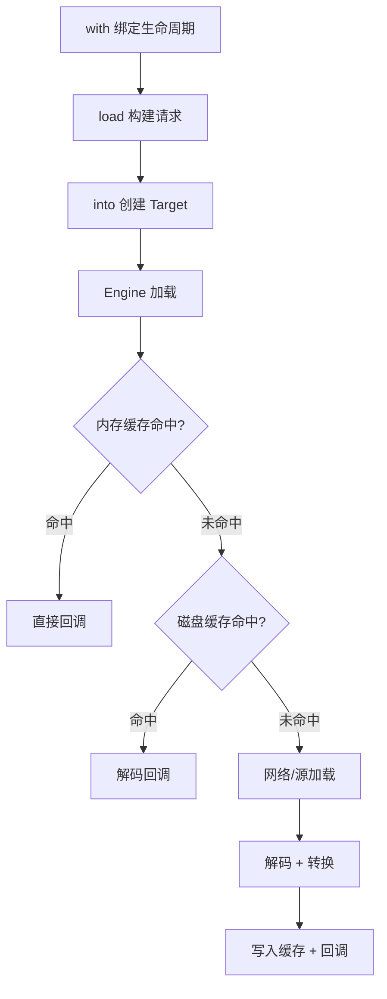

# Glide 图片加载框架

> 面试高频指数：极高

> Glide 是 Android 使用最广泛的图片加载框架，由 Google 官方推荐。它以「流畅、内存友好」著称：三级缓存、与生命周期联动、自动压缩采样。本文拆解 Glide 的核心机制与面试考点。

## 一、组件定位

### 1.1 基本使用

::: code-tabs

@tab:active Java

```java
Glide.with(this)
        .load("https://example.com/image.jpg")
        .placeholder(R.drawable.placeholder)
        .error(R.drawable.error)
        .override(300, 300)
        .into(imageView);
```

@tab Kotlin

```kotlin
Glide.with(this)
    .load("https://example.com/image.jpg")
    .placeholder(R.drawable.placeholder)
    .error(R.drawable.error)
    .override(300, 300)
    .into(imageView)
```

:::

### 1.2 与其他框架对比

| 对比项 | Glide | Fresco | Picasso |
|--------|-------|--------|---------|
| 缓存 | 三级缓存（内存+磁盘+网络） | 三级缓存 | 两级缓存（无磁盘） |
| 生命周期 | 自动绑定 Activity/Fragment | 需手动管理 | 弱绑定 |
| 图片格式 | WebP/GIF/Video 帧 | WebP/GIF | GIF 需扩展 |
| 内存占用 | 按 View 尺寸采样，友好 | 峰值较高 | 一般 |

## 二、加载流程

### 2.1 完整链路



### 2.2 关键步骤

| 步骤 | 说明 |
|------|------|
| with() | 传入生命周期载体，注册监听，页面销毁自动取消加载 |
| load() | 支持 URL / File / 资源 ID / ByteArray 等数据源 |
| into() | 创建 ImageViewTarget，触发 Engine 加载 |
| Engine | 核心加载器，负责三级缓存查找与加载调度 |

## 三、三级缓存

### 3.1 缓存结构

| 缓存 | 存储位置 | key 依据 | 特点 |
|------|----------|----------|------|
| 活动资源 | 内存（弱引用） | 正在使用的图片 | 正在展示的图片不回收 |
| 内存缓存 | 内存（LruCache） | 原始 URL key | 快速命中，内存友好 |
| 磁盘缓存 | 磁盘（DiskLruCache） | URL 摘要 | 持久化，离线可用 |


### 3.2 缓存策略

- 默认使用 **原始图片 key** 计算缓存键，可开启 `signature()` 主动失效缓存。
- `diskCacheStrategy()` 可配置磁盘缓存策略：ALL / NONE / DATA / RESOURCE。
- 内存缓存与磁盘缓存相互独立，可分别控制开关。

## 四、生命周期绑定

Glide 与组件生命周期深度绑定，这是它相比其他框架的核心优势：

| 机制 | 说明 |
|------|------|
| RequestManager | with() 为每个 Activity/Fragment 创建，随生命周期管理请求 |
| 生命周期监听 | 页面 onStop 暂停请求、onStart 恢复、onDestroy 取消并清资源 |
| 实现方式 | 通过添加无 UI 的隐藏 Fragment 监听宿主生命周期 |

## 五、图片加载优化

| 优化点 | 做法 |
|--------|------|
| 采样压缩 | 按目标尺寸计算 inSampleSize，避免大图占内存 |
| 格式优化 | 优先使用 WebP，体积小、质量高 |
| 占位图 | placeholder / error 提升体验 |
| 复用 | 磁盘缓存避免重复下载；签名控制缓存时效 |
| 缩略图 | thumbnail() 先加载低清再替换高清 |

## 六、源码解析指引

> Glide 的缓存实现、加载流程与生命周期管理的源码细节，见 [Glide 图片加载源码分析](/ui/bitmap/glide-source.md)。

## 七、高频面试题

### Q1：Glide 的三级缓存是怎么工作的？

::: details 查看答案

加载时先查活动资源（正在使用的弱引用图片），未命中再查内存缓存（LruCache），再未命中查磁盘缓存（DiskLruCache），都没有才走网络加载。加载成功后按 活动资源 → 内存缓存 → 磁盘缓存 的顺序逐级写入，保证下次快速命中。

:::

### Q2：Glide 是如何与 Activity 生命周期绑定的？

::: details 查看答案

Glide.with(Activity) 会创建 RequestManager，并借助一个无 UI 的隐藏 Fragment 监听宿主生命周期。onStop 时暂停进行中的请求，onStart 恢复，onDestroy 取消请求并释放资源，从而避免页面销毁后图片回调导致的崩溃与内存泄漏。

:::

### Q3：Glide 内存优化体现在哪些方面？

::: details 查看答案

一是按 View 实际尺寸计算采样率压缩图片；二是活动资源 + LruCache 的二级内存缓存，配合 LRU 淘汰；三是页面销毁自动清理资源；四是支持 WebP 等更小的格式，从源头降低内存占用。

:::

### Q4：内存缓存和磁盘缓存的 key 有什么区别？

::: details 查看答案

内存缓存 key 由原始数据（URL、签名等）计算而来，保证同一个图片地址复用同一份缓存；磁盘缓存 key 基于 URL 摘要生成。两者相互独立，还可以通过 signature() 添加额外标识，在图片更新时主动失效旧缓存。

:::

### Q5：加载一张超大图会怎样？如何避免 OOM？

::: details 查看答案

若不指定尺寸，Glide 会按 ImageView 尺寸进行采样压缩（inSampleSize 2 的幂次），不会把原图整张解码进内存。配合 override() 指定目标尺寸、使用 WebP 格式、合理配置磁盘缓存策略，可有效避免 OOM。若确需加载原图，则应使用 BitmapRegionDecoder 分块加载。

:::

## 小结

- Glide = RequestManager + Engine + 三级缓存 + 生命周期绑定。
- 三级缓存：活动资源（弱引用）→ 内存（LruCache）→ 磁盘（DiskLruCache）。
- 隐藏 Fragment 机制实现与组件生命周期的自动绑定。
- 采样压缩、WebP、缓存策略共同保障内存友好。

> 进阶阅读：[Glide 图片加载源码分析](/ui/bitmap/glide-source.md) | [Bitmap 使用与优化](/ui/bitmap/bitmap-guide.md) | [图片压缩方案](/ui/bitmap/bitmap-compress.md)
