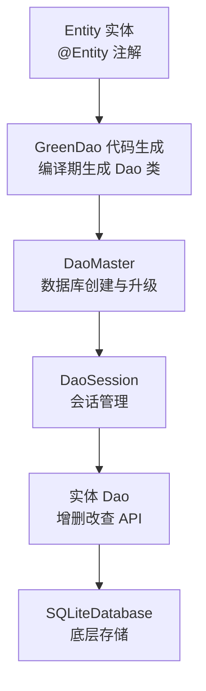
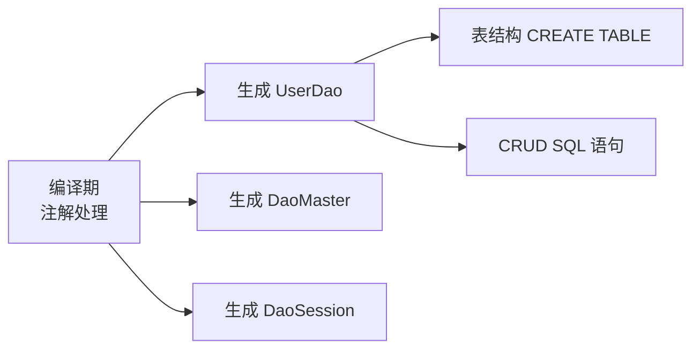

# GreenDao 数据库框架

> 面试高频指数：中

> GreenDao 是 greenrobot 出品的 Android ORM 数据库框架，被公认为 Android 中数据库操作综合效率最高的框架。它通过编译期代码生成避免了反射开销，把 SQLite 的增删改查变成类型安全的 Java 方法调用。

## 一、组件定位

### 1.1 为什么效率最高

| 维度 | GreenDao | 对比对象 |
|------|----------|----------|
| 性能 | 编译期生成代码，无反射 | 反射型 ORM 慢一个量级 |
| 体积 | 核心库约 100KB | 全功能 ORM 体积较大 |
| 安全 | 类型安全、编译期检查 | 字符串 SQL 易错 |
| 易用 | 注解实体 + 一键生成 | 手写 SQL 繁琐 |

### 1.2 整体架构



| 组件 | 职责 |
|------|------|
| DaoMaster | 持有 SQLiteOpenHelper，负责建库与版本升级 |
| DaoSession | 会话对象，管理各实体 Dao 的获取与缓存 |
| 实体 Dao | 每个实体对应一个 Dao，提供类型安全的 CRUD API |

## 二、基本使用

### 2.1 定义实体

::: code-tabs

@tab:active Java

```java
@Entity
public class User {
    @Id(autoincrement = true)
    private Long id;

    @Unique
    private String name;

    private int age;

    // getter / setter ...
}
```

@tab Kotlin

```kotlin
@Entity
data class User(
    @Id(autoincrement = true)
    var id: Long? = null,

    @Unique
    var name: String? = null,

    var age: Int = 0
)
```

:::

### 2.2 初始化与 CRUD

::: code-tabs

@tab:active Java

```java
// 初始化（Application 中执行一次）
DaoMaster.DevOpenHelper helper =
        new DaoMaster.DevOpenHelper(context, "app.db");
SQLiteDatabase db = helper.getWritableDatabase();
DaoMaster daoMaster = new DaoMaster(db);
DaoSession daoSession = daoMaster.newSession();
UserDao userDao = daoSession.getUserDao();

// 增
User user = new User();
user.setName("Alice");
userDao.insert(user);

// 查（QueryBuilder 构建查询）
List<User> users = userDao.queryBuilder()
        .where(UserDao.Properties.Age.gt(18))
        .orderAsc(UserDao.Properties.Name)
        .list();
```

@tab Kotlin

```kotlin
// 初始化（Application 中执行一次）
val helper = DaoMaster.DevOpenHelper(context, "app.db")
val db = helper.writableDatabase
val daoMaster = DaoMaster(db)
val daoSession = daoMaster.newSession()
val userDao = daoSession.userDao

// 增
val user = User(name = "Alice", age = 20)
userDao.insert(user)

// 查（QueryBuilder 构建查询）
val users = userDao.queryBuilder()
    .where(UserDao.Properties.Age.gt(18))
    .orderAsc(UserDao.Properties.Name)
    .list()
```

:::

## 三、核心原理：代码生成

### 3.1 编译期生成

GreenDao 最大的特点是在 **编译期** 读取 @Entity 注解的实体类，自动生成 Dao、DaoMaster、DaoSession 与实体表的映射代码：



### 3.2 为什么不用反射

| 方案 | 开销 | 特点 |
|------|------|------|
| 反射映射 | 高 | 每次读写都走反射，性能差 |
| 代码生成 | 低 | SQL 语句编译期写好，运行时直接执行 |

代码生成把「映射逻辑」前移到编译期，运行时零反射，这就是 GreenDao 快的根本原因。

## 四、注解体系

| 注解 | 作用 |
|------|------|
| @Entity | 标记实体类，对应一张表 |
| @Id | 主键，支持 autoincrement 自增 |
| @Unique | 唯一约束 |
| @NotNull | 非空约束 |
| @Index | 建立索引，加速查询 |
| @ToMany / @ToOne | 一对多 / 一对一关联 |
| @Convert | 自定义类型转换（如枚举、Date） |

## 五、数据库升级

| 方案 | 说明 |
|------|------|
| DevOpenHelper | 开发期使用，版本升级直接删表重建（数据丢失） |
| 自定义 OpenHelper | 重写 onUpgrade，按版本号执行 ALTER TABLE 迁移脚本 |
| 迁移工具 | 配合 MigrationHelper 逐表备份恢复 |

> 生产环境必须自定义升级逻辑，避免 DevOpenHelper 的「删库」行为。

## 六、高频面试题

### Q1：GreenDao 为什么比反射型 ORM 快？

::: details 查看答案

GreenDao 在编译期读取注解生成 Dao 代码，SQL 语句与实体映射在编译时就已经确定，运行时直接执行、零反射开销；反射型 ORM（如早期的 ORMLite）每次读写都动态解析字段，性能差一个量级。这是 GreenDao 综合效率最高的根本原因。

:::

### Q2：GreenDao 的代码生成是怎么触发的？

::: details 查看答案

GreenDao 使用注解处理器在编译期扫描 @Entity 注解的实体类，生成对应的 UserDao、DaoMaster、DaoSession 以及建表语句和 CRUD 方法。生成代码与实体同步编译，因此 IDE 里可以直接使用类型安全的 API。

:::

### Q3：GreenDao 与 Room 如何选择？

::: details 查看答案

| 对比项 | GreenDao | Room |
|--------|----------|------|
| 性能 | 快，无反射 | 较快，编译期 SQL 校验 |
| 学习成本 | 低 | 中，需掌握 SQL |
| 关联查询 | 手动 | 支持关系对象 |
| 官方支持 | 第三方 | Google 官方 |
| 协程/Flow | 需适配 | 原生支持 |

新项目建议用 Room（官方维护、协程友好）；GreenDao 适合追求极致性能或维护老项目。

:::

### Q4：GreenDao 如何做数据库升级？

::: details 查看答案

开发期可用 DevOpenHelper，升级会删表重建；生产环境需自定义 OpenHelper 重写 onUpgrade，根据旧版本号执行 ALTER TABLE 等迁移 SQL，或使用 MigrationHelper 逐表备份恢复数据，保证升级不丢数据。

:::

### Q5：QueryBuilder 是怎么构建 SQL 的？

::: details 查看答案

QueryBuilder 提供 where / orderAsc / limit 等链式方法，内部逐步拼接 WHERE、ORDER BY、LIMIT 子句，最终生成 SQL 并交给 SQLiteDatabase 执行。条件对象（如 Properties.Age.gt(18)）由代码生成器为每个字段预先创建，类型安全且可复用于多条查询（Query 可重复执行）。

:::

## 小结

- GreenDao = 编译期代码生成 + 类型安全 ORM + QueryBuilder。
- 代码生成是高性能的根本，运行时零反射。
- 注解体系覆盖主键、约束、索引与关联关系。
- 生产环境需自定义升级逻辑，避免 DevOpenHelper 删库。

> 进阶阅读：[Room 使用指南](/jetpack/room-datastore/room-guide.md) | [Room 与 GreenDao 对比选型](/jetpack/room-datastore/room-advanced.md) | [SQLite 使用指南](/android/storage/sqlite-guide.md)
