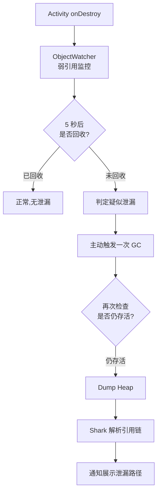

# LeakCanary 内存泄漏检测

> 面试高频指数：高

> LeakCanary 是 Android 内存泄漏检测的利器，由 Square 开源。它会在应用运行时自动监控对象引用，发现泄漏后自动 Dump Heap 并分析出完整的引用链，帮开发者快速定位「谁还持有这个对象」。

## 一、组件定位

### 1.1 为什么需要它

内存泄漏是 Android OOM 的头号元凶。Activity 销毁后仍被静态引用、回调、非静态内部类持有，会导致内存只增不减。LeakCanary 的价值在于 **自动发现 + 自动分析**：

| 能力 | 说明 |
|------|------|
| 自动监控 | 自动监听 Activity / Fragment / ViewModel 等对象的回收 |
| 自动分析 | 泄漏后自动 Dump Heap 并解析引用链 |
| 可视化 | 通知栏展示「谁 → 谁 → 谁」的完整引用路径 |

### 1.2 工作流程



## 二、核心原理

### 2.1 引用泄漏观察

LeakCanary 的核心是 **弱引用 + 引用队列** 的组合：

::: code-tabs

@tab:active Java

```java
// 简化版 ObjectWatcher 原理
public class ObjectWatcher {
    private final Set<KeyedWeakReference> watchedReferences =
            new CopyOnWriteArraySet<>();

    public void watch(Object watchedReference) {
        // 把监控对象包成 KeyedWeakReference（持有唯一 key）
        KeyedWeakReference reference =
                new KeyedWeakReference(watchedReference, key, queue);
        watchedReferences.add(reference);
        // 延迟 5 秒后检查是否被回收
        checkRetainedExecutor.execute(() -> {
            if (!isGone(reference)) {
                // 对象仍在，疑似泄漏，触发 GC 后再查
                GcTrigger.runGc();
                if (!isGone(reference)) {
                    // 仍存活，确定泄漏
                    heapDumper.dumpHeap();
                }
            }
        });
    }
}
```

@tab Kotlin

```kotlin
// 简化版 ObjectWatcher 原理
class ObjectWatcher {
    private val watchedReferences = CopyOnWriteArraySet<KeyedWeakReference>()

    fun watch(watchedReference: Any) {
        // 把监控对象包成 KeyedWeakReference（持有唯一 key）
        val reference = KeyedWeakReference(watchedReference, key, queue)
        watchedReferences.add(reference)
        // 延迟 5 秒后检查是否被回收
        checkRetainedExecutor.execute {
            if (!isGone(reference)) {
                // 对象仍在，疑似泄漏，触发 GC 后再查
                GcTrigger.runGc()
                if (!isGone(reference)) {
                    // 仍存活，确定泄漏
                    heapDumper.dumpHeap()
                }
            }
        }
    }
}
```

:::

### 2.2 判断泄漏的三重确认

| 步骤 | 目的 |
|------|------|
| 弱引用 + 引用队列 | 对象被回收时弱引用会进入引用队列，据此判断是否存活 |
| 延迟 5 秒 | 给 GC 留出时间，避免误报 |
| 主动 GC 复查 | 调用 System.gc() 后二次确认，过滤「可能回收但还没回收」的情况 |

## 三、泄漏原因与修复

| 泄漏场景 | 原因 | 修复方案 |
|----------|------|----------|
| 静态引用持有 Activity | static 变量持有 Context | 改为弱引用或及时置空 |
| 非静态内部类 | 隐式持有外部类实例 | 改用静态内部类 + 弱引用 |
| Handler 泄漏 | Handler 持有 Activity | 静态 Handler + 弱引用 |
| 未注销监听 | 注册未反注册 | onDestroy 中反注册 |
| 单例持有 Context | 单例长期持有 Activity | 使用 Application Context |

## 四、集成方式

::: code-tabs

@tab:active Java

```java
// debug 依赖即可，release 包自动移除
debugImplementation "com.squareup.leakcanary:leakcanary-android:2.14"
```

@tab Kotlin

```kotlin
// debug 依赖即可，release 包自动移除
debugImplementation("com.squareup.leakcanary:leakcanary-android:2.14")
```

:::

- 无需手动初始化，通过 ContentProvider 在应用启动时自动安装。
- 只应加在 debug 构建中，避免影响线上性能。

## 五、源码解析指引

> LeakCanary 的初始化注册、引用泄漏观察、Dump Heap 三大核心流程的源码细节，见 [LeakCanary 源码分析](/advanced/performance/leakcanary-analysis.md)。

## 六、高频面试题

### Q1：LeakCanary 是怎么判断一个对象泄漏的？

::: details 查看答案

把监控对象包装成弱引用并关联引用队列：对象正常回收时弱引用会被加入引用队列；若一段时间后弱引用不在队列中，说明对象仍被强引用持有。LeakCanary 先延迟 5 秒排除慢回收，再主动触发 GC 复查，确认仍存活才判定泄漏并 Dump Heap。

:::

### Q2：LeakCanary 拿到 Heap 后如何定位泄漏引用链？

::: details 查看答案

Dump 出的 hprof 文件交给 Shark 解析：从 GC Roots 出发，沿强引用路径遍历堆中对象，找到能到达泄漏对象的最短强引用链。这条链上的每一环都是「谁持有谁」的实证，直接展示在通知与详情页。

:::

### Q3：为什么 LeakCanary 只加在 debug 依赖里？

::: details 查看答案

Heap Dump 与引用链分析开销较大，会拖慢应用并产生大量内存占用，只适合开发期排查。release 包若带上会严重影响性能与体积，因此使用 debugImplementation 引入，release 构建自动剔除。

:::

### Q4：Handler 为什么会导致内存泄漏？如何修复？

::: details 查看答案

非静态内部类 Handler 隐式持有外部 Activity 的引用，若消息队列中还有未处理的消息，Activity 就无法被回收。修复：将 Handler 声明为静态内部类并使用 WeakReference 持有 Activity，同时在 onDestroy 中 removeCallbacksAndMessages(null) 清空消息。

:::

### Q5：LeakCanary 的初始化为什么不写在 Application 里？

::: details 查看答案

LeakCanary 在清单中注册了一个 ContentProvider（LeakSentryInstaller），其 onCreate() 在 Application.onCreate 之前被系统调用，借此完成自动安装。这样使用者无需手动调用初始化代码，也保证监控尽早生效，这是 Android 库常见的免初始化技巧。

:::

## 小结

- LeakCanary = 弱引用监控 + 延迟复查 + Heap Dump + 引用链分析。
- 三重确认机制避免误报：延迟 5 秒 → 主动 GC → 二次检查。
- 常见泄漏根因：静态引用、非静态内部类、Handler、未注销监听。
- 只加 debug 依赖，通过 ContentProvider 免初始化自动安装。

> 进阶阅读：[LeakCanary 源码分析](/advanced/performance/leakcanary-analysis.md) | [内存优化实战](/advanced/performance/memory-optimization.md) | [性能优化](/advanced/performance/)
