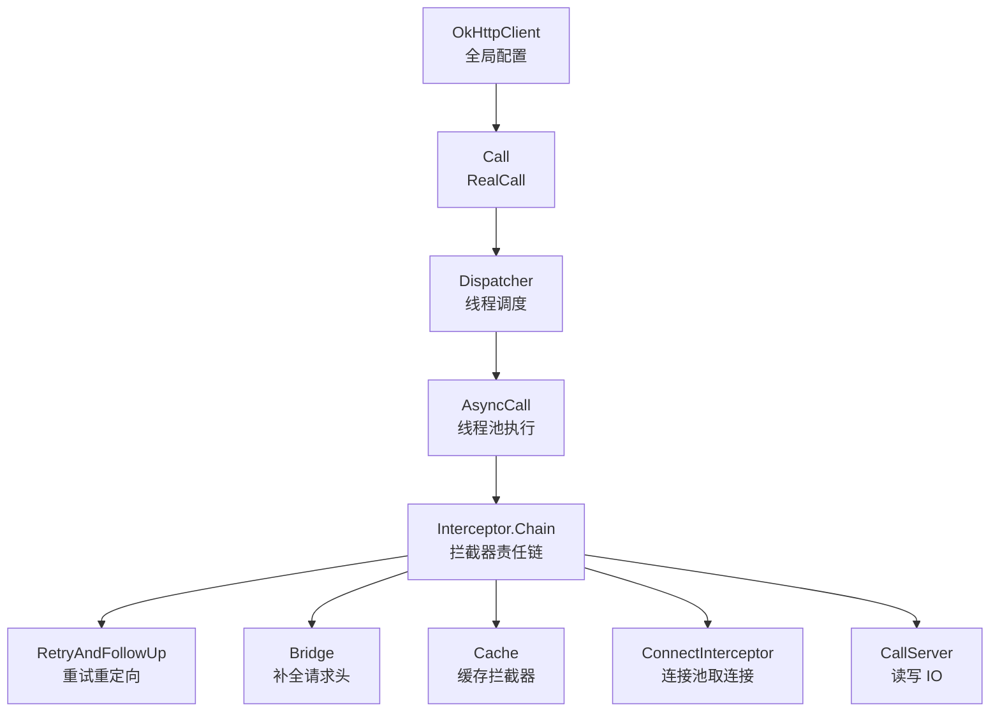
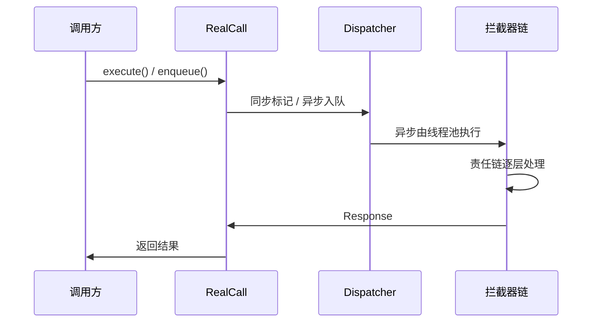
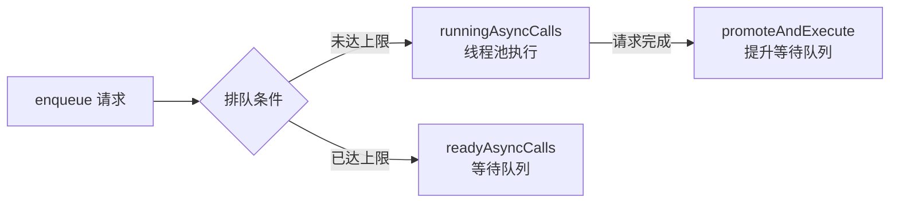
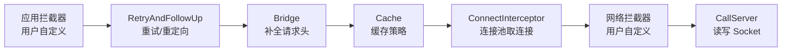

# OkHttp 底层网络框架

> 面试高频指数：极高

> OkHttp 是 Android 网络请求的事实标准，被誉为「Android 最优秀的网络底层框架，没有之一」。从 `client.newCall(request).execute()` 到拿到 Response，中间经历 Dispatcher 调度、拦截器责任链、连接池复用。本文从组件视角拆解 OkHttp 的设计思想与核心机制。

## 一、组件定位

### 1.1 为什么是它

| 维度 | 说明 |
|------|------|
| 性能 | 连接池复用 TCP/TLS，减少握手开销；支持 HTTP/2 多路复用 |
| 易用 | 链式 API 简洁直观，同步/异步请求一行切换 |
| 扩展 | 拦截器机制高度可定制，缓存、日志、鉴权均可插拔 |
| 生态 | Retrofit、Glide 等主流框架底层都基于 OkHttp |

### 1.2 整体架构



| 组件 | 职责 |
|------|------|
| OkHttpClient | 全局配置（超时 / 缓存 / 拦截器 / 连接池 / 代理） |
| Call | 一次请求的抽象（execute 同步 / enqueue 异步） |
| Dispatcher | 异步任务调度（线程池 + 双队列） |
| Interceptor | 责任链，逐层加工请求与响应 |
| ConnectionPool | 连接复用，默认保活 5 分钟 |

## 二、基础使用

::: code-tabs

@tab:active Java

```java
OkHttpClient client = new OkHttpClient.Builder()
        .connectTimeout(10, TimeUnit.SECONDS)
        .readTimeout(10, TimeUnit.SECONDS)
        .build();

Request request = new Request.Builder()
        .url("https://api.example.com/user")
        .get()
        .build();

// 异步请求
client.newCall(request).enqueue(new Callback() {
    @Override
    public void onFailure(Call call, IOException e) { }

    @Override
    public void onResponse(Call call, Response response) throws IOException {
        String body = response.body().string();
    }
});
```

@tab Kotlin

```kotlin
val client = OkHttpClient.Builder()
    .connectTimeout(10, TimeUnit.SECONDS)
    .readTimeout(10, TimeUnit.SECONDS)
    .build()

val request = Request.Builder()
    .url("https://api.example.com/user")
    .get()
    .build()

// 异步请求
client.newCall(request).enqueue(object : Callback {
    override fun onFailure(call: Call, e: IOException) { }

    override fun onResponse(call: Call, response: Response) {
        val body = response.body?.string()
    }
})
```

:::

## 三、请求执行流程

### 3.1 同步与异步



- **execute()**：同步执行，当前线程直接跑完整条拦截器链，调用方需自行管理线程。
- **enqueue()**：异步执行，包装为 AsyncCall 交给 Dispatcher 调度，回调在 OkHttp 的线程池中触发。

### 3.2 Dispatcher 双队列调度

Dispatcher 内部维护 **readyAsyncCalls（等待队列）** 与 **runningAsyncCalls（执行队列）**，并通过两个上限控制并发：

| 参数 | 默认值 | 作用 |
|------|--------|------|
| maxRequests | 64 | 同时执行的最大请求数 |
| maxRequestsPerHost | 5 | 同一主机同时执行的最大请求数 |



## 四、拦截器责任链

责任链是 OkHttp 的灵魂，请求与响应在链上逐层传递：



| 拦截器 | 职责 |
|--------|------|
| RetryAndFollowUpInterceptor | 失败重试、重定向（默认最多 20 次） |
| BridgeInterceptor | 补全 Host / Content-Length / gzip 等请求头 |
| CacheInterceptor | 基于 HTTP 缓存头 + DiskLruCache 的磁盘缓存 |
| ConnectInterceptor | 从连接池获取或新建连接 |
| CallServerInterceptor | 写请求读响应，是链的终点 |

## 五、连接池与缓存

### 5.1 连接池复用

- 以 **地址 + 端口 + TLS 版本** 为 key 缓存连接，默认空闲 5 分钟回收。
- 减少 TCP 三次握手与 TLS 握手次数，是 OkHttp 高性能的核心之一。
- 清理任务由独立的守护线程定期执行，淘汰过期连接。

### 5.2 缓存机制

| 项 | 说明 |
|----|------|
| 存储 | DiskLruCache，以请求 URL 的 MD5 为文件名 |
| 策略 | 尊重服务器返回的 Cache-Control / Expires / ETag |
| 验证 | 缓存过期后发起条件请求，304 则复用缓存体 |

## 六、源码解析指引

> OkHttp 的请求执行链路、Dispatcher 线程调度、连接池复用与责任链实现细节，见 [OkHttp 源码解析](/network/http/okhttp-source.md)。

## 七、高频面试题

### Q1：OkHttp 为什么快？

::: details 查看答案

- 连接池复用 TCP/TLS 连接，避免频繁握手。
- 支持 HTTP/2 多路复用，单连接并发多个请求。
- 磁盘缓存 + 条件请求减少重复数据传输。
- 拦截器链设计让各环节职责单一，避免重复解析与加工。

:::

### Q2：拦截器与责任链模式有什么关系？

::: details 查看答案

责任链模式：多个处理器依次处理请求，每个处理器决定自己处理还是传给下一个。OkHttp 的 Interceptor.Chain 就是责任链的经典实现，请求沿链传递，响应原路返回，每一层都可以加工请求、拦截响应、决定是否继续。

:::

### Q3：Dispatcher 如何控制并发？

::: details 查看答案

Dispatcher 维护 readyAsyncCalls 与 runningAsyncCalls 双队列，通过 maxRequests（64）与 maxRequestsPerHost（5）两个上限控制并发；每次请求完成或入队时调用 promoteAndExecute()，把等待队列中的任务提升到执行队列，交给线程池运行。

:::

### Q4：HttpURLConnection 与 OkHttp 有什么区别？

::: details 查看答案

| 对比项 | HttpURLConnection | OkHttp |
|--------|-------------------|--------|
| 连接复用 | 不友好 | 连接池复用 |
| 协议支持 | 一般 | HTTP/2、WebSocket |
| 扩展性 | 差 | 拦截器机制强大 |
| 性能 | 一般 | 高 |

:::

### Q5：一次完整的 OkHttp 请求经过了哪些组件？

::: details 查看答案

OkHttpClient 构建配置 → newCall 创建 RealCall → execute/enqueue 交给 Dispatcher → 拦截器责任链（重试重定向 → 桥接 → 缓存 → 连接 → 网络拦截器 → IO）→ 连接池取连接 → Socket 读写 → Response 原路返回。

:::

## 小结

- OkHttp = OkHttpClient + Call + Dispatcher + 拦截器链 + 连接池。
- Dispatcher 双队列 + 双上限控制异步并发。
- 责任链：应用拦截器 → 重试 → 桥接 → 缓存 → 连接 → 网络拦截器 → IO。
- 连接池复用 TCP/TLS，缓存基于 HTTP 缓存头 + DiskLruCache。

> 进阶阅读：[OkHttp 源码解析](/network/http/okhttp-source.md) | [OkHttp 拦截器深入](/network/http/okhttp-interceptor.md) | [Retrofit 动态代理原理](/network/http/retrofit-source.md) | [Retrofit 网络封装框架](retrofit.md)
