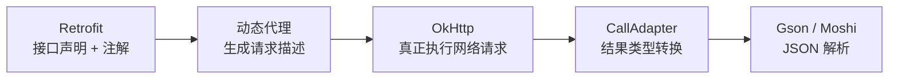
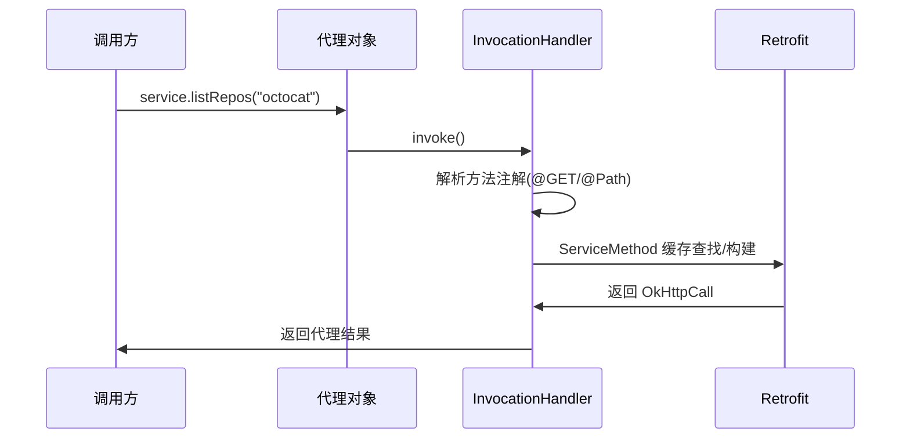
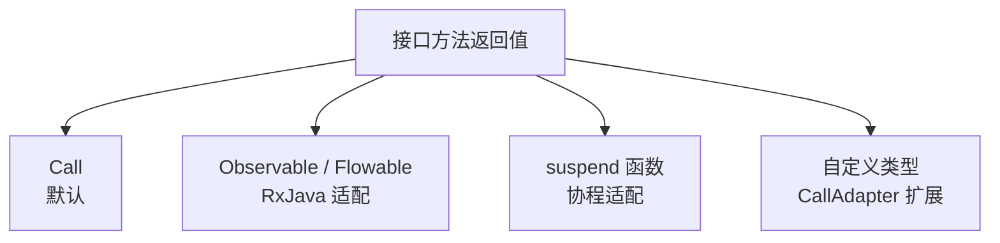

# Retrofit 网络封装框架

> 面试高频指数：极高

> Retrofit 是 Square 出品的网络封装框架，基于 OkHttp 提供声明式 REST API。它把「接口方法 + 注解」翻译成 OkHttp 请求，内含九种常用设计模式的灵活运用，是理解「框架设计之美」的最佳教材。

## 一、组件定位

### 1.1 与 OkHttp 的关系



- **Retrofit 负责「翻译」**：把接口方法调用翻译成 OkHttp 的 Request。
- **OkHttp 负责「执行」**：真正完成网络 IO。
- 二者分工明确：Retrofit 解决「怎么写请求」，OkHttp 解决「怎么发请求」。

### 1.2 基础使用

::: code-tabs

@tab:active Java

```java
public interface GitHubService {
    @GET("users/{user}/repos")
    Call<List<Repo>> listRepos(@Path("user") String user);
}

Retrofit retrofit = new Retrofit.Builder()
        .baseUrl("https://api.github.com/")
        .addConverterFactory(GsonConverterFactory.create())
        .build();

GitHubService service = retrofit.create(GitHubService.class);
service.listRepos("octocat").enqueue(new Callback<List<Repo>>() {
    @Override
    public void onResponse(Call<List<Repo>> call, Response<List<Repo>> response) { }

    @Override
    public void onFailure(Call<List<Repo>> call, Throwable t) { }
});
```

@tab Kotlin

```kotlin
interface GitHubService {
    @GET("users/{user}/repos")
    fun listRepos(@Path("user") user: String): Call<List<Repo>>
}

val retrofit = Retrofit.Builder()
    .baseUrl("https://api.github.com/")
    .addConverterFactory(GsonConverterFactory.create())
    .build()

val service = retrofit.create(GitHubService::class.java)
service.listRepos("octocat").enqueue(object : Callback<List<Repo>> {
    override fun onResponse(call: Call<List<Repo>>, response: Response<List<Repo>>) { }

    override fun onFailure(call: Call<List<Repo>>, t: Throwable) { }
})
```

:::

## 二、核心原理：动态代理

### 2.1 create() 做了什么

`retrofit.create(Service.class)` 的核心是 **JDK 动态代理**：不实现接口，而是在运行时生成代理对象，把所有方法调用统一拦截到 InvocationHandler。



::: code-tabs

@tab:active Java

```java
// 简化版动态代理核心
public <T> T create(final Class<T> service) {
    return (T) Proxy.newProxyInstance(
            service.getClassLoader(),
            new Class<?>[]{service},
            new InvocationHandler() {
                @Override
                public Object invoke(Object proxy, Method method, Object[] args) {
                    // 解析方法注解，构建 ServiceMethod
                    ServiceMethod<T> serviceMethod =
                            loadServiceMethod(method);
                    OkHttpCall<T> okHttpCall =
                            new OkHttpCall<>(serviceMethod, args);
                    return serviceMethod.callAdapter.adapt(okHttpCall);
                }
            });
}
```

@tab Kotlin

```kotlin
// 简化版动态代理核心（Kotlin 写法示意）
fun <T : Any> create(service: Class<T>): T {
    return Proxy.newProxyInstance(
        service.classLoader,
        arrayOf(service),
        InvocationHandler { _, method, args ->
            // 解析方法注解，构建 ServiceMethod
            val serviceMethod = loadServiceMethod<T>(method)
            val okHttpCall = OkHttpCall<T>(serviceMethod, args)
            serviceMethod.callAdapter.adapt(okHttpCall)
        }
    ) as T
}
```

:::

### 2.2 注解系统

| 注解分类 | 代表 | 作用 |
|----------|------|------|
| 请求方法 | @GET / @POST / @PUT / @DELETE | 声明 HTTP 方法与相对路径 |
| 路径参数 | @Path | 替换 URL 中的 {占位符} |
| 查询参数 | @Query / @QueryMap | 拼接查询串 |
| 请求体 | @Body | 序列化对象为请求体 |
| 请求头 | @Header / @Headers | 设置请求头 |
| 表单 | @FormUrlEncoded / @Field | 表单提交 |

## 三、CallAdapter 与 Converter

### 3.1 职责划分

| 组件 | 职责 | 举例 |
|------|------|------|
| CallAdapter | 把 OkHttpCall 适配成其他类型 | Call、RxJava 的 Observable、协程的 suspend |
| Converter | 请求体/响应体的序列化与反序列化 | Gson、Moshi、protobuf |

### 3.2 支持多种返回类型



正是这套扩展点，让 Retrofit 能无缝衔接 RxJava 与协程，而核心代码几乎不变。

## 四、九种设计模式的灵活运用

Retrofit 被公认为「内含九种常用设计模式」的教科书级框架：

| # | 设计模式 | 在 Retrofit 中的体现 |
|---|----------|----------------------|
| 1 | 动态代理 | create() 生成接口代理，拦截方法调用 |
| 2 | 建造者 | Retrofit.Builder 链式构建配置 |
| 3 | 工厂 | CallAdapter.Factory / Converter.Factory |
| 4 | 适配器 | CallAdapter 把 Call 适配成 Observable 等 |
| 5 | 策略 | 不同 Converter 可插拔替换 |
| 6 | 外观 | Retrofit 对外暴露简单 API，隐藏 OkHttp 细节 |
| 7 | 单例 | ServiceMethod 缓存，每个方法只构建一次 |
| 8 | 观察者 | 回调 Callback 观察请求结果 |
| 9 | 装饰 | 拦截器/转换器层层装饰扩展能力 |

> 面试中能说出其中 4-5 种并结合代码说明，即可体现源码功底。

## 五、源码解析指引

> Retrofit 动态代理与 ServiceMethod 缓存的完整源码拆解，见 [Retrofit 动态代理原理](/network/http/retrofit-source.md)。

## 六、高频面试题

### Q1：Retrofit 是如何把接口方法变成网络请求的？

::: details 查看答案

三步：一是 create() 用 JDK 动态代理生成接口代理对象；二是方法调用被 InvocationHandler.invoke() 拦截，解析方法注解（@GET、@Path 等）与参数注解；三是构建 ServiceMethod（含注解解析结果与 CallAdapter/Converter），再包装成 OkHttpCall 执行。ServiceMethod 会缓存，每个方法只解析一次。

:::

### Q2：Retrofit 与 OkHttp 的分工是什么？

::: details 查看答案

Retrofit 只负责把接口声明翻译成 OkHttp 的 Request，并处理返回类型的适配与转换；真正发起网络请求、连接复用、超时控制、缓存都由 OkHttp 完成。Retrofit 依赖 OkHttp，两者是上层封装与底层执行的关系。

:::

### Q3：CallAdapter 和 Converter 有什么区别？

::: details 查看答案

CallAdapter 负责把 OkHttpCall 适配成接口方法的返回类型（Call、Observable、suspend 等），管的是「返回类型怎么变」；Converter 负责请求体与响应体的序列化/反序列化（JSON 到对象），管的是「数据怎么转」。二者都是通过 Factory 扩展点插拔。

:::

### Q4：Retrofit 用了哪些设计模式？举例说明。

::: details 查看答案

常见说法：动态代理（create 生成代理）、建造者（Builder 构建）、工厂（CallAdapter/Converter Factory）、适配器（CallAdapter 适配返回类型）、策略（Converter 可替换）、外观（隐藏 OkHttp 细节）、单例（ServiceMethod 缓存）、观察者（Callback 回调）、装饰（拦截器扩展）。能结合源码举出具体例子更有说服力。

:::

### Q5：为什么 Retrofit 的方法必须声明在接口里？

::: details 查看答案

Retrofit 依赖 JDK 动态代理，而动态代理只能代理接口（Proxy.newProxyInstance 要求传入接口 Class 数组），不能代理普通类。因此 Retrofit 的 API 必须声明为接口，create() 才能为其生成代理对象。

:::

## 小结

- Retrofit = 动态代理 + 注解解析 + CallAdapter + Converter。
- create() 用 JDK 动态代理拦截方法调用，ServiceMethod 缓存保证性能。
- CallAdapter 管返回类型适配，Converter 管数据转换，均可插拔扩展。
- 九种设计模式的灵活运用是框架设计的典范。

> 进阶阅读：[Retrofit 动态代理原理](/network/http/retrofit-source.md) | [Retrofit + OkHttp 详解](/network/http/retrofit-okhttp.md) | [OkHttp 底层网络框架](okhttp.md)
