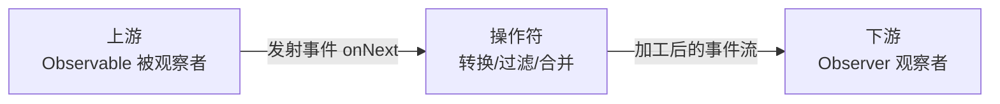
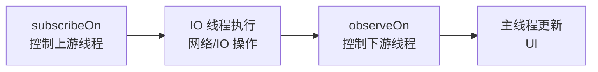
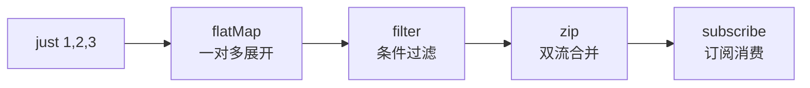

# RxJava 响应式编程

> 面试高频指数：高

> RxJava 是 Java 平台的响应式编程库，以「异步、简洁、优雅、强大」著称。它把复杂的异步逻辑抽象为事件流，配合丰富的操作符完成链式组合。本文探究 RxJava 的核心机制与操作符体系。

## 一、组件定位

### 1.1 响应式编程思想



- **被观察者（Observable）**：数据的生产源头，决定何时发射事件。
- **观察者（Observer）**：事件的消费方，处理 onNext / onError / onComplete。
- **操作符**：事件流的转换器，把上游事件加工后传给下游。

### 1.2 为什么要用 RxJava

| 优势 | 说明 |
|------|------|
| 异步简洁 | 线程切换一行搞定，摆脱嵌套回调 |
| 链式表达 | 数据流处理逻辑线性可读 |
| 操作符丰富 | 30+ 操作符覆盖绝大多数业务场景 |
| 错误处理 | onErrorResumeNext 等统一兜底 |

## 二、基础使用

::: code-tabs

@tab:active Java

```java
Observable.create((ObservableOnSubscribe<Integer>) emitter -> {
            emitter.onNext(1);
            emitter.onNext(2);
            emitter.onNext(3);
            emitter.onComplete();
        })
        .map(i -> i * 10)                    // 转换
        .filter(i -> i > 10)                 // 过滤
        .subscribeOn(Schedulers.io())        // 上游在 IO 线程
        .observeOn(AndroidSchedulers.mainThread()) // 下游在主线程
        .subscribe(i -> Log.d("RxJava", "value=" + i));
```

@tab Kotlin

```kotlin
Observable.create<Int> { emitter ->
            emitter.onNext(1)
            emitter.onNext(2)
            emitter.onNext(3)
            emitter.onComplete()
        }
        .map { it * 10 }                                    // 转换
        .filter { it > 10 }                                 // 过滤
        .subscribeOn(Schedulers.io())                       // 上游在 IO 线程
        .observeOn(AndroidSchedulers.mainThread())          // 下游在主线程
        .subscribe { value -> Log.d("RxJava", "value=$value") }
```

:::

## 三、观察者模式与线程切换

### 3.1 观察者模式

RxJava 使用扩展的观察者模式：订阅（subscribe）时建立上下游连接，上游每发射一个事件，操作符逐个处理，最终交给下游观察者。核心类型：

| 类型 | 说明 |
|------|------|
| Observable | 发射 0..N 个事件，不支持背压 |
| Flowable | 发射 0..N 个事件，支持背压 |
| Single | 只发射 1 个事件或错误 |
| Maybe | 发射 0 或 1 个事件 |
| Completable | 只关心完成，不发射数据 |

### 3.2 subscribeOn 与 observeOn



| 方法 | 作用 | 生效位置 |
|------|------|----------|
| subscribeOn | 指定事件**产生**的线程 | 上游（多次调用取第一次生效） |
| observeOn | 指定事件**消费**的线程 | 下游（每次调用切换后续线程） |

## 四、背压机制

| 概念 | 说明 |
|------|------|
| 背压 | 上游发射速度 > 下游处理速度时的事件积压问题 |
| Flowable | 支持背压的响应式类型，通过缓冲区与策略控制 |
| BackpressureStrategy | BUFFER / DROP / LATEST / ERROR / MISSING 五种策略 |
| 触发条件 | 缓冲池溢出时按策略丢弃或报错 |

> 高频业务（按钮点击防抖、搜索防抖）可用 throttleFirst / debounce 操作符从源头削减事件量。

## 五、操作符体系

| 分类 | 代表操作符 | 作用 |
|------|-----------|------|
| 创建 | create / just / fromArray / interval | 创建事件流 |
| 转换 | map / flatMap / concatMap / switchMap | 变换数据类型 |
| 过滤 | filter / take / distinct / debounce | 按条件筛选 |
| 组合 | zip / merge / concat / combineLatest | 合并多个流 |
| 线程 | subscribeOn / observeOn | 切换线程 |
| 错误 | onErrorReturn / retry / onErrorResumeNext | 异常兜底 |



## 六、RxJava 与协程对比

| 对比项 | RxJava | Kotlin 协程 |
|--------|--------|-------------|
| 语法 | 链式操作符 | 顺序代码 + suspend |
| 学习成本 | 高（操作符多） | 低 |
| 取消 | 需管理 Disposable | 结构化并发自动取消 |
| 背压 | Flowable 支持 | Flow 支持 |
| 生态 | 老项目广泛使用 | 新项目主流 |

> 新项目官方推荐协程；但理解 RxJava 的观察者模式与线程模型，对阅读老代码与面试都至关重要。

## 七、高频面试题

### Q1：subscribeOn 和 observeOn 有什么区别？

::: details 查看答案

subscribeOn 指定事件产生的线程，即上游 Observable 执行订阅代码所在的线程，多次调用只第一次生效；observeOn 指定事件消费的线程，即下游观察者回调所在线程，每次调用都会切换后续所有操作符的执行线程。典型用法：subscribeOn(io) 做网络请求，observeOn(main) 更新 UI。

:::

### Q2：map、flatMap、concatMap、switchMap 有什么区别？

::: details 查看答案

map 一对一转换；flatMap 一对多展开但**无序**合并结果（可能乱序）；concatMap 一对多展开且**按顺序**串联发射（保序但串行）；switchMap 一对多展开但**只保留最新**的上游事件结果（用于搜索联想、快速点击等场景）。

:::

### Q3：什么是背压？怎么解决？

::: details 查看答案

背压是上游发射速度远大于下游处理速度时，事件在缓冲区积压的问题。使用 Flowable + BackpressureStrategy 处理：BUFFER 无限缓冲、DROP 丢弃、LATEST 保留最新、ERROR 溢出报错；或从源头用 debounce / sample 等操作符降低事件频率。

:::

### Q4：RxJava 的线程切换底层是怎么实现的？

::: details 查看答案

核心是线程调度器 Scheduler：subscribeOn 通过包装上游的 subscribe 方法，把订阅动作投递到指定线程池执行；observeOn 通过在下游侧插入一个观察者，把事件投递到指定线程的 Handler/Executor 中转发。本质是「事件投递线程」的切换，而不是魔法般的线程迁移。

:::

### Q5：RxJava 中如何避免内存泄漏？

::: details 查看答案

订阅会建立 Observable 对 Observer 的强引用，页面销毁后若不取消会导致泄漏。解决：使用 CompositeDisposable 统一管理，onDestroy 中调用 dispose()；或用 RxLifecycle / AutoDispose 自动绑定生命周期；页面级订阅建议配合 takeUntil 在生命周期事件处自动结束。

:::

## 小结

- RxJava = 被观察者 + 操作符 + 观察者，事件流链式处理。
- subscribeOn 控制上游线程，observeOn 控制下游线程。
- Flowable + BackpressureStrategy 解决背压。
- 操作符按 创建 / 转换 / 过滤 / 组合 / 线程 / 错误 分类记忆。

> 进阶阅读：[RxJava 操作符详解](/network/coroutine/rxjava-operators.md) | [Flow 响应式流进阶](/network/coroutine/flow-advanced.md) | [协程原理剖析](/network/coroutine/coroutine-principle.md) | [Retrofit 网络封装框架](retrofit.md)
