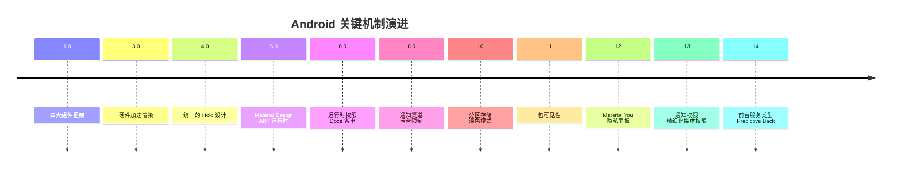
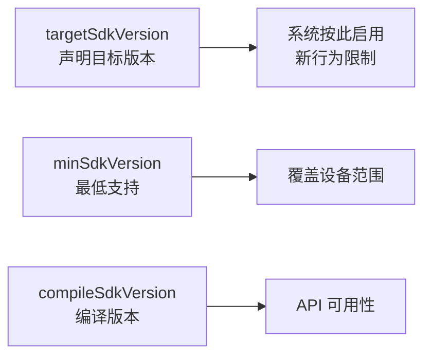
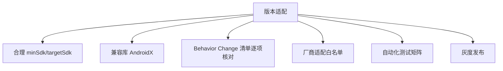

# Android 版本演进与特性

> 面试高频指数：低 — 不常考细节，但"版本命名与 API Level 对应、某个特性在哪个版本引入"偶有出现，是基础常识题。

## 一、版本命名与 API Level

### 1.1 命名规则

```text
Android 1.5 (Cupcake)      → 以甜点名命名（1.5~9.0）
Android 10                 → 2019 年起改用数字
Android 10/11/12/13/14/15 → 数字命名
```

| Android 版本 | 代号 | API Level | 发布时间 |
|--------------|------|-----------|----------|
| 1.0 | — | 1 | 2008.09 |
| 1.5 | Cupcake | 3 | 2009.04 |
| 2.2 | Froyo | 8 | 2010.05 |
| 4.0 | Ice Cream Sandwich | 14 | 2011.10 |
| 4.4 | KitKat | 19 | 2013.10 |
| 5.0 | Lollipop | 21 | 2014.11 |
| 6.0 | Marshmallow | 23 | 2015.10 |
| 7.0 | Nougat | 24 | 2016.08 |
| 8.0 | Oreo | 26 | 2017.08 |
| 9.0 | Pie | 28 | 2018.08 |
| 10 | Quince Tart | 29 | 2019.09 |
| 11 | Red Velvet Cake | 30 | 2020.09 |
| 12 | Snow Cone | 31 | 2021.10 |
| 12L | — | 32 | 2022.03 |
| 13 | Tiramisu | 33 | 2022.08 |
| 14 | Upside Down Cake | 34 | 2023.10 |
| 15 | Vanilla Ice Cream | 35 | 2024.09 |

## 二、关键特性演进

### 2.1 系统机制演进



### 2.2 里程碑特性详解

| 版本 | 核心特性 | 开发者影响 |
|------|----------|-----------|
| 5.0 | ART 替换 Dalvik、Material Design | 运行性能跃升 |
| 6.0 | 运行时权限（危险权限动态申请） | targetSdk 23+ 适配 |
| 7.0 | 多窗口、FileProvider | 文件共享适配 |
| 8.0 | 通知渠道、后台执行限制 | targetSdk 26+ 适配 |
| 9.0 | 默认 HTTPS、刘海屏 | 网络安全适配 |
| 10 | 分区存储强制、深色模式 | targetSdk 29+ 适配 |
| 12 | Material You、隐私指示器 | 主题与权限适配 |
| 13 | 通知运行时权限、照片选择器 | targetSdk 33+ 适配 |
| 14 | 前台服务类型、16KB 页对齐 | targetSdk 34+ 适配 |
| 15 | 边缘到边缘强制、部分屏幕共享 | targetSdk 35+ 适配 |

## 三、适配策略

### 3.1 targetSdk 的契约



| 版本字段 | 作用 | 建议 |
|----------|------|------|
| compileSdk | 编译用 API 全集 | 用最新稳定版 |
| minSdk | 最低支持版本 | 按市场覆盖 |
| targetSdk | 触发新行为 | 跟随商店要求（2023 起要求 33+） |

### 3.2 行为变更检查

::: code-tabs

@tab:active Java

```java
// 运行时判断版本（处理行为差异）
if (Build.VERSION.SDK_INT >= Build.VERSION_CODES.TIRAMISU) {
    // Android 13+：动态申请通知权限
    requestPermissions(new String[]{Manifest.permission.POST_NOTIFICATIONS}, 1);
} else {
    // 旧版本无需申请
}

// 分区存储：targetSdk 29+ 默认作用域存储
if (Build.VERSION.SDK_INT >= Build.VERSION_CODES.Q) {
    // 使用 MediaStore / SAF 访问
} else {
    // 可直接读写公共目录
}
```

@tab Kotlin

```kotlin
// 运行时判断版本（处理行为差异）
if (Build.VERSION.SDK_INT >= Build.VERSION_CODES.TIRAMISU) {
    // Android 13+：动态申请通知权限
    requestPermissions(arrayOf(Manifest.permission.POST_NOTIFICATIONS), 1)
} else {
    // 旧版本无需申请
}

// 分区存储：targetSdk 29+ 默认作用域存储
if (Build.VERSION.SDK_INT >= Build.VERSION_CODES.Q) {
    // 使用 MediaStore / SAF 访问
} else {
    // 可直接读写公共目录
}
```

:::

## 四、碎片化问题

### 4.1 碎片化现状

| 维度 | 挑战 |
|------|------|
| 系统版本 | 5.0~15 并存 |
| 厂商 ROM | MIUI/ColorOS/鸿蒙 行为差异 |
| 屏幕尺寸 | 手机/平板/折叠屏/大屏 |
| 芯片架构 | ARM64/ARMv7/x86 模拟器 |
| 屏幕密度 | mdpi~xxxhdpi 多档 |

### 4.2 应对策略



## 五、高频面试题

### Q1：minSdkVersion、targetSdkVersion、compileSdkVersion 的区别？
::: details 查看答案
compileSdkVersion：编译时使用的 API 版本，决定你能调用哪些新 API（最新稳定版），不影响运行行为；minSdkVersion：应用支持的最低系统版本，低于它的设备无法安装，决定可覆盖设备范围；targetSdkVersion：声明应用针对哪个版本开发，系统根据它启用"新行为变更"（如 Android 10 分区存储、13 通知权限），是适配的核心。升级 targetSdk 不是改个数字：官方每个版本有行为变更清单，需逐项测试，并配合 AndroidX 兼容库处理新老版本差异。
:::

### Q2：Android 6.0 运行时权限和 5.0 及以前的安装时权限有什么区别？
::: details 查看答案
5.0 及以前：安装时授权（Install-time），用户安装时一次性授予清单里的全部权限，无法单独拒绝，厂商可自定义；6.0 起：危险权限在运行时动态申请（Runtime permission），分为：① 普通权限（Normal）：安装时自动授予；② 危险权限（Dangerous）：涉及隐私（相机/定位/联系人等），运行时弹窗申请，可拒绝、可随时在设置中撤销；③ 特殊权限（如悬浮窗）：需跳转设置授予。开发者需在运行时请求、处理拒绝回调，并提供"拒绝后的引导"逻辑。
:::

### Q3：Android 10 的分区存储是什么？怎么适配？
::: details 查看答案
分区存储（Scoped Storage）：targetSdk 29+ 时应用只能访问自己专属目录（Context.getExternalFilesDir）和媒体库（MediaStore）中的内容，不能直接读写公共目录任意文件。适配：① 读公共媒体：用 MediaStore API（query + openFileDescriptor）；② 写公共媒体：插入 MediaStore（PENDING 状态）；③ 文件类型专属（音频/图片/视频）通过 MediaStore 集合访问；④ 下载目录可用 SAF（ACTION_CREATE_DOCUMENT）让用户选择；⑤ 自己的 app 专属目录不受影响。Android 11 起进一步收紧（不能再用 requestLegacyExternalStorage 豁免）。
:::

### Q4：Android 12 和 13 有哪些必须适配的行为变更？
::: details 查看答案
Android 12（API 31）：① 大幅改版 UI（Material You 动态取色）；② 隐私指示器（相机/麦克风使用提示条）、隐私面板；③ 近似位置权限（ACCESS_COARSE_LOCATION 可单独授予）；④ 导出组件显式声明（android:exported 必填）；⑤ Splash Screen 新启动画面。Android 13（API 33）：① 通知运行时权限（POST_NOTIFICATIONS 需动态申请）；② 照片选择器（Photo Picker 免权限选图）；③ 细粒度媒体权限（READ_MEDIA_IMAGES/VIDEO/AUDIO 替代 READ_EXTERNAL_STORAGE）；④ 剪贴板隐私提示。适配要点：targetSdk 更新 + AndroidX 对应版本 + 清单与权限调整 + 逐项行为测试。
:::

### Q5：Android 碎片化严重，团队怎么保证多版本兼容？
::: details 查看答案
① 合理定级：按市场数据定 minSdk（覆盖 95%+ 设备），targetSdk 跟随商店要求；② 兼容库：AndroidX/AppCompat 统一处理旧版本差异，优先用官方组件；③ 版本判断：行为差异处用 Build.VERSION 判断或兼容库封装；④ 特性检测：硬件能力（相机、传感器）运行时检测而非版本判断；⑤ 测试矩阵：真机 + 云测（模拟器覆盖 5.0~最新）、多分辨率；⑥ 厂商适配：重点机型（华为/小米/OPPO）专项测试，加白名单；⑦ 灰度发布：分阶段放量，监控崩溃率与反馈；⑧ 降级策略：新特性无法实现时提供优雅降级。
:::

## 六、小结

版本演进要点：

1. 命名：甜点名（1.5~9.0）→ 数字（10+），API Level 对应
2. 里程碑：5.0 ART、6.0 运行时权限、10 分区存储、13 通知权限
3. 三个 sdkVersion 各司其职，targetSdk 是适配核心
4. 行为变更清单 + AndroidX 是适配基本盘
5. 碎片化应对：定级 + 测试矩阵 + 灰度 + 降级

相关阅读：[Android 学习路线图](/roadmap/android-roadmap.md)、[Kotlin 学习路线图](/roadmap/kotlin-roadmap.md)、[Compose 学习路线图](/roadmap/compose-roadmap.md)、[APK 构建流程详解](/system/apk/apk-build-process.md)。
