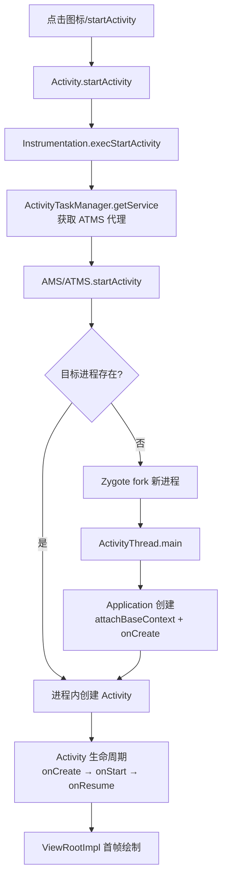

# 🏢 AMS 与 Activity 启动流程

> 面试高频指数：⭐⭐⭐⭐⭐
> Activity 启动流程是 Android 源码面试的"必考大题"。

## 1. AMS 是什么

```text
AMS（ActivityManagerService）
系统核心服务，运行在 SystemServer 进程

主要职责：
① 管理四大组件（启动、销毁、调度）
② 管理进程（创建、优先级 OOM Adj、Kill）
③ 管理任务栈（Task/Back Stack）
④ 权限校验（startActivity 前检查）
⑤ 广播、服务的调度中心
```

## 2. Activity 启动流程（完整链路）



### 2.1 详细步骤

```text
① 应用进程：Activity.startActivity()
   → Activity.startActivityForResult()
   → Instrumentation.execStartActivity()    // 埋点/监控入口

② 跨进程请求：获取 ATMS（ActivityTaskManagerService）Binder 代理
   → startActivity 请求发往系统进程

③ 系统进程：ATMS.startActivity() → ActivityStarter
   → 检查 Intent/权限/任务栈
   → 确定启动模式与任务栈（Task）

④ 进程创建：目标进程不存在时
   → AMS.startProcessLocked()
   → 向 Zygote 发送 fork 请求（Socket）
   → Zygote.fork 出子进程

⑤ 新进程初始化：ActivityThread.main()
   → 创建主线程 Looper（prepareMainLooper）
   → attach(false) 绑定 AMS
   → 创建 Application（attachBaseContext → onCreate）

⑥ Activity 创建：AMS 通过 Binder 通知 ActivityThread
   → handleLaunchActivity()
   → 创建 Activity 实例
   → attach() 关联 Window
   → onCreate → onStart → onResume

⑦ 首帧绘制：onResume 后
   → ViewRootImpl.performTraversals()
   → measure/layout/draw → 首帧显示
```

## 3. 启动模式与任务栈

| 模式 | 行为 | 场景 |
| --- | --- | --- |
| standard | 每次新建实例 | 默认 |
| singleTop | 栈顶复用（onNewIntent） | 通知点击 |
| singleTask | 栈内复用，清空其上 | 首页、主界面 |
| singleInstance | 独立任务栈，全局唯一 | 电话、闹钟 |

```text
任务栈（Task）：
- 每个 App 可能有多个 Task
- singleTask/singleInstance 影响 Task 归属
- 系统按 LRU 管理 Task（可销毁恢复）
```

## 4. 进程优先级（OOM Adj）

```text
进程优先级从高到低：
① 前台进程（Foreground）：前台 Activity、正在接收输入
② 可见进程（Visible）：可见但不可交互
③ 服务进程（Service）：已启动服务
④ 后台进程（Cached）：不可见 Activity（LRU 缓存）
⑤ 空进程（Empty）：无组件

OOM_ADJ 数值：
0     FOREGROUND_APP
100   VISIBLE_APP
200   PERCEPTIBLE_APP（后台播放音乐）
300   BACKUP_APP
400   HEAVY_WEIGHT_APP
500   SERVICE_APP
900   CACHED_APP（可被杀死）

内存不足时：从低优先级开始回收
```

## 5. 冷启动 vs 热启动

| 类型 | 过程 | 优化点 |
| --- | --- | --- |
| 冷启动 | 创建进程 + Application + Activity | 首帧耗时最长 |
| 热启动 | 复用已有进程，重建 Activity | 较快 |
| 温启动 | 进程存活，Activity 重建 | 中 |

**冷启动优化**：

```text
① Application.onCreate 不做事（延迟初始化/异步初始化）
② 启动页用 Window Background 占位（Theme 设置 windowBackground）
③ 避免主线程 IO、反射、大对象
④ 布局精简（首屏）
⑤ 预加载（懒加载）
```

## 6. 高频面试题

**Q1：Activity 启动流程？（标准答案）**
A：startActivity → Instrumentation → ATMS（Binder）→ ActivityStarter 检查
→ 进程不存在则 Zygote fork → ActivityThread.main → Application → handleLaunchActivity
→ onCreate/onStart/onResume → 首帧。

**Q2：AMS 和 ATMS 的区别？**
A：Android 10 后将 Activity 管理拆分出 ATMS（ActivityTaskManagerService），
AMS 负责进程/服务/广播等更广的管理，ATMS 专注 Activity/Task/Window 相关。
（面试中常统称 AMS。）

**Q3：为什么用 Zygote fork 创建进程？**
A：fork 复制父进程地址空间，Zygote 已预加载常用类与资源，子进程继承，
省去重复加载时间（启动更快、内存共享）。

**Q4：进程被杀死后如何恢复？**
A：系统重建进程并恢复任务栈（onCreate 收到 savedInstanceState）；
进程死亡前系统调用 onSaveInstanceState 保存状态。因此 Activity 状态保存
很重要。

**Q5：如何优化冷启动？**
A：Application 轻量化（延迟初始化）、Window Background 占位、布局精简、
异步预加载、线程池预热、启动器（App Startup）按需初始化。

## 7. 小结

- AMS 是组件/进程/任务栈的管理中心。
- 启动链路：应用进程 → Binder → 系统进程 → Zygote → 新进程 → Activity。
- 进程优先级决定被杀顺序（OOM Adj）。
- 冷启动优化从 Application 与首屏入手。
- 面试重点：完整链路 + 各环节类名 + 优化手段。
