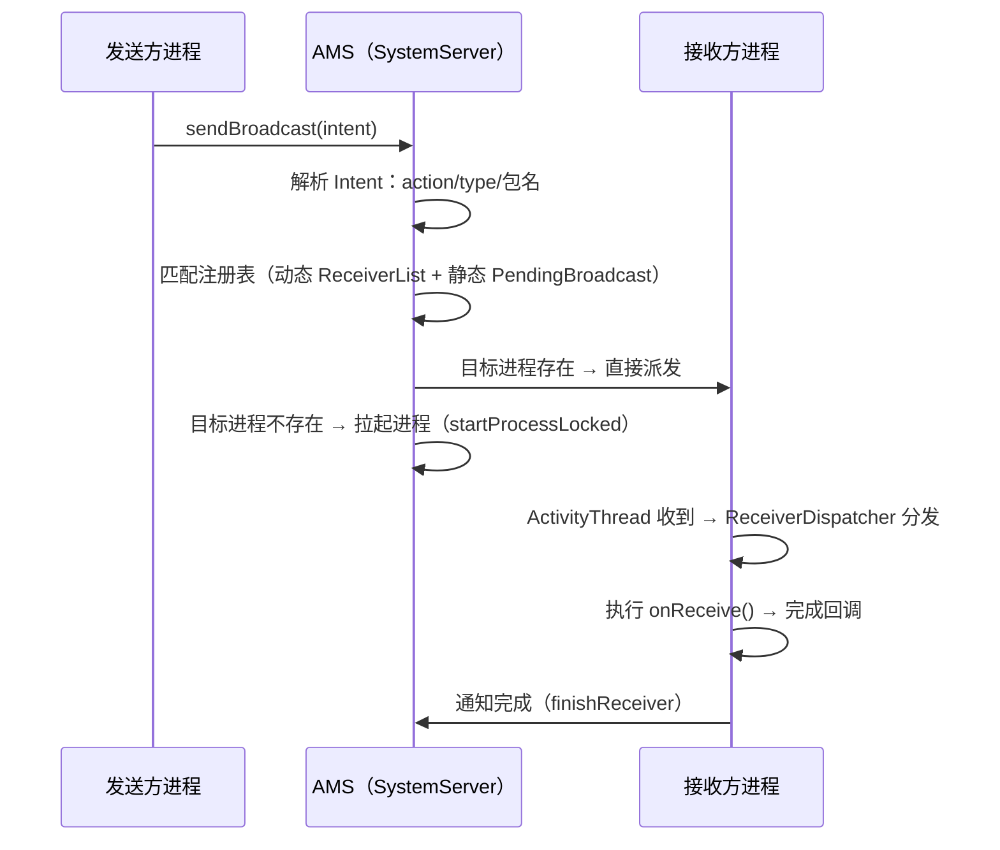

# 广播机制底层原理

> 面试高频指数：高
> 广播（BroadcastReceiver）是四大组件中最"轻"的，但底层分发链路涉及 AMS、进程调度与注册管理。

## 1. 广播的两种注册方式

### 1.1 动态注册

```java
// 动态注册：代码中注册，进程存活期间有效
IntentFilter filter = new IntentFilter("com.example.CUSTOM_ACTION");
registerReceiver(receiver, filter);

// 记得注销
unregisterReceiver(receiver);
```

### 1.2 静态注册

```xml
<!-- 静态注册：AndroidManifest.xml 中声明，无需进程存活 -->
<receiver
    android:name=".MyReceiver"
    android:exported="true">
    <intent-filter>
        <action android:name="com.example.CUSTOM_ACTION" />
    </intent-filter>
</receiver>
```

| 对比项 | 动态注册 | 静态注册 |
|--------|----------|----------|
| 注册位置 | 代码 | Manifest |
| 进程存活要求 | 需要 | 不需要（可拉起进程） |
| 生命周期 | 跟随组件 | 跟随安装 |
| Android 8.0+ | 不受限 | 大部分隐式广播被限制 |
| 推荐 | 常用 | 系统特定广播 |

## 2. 广播分发链路（核心）

### 2.1 发送到接收的完整流程



### 2.2 关键数据结构

```text
ReceiverList：进程注册的广播接收者列表（动态）
BroadcastQueue：广播队列（前台/后台各一个）
BroadcastRecord：正在派发的广播记录
PendingBroadcast：静态注册待拉起进程的广播
```

## 3. 有序广播与无序广播

### 3.1 无序广播（标准广播）

```java
// 无序广播：所有接收者并行接收，无顺序、不可拦截、不可修改
sendBroadcast(intent);
```

```text
特点：
- 并行分发
- 无优先级概念
- 接收者之间互不影响
- 性能较好
```

### 3.2 有序广播

```java
// 有序广播：按优先级依次传递，可拦截、可修改数据
sendOrderedBroadcast(intent, null);
```

```java
// 接收者中拦截/修改
public class MyReceiver extends BroadcastReceiver {
    @Override
    public void onReceive(Context context, Intent intent) {
        // 修改结果数据
        setResultCode(Activity.RESULT_OK);
        setResultData("modified");
        // 拦截广播：不再传给后面的接收者
        abortBroadcast();
    }
}
```

```text
有序广播传递链：
按 android:priority（Manifest）或 filter 优先级排序
→ 依次派发，前一个完成后才派发下一个
→ 可 abortBroadcast 中断
→ 可用 getResultData/setResultData 传递数据
```

## 4. 粘性广播

```java
// 粘性广播：发送后保留状态，之后注册的接收者也能收到
sendStickyBroadcast(intent);  // 已废弃（Android 5.0 起不推荐）
```

```text
粘性广播的问题：
- 保存最后状态在系统侧
- 有状态泄露风险
- Android 5.0 后不建议使用，用其他方案替代
```

## 5. 系统广播与限制

### 5.1 Android 8.0+ 隐式广播限制

```text
大多数隐式广播（非显式指定包名）不再支持静态注册：

受限广播示例：
- ACTION_BATTERY_CHANGED（改为动态注册）
- ACTION_SCREEN_ON / OFF
- ACTION_USER_PRESENT
- ACTION_BOOT_COMPLETED（特殊例外，部分仍可静态注册）

仍然可静态注册的（豁免列表）：
- ACTION_BOOT_COMPLETED
- ACTION_LOCALE_CHANGED
- ACTION_MY_PACKAGE_REPLACED 等
```

### 5.2 如何突破限制

```java
// 方式一：显式指定包名的广播仍可静态注册
Intent intent = new Intent("com.example.CUSTOM_ACTION");
intent.setPackage("com.example.target");  // 显式指定包

// 方式二：改用动态注册（进程存活时）
// 方式三：JobScheduler / WorkManager 替代定时广播
```

## 6. 广播与进程、性能

### 6.1 广播拉起进程

```text
静态注册广播可能拉起目标进程（系统广播豁免场景）。
拉起成本高（fork + 初始化），频繁广播会导致进程频繁创建销毁。

优化：尽量用动态注册或 JobScheduler。
```

### 6.2 广播执行限制

```text
onReceive 在主线程执行，一般 < 10 秒（未启动进程场景）。
耗时操作应交给 goAsync() + 线程，或改用其他组件。

过长的广播处理会被 AMS 判超时（ANR），
且有序广播会阻塞后续接收者。
```

## 7. 高频面试题

**Q1：动态注册和静态注册的区别？**
A：动态注册在代码中、进程存活才有效、可随时注销；静态注册在 Manifest、可拉起进程、8.0+ 隐式广播受限。推荐动态注册。

**Q2：广播的完整分发流程？**
A：sendBroadcast → AMS 解析匹配（动态 ReceiverList + 静态）→ 目标进程存在直接派发、不存在拉起进程 → ActivityThread 分发 → onReceive → 回执完成。

**Q3：有序广播和无序广播的区别？**
A：无序并行、无顺序、不可拦截；有序按优先级依次传递、可 abortBroadcast 拦截、可用 result 数据链传递数据。

**Q4：为什么 8.0 后静态注册收不到很多系统广播？**
A：为性能与安全限制隐式广播静态注册（隐式广播可能拉起大量进程）。显式广播与豁免列表内的仍可静态注册，多数场景改动态注册。

**Q5：onReceive 中能做耗时操作吗？**
A：不建议。onReceive 在主线程，超时可能 ANR；静态注册场景进程可能被拉起执行后销毁。长任务用 goAsync/线程/JobScheduler。

## 8. 小结

- 广播注册：动态（代码）/ 静态（Manifest），8.0+ 隐式广播受限。
- 分发链路：sendBroadcast → AMS 匹配 → 派发/拉起进程 → onReceive。
- 有序广播可拦截、可传数据；粘性广播已废弃。
- onReceive 主线程短任务，性能敏感需谨慎。
