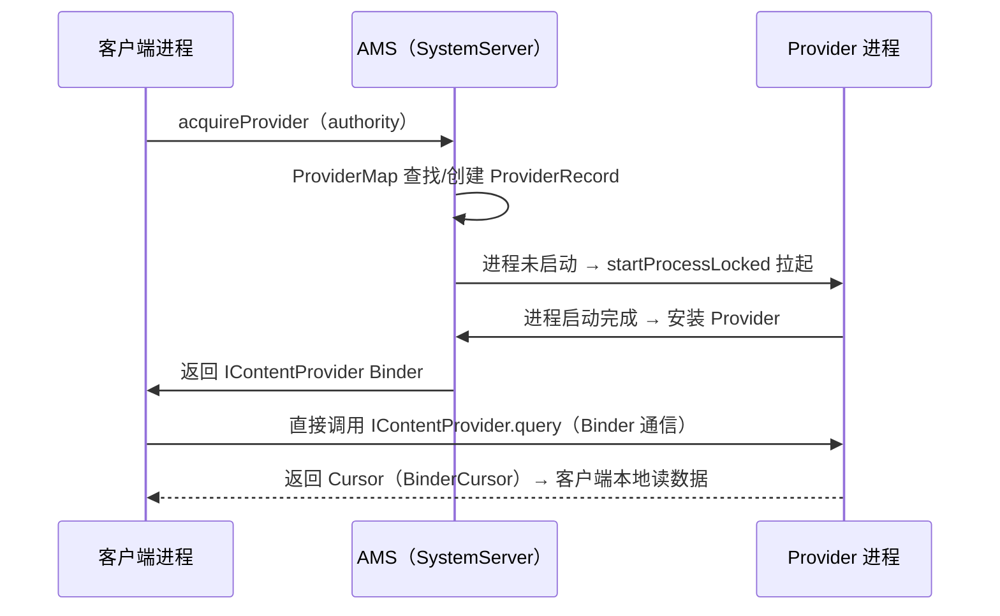

# ContentProvider 底层原理

> 面试高频指数：高
> ContentProvider 是四大组件中唯一与"数据共享"绑定的组件，其底层与 AMS 的进程管理、Binder 通信紧密相关。

## 1. ContentProvider 是什么

```text
ContentProvider：跨进程数据共享的"标准接口"

核心：
① 封装数据访问（CRUD）
② 提供 Uri 寻址（content://authority/path）
③ 跨进程安全访问（权限控制）
④ 数据变更通知（ContentObserver）
```

**与直接 Binder 的区别**：

| 对比项 | ContentProvider | 自定义 Binder/AIDL |
|--------|-----------------|--------------------|
| 数据模型 | Uri + Cursor（表结构） | 任意接口 |
| 权限控制 | 内置（read/write 权限） | 自行实现 |
| 变更通知 | ContentObserver 内建 | 需自行实现 |
| 适用场景 | 数据共享（数据库、文件） | 服务调用（方法级） |

## 2. Provider 注册与启动

### 2.1 Manifest 注册

```xml
<provider
    android:name=".MyContentProvider"
    android:authorities="com.example.app.provider"
    android:exported="true"
    android:readPermission="com.example.permission.READ"
    android:writePermission="com.example.permission.WRITE" />
```

### 2.2 Provider 启动时机

```text
Provider 随其所在进程启动时初始化：
① 进程创建（ActivityThread.main）
② installProvider：根据 manifest 收集 provider
③ 按顺序调用 attachInfo + onCreate

关键点：Provider.onCreate 先于 Application.onCreate？—— 否！
顺序：Application.attachBaseContext → Provider.onCreate → Application.onCreate
```

### 2.3 AMS 中的 Provider 管理

```text
AMS 维护 ProviderMap：
- provider 注册表（authority → ContentProviderRecord）
- 记录 provider 所在进程（ProcessRecord）
- 跨进程访问时先解析 provider 是否存活
```

## 3. 跨进程访问流程

### 3.1 客户端获取 Provider

```java
// 通过 Context.getContentResolver 获取
ContentResolver resolver = context.getContentResolver();

// 查询：内部会跨进程调用 Provider 的 query
Cursor cursor = resolver.query(
    Uri.parse("content://com.example.app.provider/data"),
    null, null, null, null);
```

### 3.2 完整调用链



### 3.3 Cursor 的跨进程传输

```text
跨进程返回 Cursor 的实现：
- 服务端创建 CursorWindow（共享内存，Ashmem）
- 通过 Binder 传递 CursorWindow 句柄
- 客户端通过共享内存直接读数据（无需逐行序列化）

优化点：
- Cursor 数据放共享内存，减少拷贝
- 大结果集不会全部序列化到 Binder 事务
```

## 4. ContentObserver 变更通知

### 4.1 注册与通知

```java
// 客户端注册观察者
resolver.registerContentObserver(uri, true, observer);

// 服务端数据变化时通知
getContext().getContentResolver().notifyChange(uri, null);
```

```text
通知链路：
Provider.notifyChange
→ AMS（IContentService 实际是 ContentService 管理）
→ 通知注册了该 Uri 的观察者（跨进程 Binder 回调）
→ 客户端收到 onChange
```

### 4.2 观察者注册位置

```text
ContentObserver 的注册表由 ContentService 管理
（SystemServer 中的独立服务，非 AMS 内）

结构：ObserverMap：Uri → 观察者列表（含跨进程代理）
```

## 5. 权限校验

### 5.1 权限检查流程

```text
访问 Provider 时的权限校验：
① Uri 解析出 authority → 找到目标 provider
② 检查调用方是否声明了 readPermission/writePermission
③ 检查 uri 级 grantUriPermission（临时授权）
④ 检查 exported / 签名权限等

不通过 → SecurityException
```

### 5.2 临时授权

```java
// 临时授权：Intent 传递 Uri 时授予对方访问权限
Intent intent = new Intent(Intent.ACTION_VIEW, uri);
intent.addFlags(Intent.FLAG_GRANT_READ_URI_PERMISSION);
startActivity(intent);

// 配合：
// <provider android:grantUriPermissions="true" />
```

## 6. Provider 与进程优先级

```text
Provider 所在进程的 adj 受客户端影响：
- 有客户端正在访问 → 进程优先级提升
- 客户端都在后台 → provider 进程降级可回收

进程被回收 → provider 销毁 → 数据持久化在数据库/文件
（内存数据会丢失，需重建时重新加载）
```

## 7. 高频面试题

**Q1：ContentProvider 跨进程访问的完整流程？**
A：acquireProvider → AMS 查找/创建 → 进程未启动则拉起 → 安装后返回 IContentProvider → 客户端直接 Binder 调用 CRUD，Cursor 数据走共享内存。

**Q2：Provider 的 onCreate 和 Application.onCreate 顺序？**
A：先 attachBaseContext，再 Provider.onCreate，最后 Application.onCreate。所以 Provider 初始化时 Application 上下文已就绪但 onCreate 未执行。

**Q3：ContentObserver 是什么？怎么通知？**
A：观察 Uri 数据变化的回调。注册后数据变更时 notifyChange → ContentService 分发 → 客户端 onChange。

**Q4：Cursor 跨进程是怎么传递的？**
A：服务端把数据写入共享内存 CursorWindow，通过 Binder 传句柄，客户端映射后直接读，避免逐行序列化拷贝。

**Q5：Provider 权限如何控制？**
A：Manifest 声明 readPermission/writePermission，调用方需声明对应权限；支持 grantUriPermissions 临时授权；未授权访问抛 SecurityException。

## 8. 小结

- ContentProvider = 数据共享标准接口，Uri 寻址 + CRUD + 权限。
- 跨进程链路：AMS 管理 ProviderRecord，拉起进程，Binder 调用。
- Cursor 走共享内存（CursorWindow），高效传大结果集。
- ContentObserver 基于 ContentService 的观察者注册表。
- 权限：声明式 + 临时授权，安全可控。
