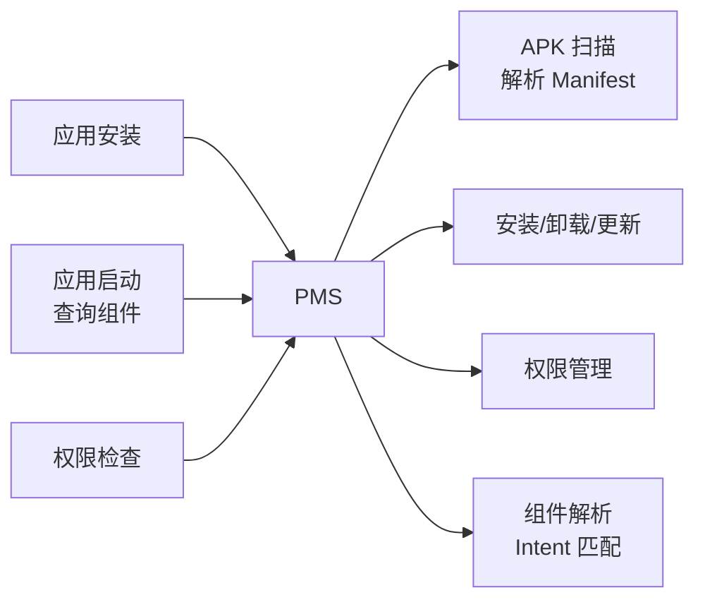
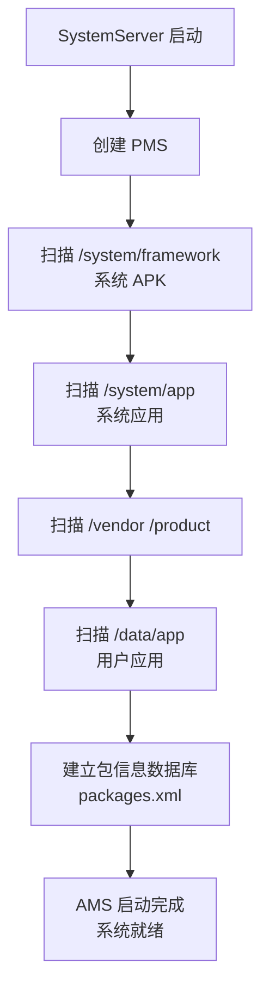
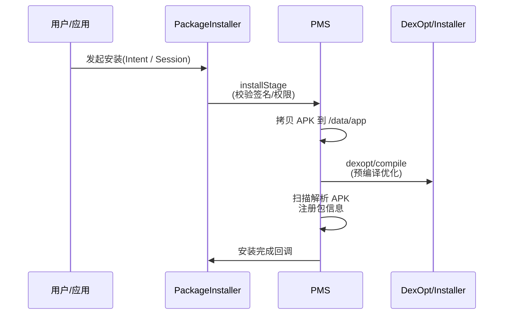
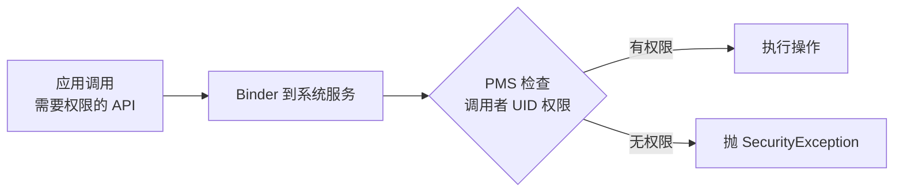

# PMS 包管理机制

> PMS(PackageManagerService)是 Android 的"应用管家":扫描 APK、解析 Manifest、管理安装卸载、分配权限。理解 PMS 才能理解 APK 如何被系统识别与运行。

## 一、PMS 职责与架构

PMS 的职责与架构关系如下：



PMS 各项职责的说明如下：

| 职责 | 说明 |
|------|------|
| APK 扫描 | 扫描系统/厂商/用户目录的 APK |
| Manifest 解析 | 解析四大组件、权限、Intent-Filter |
| 安装管理 | install / uninstall / update |
| 权限管理 | 权限分配与运行时校验 |
| 组件查询 | resolveActivity / queryIntentActivities |
| 信息提供 | 版本、签名、安装来源 |

## 二、PMS 启动与扫描

PMS 启动时的扫描流程如下：



PMS 初始化的核心实现如下：

::: code-tabs

@tab:active Java

```java
// PMS 初始化(简化)
class PackageManagerService {
    PackageManagerService(Context context, Installer installer) {
        // 1. 创建 Settings(持久化包信息)
        mSettings = new Settings(...);
        // 2. 扫描各目录的 APK
        scanDirTracedLI(new File("/system/framework"), ...);
        scanDirTracedLI(new File("/system/app"), ...);
        scanDirTracedLI(new File("/data/app"), ...);
        // 3. 写回 packages.xml(增量更新)
        mSettings.writeLPr();
    }
}
```

@tab Kotlin

```kotlin
// PMS 初始化(简化)
class PackageManagerService(context: Context, installer: Installer) {
    init {
        // 1. 创建 Settings(持久化包信息)
        mSettings = Settings(...)
        // 2. 扫描各目录的 APK
        scanDirTracedLI(File("/system/framework"), ...)
        scanDirTracedLI(File("/system/app"), ...)
        scanDirTracedLI(File("/data/app"), ...)
        // 3. 写回 packages.xml(增量更新)
        mSettings.writeLPr()
    }
}
```

:::

各扫描目录的内容说明如下：

| 扫描目录 | 内容 |
|---------|------|
| /system/framework | 系统框架(无需注册) |
| /system/app | 系统应用(不可卸载) |
| /vendor、/product | 厂商应用 |
| /data/app | 用户安装应用(可卸载) |

## 三、APK 安装流程

### 3.1 安装路径

APK 安装的完整时序如下：



### 3.2 安装要点

安装过程中的各关键步骤说明如下：

| 步骤 | 说明 |
|------|------|
| 签名校验 | 与已装版本签名一致性检查 |
| 版本校验 | 降级需 allowDowngrade |
| 存储分配 | 拷贝到 /data/app/pkg-xxx/ |
| 编译优化 | dex2oat(AOT)或 JIT 策略 |
| 权限分配 | 授予 manifest 声明的权限 |
| 广播通知 | ACTION_PACKAGE_ADDED 等 |

安装校验的要点总结如下：

::: code-tabs

@tab:active Java

```java
// 开发者视角:安装过程的关键校验
// 1. 签名不一致 → 拒绝安装(INSTALL_FAILED_UPDATE_INCOMPATIBLE)
// 2. targetSdk 过低 + 新系统 → 兼容性警告
// 3. 请求过多敏感权限 → 用户可拒绝
// 4. 存储不足 → INSTALL_FAILED_INSUFFICIENT_STORAGE
```

@tab Kotlin

```kotlin
// 开发者视角:安装过程的关键校验
// 1. 签名不一致 → 拒绝安装(INSTALL_FAILED_UPDATE_INCOMPATIBLE)
// 2. targetSdk 过低 + 新系统 → 兼容性警告
// 3. 请求过多敏感权限 → 用户可拒绝
// 4. 存储不足 → INSTALL_FAILED_INSUFFICIENT_STORAGE
```

:::

## 四、Manifest 解析与组件注册

PackageParser 解析的核心产物如下：

::: code-tabs

@tab:active Java

```java
// PackageParser 解析 APK 的 AndroidManifest.xml(二进制 XML)
// 产物:Package 对象,包含:
class Package {
    String packageName;                 // 包名
    ApplicationInfo applicationInfo;    // 应用信息
    ArrayList<Activity> activities;     // Activity 组件
    ArrayList<Service> services;        // Service 组件
    ArrayList<Provider> providers;      // ContentProvider
    ArrayList<ActivityIntentInfo> receivers;  // 广播接收者
    ArrayList<Permission> permissions;  // 声明的权限
    Signature[] signatures;             // 签名
    int versionCode; String versionName;
}
```

@tab Kotlin

```kotlin
// PackageParser 解析 APK 的 AndroidManifest.xml(二进制 XML)
// 产物:Package 对象,包含:
class Package {
    var packageName: String? = null             // 包名
    var applicationInfo: ApplicationInfo? = null // 应用信息
    val activities = ArrayList<Activity>()       // Activity 组件
    val services = ArrayList<Service>()          // Service 组件
    val providers = ArrayList<Provider>()        // ContentProvider
    val receivers = ArrayList<ActivityIntentInfo>()  // 广播接收者
    val permissions = ArrayList<Permission>()     // 声明的权限
    var signatures: Array<Signature>? = null      // 签名
    var versionCode = 0
    var versionName: String? = null
}
```

:::

> **组件注册的意义**:四大组件必须注册才能被系统识别。AMS 启动组件时通过 PMS 查询组件信息;Intent 隐式匹配也依赖 PMS 解析的 IntentFilter。

## 五、权限管理

### 5.1 权限检查流程

权限检查的整体流程如下：



各权限类型的对比说明如下：

| 权限类型 | 授予时机 | 示例 |
|---------|---------|------|
| normal | 安装时自动授予 | INTERNET |
| dangerous | 运行时用户授权 | CAMERA、LOCATION |
| signature | 相同签名才授予 | 系统 API |
| signatureOrSystem | 系统应用或同签名 | 系统级能力 |

### 5.2 运行时权限

运行时权限的申请示例代码如下：

::: code-tabs

@tab:active Java

```java
// 运行时权限:dangerous 权限动态申请
if (checkSelfPermission(Manifest.permission.CAMERA) != PackageManager.PERMISSION_GRANTED) {
    requestPermissions(new String[]{Manifest.permission.CAMERA}, REQ_CAMERA);
}
// 用户授权后:PMS 记录授权状态,后续直接通过
```

@tab Kotlin

```kotlin
// 运行时权限:dangerous 权限动态申请
if (checkSelfPermission(Manifest.permission.CAMERA) != PackageManager.PERMISSION_GRANTED) {
    requestPermissions(arrayOf(Manifest.permission.CAMERA), REQ_CAMERA)
}
// 用户授权后:PMS 记录授权状态,后续直接通过
```

:::

## 六、解析器缓存与查询

隐式 Intent 匹配的核心实现如下：

::: code-tabs

@tab:active Java

```java
// resolveActivity:Intent → 目标组件(隐式跳转的基础)
public ResolveInfo resolveActivity(Intent intent, int flags) {
    // 1. 从缓存查询(PMS 启动时已解析所有 IntentFilter)
    // 2. 匹配 action / category / data
    // 3. 多个匹配时按优先级选择
}
// 查询流程依赖 PMS 持有的 IntentResolver(包 → IntentFilter 索引)
```

@tab Kotlin

```kotlin
// resolveActivity:Intent → 目标组件(隐式跳转的基础)
fun resolveActivity(intent: Intent, flags: Int): ResolveInfo? {
    // 1. 从缓存查询(PMS 启动时已解析所有 IntentFilter)
    // 2. 匹配 action / category / data
    // 3. 多个匹配时按优先级选择
}
// 查询流程依赖 PMS 持有的 IntentResolver(包 → IntentFilter 索引)
```

:::

## 七、高频面试题

### Q1：PMS 是什么?主要职责有哪些?
::: details 查看答案
PMS(PackageManagerService)是系统核心服务,管理所有已安装应用的信息:① 启动时扫描各目录 APK,解析 AndroidManifest(四大组件、权限、IntentFilter);② 管理安装/卸载/更新;③ 权限管理与检查(运行时权限);④ 组件查询(Intent 匹配:resolveActivity/queryIntentActivities);⑤ 提供包信息(版本、签名、安装来源)。应用通过 PackageManager 代理与 PMS 通信,AMS 启动组件时也要通过 PMS 获取组件信息。
:::

### Q2：APK 安装的完整流程?
::: details 查看答案
① 发起安装(PackageInstaller Session 或 Intent);② PMS.installStage:校验签名一致性、版本、存储空间;③ 拷贝 APK 到 /data/app/包名-xxx/;④ dexopt 编译优化(或按策略延迟);⑤ 扫描解析 APK,注册包信息到 packages.xml;⑥ 权限处理(授权 manifest 权限);⑦ 发送 ACTION_PACKAGE_ADDED 广播,桌面添加图标;⑧ 回调安装结果。失败场景:签名冲突、空间不足、降级、解析失败都会终止并返回错误码。
:::

### Q3：应用安装后为什么四大组件必须注册?不注册会怎样?
::: details 查看答案
因为系统通过 PMS 的组件注册表来启动和匹配组件:① 显式启动需要 PMS 返回组件信息(包名+类名校验);② 隐式启动(Intent 匹配)依赖 PMS 解析的 IntentFilter;③ 广播注册(静态)在 manifest 中声明,系统扫描后记录。不注册的组件:startActivity 会抛 ActivityNotFoundException;隐式 Intent 无法匹配;静态广播收不到。注册表是系统的"通讯录",不登记就无法被找到。
:::

### Q4：权限检查的流程是怎样的?普通权限和危险权限有什么区别?
::: details 查看答案
流程:应用调用需权限的 API → 通过 Binder 到系统服务(如定位服务)→ 系统服务调用 PMS.checkPermission → 根据调用者 UID 查找其权限集合 → 有权限放行,无权限抛 SecurityException。区别:normal 权限安装时自动授予(INTERNET);dangerous 权限运行时用户授权(CAMERA/LOCATION,Android 6.0+);signature 权限要求同签名;signatureOrSystem 允许系统应用。dangerous 权限是运行时动态申请,用户可随时在设置中撤销。
:::

### Q5：为什么启动很慢?PMS 扫描有什么优化?
::: details 查看答案
PMS 启动时要扫描几百上千个 APK 并解析,是开机慢的原因之一。优化手段:① 增量更新:packages.xml 持久化上次扫描结果,只扫描变更部分;② 解析缓存:IntentResolver 索引缓存,查询复用;③ 并行扫描:多线程扫描加快速度;④ 只解析需要的信息:延迟解析/懒加载(低优先级信息按需解析);⑤ 系统镜像预置:内置应用信息预生成。新版本还引入"增量扫描+缓存验证",避免每次全量解析。
:::

## 小结

- PMS 是应用信息中心:扫描、解析、安装、权限、查询
- 启动扫描各目录 APK,信息持久化到 packages.xml
- 安装流程:校验 → 拷贝 → 编译 → 解析注册 → 广播
- 四大组件必须注册,隐式匹配依赖 IntentFilter 解析
- 权限分 normal/dangerous/signature,运行时授权走 PMS
- 查询缓存与增量扫描是 PMS 性能关键

> 进阶阅读：[APK 打包流程与签名机制](/system/apk/apk-build-process.md) | [系统启动流程](/system/boot/system-boot.md) | [AMS 与 Activity 启动](/system/ams-wms/ams-activity-launch.md)
