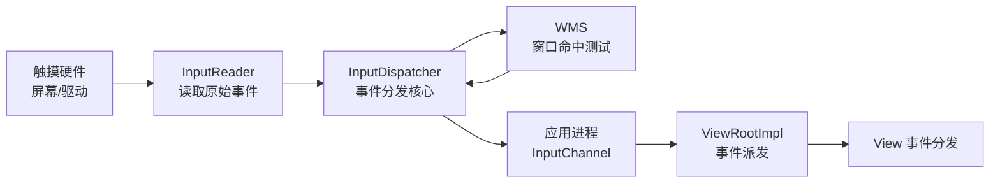
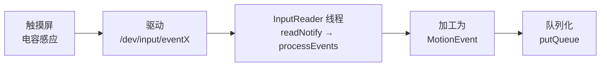
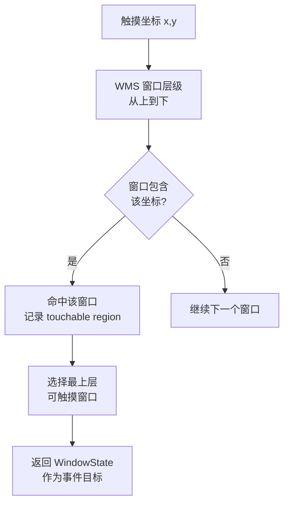
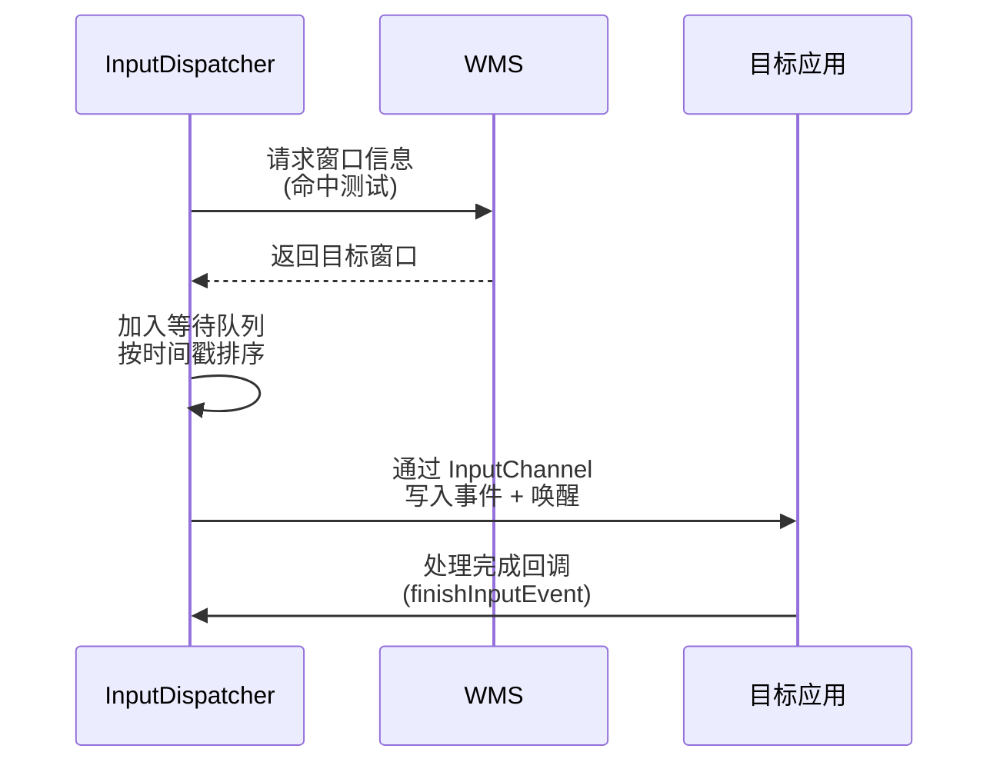
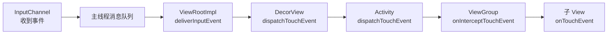

# WMS 触摸事件分发深入

> 手指触摸屏幕到应用 onTouchEvent,中间经过:硬件 → InputManager → WMS 命中测试 → InputDispatcher → 应用窗口。本文拆解完整链路与关键源码。

## 一、触摸事件全景



| 组件 | 职责 |
|------|------|
| InputManagerService | 管理输入系统(系统服务) |
| InputReader | 读取设备事件,加工成 MotionEvent |
| InputDispatcher | 分发策略:找目标窗口、排队、唤醒 |
| WMS | 窗口管理:提供窗口信息做命中测试 |
| InputChannel | 内核 socketpair,跨进程传递事件 |

## 二、事件来源与读取



```java
// InputReader 循环(简化)
// 1. 从 /dev/input/eventX 读原始事件(内核 evdev)
// 2. 设备 mapper(触摸屏/按键/鼠标)加工为输入事件
// 3. 放入队列,通知 InputDispatcher 处理
// 4. 触摸事件 → MotionEvent;按键 → KeyEvent
```

## 三、命中测试:找目标窗口

### 3.1 为什么需要命中测试

> 屏幕上可能有多个窗口(Activity、Dialog、Toast、状态栏),触摸点坐标需要确定**谁接收事件**。



| 命中条件 | 说明 |
|---------|------|
| 坐标包含 | 触摸点在窗口边界内 |
| 可见性 | 窗口可见且不透明拦截 |
| 可触摸 | FLAG_NOT_TOUCHABLE 除外 |
| 层级 | 最上层(相同区域取 Z-order 最高) |

```java
// WMS.findWindowForPoint:命中测试核心
WindowState findWindowForPoint(int x, int y) {
    // 1. 遍历窗口列表(按 Z-order 从高到低)
    // 2. 判断点是否在窗口 frame 内
    // 3. 处理 FLAG_NOT_TOUCHABLE、FLAG_NOT_TOUCH_MODAL
    // 4. 子窗口链:Dialog 等附属窗口优先
    // 5. 命中 → 返回窗口并记录 touchableRegion
}
```

### 3.2 触摸目标窗口优先级

```
系统窗口(状态栏/输入法) > 应用子窗口(Dialog) > 应用窗口(Activity) > 壁纸
```

## 四、InputDispatcher 分发

### 4.1 分发流程



### 4.2 关键机制

| 机制 | 说明 |
|------|------|
| 排队分发 | 事件按时间顺序,避免乱序 |
| 同步等待 | 前一事件处理完才发下一个(保序) |
| ANR 检测 | 5 秒未响应 → 输入 ANR |
| 超时处理 | 未消费事件 → 找下一个目标 |
| 拦截 | 手势导航/系统手势优先 |

>  **输入 ANR**:应用窗口 5 秒内未处理完输入事件(主线程卡死),系统弹 ANR 对话框。

## 五、事件到达应用

```java
// ViewRootImpl 中的 InputEventReceiver
// 应用进程通过 InputChannel 接收事件
final class WindowInputEventReceiver extends InputEventReceiver {
    @Override
    public void onInputEvent(InputEvent event) {
        // 1. 把事件投递到主线程队列
        enqueueInputEvent(event, ...);
    }
}

// 事件分发到 View 层
// ViewRootImpl.deliverInputEvent → 派发到 DecorView
// → View.dispatchTouchEvent(触摸事件)
// → 进入熟悉的 dispatch/onIntercept/onTouch 三级分发
```



## 六、触摸链路总结

| 环节 | 关键点 |
|------|--------|
| 硬件 | 电容屏 → evdev 驱动事件 |
| InputReader | 原始事件 → MotionEvent |
| InputDispatcher | 排队 + 找目标 |
| WMS | 命中测试:坐标 → 窗口 |
| InputChannel | socketpair 跨进程传输 |
| ViewRootImpl | 应用侧接收 |
| View 体系 | dispatchTouchEvent 三级分发 |

## 七、高频面试题

### Q1：触摸事件从硬件到应用经历了什么?
::: details 查看答案
完整链路:① 触摸屏硬件产生电信号,内核驱动转化为 evdev 事件(/dev/input/eventX);② InputReader 线程读取并加工成 MotionEvent;③ 放入队列通知 InputDispatcher;④ InputDispatcher 请求 WMS 做窗口命中测试(根据坐标和窗口层级找目标);⑤ 通过 InputChannel(socketpair)把事件写入目标应用进程并唤醒;⑥ 应用进程 ViewRootImpl 的 InputEventReceiver 接收,投递主线程;⑦ ViewRootImpl → DecorView → Activity → ViewGroup → View 逐级分发。关键:命中测试在系统侧(WMS),分发保序、有 ANR 检测。
:::

### Q2：WMS 如何决定触摸事件给哪个窗口?
::: details 查看答案
命中测试(WindowManagerService.findWindowForPoint):① 按 Z-order 从高到低遍历窗口列表;② 判断触摸坐标是否在窗口 frame 内;③ 过滤不可触摸窗口(FLAG_NOT_TOUCHABLE)、处理 NOT_TOUCH_MODAL(只拦截边界内);④ 子窗口优先(如 Dialog 附着在 Activity 上);⑤ 记录 touchableRegion(可触摸区域,考虑透明区域)。返回最上层的可触摸窗口作为事件目标。系统窗口(状态栏/输入法)层级最高,壁纸最低。
:::

### Q3：什么是输入 ANR?如何产生与避免?
::: details 查看答案
输入 ANR:输入事件发给应用窗口后,5 秒内未处理完成(InputDispatcher 等待 finishInputEvent 超时)。产生原因:主线程被耗时任务阻塞(大文件 IO、数据库查询、死锁、无限循环),导致事件处理延迟。避免:① 主线程不做耗时操作;② 用协程/WorkManager 异步;③ 合理使用 HandlerThread;④ 用 ANR 监控(主线程心跳)提前发现。注意:输入 ANR 比广播 ANR 更常见,是流畅度的重要指标。
:::

### Q4：InputChannel 是什么?为什么事件能跨进程传递?
::: details 查看答案
InputChannel 是系统与应用之间的输入事件通道,底层是 socketpair(成对 socket 描述符):一端在系统进程(InputDispatcher),一端在应用进程(ViewRootImpl 持有)。系统通过 Binder 把文件描述符传给应用(共享 fd),之后事件通过 socket 写入即可跨进程传输,无需每次 Binder 调用(高频场景性能更好)。应用侧 InputEventReceiver 从 channel 读取事件,同时 channel 还支持接收方回执(finishInputEvent 通过 socket 发回)。
:::

### Q5：触摸事件在 View 体系中的分发顺序?
::: details 查看答案
三级分发:① dispatchTouchEvent(顶层入口):Activity → PhoneWindow → DecorView → ViewGroup;② ViewGroup.onInterceptTouchEvent(拦截):决定是否拦截事件给子 View;③ 子 View.onTouchEvent(处理):返回 true 消费,false 向上回传。关键点:事件序列(DOWN 开始)中,第一个 DOWN 决定"事件目标链",后续 MOVE/UP 沿同一链路分发;DOWN 被消费后,整个序列由该 View 处理;onInterceptTouchEvent 可拦截 MOVE(如滑动冲突用 requestDisallowInterceptTouchEvent 控制)。
:::

## 小结

- 触摸链路:硬件 → InputReader → InputDispatcher → WMS 命中 → InputChannel → View
- 命中测试:Z-order + 坐标 + 可触摸性决定目标窗口
- InputDispatcher 保序分发,5 秒超时触发输入 ANR
- InputChannel 用 socketpair 跨进程,高频事件高效传输
- 应用内:dispatchTouchEvent → onInterceptTouchEvent → onTouchEvent
- 触摸事件的核心是"找窗口 + 保序 + 逐级分发"

> 进阶阅读：[WMS 窗口管理原理](/system/ams-wms/wms-principle.md) | [输入系统与触摸事件分发](/ui/event/input-system.md) | [事件分发机制详解](/ui/event/)
