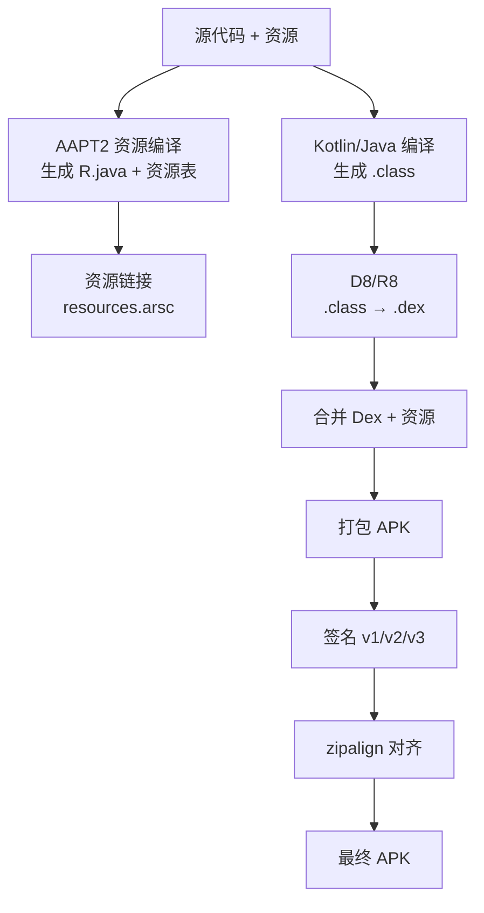

# APK 打包流程与签名机制

> 理解打包流程有助于排查构建问题、优化构建速度，也是进阶面试常考点。

## 一、完整构建流程

APK 的完整构建流程如下：

## 二、各环节详解

各构建环节的工具与作用说明如下：

| 环节 | 工具 | 作用 |
|------|------|------|
| 资源编译 | AAPT2 | 编译资源、生成 R 类 |
| 代码编译 | Kotlin/Java 编译器 | 源码 → class |
| Dex 编译 | D8 | class → dex（压缩为字节码） |
| 压缩优化 | R8 | 混淆、裁剪、优化 |
| 资源优化 | AAPT2 link | 生成 `resources.arsc` |
| 打包 | apkbuilder | 组装 APK |
| 签名 | apksigner | 添加签名块 |
| 对齐 | zipalign | 优化资源对齐（减少运行内存） |

## 三、签名机制

各签名版本的特点对比说明如下：

| 版本 | 方案 | 特点 |
|------|------|------|
| v1 | JAR 签名 | 仅保护 APK 内文件，可篡改清单 |
| v2 | APK Signature Scheme | 全文件摘要校验，速度快 |
| v3 | 密钥轮换 | 支持密钥更换（Android 9+） |

::: warning
- 签名不匹配会导致升级失败（"应用未安装"错误）
- Google Play 要求 **v2+ 签名**
:::

## 四、构建加速建议

1. 开启构建缓存：`org.gradle.caching=true`
2. 并行构建：`org.gradle.parallel=true`
3. 使用 **Configuration Cache**
4. 拆分模块增量编译
5. CI 环境使用远端构建缓存

> 进阶阅读：[Gradle 构建](/engineering/gradle/) | [多渠道打包方案](multi-channel.md)
