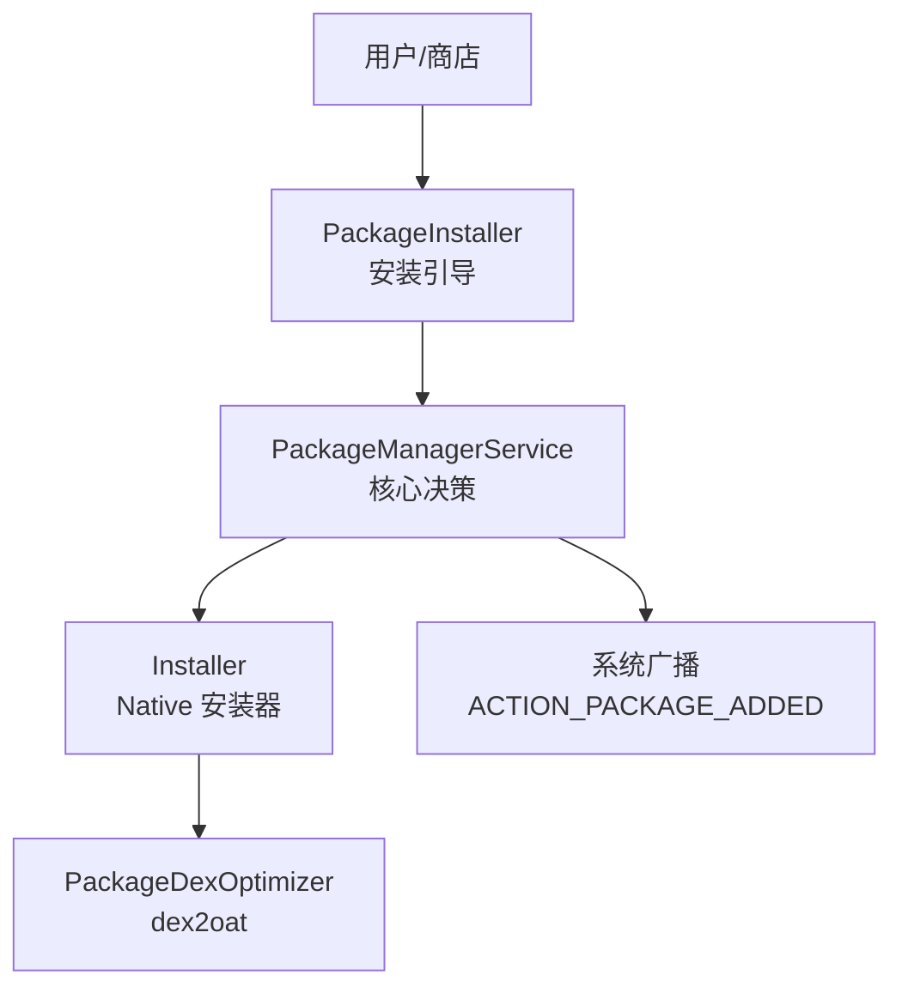
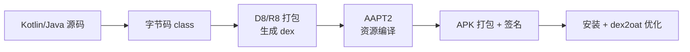
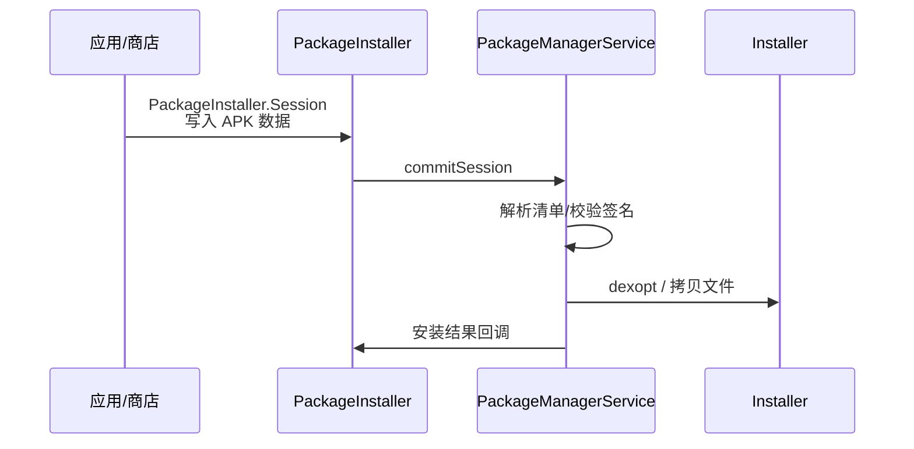
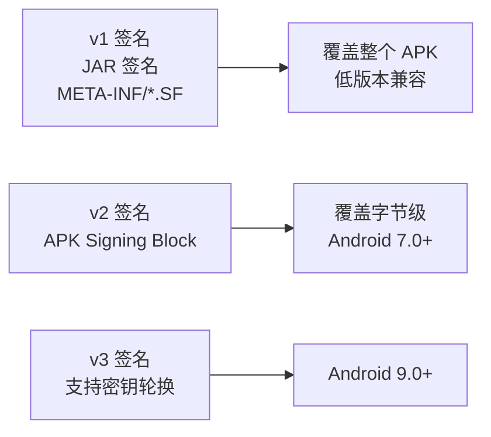

# APK 安装流程与原理

> 面试高频指数：中 — "APK 安装经历了哪些步骤？dex2oat 是什么？安装器（installer）的作用？"是系统源码方向的高频考点。

## 一、安装入口与方式

### 1.1 安装方式

各安装方式的特点说明如下：

| 方式 | 特点 |
|------|------|
| 应用商店安装 | 系统服务（Session 安装） |
| adb install | 命令行静默安装 |
| 文件管理器点击 | PackageInstaller 界面 |
| 代码 installPackage | 需系统权限（System/PackageInstaller） |

### 1.2 主要参与者

安装链路的主要参与者构成如下：



## 二、APK 结构

```text
app.apk (ZIP 格式)
├── classes.dex        # DEX 字节码（主 DEX）
├── classes2.dex       # 多 DEX（64K 方法数限制后）
├── AndroidManifest.xml # 二进制 XML 清单
├── resources.arsc     # 资源索引表
├── res/               # 资源文件
├── assets/            # 原始资源
├── lib/               # native 库（arm64-v8a 等）
├── META-INF/          # 签名信息
└── kotlin/            # Kotlin 元数据
```

### APK 编译产物链

APK 编译产物的转化链路如下：



## 三、安装流程详解

### 3.1 PackageInstaller 阶段

PackageInstaller 安装阶段的完整时序如下：



### 3.2 核心步骤

安装的核心步骤说明如下：

| 步骤 | 说明 |
|------|------|
| 1. 拷贝 APK | 复制到 /data/app 私有目录（加固包壳等） |
| 2. 解析清单 | 读取 AndroidManifest，注册组件、权限 |
| 3. 签名校验 | 验证 APK 签名（v1/v2/v3） |
| 4. dex2oat | DEX 编译为 OAT 机器码（预编译/验证） |
| 5. 更新权限 | 为应用分配 UID、GID、SELinux 标签 |
| 6. 发送广播 | ACTION_PACKAGE_ADDED 通知系统 |
| 7. 清理 | 删除临时文件，更新 Package 数据库 |

### 3.3 dex2oat 编译

dex2oat 编译的整体流程如下：


各编译模式的特点说明如下：

| 编译模式 | 说明 |
|----------|------|
| 纯解释 | 不预编译，运行慢 |
| 快速编译 | speed-profile：常用方法编译，启动快 |
| 全量编译 | speed：全部编译，安装慢但运行快 |
| verify | 仅验证 |

> 关键点：安装时 dex2oat 把 DEX 编译成 OAT（含机器码），ART 运行时直接执行机器码，这就是"安装慢但运行快"的原因。首次启动与系统升级后的开机优化都是 dex2oat。

## 四、安装器（Installer）与权限

### 4.1 分层架构

```text
PackageManagerService (Java)
    └── Installer (Java, 通过 socket 调用)
            └── installd (Native daemon)
                    └── 文件操作/dexopt
```

- installd 以 root 权限运行，负责文件系统操作
- 应用安装目录权限：750，UID 隔离
- SELinux 标签控制访问

### 4.2 签名校验

各签名版本的校验范围示意如下：



各签名版本的覆盖范围对比说明如下：

| 版本 | 覆盖范围 | 特点 |
|------|----------|------|
| v1 | 文件级别 | 可篡改单个文件重新签名 |
| v2 | 字节级别 | 防篡改更强 |
| v3 | 字节级别 | 支持密钥轮换 |

## 五、安装后的变化

### 5.1 系统状态变化

安装后系统的各状态变化说明如下：

| 变化 | 说明 |
|------|------|
| /data/app | 应用 APK 副本 |
| /data/data | 应用数据目录（UID 隔离） |
| /data/dalvik-cache | OAT 文件缓存 |
| 包数据库 | packages.xml / package 表 |
| 组件注册 | AMS 中注册四大组件 |
| 广播 | PACKAGE_ADDED 等 |

### 5.2 应用启动关联

安装完成后：
- Launcher 通过 PMS 查询到应用信息显示图标
- 点击图标 → AMS 根据包名启动 MainActivity
- 进程创建时加载 OAT 优化产物

## 六、高频面试题

### Q1：APK 安装的完整流程是什么？
::: details 查看答案
① 拷贝 APK 到 /data/app（通过 Installer 调用 installd）；② PackageManagerService 解析 AndroidManifest.xml，校验签名，检查权限与冲突；③ 分配 UID/GID 和 SELinux 标签，创建数据目录 /data/data/包名；④ dex2oat 把 DEX 编译为 OAT 优化产物；⑤ 更新包数据库与组件注册（AMS）；⑥ 发送 ACTION_PACKAGE_ADDED 广播；⑦ 清理临时文件。整体分为：写入 → 解析校验 → 优化编译 → 注册 → 广播通知五个阶段。
:::

### Q2：dex2oat 是什么？为什么要做这个？
::: details 查看答案
dex2oat 是 ART 运行时的 AOT 编译器，把 DEX 字节码编译成 OAT 文件（内含机器码）。原因：① 直接执行 DEX 需要解释器，慢；② 预编译成机器码后运行时直接执行，显著提升启动和运行速度；③ 安装/系统升级时执行（首次开机优化），用安装时间换运行速度。编译模式：verify（验证）、quicken、speed-profile（常用方法编译）、speed（全量编译）。现代设备默认 speed-profile，兼顾安装速度与性能。
:::

### Q3：APK 的 v1、v2、v3 签名有什么区别？
::: details 查看答案
v1（JAR 签名）：对 APK 内每个文件做 SHA1/MD5 摘要签名，元数据放 META-INF，校验粒度是文件级，可移除文件后重签；v2（APK Signing Block）：在 APK 中插入签名块，对整个 APK 字节做摘要，校验粒度是字节级，防篡改更强，Android 7.0+ 支持；v3：在 v2 基础上支持密钥轮换（Android 9.0+）。建议同时签 v1+v2（兼容旧系统），新系统按 v2/v3 校验。工具：apksigner 支持 v2/v3。
:::

### Q4：installd 和 PackageManagerService 是什么关系？
::: details 查看答案
PMS（PackageManagerService）是 Java 层包管理核心：解析清单、校验签名、管理权限和组件注册；Installer 是 Java 层桥接类，通过 socket 与 native 的 installd 通信；installd 是 native daemon，以 root 权限执行实际文件系统操作：创建/删除应用目录、设置权限、执行 dexopt（dex2oat）。分层原因：PMS 运行在系统进程（低权限），文件系统级操作需提升权限，由 installd 隔离执行，降低安全风险。
:::

### Q5：安装应用后系统发生了哪些变化？
::: details 查看答案
① 文件：APK 副本在 /data/app，数据目录 /data/data/包名（UID 专属权限）；② 编译产物：OAT 缓存到 dalvik-cache；③ 数据库：包名、版本、权限写入 packages.xml 与包数据库；④ 组件：AMS 注册四大组件，Launcher 显示图标；⑤ 广播：发送 ACTION_PACKAGE_ADDED/PACKAGE_REPLACED；⑥ 安全：分配 UID/GID、SELinux 标签隔离。卸载时反向操作：停止进程、删除数据与优化产物、移除注册、发 PACKAGE_REMOVED 广播。
:::

## 七、小结

APK 安装要点：

1. 入口：PackageInstaller → PMS → installd 三层
2. 五阶段：写入、解析校验、编译优化、注册、广播
3. dex2oat 把 DEX 编译为 OAT，用安装时间换运行速度
4. 签名 v1/v2/v3 覆盖粒度递进，v2/v3 防篡改更强
5. UID + SELinux 隔离保证多应用安全

相关阅读：[APK 构建流程详解](/system/apk/apk-build-process.md)、[APK 加固与安全防护](/system/apk/apk-reinforcement.md)、[APK 签名校验机制](/system/apk/signature-verify.md)、[AMS 启动 Activity 流程](/system/ams-wms/ams-activity-launch.md)。
