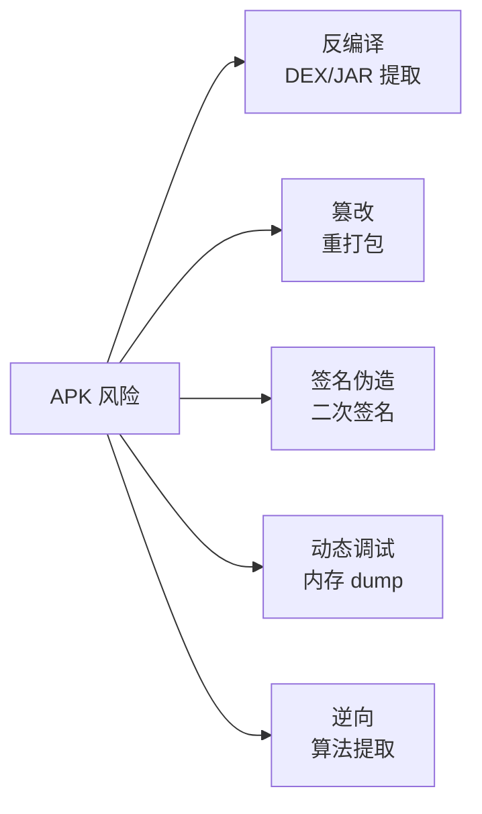
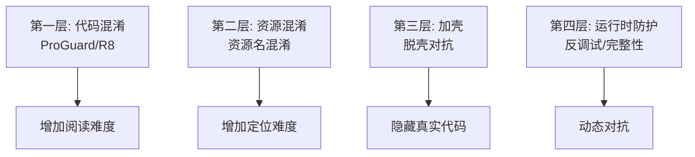
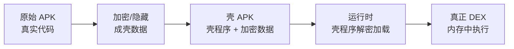
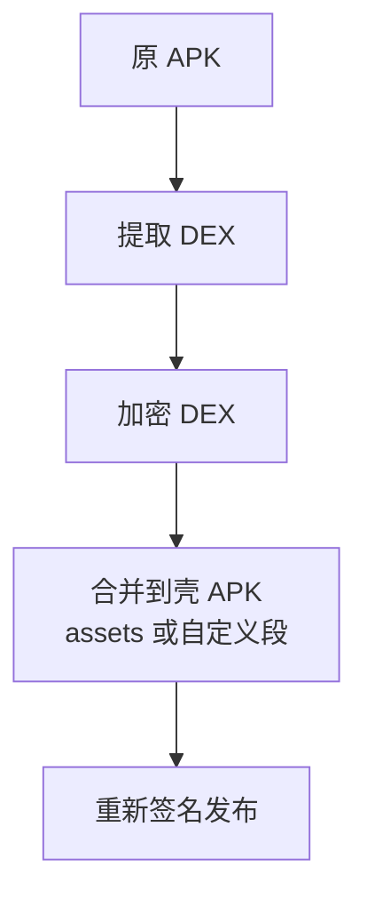

# APK 加固与安全防护

> 面试高频指数：中 — "APK 怎么防止被反编译？加壳原理是什么？混淆和加固的区别？"是移动安全方向的高频考点。

## 一、安全威胁概述

### 1.1 APK 面临的风险



| 风险 | 说明 | 危害 |
|------|------|------|
| 静态反编译 | dex2jar + jadx 还原源码 | 核心逻辑泄露 |
| 重打包 | 修改后重新签名 | 植入恶意代码 |
| 动态调试 | IDA/Frida 挂钩 | 破解授权/算法 |
| 内存抓取 | dump 运行时数据 | 密钥泄露 |

### 1.2 防护层次



## 二、代码混淆（ProGuard/R8）

### 2.1 混淆原理

```groovy
// build.gradle 开启 R8
android {
    buildTypes {
        release {
            minifyEnabled true          // 开启混淆
            shrinkResources true        // 资源压缩
            proguardFiles getDefaultProguardFile('proguard-android-optimize.txt'),
                'proguard-rules.pro'
        }
    }
}
```

| 混淆操作 | 说明 |
|----------|------|
| 重命名 | 类/方法/字段改为 a/b/c |
| 移除 | 删除未使用的代码（shrink） |
| 内联 | 短方法内联优化 |
| 资源压缩 | 移除未引用资源 |

### 2.2 混淆效果对比

```java
// 混淆前
public class UserManager {
    public void login(String username, String password) {
        // 登录逻辑
    }
}

// 混淆后
public class a {
    public void a(String a, String b) {
        // 逻辑还在但无法快速定位
    }
}
```

### 2.3 需要 keep 的内容

```proguard
# proguard-rules.pro
# 反射使用的类
-keep class com.example.reflection.** { *; }

# 实体类（Gson 等序列化）
-keep class com.example.model.** { *; }

# JNI 方法
-keepclasseswithmembernames class * {
    native <methods>;
}

# 三方库特殊规则（按库文档）
-dontwarn okhttp3.**
```

## 三、签名校验

### 3.1 为什么校验签名

**签名是 APK 的身份凭证**：防篡改、防重打包。

```kotlin
// 运行时校验自身签名
fun verifySignature(context: Context): Boolean {
    val expectedHash = "你的应用签名 SHA256"
    val currentHash = getSignatureHash(context)
    return expectedHash == currentHash
}

private fun getSignatureHash(context: Context): String {
    val info = context.packageManager.getPackageInfo(
        context.packageName,
        PackageManager.GET_SIGNATURES
    )
    return info.signatures[0].toByteArray().sha256()
}
```

### 3.2 校验的局限

| 局限 | 说明 |
|------|------|
| 可被 hook | 动态修改返回值 |
| 可被绕过 | 脱壳后 patch 校验点 |
| 需配合加固 | 单一手段不够 |

> 关键点：签名校验是**基础防线**，真正安全需要"校验点分散 + 运行时混淆 + 服务端校验"组合。

## 四、加壳（APK 加固）

### 4.1 加壳原理



**核心思路**：把真实 DEX 加密存到壳中，运行时由壳程序解密后通过自定义 ClassLoader 加载，静态工具无法直接拿到真实代码。

### 4.2 加壳流程



### 4.3 壳的加载机制

```java
// 壳程序核心：自定义 ClassLoader 解密加载
public class ShellClassLoader extends DexClassLoader {
    private static final byte[] KEY = "encrypt-key".getBytes();

    public ShellClassLoader(String dexPath, ClassLoader parent) {
        super(dexPath, null, null, parent);
    }

    // 在 Application.attachBaseContext 中
    // 解密 assets 中的加密 dex，写入文件后加载
    public static void loadRealDex(Context context) {
        byte[] encrypted = readAsset(context, "shell.dat");
        byte[] realDex = AESDecrypt(encrypted, KEY);
        File dexFile = writeToPrivateDir(context, realDex);
        // 用自定义 ClassLoader 加载真实 DEX
        new ShellClassLoader(dexFile.getPath(), context.getClassLoader());
    }
}
```

### 4.4 加壳方案对比

| 方案 | 特点 | 适用 |
|------|------|------|
| 免费加固（360/腾讯乐固） | 简单接入 | 常规需求 |
| 企业级加固（爱加密等） | 多种保护 | 金融/政企 |
| 自研壳 | 可控但成本高 | 核心应用 |

## 五、运行时防护

### 5.1 反调试

```kotlin
// 检测调试器（基础版）
fun isBeingDebugged(): Boolean {
    return Debug.isDebuggerConnected()  // Java 层
}

// 检测 Xposed/Frida 等 hook 框架（需 native 层配合）
fun isHooked(): Boolean {
    // 检查 /proc/self/maps 中可疑模块
    // 检查类加载器中的 hook 特征
    // native 层校验函数地址
}
```

### 5.2 完整性校验

```kotlin
// 关键文件校验
fun verifyIntegrity(context: Context): Boolean {
    // 1. 校验 APK 签名
    // 2. 校验 DEX 关键方法 Hash
    // 3. 校验资源 Hash
    // 4. 服务端二次校验（上报设备/包信息）
    return true
}
```

### 5.3 防护建议清单

| 手段 | 说明 |
|------|------|
| R8 混淆 | 基础，必须开启 |
| 资源混淆 | 增加定位难度 |
| 加壳 | 隐藏真实代码 |
| 反调试 | 对抗动态分析 |
| 完整性校验 | 检测篡改 |
| 服务端校验 | 密钥放服务端 |
| native 层保护 | C++ 实现核心校验 |
| 通信加密 | HTTPS + 证书校验 |

## 六、高频面试题

### Q1：混淆和加壳有什么区别？
::: details 查看答案
混淆（ProGuard/R8）：编译期处理，把类/方法/字段重命名为无意义短名并移除无用代码，增加源码阅读难度，但不隐藏代码逻辑本身，反编译后仍可读（只是难懂）；加壳：发布期处理，把真实 DEX 加密后藏入壳程序，运行时解密加载，静态反编译工具直接拿不到真实代码（只能拿到壳）。关系：混淆是基础（必须做），加壳是进阶（防静态提取），两者配合使用效果最好。
:::

### Q2：加壳的原理是什么？壳程序是怎么加载真实代码的？
::: details 查看答案
加壳原理：把真实 DEX 加密（AES 等）作为资源（assets 或自定义文件）放入壳 APK，壳程序（加固 SDK）随壳 APK 发布。运行时：① 壳的 Application 在 attachBaseContext 中被系统创建；② 壳程序读取加密数据，解密还原真实 DEX；③ 写入应用私有目录；④ 通过自定义 DexClassLoader 加载真实 DEX（设置 parent 为系统 ClassLoader）；⑤ 真实 Application 由壳程序代理创建并回调生命周期。静态分析只能看到壳代码，动态 dump 才可能拿到真实 DEX，所以还要配合反调试。
:::

### Q3：R8 和 ProGuard 有什么区别？
::: details 查看答案
ProGuard 是传统 Java 混淆工具（shrink + obfuscate + optimize）；R8 是 Android 官方编译器（AGP 3.4+ 默认），整合了 ProGuard 的混淆能力和 D8 的字节码优化，直接在编译管线内工作：① 更快的处理速度；② 内置 desugaring 支持；③ 深度优化（内联、常量传播）；④ 与 D8 无缝衔接。开启方式：release 构建默认 R8，minifyEnabled true 即可。混淆规则（keep 等）两者语法兼容，proguard-rules.pro 通用。
:::

### Q4：App 的签名校验有哪些局限性？怎么提升安全性？
::: details 查看答案
局限：① 本地校验代码可通过动态调试（Frida 等）hook 返回值绕过；② 校验点单一，patch 一处即可；③ 脱壳后真实代码被还原，校验逻辑也暴露。提升：① 校验点分散：多处校验（启动/关键操作/随机时机）；② 校验逻辑放 native 层（C++ 实现，增加逆向成本）；③ 服务端校验：把签名/包名/设备信息上报，服务端核对；④ 结果参与业务逻辑：校验失败时返回假数据而非直接退出（迷惑攻击者）；⑤ 反调试 + 完整性校验组合。
:::

### Q5：如何防止 APK 被二次打包和恶意篡改？
::: details 查看答案
① 开启 R8 混淆 + 资源压缩，提高修改难度；② 加壳保护真实 DEX，防止静态修改；③ 运行时签名校验：比对当前包签名与预期 SHA256，不一致拒绝启动或降级；④ 完整性校验：对 DEX/资源计算 Hash 并与内置值比对；⑤ 反调试反 hook：检测 Frida/Xposed/模拟器，核心逻辑 native 化；⑥ 服务端验证：登录态、设备指纹、关键逻辑服务端下发；⑦ 证书固定（SSL Pinning）防止抓包篡改通信。注意：安全是强度问题而非绝对，按应用价值选择防护等级。
:::

## 七、小结

APK 加固要点：

1. 防护层次：混淆 → 资源混淆 → 加壳 → 运行时防护
2. R8 混淆是基础，keep 规则保反射/序列化/JNI
3. 加壳 = 加密真实 DEX + 自定义 ClassLoader 运行时解密
4. 签名校验防重打包，但需多点 + native + 服务端配合
5. 反调试、完整性校验应对动态分析

相关阅读：[APK 构建流程详解](/system/apk/apk-build-process.md)、[APK 安装流程与原理](/system/apk/apk-install-process.md)、[APK 签名校验机制](/system/apk/signature-verify.md)、[多渠道打包与 V2 签名](/system/apk/multi-channel.md)。
